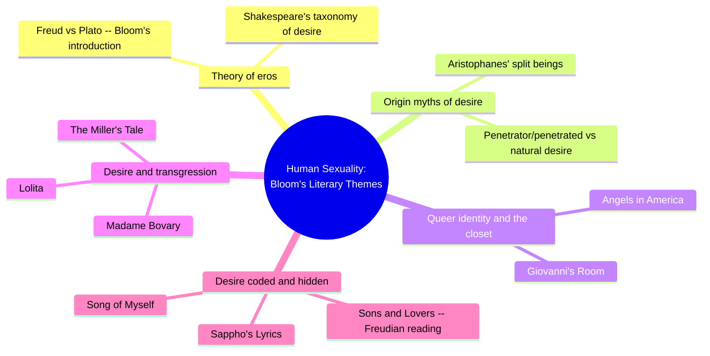
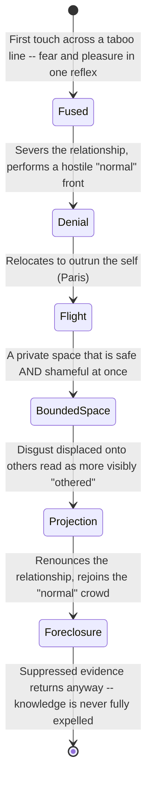
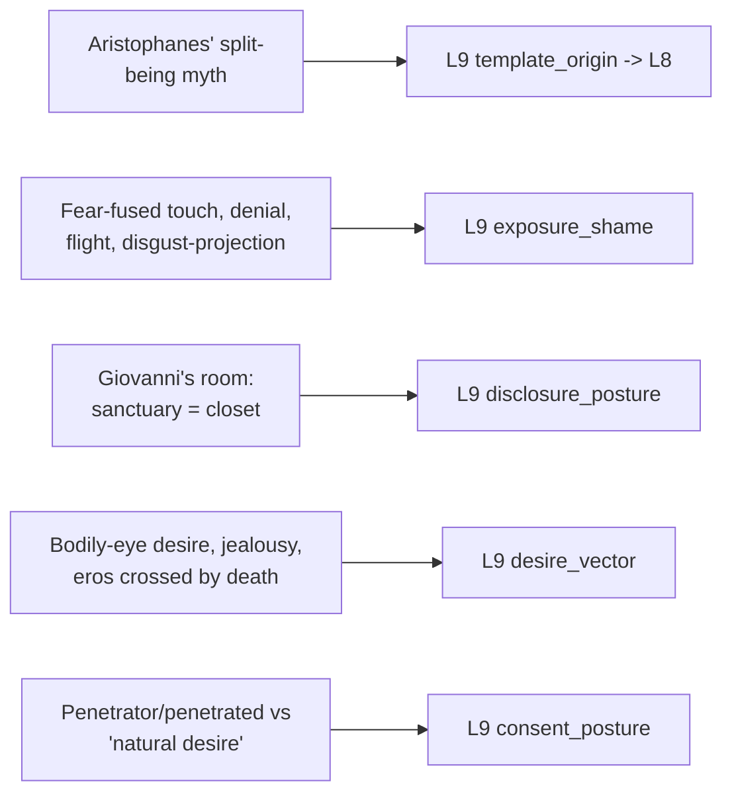

# 🧬 PSY.24 — Human Sexuality — Bloom, Hobby (2009)
### Knowledge Entry — Distill

A literary-criticism anthology in the Bloom's Literary Themes series: twenty essays, each examining how one canonical text (Aristophanes to Kushner, Sappho to Nabokov) renders human sexuality. Despite its clinical-sounding title, this is a study of desire as literary craft, not a clinical or sexological source -- exactly the register a fiction writer can steal from directly.

## TABLE OF CONTENTS
- [Core Thesis](#1-core-thesis)
- [Mind Models](#2-mind-models)
- [Framework](#3-framework--structure)
- [Key Concepts](#4-key-concepts)
- [Heuristics](#5-heuristics--decision-rules)
- [Invariants](#6-invariants)
- [Pitfalls](#7-pitfalls--myths)
- [Application](#8-application)
- [Cross-References](#9-cross-references)
- [Provenance](#10-provenance--confidence)

---

## 1 · CORE THESIS

Twenty literary-critical essays on canonical texts, Aristophanes to Kushner, show desire as always already storied: it arrives with an origin myth, a shame architecture, and a spatial logic of concealment, not as a raw drive. The most useful literary desire is compound and unresolved -- fear fused with pleasure, sanctuary fused with shame, renunciation that never fully closes.

---

## 2 · MIND MODELS

*Required. Minimum two diagrams, maximum five.*

**Diagram 1 — the whole argument.**
Caption: *twenty essays cluster into five recurring literary problems -- the book is a casebook of how desire gets written, not a single argument about what desire is.*

**Diagram 2 — the central mechanism (the closet as a repeating cycle, not a single decision).**
Caption: *Giovanni's Room shows the closet as a loop that keeps re-triggering itself -- and the loop never fully closes, even at the story's end.*

**Diagram 3 — mapped onto the Command's L9 EROS fields.**
Caption: *five literary mechanisms key cleanly to five L9 fields -- the closet essay alone supplies two primary feeds, because it gives working mechanics rather than description.*

---

## 3 · FRAMEWORK / STRUCTURE

No connecting narrative between essays; each is a stand-alone close reading of one text's treatment of sexuality, organized alphabetically by work, bookended by Bloom's series and volume introductions:

| Section | Governing question |
|---|---|
| Series Introduction (Bloom) | What makes a literary theme, as opposed to a topic, endure across eras and cultures? |
| Volume Introduction (Bloom) | How do Freud and Plato, the West's two great authorities on eros, converge and diverge -- and how does Shakespeare exceed both? |
| Angels in America (Kushner) | How does Kushner meld the erotic with the political to reimagine "family" beyond the romantic dyad? |
| Giovanni's Room (Baldwin) | How does a first-person closeted narrative render the fusion of desire and shame? |
| Lysistrata / Symposium (Aristophanes, Plato) | What structures ancient Greek sexuality if not a hetero/homo binary, and what myth explains desire's origin? |
| Lolita (Nabokov) | How does an unreliable narrator's rhetoric implicate the reader in desire it condemns? |
| Madame Bovary (Flaubert, via Baudelaire) | How does a "vulgar" adultery plot become a vehicle for genuine literary greatness? |
| Sons and Lovers (Lawrence, via Kuttner) | What does an early Freudian reading find when it applies the Oedipal complex directly to a novel? |
| Song of Myself (Whitman) | How does a poem encode homosexual desire in vision and dream rather than statement? |
| (fifteen further essays) | One text, one sexuality-craft problem, each |

---

## 4 · KEY CONCEPTS

| Concept | What it is | Why it matters |
|---|---|---|
| **The split-being myth** (Aristophanes, Symposium) | Original humans were double-bodied, punished by Zeus with division; each half now searches for its lost match, and eros is the drive to heal that division, not to merely satisfy an appetite | A ready-made origin story for a character's or culture's felt sense of desire as incompleteness and searching, not just wanting |
| **Oikeiotes vs. "the good"** | Aristophanes says lovers are bound by oikeiotes (belonging, kinship-likeness); Diotima counters that people love what is good, not merely what is "their own," proven by willingness to amputate a diseased but familiar limb | Two competing theories of why desire attaches to a specific person -- familiarity/likeness versus perceived worth -- that a writer can assign to different characters or cultures deliberately |
| **Penetrator/penetrated** | The ancient Athenian status axis for sexual roles -- active/superior versus passive/shame-bearing -- cutting across what a modern reader would sort into hetero/homo categories | A concrete non-modern shame and status architecture; prevents anachronistic retrofitting of contemporary orientation categories onto a historical or invented culture |
| **Paiderastia** | A structured, age-bound, explicitly temporary courtship between an older "lover" and a younger "beloved," in which the younger partner was expected to resist and not enjoy the acts | Demonstrates that consent, pleasure, and duration norms are culturally constructed variables, not universal defaults, even within a single ancient society's own sexual economy |
| **The closet as bounded space** | Giovanni's room: simultaneously precious/safe and chaotic/shameful, functioning as both erotic sanctuary and psychological mirror of disjunctive identity | A single physical setting can carry two contradictory emotional registers at once without resolving into one; the contradiction is the point, not a flaw |
| **Disgust as displaced self-contempt** | David's harshest revulsion is aimed at more visibly effeminate or "othered" gay men, before he can recognize that contempt as self-directed | Shows internalized shame as active, outward-facing behavior (cruelty, distancing) rather than only private interior suffering |
| **Shakespeare's desire taxonomy** (per Bloom) | Men fall in love through "the bodily eye" and are more narcissistic; women love more maturely; jealousy runs Troilus and Cressida to Othello to The Winter's Tale; the sexual becomes erotic "when crossed by the shadow of death"; "family romances" underlie all desire | A compressed inventory of distinct desire textures rather than one universal romantic template -- gives a writer named, citable variants to draw from |
| **Erotic affiliation replacing the romantic dyad** (Angels in America) | Every romantic couple in the play dissolves by the end; the final scene replaces them with a chosen-family group, "a utopian concept of (erotic) affiliation" | A model for writing intimacy and desire as community-scaled rather than only pair-bonded, without treating the dissolved couples as a failure of love |
| **Tragic distance** (Hook's framing) | The gap between a comedy's fantastical solution (a sex strike ending a war) and the real, unresolved political catastrophe sitting just behind it | A craft principle: a text can stage desire comically while the audience is meant to feel the tragedy the comedy is displacing |

---

## 5 · HEURISTICS & DECISION RULES

| Situation | Do this | Not this |
|---|---|---|
| Writing a first same-sex or taboo-crossing touch | Fuse fear and pleasure in the same beat, one reflex | Sequence them as separate clauses ("he felt aroused, then he felt afraid") |
| Writing a closeted character's private space | Give it two simultaneous readings -- safe/precious and shameful/chaotic -- held at once | Write the hideaway as purely a sanctuary or purely a site of self-disgust |
| Writing internalized shame in a stigmatized character | Let it externalize as disgust projected onto someone read as more visibly "othered" than the character themselves | Keep shame purely interior, with no outward behavior it drives |
| Building an origin myth for a fictional culture's or character's concept of desire | Give desire a concrete backstory -- a lost wholeness, a punishment, a debt -- that explains its shape and its felt incompleteness | Treat desire as a bare need with no mythic or cultural architecture behind it |
| Writing a character's desire across more than one partner | Give each relationship its own distinct texture (comic jealousy here, tragic surrender there) rather than one uniform "type" | Collapse the character into a single desire-register regardless of partner |
| Building a culture with a non-modern sexual shame or status system | Ground the difference in structural roles (who penetrates, who is penetrated, age, status) | Retrofit a historical or invented culture's sexuality with contemporary hetero/homo categories it wouldn't have used |
| Ending a closet or self-acceptance arc | Let the resolution stay ambivalent -- suppressed material returns even after the character believes it settled | Resolve identity conflict with a clean total acceptance or a clean total denial |

---

## 6 · INVARIANTS

1. **Fear and intimacy can arrive in the same instant, not as sequential stages.** First touch across a taboo line is rendered as one fused reflex, not attraction followed by fear.
2. **A private erotic space can be a sanctuary and a source of shame at once.** The two readings compound rather than cancel each other.
3. **Internalized shame externalizes as disgust toward others read as more visibly exposed** in the same stigmatized category, before the character can recognize that contempt as self-directed.
4. **A culture's sexual-shame architecture need not match a modern orientation-based binary.** Ancient Athenian sexual status ran on penetrator/penetrated, structured by role and age, not hetero/homo.
5. **Desire in the literary tradition is repeatedly given an origin story** -- a lost wholeness, a divine punishment, a contingent family history -- rather than treated as a brute, unexplained drive.
6. **Renunciation of desire is rarely total or final on the page.** The suppressed material returns -- a letter, a memory, a name -- even after a character believes it settled.

---

## 7 · PITFALLS / MYTHS

- Treating "ancient Greek sexuality" as simply an earlier version of modern gay/straight identity -- the sources' own framing (penetrator/penetrated, paiderastia's temporary, age-bound structure) actively resists that anachronism.
- Writing internalized shame as static backstory rather than an active, ongoing behavior the character performs scene to scene (disgust, cruelty to a more visible other, serial flight).
- Treating a mythic "origin of desire" as decorative worldbuilding rather than the mechanism that explains a character's felt sense of incompleteness or searching.
- Reading a text that centers chosen family and "erotic affiliation" over the surviving romantic couple as anti-love, when the source frames it as love's redefinition, not its absence.
- Flattening a single character's desire into one register across every partner, missing that the sources repeatedly give one person distinct, non-competing desire textures depending on who they're with.
- Resolving a closet or shame arc too cleanly -- the strongest literary treatment here leaves the return of the suppressed visible on the page rather than closing the loop.

---

## 8 · APPLICATION

- **Spine level:** L5
- **12-layer character stack:** L9 EROS (primary: template_origin -> L8, Aristophanes' split-being myth as a transferable origin-story shape for a character's or culture's concept of desire; primary: exposure_shame, the fear-fused first-touch and disgust-projection cycle from Giovanni's Room; primary: disclosure_posture, the closet as a space that is simultaneously safe and shameful, never fully resolved; supporting: desire_vector, Bloom's Shakespeare-derived taxonomy of distinct desire textures; contextual: consent_posture, the penetrator/penetrated status schema as a model for a non-modern shame architecture)
- **plot_systems:** contextual -- the closet-cycle state machine (Diagram 2) is a reusable scene-and-arc engine for any character concealing a stigmatized desire or identity
- **Setting:** contextual -- paiderastia's age-bound, temporary structure and the penetrator/penetrated status schema are ready models for building a fictional culture's own, non-modern sexual status system; dovetails with, but does not formally feed, the SETTING SLICE's S8 HABIT layer already opened by [[BVX.0458]]

The book's real usefulness for a writer building L9 EROS across the full spectrum of desire, not only WLW material, is that it supplies citable, load-bearing craft mechanics rather than general encouragement to "write desire truthfully." The split-being myth gives desire a shape and a backstory; Giovanni's Room gives shame a repeating cycle and a spatial architecture rather than a single confession scene; Bloom's own introduction gives a compressed taxonomy proving that no single desire-template covers a cast. Read against [[🧬 MSX.36 — The History of Sexuality — Foucault (1978)]], the throughline is direct: Foucault argues sexual categories are historically manufactured, not timeless, and this anthology's own texts prove the point from the inside -- Athenian penetrator/penetrated status and a 1950s American closet are two different manufactured architectures for the same underlying human material, legible on the page as two entirely different shames.

---

## 9 · CROSS-REFERENCES

| Related entry | Relation |
|---|---|
| [[🧬 MSX.36 — The History of Sexuality — Foucault (1978)]] | Direct resonance: Foucault's claim that sexual categories are historically manufactured, not timeless, is demonstrated from the inside by this anthology's own texts -- the penetrator/penetrated schema and the 1950s closet are two distinct, historically specific shame architectures |
| [[🧬 MSX.17 — Mating in Captivity — Perel (2006)]] | Perel's claim that eroticism requires separateness resonates with both the Symposium's "tragic distance" (the ache of human separation Aristophanes' myth exists to explain) and Diotima's counter-claim that desire seeks the good, not mere closeness |

---

## 10 · PROVENANCE & CONFIDENCE

Full text, pdftotext extraction, 239pp. Read in full: the Series Introduction and Volume Introduction by Harold Bloom (the book's theoretical frame -- Freud vs. Plato on eros, Shakespeare's taxonomy of desire); the complete essay "Queer Politics and the Politics of the Queer in Tony Kushner's Angels in America" by Jennifer Glaser; the complete essay "Giovanni's Room and Human Sexuality" by Lorena Russell; the complete essay "The Tragic Comedy of Sex in Aristophanes' Lysistrata and Plato's Symposium" by Brian S. Hook; the opening of the Madame Bovary essay (Baudelaire).

Sampled by table of contents and index only, not deep-extracted: the remaining fifteen essays (on Lolita, Sons and Lovers, Song of Myself, Sappho's Lyrics, A Doll's House, Don Juan, "Farewell to Love," Much Ado About Nothing, Oedipus Rex, A Portrait of the Artist as a Young Man, The Rape of the Lock, Tess of the D'Urbervilles, "The Miller's Tale," Moll Flanders, "To His Coy Mistress"). Diagram 1's outer branches for these essays are built from their titles, authors, and TOC placement, not from close reading, and are kept at the level of "which literary problem this essay tackles" rather than any specific claim from inside those essays. This is a deliberate scope cut toward the three essays and the Bloom introduction that carry the anthology's most concrete, transferable L9 mechanics.

The `feeds:` keying (L9 primary x3, supporting x1, contextual x1) is this distill's own synthesis against the Command's 12-layer character stack; the source uses none of that vocabulary. The `spine: [L5]` value follows the assigning brief's explicit instruction.

## META
- Template: BVX-LEARN-v4.0
- Source classification: full-text literary-criticism anthology, deep extraction on the two Bloom introductions and three of twenty essays, sampled by TOC/index on the remainder
- Created / Updated: 2026-09-29
