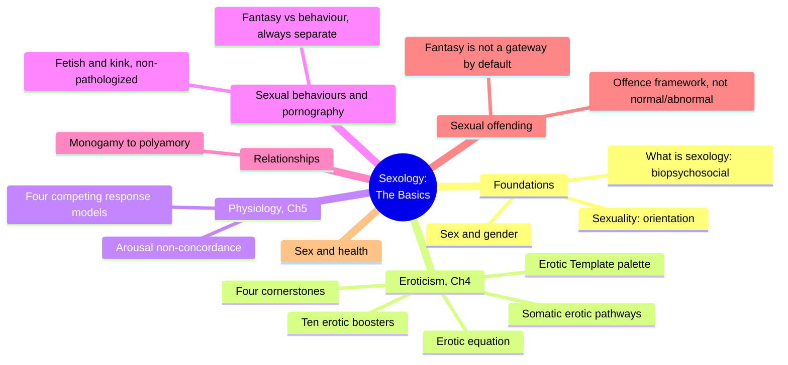
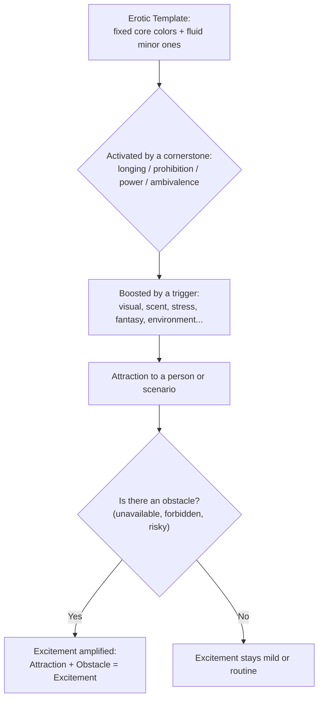
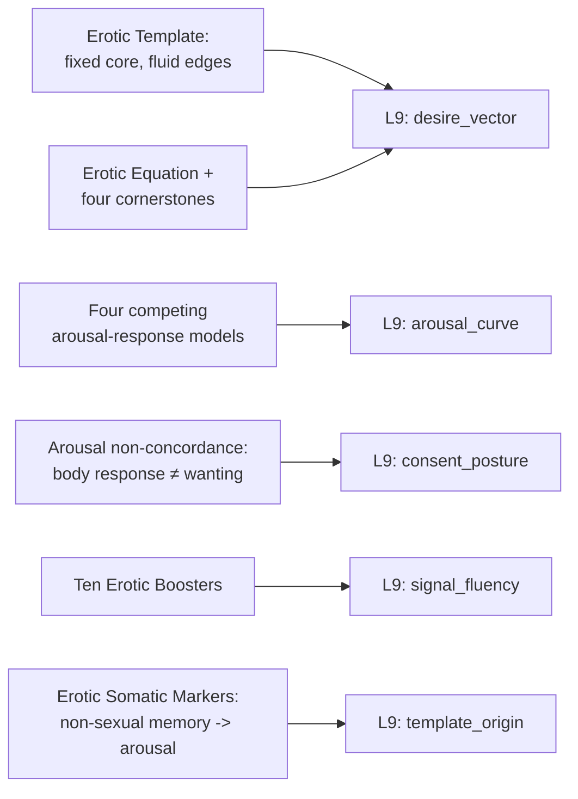

# 🧬 PSY.25 — Sexology, The Basics — Neves (2023)
### Knowledge Entry — Distill

A practicing UK psychosexual and relationship psychotherapist's introductory clinical textbook, covering sexology's full scope from physiology through eroticism, pornography, relationships, and sexual offending; the first BVX-LEARN entry to supply a working clinician's own original models (the Erotic Template, the Erotic Boosters, the Somatic Erotic Pathways) rather than academic theory or first-person testimony.

## TABLE OF CONTENTS
- [Core Thesis](#1-core-thesis)
- [Mind Models](#2-mind-models)
- [Framework](#3-framework--structure)
- [Key Concepts](#4-key-concepts)
- [Heuristics](#5-heuristics--decision-rules)
- [Invariants](#6-invariants)
- [Pitfalls](#7-pitfalls--myths)
- [Application](#8-application)
- [Cross-References](#9-cross-references)
- [Provenance](#10-provenance--confidence)

---

## 1 · CORE THESIS

Eroticism is a unique, largely fixed "Erotic Template" — a personal palette of turn-ons built from memory, fantasy, and meaningful (often non-sexual) association — that gets activated by identifiable boosters and amplified by obstacles; understanding its structure, rather than judging its content, is the clinical and practical work of sexology.

---

## 2 · MIND MODELS

*Required. Minimum two diagrams, maximum five.*

**Diagram 1 — the whole argument.**
Caption: *ten chapters move from biopsychosocial foundations through the Erotic Template's own machinery to the edges of the field (pornography, offending, health) — eroticism (Ch4) and physiology (Ch5) carry the book's original models.*

**Diagram 2 — the central mechanism (the Erotic Template's activation pipeline).**
Caption: *desire is not a switch, it is a pipeline: a fixed template gets activated by a cornerstone, boosted by a sensory trigger, and then amplified — not dampened — by an obstacle in its way.*

**Diagram 3 — mapped onto the Command's L9 EROS.**
Caption: *the book's five original models split cleanly across three EROS sub-fields, with the Erotic Equation and Somatic Markers both feeding desire_vector from different angles — mechanism and origin.*

---

## 3 · FRAMEWORK / STRUCTURE

Ten chapters, moving from foundational scope to specific applied domains, each grounded in the "biopsychosocial" approach (biological, psychological, and social factors treated as inseparable):

| Chapter | Governing content | Load-bearing original model |
|---|---|---|
| 1, What is sexology? | Defines the field and its biopsychosocial method | — |
| 2, Sex and gender | Sex characteristics, gender identity, intersex variation | — |
| 3, Sexuality | Sexual orientation as a spectrum, distinct from eroticism | — |
| 4, Eroticism | The content and mechanism of individual desire | Erotic Template, four cornerstones, ten Erotic Boosters, Somatic Erotic Pathways, Erotic Equation |
| 5, The basic physiology of sex | Anatomy and arousal/response models | Four competing sexual-response models, arousal non-concordance |
| 6, Sexual behaviours | Fetish, kink, BDSM, non-pathologizing framework | Paraphilia vs. paraphilic disorder distinction |
| 7, Pornography | Use patterns, research on effects, myths | — |
| 8, Relationships | Monogamy, consensual non-monogamy, polyamory | — |
| 9, Sexual offending | Legal/clinical offence framework, fantasy vs. behaviour | — |
| 10, Sex is an important part of overall health | Sex and physical/mental wellbeing | — |

Chapter 4 (Eroticism) is the book's engine room for this shelf: it supplies five original, clinician-built models — none borrowed wholesale from a single prior theorist — that together explain what a person's desire is made of (the Template), what wakes it up moment to moment (the Boosters), why some memories become permanently arousing though nothing sexual happened (the Somatic Pathways), and why obstacles intensify rather than kill wanting (the Equation, building on Jack Morin's 1995 four cornerstones).

---

## 4 · KEY CONCEPTS

| Concept | What it is | Why it matters |
|---|---|---|
| **The Erotic Template** | A "painter's palette" model of eroticism: dominant colors (turn-ons set for life) plus minor, more fluid colors (added or dropped through experience); distinct from sexual orientation, which is comparatively fixed | Gives desire a concrete authoring structure — a small set of load-bearing, near-permanent turn-ons plus a changeable periphery, rather than either a fixed type or infinite variability |
| **Eroticism vs. sexual orientation** | Orientation answers *who* (the frame); eroticism answers *how* (the content) | Lets a character's desire vary in texture and intensity across scenes without that variation implying a change in who they're oriented toward |
| **Four cornerstones of eroticism** (after Jack Morin, 1995) | Longing/anticipation, violating prohibition, searching for power, overcoming ambivalence — the recurring structural sources of erotic charge | A concrete checklist for *why* a given scene or fantasy is arousing to a character, beyond "they find this person attractive" |
| **Ten Erotic Boosters** | Visual, olfactory, auditory, touch, stress, boredom, emotional, hormonal, fantasy, environment — the sensory/contextual triggers that activate the Template in the moment | A boost is "the cherry on the cake, not the cake itself" — desire can be fully satisfied without its usual booster present, which distinguishes a preference from a requirement |
| **Erotic Somatic Markers / Somatic Erotic Pathways** | Meaningful memories (often non-sexual — safety, comfort, first-love context) that become permanently wired to a sensory trigger (a scent, a beard shape) and produce bodily arousal on re-encounter | Explains sudden, seemingly random arousal as a traceable echo of a real emotional memory, not a symptom to be ashamed of or suppress |
| **The Erotic Equation** | Attraction + Obstacle = Excitement (Morin, 1995; Neves reframes it as an "Equation of Desire" that also explains non-sexual wanting, e.g. pandemic toilet-paper hoarding) | Explains why unavailability, forbiddenness, and risk consistently intensify desire rather than suppress it — a mechanism, not a character flaw |
| **Arousal non-concordance** | Physical arousal signs (genital lubrication/engorgement) can occur via a reflex pathway independent of subjective wanting, and vice versa; especially documented in unwanted-contact cases | Directly dismantles "if my body responded, I must have wanted it" — clinically separates physiological reflex from consent, a critical, precise distinction |
| **The dual-control model** (Bancroft & Janssen, via Nagoski) | Sexual response as a balance between an excitation system (the accelerator) and an inhibition system (the brakes); most low-desire complaints are too much brake, not too little accelerator | Reframes desire problems as often about removing inhibitory context rather than adding stimulation — a diagnostic, not just descriptive, model |
| **Basson's non-linear/circular response model** | Emotional intimacy, sexual stimuli, arousal, desire, and satisfaction feed each other in a loop rather than a fixed linear sequence (contrasted with Masters and Johnson's excitement-plateau-orgasm-resolution) | Especially relevant to responsive (not just spontaneous) desire — desire can follow arousal rather than precede it, without that being dysfunctional |
| **Paraphilia vs. paraphilic disorder** | DSM-5 distinguishes an atypical but non-distressing sexual interest (paraphilia) from one causing clinically significant distress or non-consenting harm (paraphilic disorder) | Lets a character have an unusual erotic template that is simply theirs, not automatically a pathology requiring a plot-level "cure" |
| **Fantasy/behaviour separation** | Sexual fantasies (including disturbing or illegal-sounding ones) are structurally distinct from a desire to enact them; most fantasy content never translates into behaviour | Frees a character's interior fantasy life from having to predict or justify their actual conduct |

---

## 5 · HEURISTICS & DECISION RULES

| Situation | Do this | Not this |
|---|---|---|
| Authoring a character's core turn-ons | Fix 2-3 dominant, near-permanent "colors," and leave room for a fluid, changeable periphery around them | Treat every turn-on as equally fixed, or equally negotiable |
| A character's desire spikes around something forbidden, risky, or unavailable | Use the Erotic Equation: let the obstacle itself be the amplifier, not an obstacle desire has to overcome | Write desire as suppressed or diminished by the obstacle |
| Two characters have mismatched arousal patterns (one visual, one touch-driven) | Name the specific booster mismatch as a solvable compatibility question | Write it as vague, unexplained incompatibility or as one partner being "broken" |
| A character responds physically to unwanted contact | Show the non-concordance explicitly — physical response without wanting — and do not let a character (or the narrative) treat the physical sign as proof of consent | Use genital/physical response as evidence that the contact was wanted |
| A character has an unusual, non-harmful kink or fetish | Write it as a stable, non-pathological part of their Template, potentially with a traceable but not mandatory origin story | Default to trauma-as-explanation for kink, or treat it as something to be cured |
| A character has an arousing fantasy that would be disturbing or illegal to enact | Keep the fantasy and any real-world intent as separate facts the plot can hold independently | Treat the fantasy as a reveal that the character secretly wants, or will, enact it |
| Depicting a low-desire or mismatched-desire relationship problem | Diagnose via the accelerator/brakes model — ask what's adding inhibition, not only what's missing stimulation | Assume the fix is always more/better stimulation |
| A character suddenly feels aroused in a non-sexual context and is ashamed of it | Trace it to a Somatic Erotic Marker (a meaningful, often non-sexual memory) rather than writing it as random or shameful | Have the character pathologize a sudden, contextually odd arousal response |

---

## 6 · INVARIANTS

1. **Eroticism (how) and sexual orientation (who) are separate axes.** A character's desire can shift in texture and object across experience without their orientation changing.
2. **A person's dominant erotic "colors" are largely fixed for life; the periphery is fluid.** Desire has a stable core and a changeable edge, not one uniform mutability.
3. **An obstacle amplifies desire; it does not, by default, suppress it.** The Erotic Equation holds across sexual and non-sexual wanting alike.
4. **Physical arousal and subjective wanting are separable facts (non-concordance), not proof of each other.** This holds in both directions — wanting without visible arousal, and arousal without wanting.
5. **Fantasy content and behavioral intent are distinct.** Most fantasy, including disturbing content, never becomes and was never meant to become behaviour.
6. **A booster is not the desire itself.** Desire can be satisfied without its preferred booster present; the booster only makes activation easier or stronger in the moment.
7. **An unusual erotic interest is not, by default, evidence of trauma or pathology.** Pathology requires distress or non-consenting harm, not merely deviation from a statistical norm.
8. **A sudden, seemingly random arousal response usually traces to a specific meaningful memory (a Somatic Marker), not to randomness or dysfunction.**

---

## 7 · PITFALLS / MYTHS

- Treating a partner's unusual turn-on as evidence something is "wrong" with them; the book explicitly frames most unusual turn-ons as more common than people assume, and urges non-judgmental curiosity over correction.
- Assuming BDSM or kink interest indicates unresolved trauma; cited research (Shahbaz & Chirinos, 2017) finds no evidence that BDSM practitioners have elevated trauma histories relative to the general population.
- Treating genital or physical arousal during unwanted contact as proof of consent or desire; this is explicitly named as a source of self-blame the clinical literature corrects.
- Assuming a single "normal" model of sexual response applies to everyone; the book presents four competing, non-interchangeable models (linear, added-desire, circular, dual-control) precisely because no single one fits every person.
- Believing a disturbing or taboo sexual fantasy predicts real-world intent or risk; the book states plainly that fantasy is not a reliable gateway to behaviour for most people.
- Treating the "vaginal orgasm," the G-spot, and squirting as separate, hierarchical, or aspirational phenomena; the book corrects each as a myth built on incomplete anatomy (all orgasms are clitoral in origin; the "G-spot" is a clitoral structure; squirting is not a marker of orgasm quality).
- Assuming desire must precede arousal (spontaneous desire) for a sexual encounter to be legitimate; responsive desire — arousal preceding or generating desire — is presented as equally normal, especially relevant to long-term relationships.

---

## 8 · APPLICATION

- **Spine level:** [L5] WOUND, per this batch's assigned keying (a clinical-textbook source; several of its own mechanisms — the Erotic Equation, Somatic Markers — describe how desire forms around absence, prohibition, or meaningful early memory rather than a single injury)
- **12-layer character stack:** L9 EROS, primary (`desire_vector`, `arousal_curve`, `consent_posture`); L9 EROS, supporting (`signal_fluency`, `template_origin`); L8 IMPRINT, implied (Somatic Erotic Markers require a specific originating memory, even when that memory is non-sexual)
- **plot_systems:** contextual candidate once `04_PLOT_SYSTEMS/` opens — the Erotic Equation (obstacle amplifies desire) is directly reusable as a scene-tension generator for any romantic or erotic plot beat, independent of the character system
- **Setting:** none directly; this is a clinical-individual source, not a setting-shelf one

This book's strongest, most portable contribution is giving `desire_vector` and `arousal_curve` concrete, competing internal structures instead of a single default shape. A character's desire is authorable as a small palette of fixed core turn-ons plus a fluid periphery (the Template), activated through nameable mechanisms (the cornerstones, the boosters) and intensified by obstacles rather than dampened by them (the Equation) — while their physiological arousal can be modeled against any of four different clinical curves depending on who they are, none of them more "correct" than the others. The arousal non-concordance finding is the single most load-bearing addition to `consent_posture`: it gives a clinically precise, citable reason a character's body and a character's consent can diverge, useful for writing both violation and its aftermath truthfully.

---

## 9 · CROSS-REFERENCES

| Related entry | Relation |
|---|---|
| [[🧬 MSX.17 — Mating in Captivity — Perel (2006)]] | Sibling on desire requiring an obstacle/gap to exist (Perel's "separateness," this book's "Erotic Equation"); Neves supplies the clinical mechanism, Perel the relational application |
| [[🧬 PSY.13 — Psychology of the Unconscious — Jung (1916)]] | The Somatic Erotic Marker (a non-sexual memory permanently wired to arousal) is a concrete, modern clinical instance of Jung's claim that a desired object is structurally a symbol for something else |
| [[🧬 PSY.16 — Techniques of Pleasure — Weiss (2011)]] | Shared territory on kink/BDSM as non-pathological, consent-literate practice; this book supplies the clinical/diagnostic register (DSM-5 paraphilia vs. disorder) where Weiss supplies the ethnographic one |
| [[🧬 MSX.22 — The Ultimate Guide to Kink — Taormino (2012)]] | Practitioner-facing sibling on power exchange, consent, and aftercare; this book's "searching for power" cornerstone and paraphilia/disorder distinction supply the clinical framing underneath that practical guide |

---

## 10 · PROVENANCE & CONFIDENCE

Full text, pdftotext extraction (~220pp main text before index), clean text layer with a machine-readable table of contents and running page headers. Read in full: the front matter (advance praise, series description, biography, acknowledgements, glossary excerpt); Chapter 4, "Eroticism" (full — the Erotic Template, the four cornerstones, the ten Erotic Boosters, the Somatic Erotic Pathways, the Erotic Equation, erotic fantasies and Lehmiller's research, novelty-seeking, fetish and kink, the paraphilia/paraphilic-disorder distinction); the sexual-response-model section of Chapter 5, "The basic physiology of sex" (Masters and Johnson, Kaplan, Basson, Nagoski's dual-control model, Gurney's conditions for good sex, arousal and non-concordance, orgasm, resolution phase, and the vaginal-orgasm/G-spot/squirting myths section). Sampled, not deep-extracted: the opening of Chapter 9, "Sexual offending" (the offence-framework argument and fantasy/behaviour distinction, read through the paedophilia terminology section). Not read: Chapters 1-3 (What is sexology?, Sex and gender, Sexuality) beyond the table of contents and cross-references in Chapter 4; Chapters 6-8 (Sexual behaviours, Pornography, Relationships) and Chapter 10 (Sex and health) beyond the table of contents; the remainder of Chapter 9; the Conclusion; the Index.

The `feeds:` variable names (`desire_vector`, `arousal_curve`, `consent_posture`, `signal_fluency`, `template_origin`) are taken directly from L9 EROS and adjacent layer definitions in `ssot_02_character_systems_vertical_slice.md` PART A and the L9 EROS synthesis (`ssot_02_l9_eros_synthesis.md`), not inferred loosely; `arousal_curve` and `template_origin` were fields the 9/29 synthesis pass already ruled onto L9 from an earlier wave of this shelf, and this entry is independent confirmation from a clinical-textbook source rather than a new proposal.

## META
- Template: BVX-LEARN-v4.0, sexuality variant (BOLO 87/88, `brief.DISTILL.md` as changed by `brief.DISTILL.wave3.md`)
- Source classification: full-text book, deep extraction on 1 of 10 chapters plus a targeted section of a second, partial extraction on a third, remaining chapters represented via table of contents only
- Created / Updated: 2026-09-29
