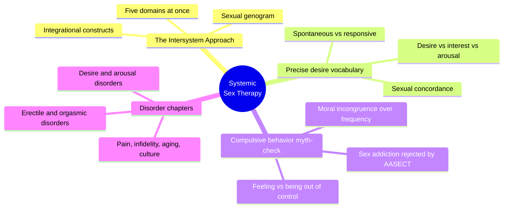
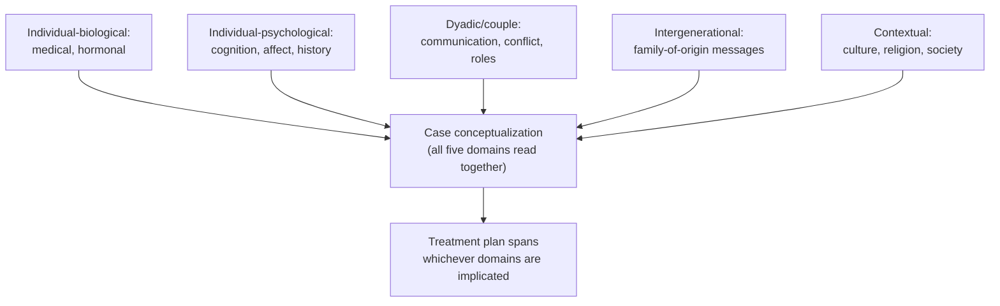
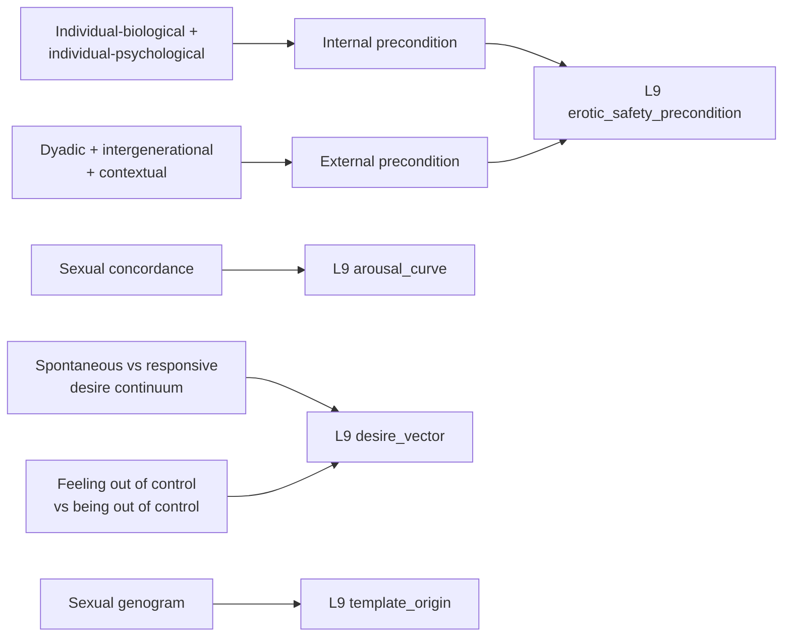

# PSY.26 — Systemic Sex Therapy, Third Edition — ed. Katherine M. Hertlein, Nancy Gambescia, and Gerald R. Weeks (2020)
### Knowledge Entry — Distill

An 18-chapter clinical training text for couple-and-sex therapists, organized around a single integrative framework (the Intersystem Approach) — the CLINICAL anchor of the sexuality shelf, supplying precise diagnostic vocabulary and a myth-correcting chapter on compulsive sexual behavior that the rest of the shelf lacks.

## TABLE OF CONTENTS
- [Core Thesis](#1-core-thesis)
- [Mind Models](#2-mind-models)
- [Framework](#3-framework--structure)
- [Key Concepts](#4-key-concepts)
- [Heuristics](#5-heuristics--decision-rules)
- [Invariants](#6-invariants)
- [Pitfalls](#7-pitfalls--myths)
- [Application](#8-application)
- [Cross-References](#9-cross-references)
- [Provenance](#10-provenance--confidence)

---

## 1 · CORE THESIS

No sexual issue lives in one domain: the Intersystem Approach insists every case be read across five levels at once — individual-biological, individual-psychological, couple, intergenerational, and contextual — before any single cause is named. Desire and arousal are themselves multi-part and often discordant, and the felt sense of being "out of control" sexually is a separate, frequently mis-diagnosed variable from actually being so.

---

## 2 · MIND MODELS

*Required. Minimum two diagrams, maximum five.*

**Diagram 1 — the whole argument.**
Caption: *eighteen disorder-specific chapters all run through the same five-domain lens — the book's unity is the Intersystem Approach, not its table of contents of diagnoses.*

**Diagram 2 — the central mechanism (five domains simultaneously assessed, converging on one case formulation).**
Caption: *the model's discipline is refusing to stop at the first domain that shows a symptom — a presenting problem in one domain still requires all five to be checked before treatment is planned.*

**Diagram 3 — mapped onto the Command's L9 EROS layer.**
Caption: *the Intersystem Approach's internal/external domain split lands almost exactly on L9's own internal/external erotic_safety_precondition axis — this source is closer to L9's clinical substrate than any other book in the wave.*

---

## 3 · FRAMEWORK / STRUCTURE

The book opens by stating its unifying theory (Ch. 1, the Intersystem Approach) and its professional context (Ch. 2–3), then runs sixteen disorder- or population-specific chapters — desire disorders (male and female), erectile disorder, premature and delayed ejaculation, orgasmic disorder, pain disorders, mental-health comorbidity, same-sex couples, compulsive sexual behavior, aging, infidelity, culture, and technology — each following an identical internal shape: definition/description, etiology (walked through all five Intersystem domains), assessment, treatment, research and future directions. This repeated shape is the book's real spine: any chapter can be read as a worked example of the same five-domain method applied to a different presenting problem, which is why the Intersystem Approach chapter (Ch. 1) functions as the whole book's mind model in miniature.

---

## 4 · KEY CONCEPTS

| Concept | What it is | Why it matters |
|---|---|---|
| **The Intersystem Approach** | Five domains assessed simultaneously for any sexual issue: individual-biological, individual-psychological, dyadic/couple, intergenerational (family-of-origin), and contextual (culture/society/religion) | The book's founding correction to a century of individually-oriented sex therapy (Masters and Johnson's asymptomatic-partner-as-assistant model, Kaplan's symptom "bypass" technique) |
| **Sexual desire vs. interest vs. arousal** | Desire: an appetite/drive toward gratification; interest: willingness to engage, often used interchangeably with desire in women; arousal: the physiological (genital/extra-genital) vasocongestive response | Precise, separable terms — treating them as synonyms is a diagnostic error the field itself made for decades |
| **Sexual concordance** | The degree of alignment between subjective sexual interest and measured genital arousal | Concordance is frequently low, especially in women — genital arousal without subjective interest, or the reverse, is normal variation, not dysfunction or deception |
| **Spontaneous vs. responsive desire** | A continuum (not a binary or a gender split) of stimulus threshold: "spontaneous" desire has a low threshold for triggering, "responsive" desire needs more context/stimulus first (Meana's reframe of Basson's model) | Desire discrepancy between partners is frequently a threshold mismatch, not a deficiency in the lower-desire partner |
| **Motivations for sex beyond desire** | Meston and Buss's 237-reason taxonomy collapses into four factors: physical, goal-attainment, emotional, and insecurity-driven reasons — most have little to do with desire itself | Undercuts the assumption that desire is the prerequisite for choosing to have sex; frequency is not a valid proxy for interest |
| **The out-of-control/addiction distinction** | "Feeling out of control is not the same thing as being out of control" (Ley, quoting Klein) — self-report of sexual dyscontrol is data to investigate, not a diagnosis to accept at face value | AASECT formally rejected "sex addiction" as a diagnostic construct in 2016; neuropsychological testing finds no consistent executive-function deficit in self-identified "sex addicts" |
| **Moral incongruence as the real driver** | Pornography Problems due to Moral Incongruence (PPMI): religiosity and moral conflict, not frequency of use, predict distress about one's own sexual behavior | Reframes the clinical target from "reduce the behavior" to "resolve the conflict between behavior and values" |
| **Sexual shame** | An internalized belief that one's own sexuality/desire is abnormal or disgusting, sourced from culture, relationships, and self-judgment | Distinguished sharply from the behavior itself — the shame is the clinical problem, not the desire that triggers it |
| **The sexual genogram** | A clinical tool for tracing overt and covert family-of-origin messages about sexuality across generations | Operationalizes "where did this belief/shame/script come from" as a literal diagrammed intergenerational map |
| **Integrational constructs** | Cross-domain lenses (Social Interactional Theory, Triangular Theory of Love, attachment styles) used to link findings across the five Intersystem domains rather than treating each in isolation | Prevents the five-domain assessment from becoming five disconnected checklists |

---

## 5 · HEURISTICS & DECISION RULES

| Situation | Do this | Not this |
|---|---|---|
| A sexual difficulty presents in one partner | Assess all five Intersystem domains before treatment planning | Treat the symptomatic partner in isolation and the other as an assistant |
| A client reports "I can't control my sexual desire/behavior" | Investigate moral incongruence, mental health, and relational context as separate variables from the behavior itself | Accept the self-diagnosis and move straight to suppression-based treatment |
| Distress accompanies a sexual desire or behavior | Ask whether the drive itself or the person's conflict about the drive is the actual subject | Assume the drive is pathological because it produces distress |
| Partners show a desire discrepancy | Check whether one runs spontaneous-style and the other responsive-style before pathologizing either | Label the lower-desire (or less spontaneously-triggered) partner as dysfunctional |
| A character's or client's arousal signals don't match their stated interest | Write/treat the discordance as ordinary variation, most common in women | Read mismatch as deception, repression, or malfunction |
| Tracing the origin of sexual shame or restriction | Trace it to family-of-origin and cultural messaging (genogram logic) | Treat the shame as free-floating or assume it needs no origin story |
| A client's sexuality conflicts with religious or moral values | Help develop a self-determined sexual ethic (intentionality, authenticity, consent, honesty, mutuality) rather than suppressing the sexuality | Frame the sexuality itself as the disease to be cured |

---

## 6 · INVARIANTS

1. **A sexual difficulty is never explained by one domain.** The Intersystem Approach requires individual-biological, individual-psychological, couple, intergenerational, and contextual factors all be checked.
2. **Subjective and physiological arousal are separable and often discordant**, especially in women — low concordance is normal variation, not a sign of dysfunction.
3. **Desire runs on a spontaneous-to-responsive continuum of stimulus threshold**, not a fixed trait or clean gender binary.
4. **The felt sense of sexual dyscontrol and actual behavioral dyscontrol are different variables** — self-report of the former is not evidence of the latter.
5. **Moral incongruence, not frequency of behavior, is the strongest predictor of distress** about one's own sexual desires or behavior.
6. **Sexual scripts, beliefs, and shame are inherited intergenerationally** and can be traced to specific family-of-origin messaging.

---

## 7 · PITFALLS / MYTHS

- Treating one partner as the sole "symptomatic" locus of a couple's sexual problem (the historical Masters-and-Johnson/Kaplan error the book explicitly corrects).
- Equating self-reported "sex addiction" or "porn addiction" with a validated clinical entity — no consistent neuropsychological or behavioral-frequency evidence supports it as its own disorder, and AASECT formally rejects the construct.
- Treating a client's subjective sense of being "out of control" as literal executive-function impairment rather than investigating what it's actually evidence of.
- Assuming low desire in a partner is dysfunction rather than checking for a spontaneous/responsive threshold mismatch.
- Treating genital wetness or erection as equivalent to subjective desire or interest — concordance is frequently low.
- Ignoring intergenerational and cultural context as sources of present-day sexual shame, treating it instead as a purely individual or purely relational problem.
- Framing non-heteronormative or non-monogamous sexuality itself as the pathology, rather than the moral conflict a client feels about it (the book traces this error's direct history in the sex-addiction field, including its roots in framing homosexuality itself as an addiction).

---

## 8 · APPLICATION

- **Spine level:** none — this is an L9 EROS character-layer source, not a story-spine source (per the v4 template's binding rule that character-stack feeds sit beside the spine, not on it)
- **12-layer character stack:** L9 primary across three fields (desire_vector, arousal_curve, erotic_safety_precondition), supporting on three more (signal_fluency, template_origin, exposure_shame)
- **plot_systems:** contextual — the five-domain Intersystem checklist is a ready-made diagnostic pass for writing why a character's intimate life is stalled, keeping the writer from collapsing a couple's or a character's issue into a single cause
- **Setting:** none

This is the wave's clinical anchor for L9, and its clearest gift is precision where other sources gesture. desire_vector gets two distinct, non-overlapping mechanisms: the ordinary spontaneous/responsive threshold continuum (useful for any character's baseline desire shape), and a genuinely new one for the "non-terminating" mode the brief names — a desire that *feels* unstoppable is authored truthfully not by making the drive itself infinite, but by giving the character a moral-incongruence engine (a conflict between the desire and a value the character holds) that regenerates the felt sense of dyscontrol regardless of the drive's actual strength or frequency. arousal_curve gets concordance as a named, measurable gap: a character's bodily response and stated interest can run independently, and writing that gap is more accurate than writing arousal as a single dial. erotic_safety_precondition gets a clean internal/external split ready to import directly: individual-biological and individual-psychological factors are internal, dyadic/intergenerational/contextual factors are external, and the book's discipline of checking all five before diagnosing any one is a directly transferable authoring rule — never let a character's stalled intimacy be explained by a single domain. template_origin gets a literal tool (the sexual genogram) for tracing where a character's specific sexual beliefs and shame came from, generation by generation.

---

## 9 · CROSS-REFERENCES

| Related entry | Relation |
|---|---|
| [[🧬 MSX.17 — Mating in Captivity — Perel (2006)]] | Sibling L9 source, cross-shelf — Perel's security/passion polarity is the popular-audience counterpart to this book's clinical desire-discrepancy and intersystem material |
| [[🧬 PSY.17 — Women's Anatomy of Arousal — Winston (2010)]] | Sibling L9 source, same wave — Winston's arousal staircase and signal-reading model is the practitioner-facing parallel to this book's clinical concordance and arousal terminology |
| [[🧬 PSY.08 — Lust, Men, and Meth — Fawcett (2015)]] | Cross-shelf source — Ley's case study "Carlos" (meth use, HIV status, compulsive-behavior misdiagnosis) is the same clinical territory Fawcett's book covers in ethnographic depth |

---

## 10 · PROVENANCE & CONFIDENCE

Full text, plain-text extraction, ~4,206 lines (~1,131 KB, the largest file in this wave). Read via table of contents and grep-located chapter boundaries, then targeted full reads: front matter, preface summary, and full contributor bios; Chapter 1, "The Intersystem Approach to Sex Therapy" (Weeks, Gambescia, Hertlein — full, including all five domains, integrational constructs, and references); the opening historical section of Chapter 2, "The Profession of Sex Therapy" (Kleinplatz, through the VIAGRA-era discussion); the full "Terminology" section of Chapter 8, "Systemic Treatment of Sexual Interest/Arousal Problems in Women" (Gambescia and Weeks — desire, interest, arousal, concordance, motivations for sex, theoretical models); and the full body of Chapter 13, "Treating Those Who Struggle with Sexual Desires" (Ley — historical context, research on subjective self-control, moral incongruence, and all four case descriptions). Not directly read: Chapters 3–7, 9–12, and 14–18 (specific dysfunction chapters — erectile disorder, ejaculatory disorders, orgasmic disorder, pain disorders, mental-health comorbidity, same-sex couples, aging, infidelity, culture, technology, and the conclusion). These chapters were confirmed via table of contents to follow the same five-domain Intersystem structure established in Chapter 1, and no claim in this entry rests on their unread content.

## META
- Template: BVX-LEARN-v4.0
- Source classification: full-text edited clinical volume, deep extraction on 3 of 18 chapters plus the full framework chapter and front matter, remainder confirmed structurally via TOC only
- Created / Updated: 2026-09-29
