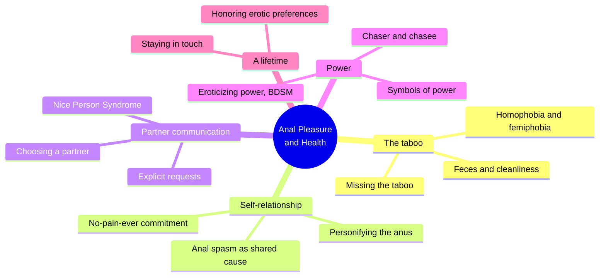
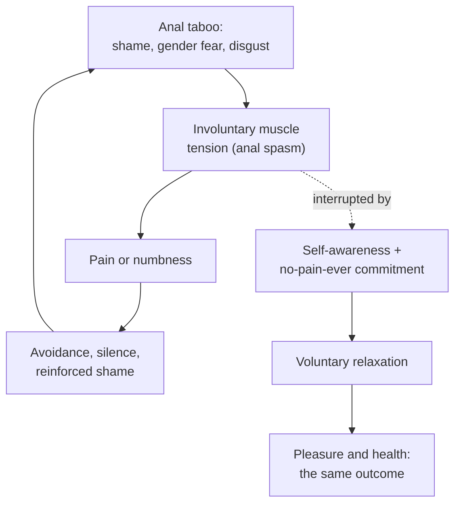
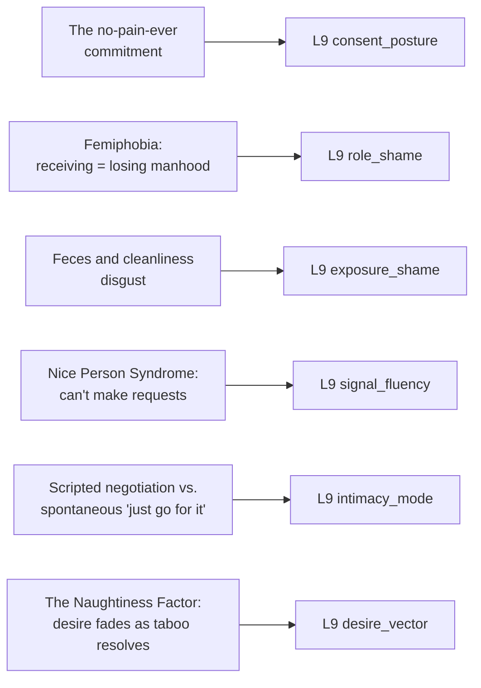

# 🧬 PSY.27 — Anal Pleasure and Health — Morin (2010)
### Knowledge Entry — Distill

Jack Morin's clinical guide (4th edition, from his 1970s sex-therapy research through decades of practice) treats anal pleasure and anal health as the same project: the muscular tension that causes hemorrhoids and fissures is the same tension that blocks pleasure, and both dissolve through the same combination of self-awareness, voluntary relaxation, and honest communication.

## TABLE OF CONTENTS
- [Core Thesis](#1-core-thesis)
- [Mind Models](#2-mind-models)
- [Framework](#3-framework--structure)
- [Key Concepts](#4-key-concepts)
- [Heuristics](#5-heuristics--decision-rules)
- [Invariants](#6-invariants)
- [Pitfalls](#7-pitfalls--myths)
- [Application](#8-application)
- [Cross-References](#9-cross-references)
- [Provenance](#10-provenance--confidence)

---

## 1 · CORE THESIS

Anal pleasure and anal health run on the same two conditions: enough self-awareness to know what you actually want, and enough safety, physical and psychological, to ask for it without pain. The taboo blocking both isn't really about hygiene; it's about gender, shame, and power. Relaxation, not technique, is the real skill.

---

## 2 · MIND MODELS

*Required. Minimum two diagrams, maximum five.*

**Diagram 1 — the whole argument.**
Caption: *five domains, one recurring claim: the same self-awareness and relaxation that heal the body also unlock the pleasure, and the block in both cases is the taboo, not the anatomy.*

**Diagram 2 — the central mechanism (a feedback loop, and where the book's method breaks it).**
Caption: *taboo, tension, pain, and avoidance reinforce each other in a closed loop — the method doesn't attack the taboo directly, it interrupts the loop one link down, at voluntary muscle relaxation.*

**Diagram 3 — mapped onto the Command's L9 EROS fields.**
Caption: *six concrete pieces of clinical material give six L9 variables a mechanism grounded in decades of client work, not theory alone.*

---

## 3 · FRAMEWORK / STRUCTURE

Fourteen chapters plus a medical appendix, moving from private self-exploration to partnered and lifelong practice:

| Movement | Chapters | Governing move |
|---|---|---|
| Orientation | Intro; What Is Anal Pleasure?; Confronting the Anal Taboo; How to Use This Book | Names the taboo's history, prevalence data, and social functions before any technique is offered |
| Private self-exploration | Looking and Touching; Beneath the Skin; Mind and Body; Inside the Anus; Anal Eroticism; Discovering the Rectum | Builds anatomical knowledge, muscular awareness, and a felt relationship to one's own anus, entirely alone at first |
| Confronting blocks | Attitudes Toward Rectal Stimulation | Names feces, homophobia, gender roles, drugs, and the taboo's own erotic charge (the Naughtiness Factor) as the specific things standing between awareness and pleasure |
| Partnered practice | Mutual Exploration; Anal Intercourse | Moves from solo work to negotiated, communicated touch with a partner, intercourse deliberately held until last |
| Meaning and integration | Realms of Power; A Lifetime of Anal Pleasure | Names the power dynamics (conscious and not) running under all of it, then how to sustain awareness and honor one's own preferences long-term |
| Appendix | Health Problems Involving the Anus and Rectum | HIV/STDs, common anal-rectal diseases, and self-healing guidelines, medically framed |

The throughline: every chapter converts an unexamined, taboo-charged default (numbness, silence, assumed roles, "no pain, just get through it") into a deliberate, self-aware choice.

---

## 4 · KEY CONCEPTS

| Concept | What it is | Why it matters |
|---|---|---|
| **Anal spasm** | Involuntary contraction of the anal sphincters, named as the single physiological mechanism underlying both most anal medical problems and blocked anal pleasure | Collapses "health" and "pleasure" into the same project: the fix (awareness plus relaxation) is identical regardless of the goal |
| **The no-pain-ever commitment** | An explicit, advance promise to oneself: "I will do everything within my power to protect my anus from any pain or discomfort whatsoever" | A self-directed consent rule made before pressure arrives, so it can hold up against a partner's wants in the moment |
| **Personifying the anus** | Treating a numb or alienated body part as a relationship to repair — "getting acquainted," listening to what it communicates through tension or pain | Reframes a body-shame block as a relationship with a history, not a fixed defect, opening a path to repair through attention rather than force |
| **Performance vs. pleasure orientation** | Clients whose primary goal was pleasing a partner did measurably worse than those whose goal was their own pleasure | A clean, evidence-based split between two motives that look similar from outside but predict opposite outcomes |
| **The anal taboo's social functions** | Four likely functions: enforcing cleanliness/disgust, dramatizing a mind-body split, enforcing strict gender roles, and bolstering sanctions against homosexuality | The taboo isn't really about hygiene — it does real cultural work, which is why factual reassurance alone rarely dissolves it |
| **Femiphobia** | Morin's term: fear of anal receptivity is fear of the social meaning of receptivity (femininity, loss of masculine status), not necessarily fear of being gay | Explicitly separates two anxieties usually fused together — lets a straight man's receptive desire exist without implying anything about his orientation |
| **The Naughtiness Factor** | In Morin's separate research, breaking a taboo was the single aphrodisiac in nearly 40% of peak erotic memories; normalizing the same act can cool that specific charge | A desire that runs partly on obstacle and risk doesn't necessarily grow once the obstacle is removed — it can quiet down instead |
| **Nice Person Syndrome** | A childhood-trained role: deferring to others' wishes, unable to make direct requests, "nicing people into submission" instead of asking | Converts potential pleasure into obligation and duty; shows up bodily as tension, because desires never get spoken and thus never get honored |
| **Symbols of power** | Appearance, age, race, money, social skill, sexual confidence, self-esteem — currencies partners use, often unconsciously, to position themselves relative to each other | Self-esteem is named as the one power source that doesn't require a partner's cooperation to hold, unlike the other six |
| **Eroticizing power / BDSM** | Consensual, deliberately theatrical dominance-submission play, distinct from real relational power imbalance; "the key is to learn to see oneself not as the victim of dominance, but its master" | Requires an explicit signal (a safe word) that overrides the scene's own script, because within an unnegotiated encounter "no" cannot safely be assumed to mean "yes" |

---

## 5 · HEURISTICS & DECISION RULES

| Situation | Do this | Not this |
|---|---|---|
| A character's pleasure keeps turning into pain or shutting down | Give the tension a specific trigger (taboo, shame, fear of a role) | Write the pain as random or purely physical |
| A character can't ask a partner for what they want | Root the silence in a trained pattern (people-pleasing, fear of upsetting) | Have the character suddenly become articulate with no setup |
| Writing a receptive or submissive male character | Separate fear of femininity (femiphobia) from fear of being gay — they are not the same anxiety | Collapse all male receptivity anxiety into "he's secretly gay" |
| Writing consensual power-exchange (dominance/submission) | Show the explicit negotiation (a safe word, stated limits) that separates play from harm | Let "no means yes" stand unquestioned without an established signal |
| Writing an unequal-power relationship (money, age, fame, confidence) | Show which currency currently sets the imbalance, and how the less-powerful partner compensates or resists | Write attraction as power-neutral when a real imbalance clearly exists |
| A character's fantasy involves being dominated or humiliated | Let the character master the fantasy rather than be its victim — the desire is for the image, not literally for real degradation | Assume the fantasy's content is a literal wish |
| Writing taboo-breaking as arousing | Let the thrill fade in step with the shame — normalizing the act can cool, not just satisfy, the desire | Assume taboo-fueled desire simply escalates the more it's indulged |
| Writing a character's body-shame or chronic-pain arc | Tie a nonsexual physical symptom to the same suppressed history as their erotic block | Treat the physical symptom and the erotic block as unrelated plotlines |

---

## 6 · INVARIANTS

1. **Chronic muscular tension and blocked pleasure share one root cause and one fix.** Awareness plus voluntary relaxation, not force or willpower, resolves both.
2. **A commitment to one's own comfort has to be made in advance to hold up under pressure.** Made in the moment, it's too easily overridden.
3. **Fear of receiving is often fear of the social meaning of receiving,** not fear of the sensation itself — the two require different repair paths.
4. **Desire fueled by breaking a taboo is partly dependent on the taboo staying active.** Removing the shame can quiet, not only satisfy, that specific desire.
5. **An inability to make direct requests converts potential pleasure into obligation.** Hinting and self-erasure are not the same as consent.
6. **Consensual power-exchange requires a signal that overrides the fantasy's own script.** Without a prior agreement, "no" means no.
7. **Every relationship carries currencies of power** (appearance, age, money, confidence); self-esteem is the one form that doesn't depend on a partner's cooperation.

---

## 7 · PITFALLS / MYTHS

- Treating anal pleasure or anal shame as purely a hygiene issue rather than a taboo doing real social work (gender-role enforcement, disgust management, homophobia).
- Writing "he must secretly be gay" as the only possible meaning of a straight man's receptive desire — the book explicitly separates femiphobia from sexual orientation.
- Letting a scene's pain or shutdown read as bad luck instead of a response with an identifiable trigger.
- Assuming consensual dominance/submission is really about real-world powerlessness rather than deliberate mastery of a chosen fantasy.
- Writing "no" as automatically meaning "yes" in an unnegotiated scene — that convention only holds with an explicit prior safe word.
- Confusing performance-oriented desire ("I want to satisfy my partner") with pleasure-oriented desire — the book's own research found the former produces worse outcomes.
- Assuming that normalizing a taboo always increases enjoyment of it, when it can just as easily cool the specific thrill that made it exciting.

---

## 8 · APPLICATION

- **Spine level:** L5, the character register of the story-spine — this is a source about the mechanics of shame, consent, and power inside desire, not plot mechanics or setting.
- **12-layer character stack:** L9 EROS primarily — consent_posture (primary), role_shame (primary), exposure_shame, signal_fluency (primary), intimacy_mode, desire_vector (all supporting). See frontmatter `feeds:` for the full wiring.
- **plot_systems:** contextual candidate once `04_PLOT_SYSTEMS/` opens — the taboo/tension/pain/avoidance loop (Diagram 2) is a reusable engine for any shame cycle, sexual or not, and the point where a character's method interrupts it makes a natural turning-point beat.
- **Setting:** not applicable; this is a psychology-of-desire and clinical source, not a setting source.

For a writer rendering desire, shame, and consent truthfully, this book's real gift is mechanism over mood. The no-pain-ever commitment gives `consent_posture` a concrete shape distinct from in-scene negotiation: a boundary set in advance, before desire or a partner's wants can pressure it, which a character can then be shown honoring or breaking under strain. The femiphobia/exposure_shame split is unusually precise for fiction: a character's shame about being seen (dirty, exposed, judged) and a character's shame about what an act signifies about their role (masculinity, status, orientation) are different engines with different triggers and different repair arcs, and conflating them flattens a scene that could carry two distinct kinds of tension. Nice Person Syndrome gives `signal_fluency` its clearest negative case: a character who "nices people into submission" instead of asking directly is not simply shy, they are running a specific, nameable strategy with a specific cost (obligation replacing pleasure), which makes their eventual ability to ask for what they want a real, earned character beat rather than a sudden personality shift. The Naughtiness Factor is the book's most useful complication of `desire_vector`: not every desire escalates when indulged — some run on friction and quiet down once the obstacle it needed is gone, which is a truer and less obvious shape for a character's arc from "forbidden and thrilling" to "safe and familiar" than pure escalation would be.

---

## 9 · CROSS-REFERENCES

| Related entry | Relation |
|---|---|
| [[🧬 MSX.17 — Mating in Captivity — Perel (2006)]] | Shared territory, different mechanism: Perel's desire needs distance and mystery to survive; Morin's desire (via the Naughtiness Factor) needs an active taboo to survive — both name an obstacle as structurally necessary to a specific kind of wanting, and both show what happens when the obstacle is removed |
| [[🧬 PSY.18 — A Woman's Guide to Oral Sex — Fulbright (2012)]] | Close parallel in method: both books give explicit, concrete feedback-loop vocabularies (harder/softer/faster-style check-ins) as the mechanism for signal_fluency, and both name a physical fallback signal for when words fail |
| [[🧬 PSY.21 — The Sadeian Woman — Carter (1978)]] | Direct contrast on power: Carter's Sadeian tyranny has no exit clause and no possibility of real refusal; Morin's consensual BDSM requires exactly the safe-word exit clause Sade's world refuses to imagine — read together they mark the line between eroticized power and real tyranny |

---

## 10 · PROVENANCE & CONFIDENCE

Full text, plain-text extraction (~1,677 lines, ~120,000 words across 4 editions' worth of accumulated material). Read in full: the front-matter reviews and Introduction (prevalence data, taboo history, the 1981 research origin, workshop structure); Chapter 2, Confronting the Anal Taboo (its legal history, Freud's taboo/morality distinction, the four social functions, the anal taboo in medicine and psychology, anal spasm, sex-therapy framing); Chapter 3, How to Use This Book (goals vs. performance orientation, the no-pain-ever commitment, journaling); the opening of Chapter 4, Looking and Touching (the anal opening, the self-examination experience, personifying the anus) and the start of Chapter 5 (pelvic muscle anatomy, Kegel history, breathing); Chapter 10, Attitudes Toward Rectal Stimulation, in full (feces, homophobia, gender roles, missing the taboo/Naughtiness Factor, drugs); Chapter 11, Mutual Exploration, substantially (Nice Person Syndrome, choosing a partner, rimming); Chapter 12, Anal Intercourse, in full (condom types and use, the guided experience, sensations, orgasm, inserter concerns); Chapter 13, Realms of Power, in full (symbols of power, eroticizing power, BDSM, power and anal intercourse across straight, gay, and lesbian couples); Chapter 14, A Lifetime of Anal Pleasure, in full (staying in touch, who/when/how, aging, honoring erotic preferences). Sampled only (via section headers and opening paragraphs, not deep-read): the middle stretch of Chapters 6 through 9 (mind-body/stress, voluntary muscle control, masturbation, mapping the rectum, fisting, butt plugs) and the medical Appendix (HIV/AIDS specifics, other STDs, common anal-rectal diseases, self-healing guidelines, finding a provider) — these are anatomical/medical reference material with comparatively little L9-relevant psychological content, deprioritized against the wave 3 brief's L9 focus and the read budget.

The frontmatter `feeds:` keying is this distill's own synthesis against the wave 3 brief's L9 field list (character v2.2.0): the no-pain-ever commitment and the BDSM safe-word caveat map to `consent_posture`; femiphobia maps to `role_shame`; the feces/cleanliness taboo maps to `exposure_shame`; Nice Person Syndrome and its explicit-request antidote map to `signal_fluency`; the scripted-negotiation-versus-spontaneous split in "Choosing a Partner" maps to `intimacy_mode`; the Naughtiness Factor maps to `desire_vector`.

`zotero_key` is blank: not checked against the live Zotero database in this pass; flagged for a future cataloging sweep rather than invented.

## META
- Template: BVX-LEARN-v4.0
- Source classification: full-text plain-text extraction, deep read on the taboo, communication, and power chapters; sampled on the anatomical/muscle-control and medical-appendix chapters
- Created / Updated: 2026-09-29
