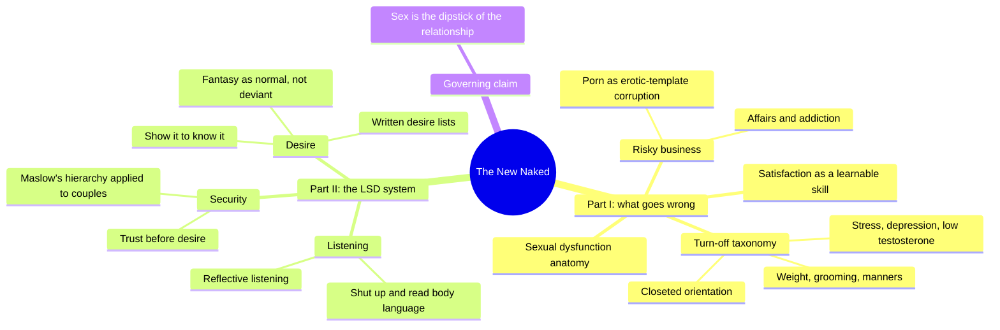
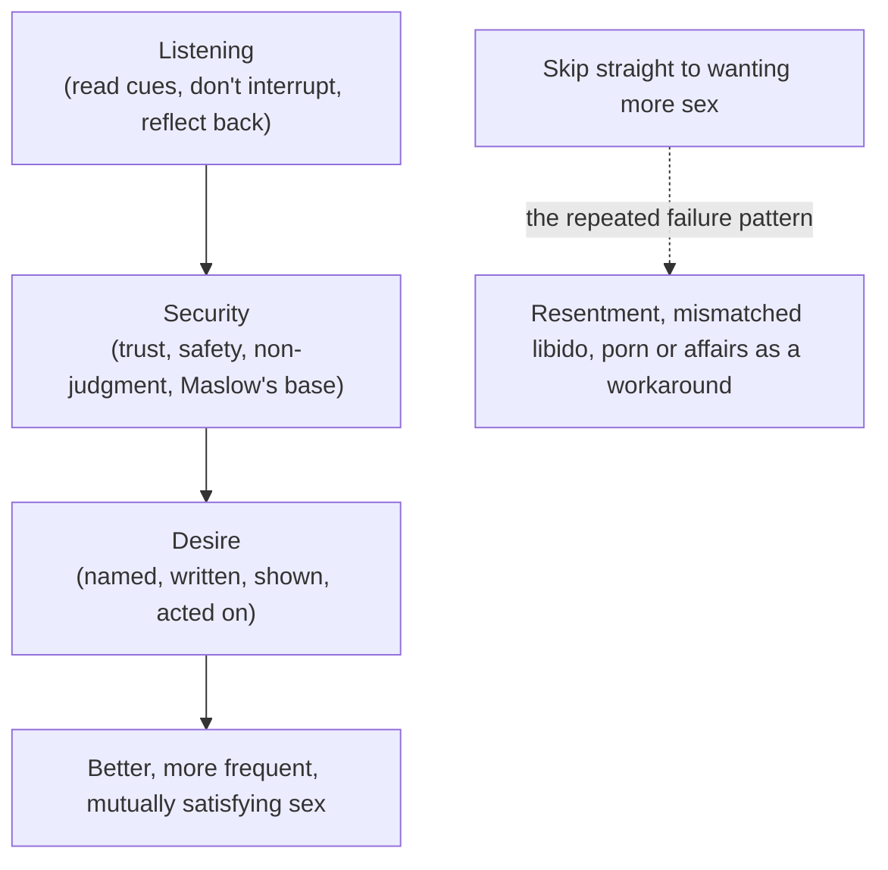
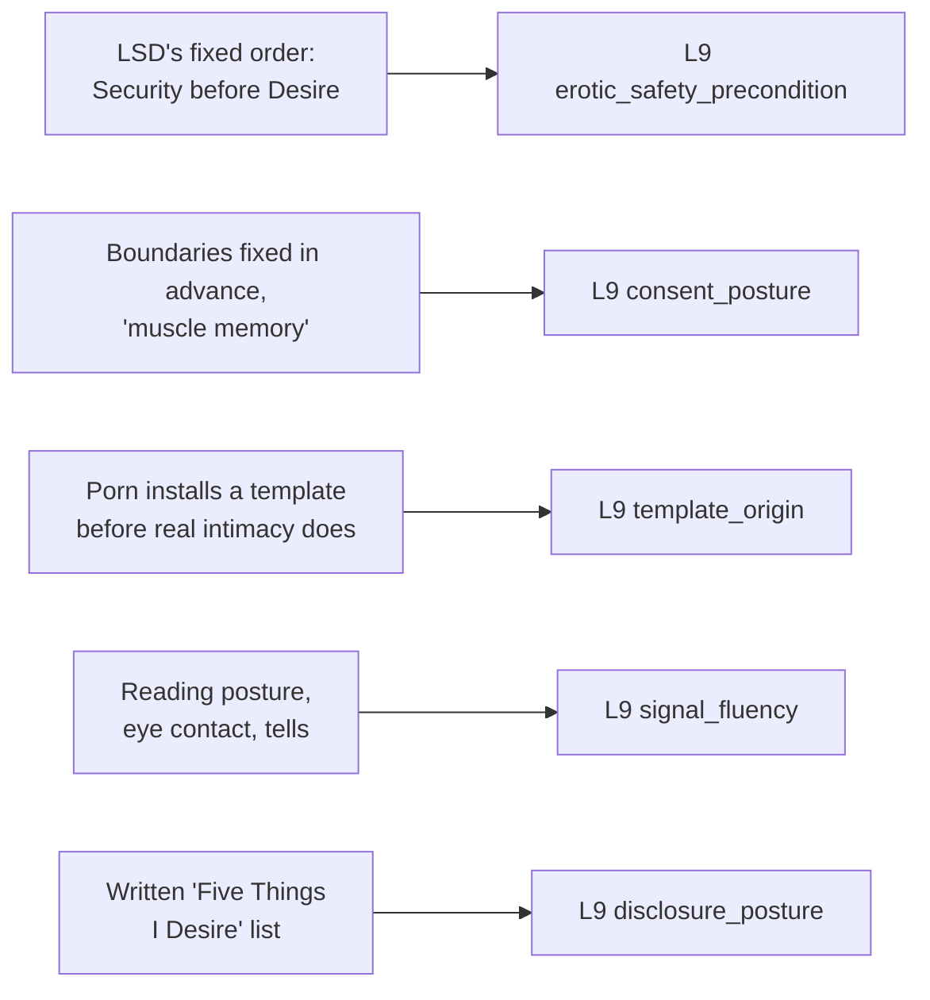

# 🧬 PSY.28 — The New Naked — Fisch with Moline (2014)
### Knowledge Entry — Distill

A urologist's clinical-popular guide, written for women about the men in their lives, built around a two-part structure — diagnosing what turns desire off, then a three-part communication system (Listening, Security, Desire) for turning it back on — drawn from decades of practice, a radio call-in show, and case vignettes.

## TABLE OF CONTENTS
- [Core Thesis](#1-core-thesis)
- [Mind Models](#2-mind-models)
- [Framework](#3-framework--structure)
- [Key Concepts](#4-key-concepts)
- [Heuristics](#5-heuristics--decision-rules)
- [Invariants](#6-invariants)
- [Pitfalls](#7-pitfalls--myths)
- [Application](#8-application)
- [Cross-References](#9-cross-references)
- [Provenance](#10-provenance--confidence)

---

## 1 · CORE THESIS

Sex is "the dipstick of every relationship": its quality reveals what's actually happening outside the bedroom. Desire cannot be restored by mechanical fixes alone; it requires Security (trust, safety, non-judgment) established before Desire can be expressed, built on a foundation of real Listening — LSD, in that fixed order.

---

## 2 · MIND MODELS

*Required. Minimum two diagrams, maximum five.*

**Diagram 1 — the whole argument.**
Caption: *two parts, one diagnostic and one prescriptive — Part I catalogs why desire dies, Part II supplies the fixed-order system (L, then S, then D) that revives it.*

**Diagram 2 — the central mechanism (a fixed-order process).**
Caption: *the LSD order is not optional — skipping straight to Desire without Listening and Security first is the book's single most repeated failure mode.*

**Diagram 3 — mapped onto the Command's L9 fields.**
Caption: *the book's clinical case material lands on five separate L9 variables, each with a concrete, citable mechanism rather than an abstract definition.*

---

## 3 · FRAMEWORK / STRUCTURE

Two parts, seven lessons, framed by an introduction and epilogue; each lesson opens with clinical case vignettes and closes with "Dear Dr. Fisch" letters and quizzes.

| Part | Lesson | Governing question |
|---|---|---|
| I. Sex Talk 101 | 1. Satisfaction | Is good sex a skill you can learn, or a fixed trait? |
| I. Sex Talk 101 | 2. What Turns You Off to Sex? | What are the diagnosable reasons desire disappears? |
| I. Sex Talk 101 | 3. Erection, Interrupted | What physically goes wrong, and how is it treated? |
| I. Sex Talk 101 | 4. Risky Business | What does porn, an affair, or addiction actually cost a relationship? |
| II. Communication 101 | 5. L Is for Listening | Why can't most couples talk to, not at, each other? |
| II. Communication 101 | 6. S Is for Security | What has to be true before desire is even accessible? |
| II. Communication 101 | 7. D Is for Desire | How do you make desire visible instead of assumed? |

---

## 4 · KEY CONCEPTS

| Concept | What it is | Why it matters |
|---|---|---|
| **Sex as the relationship's dipstick** | Sexual frequency and quality function as a diagnostic reading of the relationship's overall health, not an isolated bedroom issue | Reframes "we're not having sex" as a symptom to investigate, not the problem to solve directly |
| **The LSD system, in fixed order** | Listening, then Security, then Desire — each is explicitly a precondition for the next, not three parallel tips | The ordering itself is the claim: skipping to Desire without Listening and Security first is named as the book's most common failure pattern |
| **The turn-off taxonomy** | A structured differential of reasons desire stops: unusual stress, depression, low testosterone, being closeted, porn addiction, weight/grooming/manners, snoring/sleep apnea, digital-device intrusion | Gives a writer a checklist of *diagnosable, distinct* causes for a character's flagging desire rather than one generic "fell out of love" explanation |
| **Maslow's hierarchy applied to a couple** | Physical survival, safety, belonging, esteem, self-actualization, mapped onto a relationship: desire and generosity only become available once the lower rungs (financial, physical, emotional safety) are secured | Supplies erotic_safety_precondition a concrete, tiered structure rather than a single yes/no gate |
| **Muscle memory for safer sex** | Boundaries, consent language, and precautions ("no glove, no love," pre-agreed limits) are trained like an athlete's reflexes *before* arousal overrides deliberate judgment | Models consent as a habituated, pre-committed posture that survives the moment when "rational brain function stops," rather than a negotiation conducted mid-arousal |
| **Porn as template corruption** | Passive, high-volume pornography consumption before or instead of real partnered intimacy installs comparison points (bodies, stamina, scripted eagerness) that warp later expectations of a real partner | The book's most direct, if opinionated, statement about where an erotic template can come from and what happens when it forms from performance rather than person |
| **The written desire list** | Partners each write "What I Love about You" and "What I Desire from You," then read them aloud in a low-stakes setting (a restaurant, not the bedroom) | A concrete disclosure ritual: written first (lowers the stakes of saying it aloud unscripted), staged setting, mutual and simultaneous exchange |
| **Fantasy and role-play as normal** | The Alice-and-Joe case (porn viewing replaced by negotiated dress-up role-play) is used to argue fantasy is not deviant but a legitimate, negotiable channel for desire | Distinguishes "fantasy expressed and negotiated with a partner" from "fantasy consumed alone via porn" as two different registers with different relational effects |

---

## 5 · HEURISTICS & DECISION RULES

| Situation | Do this | Not this |
|---|---|---|
| A couple's sex life has stalled | Diagnose the specific cause (stress, depression, low-T, closeted orientation, addiction, hygiene, digital intrusion) before prescribing a fix | Treat "not enough sex" as one generic problem with one generic fix |
| Writing a partner who has stopped listening | Show it in body language first — turned posture, eyes on a phone or window, interrupting — before any dialogue names it | Have the disengagement announced only through what a character says |
| Depicting a couple attempting reconciliation after a rupture | Sequence it: security and trust re-established first, then desire re-expressed — not the reverse | Have desire alone resolve a trust rupture |
| A character wants to introduce a fantasy or kink to a partner | Show it negotiated and named aloud, with the partner given a real say in the form it takes | Show it delivered as an ultimatum or performed without the partner's input |
| Writing a character shaped by heavy solitary pornography use | Let it surface as a comparison problem (expecting a partner to match a performance) rather than a simple libido problem | Write porn use as having no effect on how the character reads a real partner |
| A character needs to make an unspoken desire known | Give them a concrete, low-stakes disclosure mechanism (written first, said aloud later, in a neutral setting) | Have them expect the partner to intuit it unstated |
| Writing consent and safer-sex boundaries in a scene | Establish them as already-rehearsed, pre-committed habits that hold under arousal | Write them as spontaneously negotiated for the first time mid-scene, with no prior habit to draw on |

---

## 6 · INVARIANTS

1. **Sexual frequency and quality reflect the relationship's overall state**, not an isolated, separable bedroom problem.
2. **Security is a precondition for desire, not a parallel track.** Trust, safety, and non-judgment must be established before desire can be reliably accessed or expressed.
3. **Boundaries fixed before arousal hold; boundaries decided during arousal often don't.** Deliberate, "rational" judgment is explicitly described as unreliable once sex begins.
4. **Desire that goes unexpressed is read as desire that doesn't exist.** The book's repeated claim is "you've got to show it to know it" — unstated desire functions, relationally, the same as absent desire.
5. **A cause for lost desire is always diagnosable.** The text explicitly rejects "it just happens" as an explanation and insists on a specific, addressable reason.

---

## 7 · PITFALLS / MYTHS

- Treating "not enough sex" or "no desire" as a single, undifferentiated symptom rather than investigating which of several distinct, named causes is actually operating.
- Skipping Listening and Security and attempting to manufacture Desire directly — named repeatedly as the book's core failure pattern.
- **A real flaw in the source itself, worth naming rather than replicating:** the "Is he gay and still in the closet?" quiz sits inside the same diagnostic taxonomy as depression and low testosterone, treating sexual orientation as a dysfunction to detect and manage within a marriage rather than an identity with its own legitimate arc — a 2014 popular-clinical register a writer should not import uncritically for a queer character's interiority.
- Assuming a partner's silence about their desires means they have none, rather than that disclosure has never been made safe or invited.
- Treating any porn use as pathological; the book itself distinguishes occasional, mutually-negotiated use from compulsive, comparison-driving solitary use, and conflating the two flattens a real distinction.
- Writing consent as something invented fresh in the heat of a scene, when the book's own "muscle memory" framing argues the opposite: that reliable boundaries are rehearsed in advance.

---

## 8 · APPLICATION

- **Spine level:** L5, the relational/intimate-arc register — this is a couple's desire built, lost, and rebuilt across time through a named communication system, not a single scene (L4) or an individual's isolated want (L6).
- **12-layer character stack:** L9 erotic_safety_precondition (primary), L9 consent_posture (primary), L9 template_origin (primary), L9 signal_fluency (supporting), L9 disclosure_posture (supporting). See frontmatter `feeds:` for the full wiring.
- **plot_systems:** contextual candidate once `04_PLOT_SYSTEMS/` opens — the turn-off taxonomy (Diagram 1) is a ready-made, differentiated cause bank for why a couple subplot's desire has stalled, richer than a single generic "grew apart."
- **Setting:** not applicable; this is a clinical relationship-advice source, not a setting source.

This is the wave's most directly usable clinical-practical source for one specific job: giving a writer a named, staged mechanism for how desire is lost and deliberately rebuilt in an established relationship, distinct from the mythic register (PSY.22) or the empirical-phenomenological register (PSY.10) covering similar ground. Its clearest exports are the fixed LSD ordering, which gives `erotic_safety_precondition` a concrete tiered structure via Maslow, and the "muscle memory" consent framing, which gives `consent_posture` a pre-committed, habituated texture distinct from in-scene negotiation. Its porn-and-template material is opinionated and dated in places (see Pitfalls) but still supplies a direct, citable account of how a `template_origin` can form from passive consumption rather than lived intimacy — useful precisely because the mechanism it describes (comparison, warped expectation) is real even where the book's moral framing around it is heavy-handed.

---

## 9 · CROSS-REFERENCES

| Related entry | Relation |
|---|---|
| [[🧬 PSY.10 — Magnificent Sex — Kleinplatz & Ménard (2020)]] | Sibling on empathic communication as the mechanism crossing relational distance; this source's Listening lesson is a lay-clinical, prescriptive cousin of Kleinplatz's empathic-communication meta-factor |
| [[🧬 MSX.17 — Mating in Captivity — Perel (2006)]] | Direct tension: Perel argues security and desire pull in opposite directions and must be held unresolved; this source argues security is a strict precondition for desire — a genuine disagreement worth preserving rather than flattening |
| [[🧬 PSY.19 — The Complete Photo Guide to Great Sex — Quiver (2012)]] | Counterweight: where this source is almost entirely relational/communicative and physically thin, PSY.19 is almost entirely physical/technical and relationally thin — read together they cover more of the L9 surface than either alone |

---

## 10 · PROVENANCE & CONFIDENCE

Loose-attachment extraction (no chapter or page markers survived; clean prose text with quiz checkboxes and letter-column formatting intact). Read in full: front matter, introduction ("Sex Is a Dipstick"), Lesson 1 (Satisfaction) in full, Lesson 2 (What Turns You Off to Sex?) in full including all diagnostic quizzes and letter columns, Lesson 4 (Risky Business) opening and porn-and-relationships section in full, Lesson 5 (L Is for Listening) in full, Lesson 6 (S Is for Security) through the Maslow section and the Five Infallible Rules, Lesson 7 (D Is for Desire) through the written-desire-list exercise and the Alice-and-Joe fantasy-negotiation case. Sampled, not deep-extracted: Lesson 3 (Erection, Interrupted — physiological/dysfunction anatomy), the remainder of Lesson 4 (affairs and addiction beyond porn), the closing portion of Lesson 7 (Fifty Shades material), and the epilogue. The book is explicitly written from a heteronormative, cisgender, "written about men but for women" clinical-popular perspective by a practicing urologist (Sourcebooks, 2014); its case vignettes and diagnostic frames are presented as clinical experience, not as a research study, and this distill treats them accordingly — useful, citable material with a real methodological blind spot flagged directly in Pitfalls rather than smoothed over.

## META
- Template: BVX-LEARN-v4.0
- Source classification: loose-attachment extraction, clinical-popular self-help book, full extraction on five of seven lessons plus introduction, sampled on two
- Created / Updated: 2026-09-29
