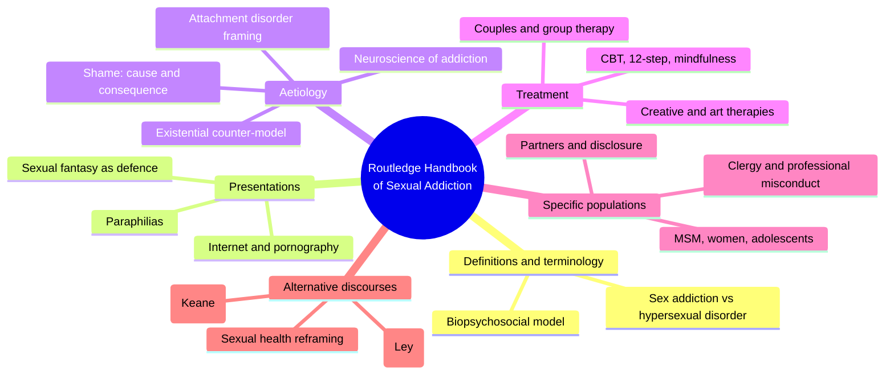
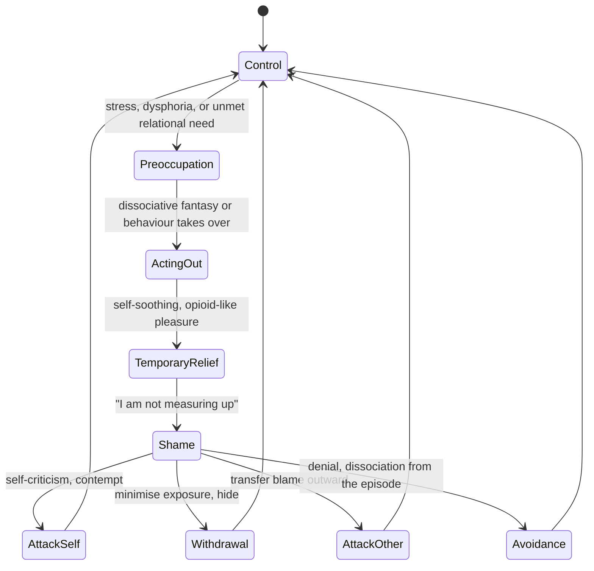
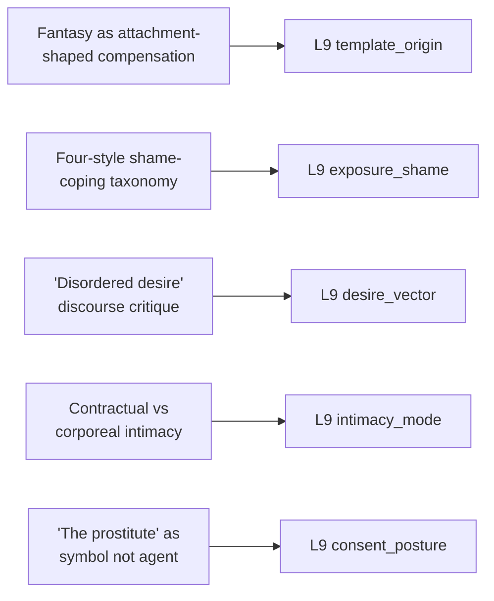

# 🧬 PSY.29 — The Routledge International Handbook of Sexual Addiction — Birchard & Benfield (2018)
### Knowledge Entry — Distill

A forty-chapter, multi-author clinical handbook on sex addiction/hypersexual disorder — definitions, presentations, aetiology, treatment modalities, specific populations, and, crucially, a closing section of the field's own sharpest critics; the library's second addiction-and-desire entry, this one built to hold both the clinical model and its rebuttal in the same volume.

## TABLE OF CONTENTS
- [Core Thesis](#1-core-thesis)
- [Mind Models](#2-mind-models)
- [Framework](#3-framework--structure)
- [Key Concepts](#4-key-concepts)
- [Heuristics](#5-heuristics--decision-rules)
- [Invariants](#6-invariants)
- [Pitfalls](#7-pitfalls--myths)
- [Application](#8-application)
- [Cross-References](#9-cross-references)
- [Provenance](#10-provenance--confidence)

---

## 1 · CORE THESIS

Compulsive sexual behaviour runs on an oscillating cycle of control, urge, acting out, relief, and shame, with fantasy serving as a dissociative, attachment-shaped substitute when relational needs go unmet. Whether this cycle constitutes a "disease" or is itself manufactured by a moralising discourse that pathologises specific desire is the field's own unresolved, live argument.

---

## 2 · MIND MODELS

*Required. Minimum two diagrams, maximum five.*

**Diagram 1 — the whole argument.**
Caption: *seven sections build one clinical model of sex addiction, then a closing section hands the mic to the model's own critics — the handbook argues with itself by design.*

**Diagram 2 — the central mechanism (the shame-addiction cycle).**
Caption: *the same states recur whether shame is framed as cause or consequence — the cycle, not the direction of causation, is the load-bearing structure, and each shame-coping style routes back into it differently.*

**Diagram 3 — mapped onto the Command's L9 EROS fields.**
Caption: *the handbook's own competing chapters split cleanly across five L9 fields — the clinical model feeds template_origin and exposure_shame, the critical chapters feed desire_vector, intimacy_mode, and consent_posture as correctives.*

---

## 3 · FRAMEWORK / STRUCTURE

Seven sections, moving from definition through mechanism, treatment, and population, to a deliberately dissenting close:

| Section | Focus |
|---|---|
| 1 · An introduction to sex addiction | Terminology, biopsychosocial framing, the state of the field |
| 2 · Presentations of sex addiction | Internet/digital-age presentations, pornography, paraphilias, the role of fantasy |
| 3 · The aetiology of sex addiction | Neuroscience, attachment-disorder framing, shame (empirical review), existential counter-model |
| 4 · The treatment of sex addiction | Assessment, group/couples/CBT/12-step/mindfulness/creative/pharmacological approaches |
| 5 · Sex addiction in specific populations | MSM, adolescents, women, partners, disclosure, sex offenders, professional and clergy misconduct |
| 6 · Alternative discourses on sex addiction | A sexual-health reframing, a Foucauldian discourse critique, an iatrogenic/moral critique |
| 7 · Conclusion | The editors' closing synthesis |

---

## 4 · KEY CONCEPTS

| Concept | What it is | Why it matters |
|---|---|---|
| **The oscillating cycle of control and release** | Birchard's model: control, urge/preoccupation, acting out, temporary relief, and shame, which tightens control and restarts the cycle | The mechanism-level shape of compulsive sexual behaviour according to its own clinical literature, regardless of one's view on whether it's a "disease" |
| **Shame as both cause and consequence** | Carnes: "shame emerges from addiction. Shame causes addiction. Whichever way the shame is flowing... it rests on one key personal assumption: somehow I am not measuring up" | Breaks a simple causal story; a character's shame and compulsive behaviour can be written as mutually reinforcing rather than one strictly producing the other |
| **The four-style shame-coping taxonomy (Compass of Shame Scale)** | Attack Self (self-criticism, contempt), Withdrawal (minimal exposure, hiding), Attack Other (transferring blame), Avoidance (denial, dissociation from the shaming event) | A concrete, differentiated menu for how a specific character processes sexual shame, rather than a generic "feels bad about it" |
| **Fantasy as dissociative self-care / attachment-object substitute** | Newbury (via Knox, Leedes): when early attachment fails, sexual fantasy can be co-opted to auto-regulate affect and stand in for a missing attachment relationship, disconnected from reflective, autobiographical self-agency | Explains compulsive fantasy use as a developmental adaptation, not a moral failing or an arbitrary taste |
| **Attachment style shapes fantasy content** | Birnbaum's findings: avoidantly attached individuals' fantasies more often feature aggression, alienation, and self-humiliation; anxiously attached individuals' fantasies more often feature submission and romantic merging | A direct, research-backed content generator: a character's attachment style predicts the emotional shape of their fantasy life, not just its frequency |
| **Sex addiction as a Foucauldian discourse** | Keane: "sex addiction" is not simply a description of a disorder but a regulated way of talking that constructs "the sex addict" as a disordered subject, combining medical and moral judgment | Reframes the diagnostic category itself as doing cultural work (defining "healthy" vs "unhealthy" sex) rather than neutrally describing one |
| **The twin pillars of classic sex addiction theory** | Carnes: "absence of a relationship" and "desire for heightened excitement" as the disease's defining features | Shows how the clinical model, by definition, classifies non-monogamous, anonymous, kink, or masturbatory sexuality as inherently more pathological than partnered, low-intensity sex |
| **The iatrogenic critique** | Ley: sex addiction concepts are "based on social and moral values towards sex," repeatedly rejected from the DSM for lack of scientific basis, and risk therapists becoming "enforcers of social attitudes towards sex, rather than healers of pain" | A direct caution against treating a diagnostic label as value-neutral fact when writing a clinician, institution, or authority figure who pathologises a character's desire |
| **The internet as both scapegoat and enabler of self-discovery** | Keane's re-reading of "Barbara," a case presented as tragic online sex addiction: a lifelong hidden desire for BDSM only became actionable once anonymity removed the social cost of disclosure | Same events, two readings — escalating pathology, or a suppressed desire finally finding a safe channel; the difference is which frame the narrator imposes |
| **Existential counter-model** | Alex Smith: from Sartre/Heidegger/van Deurzen's tradition, compulsive sexual behaviour is not a disease with an aetiology but a manifestation of free will and a chosen way of relating to lived experience, for which the person is responsible | A third framing beyond "disorder" and "discourse construct" — desire as an existential choice, however painful, rather than something that happens to a person |

---

## 5 · HEURISTICS & DECISION RULES

| Situation | Do this | Not this |
|---|---|---|
| Writing a character caught in compulsive sexual behaviour | Show the full cycle — control, urge, acting out, relief, shame, tightened control — as a loop | Show a flat, one-directional slide from "fine" to "addicted" |
| A character processes sexual shame | Pick one consistent coping style (self-attack, withdrawal, blaming others, or denial/avoidance) and let it shape their choices | Write shame as an undifferentiated bad feeling with no behavioural signature |
| Generating a character's fantasy content | Derive it from their attachment style (avoidant -> aggression/humiliation/alienation; anxious -> submission/merging) | Assign fantasy content arbitrarily or purely for shock value |
| A clinician, parent, or institution labels a character's desire "disordered" | Show the social/moral judgment embedded in that label, and who benefits from it being treated as fact | Treat the diagnosis as neutral, objective truth the narrative simply confirms |
| A character has hidden a specific desire (e.g. kink) for years | Consider that its "coming out" via a safer context may be self-discovery, not escalation into pathology | Automatically read increasing openness about desire as the addiction "getting worse" |
| Depicting a long-hidden desire's costs | Show that suppression itself — not the desire — may be producing the damage (secrecy, isolation, shame) | Blame the desire's content for harms actually caused by its concealment |
| A sexual-partner character appears in another character's "addiction" arc (e.g. a sex worker, an affair partner) | Give them their own agency, desires, and interiority | Reduce them to a symbol of the protagonist's disease or a plot device for the protagonist's healing |
| Writing what counts as "real" intimacy for a character or culture | Allow verbal/long-term/monogamous intimacy and corporeal/anonymous/fleeting connection to both be genuine | Default to treating only the contractual, long-term model as legitimate intimacy |

---

## 6 · INVARIANTS

1. **Shame and compulsive sexual behaviour reinforce each other in a cycle.** Whichever direction causation runs in a given case, the oscillating structure (control, urge, acting out, relief, shame) is the stable shape.
2. **Shame is processed through a specific coping style, not felt generically.** Self-attack, withdrawal, attacking others, and avoidance are functionally distinct and produce different downstream behaviour.
3. **Fantasy content is patterned by attachment history, not arbitrary.** What a person's fantasies emphasise (aggression, humiliation, submission, merging) tracks their attachment style's characteristic relational fears and compensations.
4. **Diagnostic categories for sexual behaviour encode moral and social judgment alongside clinical observation.** "Healthy" and "disordered" sex are not value-neutral scientific classifications; they reflect contested cultural norms about relationship structure, monogamy, and intensity.
5. **Suppression and shame can themselves generate the escalation later read as evidence of disorder.** A desire hidden out of fear of social cost is not the same phenomenon as a desire that is inherently harmful.
6. **What counts as legitimate intimacy is contested, not settled.** A verbal, long-term, mutual-disclosure model is one competing definition among others, not an objective standard against which all connection is measured.

---

## 7 · PITFALLS / MYTHS

- Writing a diagnostic label ("sex addict," "hypersexual") as if it were neutral, objective fact rather than a category that itself encodes moral judgment about which forms of sex are acceptable.
- Reading a character's dark, humiliating, or power-imbalanced fantasy content as literal desire rather than as attachment-shaped, dissociative compensation.
- Collapsing dissimilar sexual behaviours (e.g., a consensual affair and child sexual abuse) under one undifferentiated "addiction" framework, erasing real ethical distinctions between them.
- Reducing a sexual partner in another character's compulsion narrative to a symbol of that character's disease, stripped of their own agency and desire.
- Treating masturbation, pornography use, kink, or non-monogamy as inherently symptomatic simply because a character engages in them more than a narrow relational norm allows.
- Assuming online sexual expression is inherently more dangerous, "unreal," or escalatory than offline expression, rather than examining its actual function in a specific character's life.
- Writing shame as a single flat emotion rather than as a specific, differentiated coping style that shapes behaviour.

---

## 8 · APPLICATION

- **Spine level:** L5 (WOUND) — this source's clinical core (attachment rupture producing dissociative, compensatory fantasy; shame cycles that entrench rather than resolve) is directly wound-shaped: the injury is relational and developmental, and the compulsive pattern is the psyche's (imperfect) self-care response to it.
- **12-layer character stack:** primary at L9 (template_origin, exposure_shame); supporting at L9 (desire_vector, intimacy_mode); contextual at L9 (consent_posture).
- **plot_systems:** contextual — the discourse-critique material (§4, §7) is a ready-made mechanism for writing an antagonistic institution, clinician, or family member whose "help" is itself the pressure generating the character's shame spiral.
- **Setting:** none directly — a character/psychology-layer source, not a setting source.

For the EROS layer, this handbook's distinctive value is holding two incompatible models in one volume and letting a writer choose which serves a given character: the clinical model (compulsion as an oscillating shame cycle rooted in attachment injury) supplies concrete mechanism and a differentiated shame-coping vocabulary; the critical chapters supply an equally concrete corrective against pathologising desire that is merely specific, non-normative, or long-suppressed. Newbury's attachment-to-fantasy-content mapping is the most directly generative tool here — it gives a template_origin engine keyed to attachment style rather than an arbitrary kink list. The Keane/Ley material is best used not to settle whether a character "really" has an addiction, but to write the people around that character (clinicians, partners, institutions) with an awareness of what their own diagnostic language is doing.

---

## 9 · CROSS-REFERENCES

| Related entry | Relation |
|---|---|
| [[🧬 PSY.08 — Lust, Men, and Meth — Fawcett (2015)]] | Closest sibling on the shelf: both treat compulsive sexuality as fused with an earlier wound and modeled through cycles of relief and shame; this handbook adds the attachment-to-fantasy-content mechanism and, distinctively, its own internal critique of the addiction framework Fawcett writes from within |
| [[🧬 MSX.17 — Mating in Captivity — Perel (2006)]] | Shared invariant on fantasy: Perel's claim that fantasy transforms what threatens in life into what excites in bed is the non-clinical mirror of Newbury's dissociative/compensatory fantasy model here |
| [[🧬 PSY.23 — Lesbian Porn Magazines and the Sex Wars — Groeneveld (2023)]] | Direct methodological parallel: Keane's discourse critique of "sex addiction" as a category that constructs its object is the same analytic move Groeneveld makes against legal and anti-pornography framings of lesbian BDSM — both show a dominant discourse mistranslating a community's or individual's own understanding of their desire |

---

## 10 · PROVENANCE & CONFIDENCE

Full text available (1,676 KB extraction, 455pp); read directly and in depth: the front matter and editors'/contributors' overview, Section 1's introductory framing (terminology and definitions), Chapter 2.5 "The Role of Sexual Fantasies in Sexual Addiction" (Newbury, full), Chapter 3.4 "The Role of Shame in Sexual Addiction: A Review of Empirical Research" (Dhuffar & Griffiths, full, all seven reviewed studies), the opening of Chapter 3.5 "Existential Perspectives on Working with Sex Addiction" (Alex Smith), Chapter 6.2 "What's Wrong with Sex Addiction?" (Keane, full), and the opening of Chapter 6.3 "Sex Addiction: An Iatrogenic and Moral Concept" (Ley). Sampled at chapter-title/table-of-contents level only, not deep-extracted: Section 2's remaining presentation chapters (internet, pornography, paraphilias), Section 3's neuroscience and attachment-disorder chapters, all of Section 4 (treatment modalities), and all of Section 5 (specific populations — MSM, adolescents, women, partners, disclosure, offenders, clergy). The chapters read in depth were selected specifically for direct relevance to L9 EROS mechanism (fantasy, shame, and the discourse critique of desire-pathologising) per the wave 3 brief; the unread treatment and population chapters likely carry additional clinical detail not reflected here. The `feeds:` keying against L9 EROS fields is this distill's synthesis, built by direct analogy between the handbook's own named mechanisms (the shame-addiction cycle, the shame-coping taxonomy, attachment-shaped fantasy content, the discourse critique) and the field definitions supplied in the wave 3 brief.

## META
- Template: BVX-LEARN-v4.0
- Source classification: full-text edited academic handbook, deep read on 5 of ~40 chapters (selected for L9 relevance across aetiology and alternative-discourse sections), remainder sampled at chapter-title level
- Created / Updated: 2026-09-29
