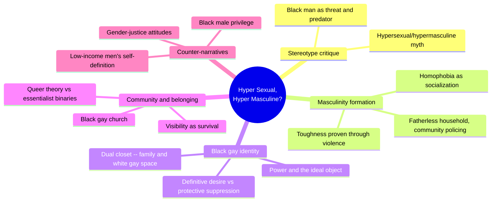
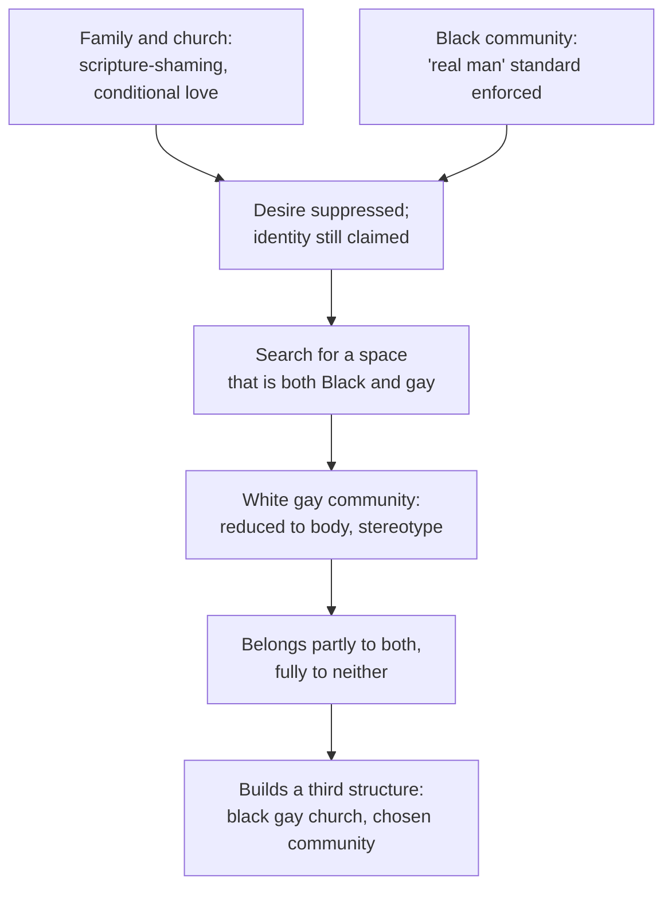
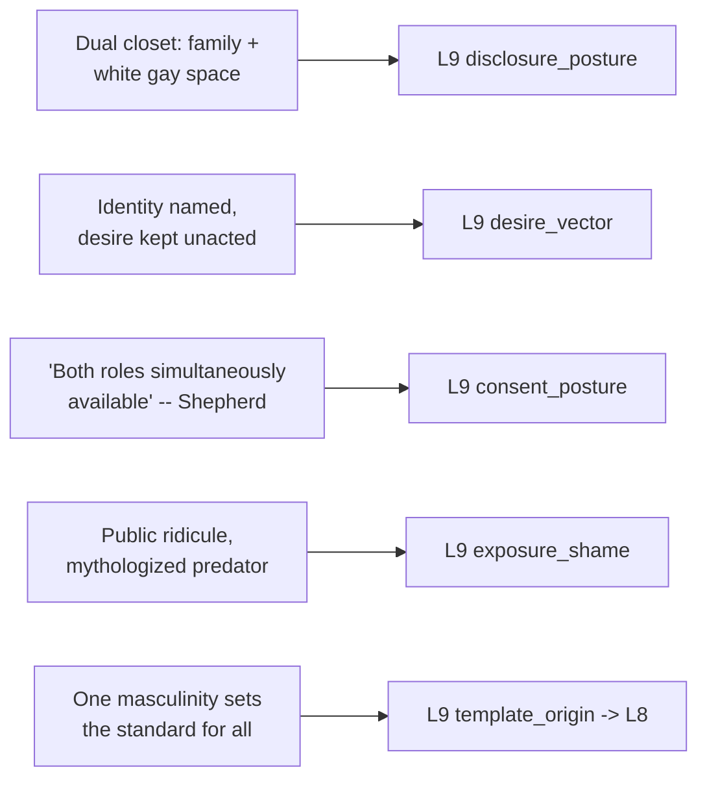

# 🧬 PSY.30 — Hyper Sexual, Hyper Masculine — Slatton, Spates (2014)
### Knowledge Entry — Distill

An edited sociology volume of first-person and research-based essays on Black masculine and sexual identity formation in the contemporary US, opening from the stereotype of the Black man as hypersexual and hypermasculine and dismantling it chapter by chapter, including a direct, sustained treatment of Black gay men's dual-community belonging.

## TABLE OF CONTENTS
- [Core Thesis](#1-core-thesis)
- [Mind Models](#2-mind-models)
- [Framework](#3-framework--structure)
- [Key Concepts](#4-key-concepts)
- [Heuristics](#5-heuristics--decision-rules)
- [Invariants](#6-invariants)
- [Pitfalls](#7-pitfalls--myths)
- [Application](#8-application)
- [Cross-References](#9-cross-references)
- [Provenance](#10-provenance--confidence)

---

## 1 · CORE THESIS

Black gay men often navigate a Black community that polices masculinity through shame and a majority-white gay community that reduces them to body and stereotype. Desire, disclosure, and power run on split architectures: an identity can be claimed while its desire stays unacted, and belonging is often built as a third space, not found in either original community.

---

## 2 · MIND MODELS

*Required. Minimum two diagrams, maximum five.*

**Diagram 1 — the whole argument.**
Caption: *eleven essays share one target -- the hypersexual/hypermasculine stereotype -- and dismantle it from five different angles, gay identity chief among them.*

**Diagram 2 — the central mechanism (the search for a third belonging).**
Caption: *neither original community offers full belonging, so the character has to build a third structure rather than pick a side -- the isolation is the mechanism that produces the new institution.*

**Diagram 3 — mapped onto the Command's L9 EROS fields.**
Caption: *five mechanisms from the same chapter key cleanly to five L9 fields, three of them primary, because the source gives named, working architectures rather than gestures at "dual identity."*

---

## 3 · FRAMEWORK / STRUCTURE

Four parts, moving from formation, through structural constraint, to critique, to counter-narrative:

| Part | Focus | Key chapters read for this distill |
|---|---|---|
| I. Challenges and Constraints of Masculine and Sexual Identity Formation | How Black masculinity is learned, including homophobia as an explicit part of that socialization | Ch.1, "Notes from a Former Homophobe" (Wright) -- full |
| II. Negotiating Unequal Ground | Structural barriers (sports, gay community belonging) Black men navigate | Ch.5, "Vagrant Frontiers: Black Gay Masculinity and a Quest for Community" (Patrick) -- full |
| III. Critical Interpretations of Black Men and Genderism | Black male privilege and survey evidence against the hypermasculine/misogynist stereotype | Sampled by chapter title/abstract only |
| IV. Black Men's Counter-Narratives in the Struggle for Masculine and Sexual Autonomy | Sensitivity in music, counter-narratives to the crack-dealer stereotype, low-income men's self-definition against the hypersexual/hypermasculine label | Sampled by chapter title/abstract only |

---

## 4 · KEY CONCEPTS

| Concept | What it is | Why it matters |
|---|---|---|
| **The dual closet** | A Black gay man conceals his sexuality from family and the Black community while defending or downplaying his Blackness in a majority-white gay community that stereotypes and objectifies him | Splits disclosure into two separate, non-transferable calculi -- being fully "out" in one space says nothing about safety in the other |
| **Definitive desire, protective proactivity** | Desire is strong enough to define the self (claiming a gay identity) without being strong enough, alone, to overcome the protective value of not acting on it | Separates naming an identity from enacting its full behavioral content -- a character can be truthfully "gay" and truthfully still not have had sex |
| **Desire for the ideal, not the individual** | Per Shepherd: many gay men desire not a specific man but "the idea of masculinity" itself, which no individual can permanently embody | Structurally explains restless pursuit or serial desire as a consequence of the object of desire being an abstraction, not a person |
| **Power as the organizing logic of gay male sex** | Shepherd's claim that sexual relations run on power-over or submission-to power, with "both roles simultaneously available" to a gay man | A named, citable power-inflected model of consent and role, distinct from a flat reciprocity-only default |
| **Community-manufactured shame** | Shame delivered through repeatable external mechanisms: a family member's recurring scripture note, public ridicule of one visible gender-nonconforming target, a mythologized predator figure used to police neighborhood boundaries | Shows shame as an actively maintained social technology, not a private feeling a character simply carries |
| **Queering identity categories** | The chapter author explicitly uses queer theory to reject essentialist binaries (masculine/feminine, homosexual/heterosexual) as the frame for his own self-understanding | A character's own theoretical vocabulary for understanding himself can be a craft tool -- his self-narration doesn't have to accept the categories imposed on him |
| **The third institution** | A Black gay church, or any voluntary community built specifically because neither the Black community nor the (white-dominated) gay community offers full belonging | Resolution is construction, not selection -- the character builds a new structure rather than choosing between two flawed ones |
| **Hypermasculinity as adaptive socialization** | Toughness proven through fighting, in a fatherless, economically precarious household, functions as a direct, traceable response to absence and precarity | Prevents writing hypermasculine performance as an unexplained cultural default rather than a learned survival strategy |
| **The masculinity hierarchy** (Kimmel, quoted) | "All masculinities are not created equal" -- one version (white, middle-class, heterosexual) sets the standard every other version is measured against | A transferable template for any identity formed in relation to an externally imposed, unmarked standard |

---

## 5 · HEURISTICS & DECISION RULES

| Situation | Do this | Not this |
|---|---|---|
| Writing a character navigating two communities that each partly reject him | Give him a genuinely divided disclosure calculus -- what he hides from one differs from what he manages in the other | Write "being closeted" as one binary that resolves the same way in every social context |
| Writing suppressed desire in a character who has already claimed the identity attached to it | Let him define himself by the desire without requiring he's acted on it -- naming and enacting are separable | Assume claiming an identity means the character has also enacted its full behavioral content |
| Writing a character's pull toward an ideal (a type, an image of masculinity or beauty) | Render the pull as toward the idea itself, explaining a pattern of restless pursuit rather than dissatisfaction with any one partner | Write every unsatisfied desire as evidence the character doesn't know what they want |
| Writing power dynamics inside a marginalized sexual community | Show both dominance and submission as roles available to the same character depending on context | Assign a character one permanent role in every power dynamic |
| Writing a community's shame-enforcement apparatus | Give it concrete, repeatable mechanisms -- ridicule of one visible target, a mythologized threat, a recurring family gesture | Write shame as a single private feeling with no external delivery system |
| Writing a character caught between two only-partial belongings | Let him respond by building a third space or chosen structure | Force a binary choice between the two communities as his only resolution |
| Writing a hypermasculine performance | Trace it to a concrete cause (fatherlessness, poverty, normalized household violence) | Present it as an inherent trait of a demographic rather than a learned, situational response |

---

## 6 · INVARIANTS

1. **Partial belonging to two communities does not sum to full belonging.** The deficits compound rather than cancel -- a character can be safe from one threat and still isolated in the space meant to shelter him.
2. **Naming a desire or identity and acting on it are separable events.** Suppression can coexist with a fully claimed identity, not only precede it.
3. **Desire can target an ideal rather than a specific person**, which structurally produces restless pursuit rather than settled satisfaction -- no individual can permanently embody an abstraction.
4. **Power in an already-marginalized dynamic is not automatically reciprocal-only.** Dominance and submission can both be available to, and used by, the same person across different encounters.
5. **A community manufactures and maintains shame through repeatable, external mechanisms** -- ridicule of one visible target, a mythologized threat -- not through private feeling alone.
6. **A single template of an identity (a masculinity, a "real man," a "real gay man") can be installed as the unmarked standard** every other version is measured against and found wanting, regardless of that version's internal coherence.

---

## 7 · PITFALLS / MYTHS

- Treating "the Black community" and "the gay community" (or any two communities a character straddles) as internally uniform blocs rather than each having its own hierarchy and gatekeeping.
- Writing a dual-belonging character's conflict as resolved the moment he finds "a community" -- the source shows ongoing, effortful negotiation, not a single arrival.
- Reducing a marginalized man's sexuality to either pure victimhood or the hypersexual stereotype -- both flatten the more contradictory account the source gives (dignity alongside shame, claimed identity alongside suppressed desire).
- Presenting internalized shame as something a character simply "has" rather than something specific people and institutions (a scripture note, a chorus of ridicule, a folk villain) actively deliver to him, repeatedly.
- Assuming a hypermasculine performance signals an absence of vulnerability rather than its management -- the source frames toughness as a direct, traceable response to fatherlessness and normalized violence, not a personality default.
- Collapsing gay male desire for "an ideal" into simple vanity -- the source frames it as a structural consequence of desiring something no specific person can permanently hold.

---

## 8 · APPLICATION

- **Spine level:** L5
- **12-layer character stack:** L9 EROS (primary: disclosure_posture, the dual-closet architecture across two communities that demand different concealment; primary: desire_vector, desire that names identity without requiring enactment, and desire for an unattainable ideal rather than a specific partner; primary: consent_posture, power-inflected role availability -- both dominance and submission open to the same character; supporting: exposure_shame, a community's concrete, repeatable shame-manufacturing mechanisms; contextual: template_origin -> L8, a single identity template installed as the unmarked standard others are measured against)
- **plot_systems:** contextual -- the "belongs incompletely to two communities, builds a third" arc (Diagram 2) is a reusable structure for any character caught between competing identity communities
- **Setting:** contextual -- the concrete community institutions named (a Black gay church, a visibly segregated dance floor, a family's scripture-as-message system) are ready models for a setting's own accepted/unaccepted boundary mechanisms; touches SETTING S8 HABIT without being formally fed here

The book's real usefulness for a writer building L9 EROS across the full sexuality spectrum, not only WLW or white-coded queer material, is that it gives named, citable mechanics for the specific bind of being doubly marginal -- desired for a stereotype in one space, shamed for an identity in another. The "definitive desire, protective proactivity" split (claiming an identity while suppressing its enactment) and Shepherd's power-role architecture are both concrete enough to write directly into a scene, not just gesture toward as "internal conflict." Read against [[🧬 MSX.36 — The History of Sexuality — Foucault (1978)]], the throughline is exact: the chapter's own author explicitly invokes queer theory to reject essentialist binaries in describing himself, making this source a first-person, present-day enactment of Foucault's claim that identity categories are built, not discovered -- and can therefore be contested from inside, exactly as the "reverse discourse" mechanism predicts.

---

## 9 · CROSS-REFERENCES

| Related entry | Relation |
|---|---|
| [[🧬 MSX.36 — The History of Sexuality — Foucault (1978)]] | Direct resonance: this source's own author explicitly draws on queer theory to reject essentialist binaries in self-narration, a first-person, present-day case of Foucault's claim that sexual identity categories are built rather than discovered, and can be contested from inside |
| [[🧬 MSX.17 — Mating in Captivity — Perel (2006)]] | Shepherd's power-over/submission-to account of gay male desire (quoted in ch.5) is a specific, power-inflected instance of Perel's broader claim that eroticism requires a bounded space where ordinary rules of equality and fairness are suspended |

---

## 10 · PROVENANCE & CONFIDENCE

Full text, pdftotext extraction, 195pp. Read in full: the Introduction ("Blackness, Maleness, and Sexuality as Interwoven Identities," Spates & Slatton -- the volume's framing of the hypersexual/hypermasculine stereotype); Chapter 1, "Notes from a Former Homophobe: An Introspective Narrative on the Development of Masculinity of an Urban African American Male" (Wright -- fatherless-household formation, community policing of gender nonconformity, homophobia as explicit socialization); Chapter 5, "Vagrant Frontiers: Black Gay Masculinity and a Quest for Community" (Patrick -- the dual-closet architecture, definitive desire vs. protective suppression, Shepherd's and Dais's and Tinney's quoted testimonies, the black gay church).

Sampled by chapter title, author note, and section-introduction summary only, not deep-extracted: Chapters 2-4 and 6-11 (African American male socialization broadly; Black male athletes; Black male privilege; survey evidence on Black men's gender-justice attitudes; sensitivity in R&B/hip hop; counter-narratives to the crack-dealer stereotype; race/patriarchy/masculinity formation; low-income Black men's self-definition against the hypersexual/hypermasculine label). This is a deliberate scope cut toward the two chapters carrying the volume's most concrete, transferable L9 mechanics on gay identity and desire specifically, read against the Introduction's full framing of the stereotype the whole volume answers.

The `feeds:` keying (L9 primary x3, supporting x1, contextual x1) is this distill's own synthesis against the Command's 12-layer character stack; the source uses none of that vocabulary. The `spine: [L5]` value follows the assigning brief's explicit instruction.

## META
- Template: BVX-LEARN-v4.0
- Source classification: full-text edited academic volume, deep extraction on the Introduction and two of eleven chapters, sampled by title/abstract on the remainder
- Created / Updated: 2026-09-29
