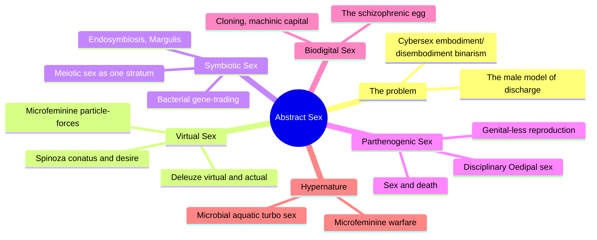
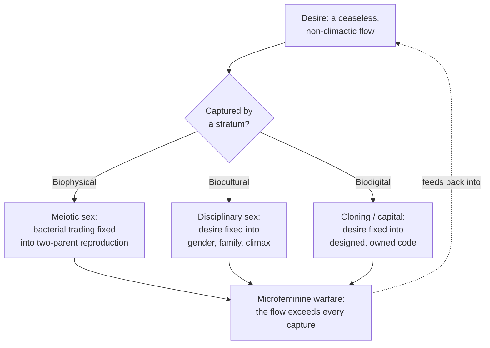
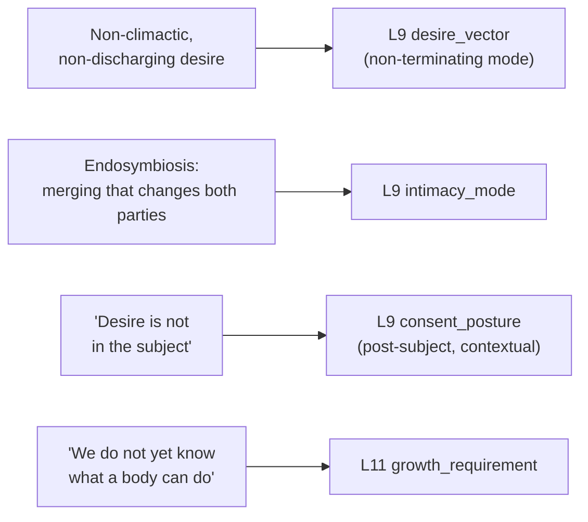

# 🧬 PSY.31 — Abstract Sex — Parisi (2004)
### Knowledge Entry — Distill

Luciana Parisi's Deleuze-and-Spinoza-inflected theory book argues that "sex" is not organs, gender, or reproduction but an abstract machine of information transfer running across three historical strata — bacterial (biophysical), human (biocultural), and cloned/engineered (biodigital) — and that desire, properly understood, never aims at a climax at all.

## TABLE OF CONTENTS
- [Core Thesis](#1-core-thesis)
- [Mind Models](#2-mind-models)
- [Framework](#3-framework--structure)
- [Key Concepts](#4-key-concepts)
- [Heuristics](#5-heuristics--decision-rules)
- [Invariants](#6-invariants)
- [Pitfalls](#7-pitfalls--myths)
- [Application](#8-application)
- [Cross-References](#9-cross-references)
- [Provenance](#10-provenance--confidence)

---

## 1 · CORE THESIS

Sex is not organs, gender, or reproduction; it is an abstract machine of information transfer running beneath and across every scale of body, from bacterial gene-trading to human intercourse to cloning. Desire is non-climactic: it never discharges toward satisfaction, only flows, connecting whatever bodies it touches. Femininity, as microfeminine particle-forces, is that same flow before it is captured into gender.

---

## 2 · MIND MODELS

*Required. Minimum two diagrams, maximum five.*

**Diagram 1 — the whole argument.**
Caption: *one flow, three historical captures (bacterial, human, digital) — each chapter shows the same underlying process seized and stabilized into a different, temporary shape of "sex."*

**Diagram 2 — the central mechanism (a capture-and-escape cycle across strata).**
Caption: *desire is captured into a stable, reproducible form at each stratum, but the book's real claim is that the flow always exceeds its capture — this excess, not the captured form, is where new bodies and new sexes come from.*

**Diagram 3 — mapped onto the Command's L9 EROS fields.**
Caption: *four pieces of this book's machinery give a non-human, hive, or engineered character's desire a structure that ordinary human-desire sources don't cover.*

---

## 3 · FRAMEWORK / STRUCTURE

An introduction plus five chapters, each mapping one stratum or the connections between them:

| Chapter | Stratum / focus | Governing move |
|---|---|---|
| Introduction: Abstract Sex | — | States the impasse: cyberfeminist debate is stuck oscillating between "embodiment" (biological difference) and "disembodiment" (the cyborg, cybersex), both still trapped inside the mind/body dualism; proposes a "third way" |
| 1. Virtual Sex | Method | Builds the toolkit: Deleuze's virtual/actual (after Bergson), Spinoza's conatus and non-subjective desire, and "microfeminine particle-forces" as femininity redefined below gender |
| 2. Symbiotic Sex | Biophysical | Bacterial sex and endosymbiosis (Lynn Margulis): gene-trading, cellular invasion, and parasitism as the oldest, most literal model of "sex," with meiotic (two-parent) sex as one later, historically specific capture of it |
| 3. Parthenogenic Sex | Biocultural | The human, disciplinary order of Sex (Oedipal family, genital reproduction, entropic pleasure) read as another historically specific capture, alongside a genital-less "parthenogenic" reproducibility that exceeds it |
| 4. Biodigital Sex | Biodigital | Cloning, genetic engineering, and cybernetic capital as a further capture: genetic information itself becomes a tradable, ownable commodity ("the schizophrenic egg," "incorporeal transformations") |
| 5. Hypernature | All three, connected | A "diagram" (microbial sex, aquatic sex, turbo sex) showing the three strata are continuous with each other on one plane, "hypernature" — technology is not opposed to biology, it is one more mode of the same bacterial process |
| Conclusion: Microfeminine Warfare | Synthesis | Names the book's real subject: an ongoing "warfare" in which the underlying flow of desire escapes and exceeds every stratum's capture of it, rather than simply reacting against control |

The throughline: every chapter re-runs the same move at a different scale — show that a form of "sex" assumed to be natural and fixed (two parents, gendered bodies, owned genetic code) is actually one temporary stabilization of an older, wilder, non-climactic flow.

---

## 4 · KEY CONCEPTS

| Concept | What it is | Why it matters |
|---|---|---|
| **Abstract sex** | Sex reconceived as an abstract machine of information transfer, not tied to organs, gender, or reproduction, operating across biophysical, biocultural, and biodigital strata | The book's title concept and central claim: "sex" is a process, not a body part or an identity |
| **Virtual / actual (Deleuze, after Bergson)** | The virtual is real but not yet actualized — not the same as "possible," which is just a pre-determined menu of options | Gives a body indeterminate capacities beyond its current, actualized form: useful for anything engineered, cloned, or hybrid |
| **Conatus (Spinoza)** | A body's power to affect and be affected by other bodies — its "effort to maintain and maximize the ability to be affected" | Reframes desire as a body's capacity to connect, not a lack seeking to be filled; "we do not judge a thing good because we desire it, we desire it because it is good for our power to act" |
| **Non-climactic desire** | Desire opposed to the "male model of pleasure" (accumulation and discharge toward a final climax); instead, "a ceaseless flowing that links together the most indifferent of bodies" | The book's most portable idea: desire structured by connection and continuation rather than by build-up and release |
| **Endosymbiosis (Margulis)** | New species and cellular structures emerge from parasitic or symbiotic merging (a virus hijacking a bacterium, a mitochondrion permanently incorporated into a cell), not only from vertical descent | An alternate model of "reproduction" through contagion and contamination rather than pairing |
| **Stratification** | The three strata (biophysical/bacterial, biocultural/human-disciplinary, biodigital/cloning-capital) are historically specific captures of one underlying flow into stable, reproducible forms | Explains why "natural" sex (two parents, fixed genitals, courtship) is a phase of order, not the flow's endpoint or origin |
| **Microfeminine particle-forces** | Femininity redefined not as an identity attached to female bodies but as a molecular, pre-individual force running through "all spheres: biophysical, socio-cultural, politico-economic, techno-scientific" | Femininity becomes a role or current a community or body can carry, not a fixed anatomical or gendered attribute |
| **Destratification / microfeminine warfare** | The process by which the underlying flow escapes or exceeds a stratum's capture of it — described as "escaping (preceding and exceeding) rather than resisting stratification" | Resistance here is not a reaction that starts after control is imposed; it is prior to and independent of the system it seems to oppose |
| **Hypernature** | The plane where biophysical, biocultural, and biodigital strata all connect and recombine; neither more natural nor more artificial than "nature" | Dissolves the technology-vs-biology opposition: cloning and genetic engineering are shown as continuous with, not opposed to, bacterial process |
| **The three strata's "sex," compared** | Biophysical = bacterial gene-trading (no organs, no pairing required); biocultural = human Oedipal/genital sex (organized around gender, family, climax); biodigital = cloning/transgenic sex (genetic code as tradable capital) | A ready-made taxonomy for writing three structurally different "kinds" of desire and reproduction across a story's species or factions |

---

## 5 · HEURISTICS & DECISION RULES

| Situation | Do this | Not this |
|---|---|---|
| Writing a non-human or hive/collective entity's desire | Write it as a flow that doesn't belong to any one member and has no individual climax | Give the collective a single body's desire structure (build-up, peak, release) |
| Writing a symbiotic or parasitic bond between two species or characters | Let the bond permanently change both parties | Treat it as a transaction between two unchanged, fixed individuals |
| Writing a character whose body is engineered, cloned, or hybrid | Give their body indeterminate capacities ("we don't yet know what it can do") | Write the engineered body as fully known and controlled by its makers |
| Writing an alien, microbial, or viral culture's "mating" or reproduction | Model it on gene-trading and contagion (bodies exchanging and recombining information on contact) | Default every species to human-style courtship and paired reproduction |
| Writing a desire that never resolves (an obsession, a species-drive, an addiction) | Let the wanting itself be the engine — escalating or shifting connection, no achievable climax | Give the character's desire a natural stopping point once "satisfied" |
| Assigning gender or sex to non-human characters | Let "femininity" or sex be a force or role that can move through a community | Assign gender by mapping directly onto human anatomy or pronouns |
| Writing institutional or hierarchical control of bodies (a state, a corporation, a hive queen) | Show it as capturing and fixing a wilder underlying flow into a stable form, not as the origin of desire itself | Write institutional control as simply switching desire on or off |
| Writing a culture or character resisting assimilation into a dominant system | Let their resistance run ahead of and beneath the system, already escaping it | Frame resistance purely as a reaction that begins only after the system acts |

---

## 6 · INVARIANTS

1. **Desire is not located in a single subject; it is a flow between bodies that a subject only partially channels.**
2. **A body's capacities are never fully known in advance.** Identity is a temporary stabilization, not a ceiling.
3. **Every stable form of "sex"** (bacterial gene-trading, human paired reproduction, cloning) **is one historical capture of a flow, not the flow's natural endpoint.**
4. **New bodies can emerge from merger and contagion** (symbiosis, infection, hybridization) **as legitimately as from vertical descent.**
5. **Desire structured as accumulation-and-discharge toward climax is one specific, culturally dominant model,** not desire's only possible shape.
6. **What escapes a system of control was already prior to and independent of that system,** not merely produced by reacting against it.
7. **Technology and biology are not opposites;** cloning, genetic engineering, and cybernetics are continuous with, not opposed to, bacterial and cellular process.

---

## 7 · PITFALLS / MYTHS

- Treating "natural" sex (two parents, fixed genitals, human-style courtship) as the default every alien, engineered, or non-human character must be measured against.
- Writing desire that only makes sense if it ends in a climax or resolution — the book's whole argument is that desire can be a structure without one.
- Collapsing a hive-mind or collective entity's desire into a single member's individual wanting.
- Treating engineered, cloned, or hybrid bodies as fully specified and predictable rather than carrying real, unscripted capacity to become something else.
- Assuming resistance to a controlling system must originate as a reaction to it, rather than something that preceded and exceeds the system.
- Using "femininity" only as a fixed identity attached to female-coded bodies, when the book's whole move is to detach it into a force that can run through any body or community.

---

## 8 · APPLICATION

- **Spine level:** L5, the character register of the story-spine — this is a source about the structure and location of desire itself, not plot mechanics.
- **12-layer character stack:** L9 EROS primarily — desire_vector (primary, non-terminating mode), intimacy_mode (supporting, endosymbiotic merging), consent_posture (contextual, post-subject desire). L11 DESTINY growth_requirement (supporting, indeterminate capacity to mutate). See frontmatter `feeds:` for the full wiring.
- **plot_systems:** contextual candidate once `04_PLOT_SYSTEMS/` opens — the stratification/destratification cycle (Diagram 2) is a reusable engine for any story built on a controlling system (empire, hive queen, corporation, church) versus a force that keeps escaping its capture rather than simply fighting it head-on.
- **Setting:** contextual — if a non-human species, fungal or mycelial network, or symbiotic ecology ever needs a biology-of-desire layer, this book's endosymbiosis material (bodies merging and trading information rather than pairing) is a ready-made toolkit; flagged as a candidate connection to the Command's own fungal/mycelial motifs, not asserted from the source itself.

This book's use is narrower than most of this shelf: it is not a guide to writing human intimacy, and applying its vocabulary to an ordinary two-person scene would be a category error. Its real value is for characters and communities the rest of the shelf doesn't reach — hive minds, engineered or cloned bodies, symbiotic or parasitic species, viral or fungal networks, post-human or collective entities — where "desire" needs a structure that isn't secretly modeled on one human body's arousal curve. For those cases, `desire_vector`'s non-terminating mode gets a fully worked-out philosophical version (desire as flow, not discharge), `intimacy_mode` gets a merging model that doesn't route through negotiation between two fixed selves, and `growth_requirement` gets a warrant for writing an engineered character whose capacities are genuinely open rather than fully specified by their design.

---

## 9 · CROSS-REFERENCES

| Related entry | Relation |
|---|---|
| [[🧬 PSY.13 — Psychology of the Unconscious — Jung (1916)]] | Parallel move at different scale: both books widen "sex" past genital function into a general force (Jung's libido, Parisi's abstract sex), but Jung stays psychological and human while Parisi pushes the same move fully into biology and machines |
| [[🧬 PSY.21 — The Sadeian Woman — Carter (1978)]] | Sharp contrast in scale: Carter's whole framework is human, gendered, and subject-based (victim or monster); Parisi explicitly wants to get under and past the human subject and fixed gender altogether — useful contrast when deciding how "zoomed out" a desire-system needs to be |
| [[🧬 MSX.17 — Mating in Captivity — Perel (2006)]] | Direct contrast: Perel's desire needs a human other and a gap between two subjects to survive; Parisi's desire isn't subject-based at all and runs through bacteria and machines as readily as through people |

---

## 10 · PROVENANCE & CONFIDENCE

Full text, OCR/scan extraction (~2,159 lines, ~75,000 words). Read in full: the front matter and Acknowledgements; the book's Introduction ("Abstract Sex," the cybersex/embodiment impasse and the proposal of a "third way"); Chapter 1, "Virtual Sex," including its Introduction, "The bio-technological impact," "Abstract sex," and "Microfeminine particle-forces" sections (its "Stratification" and "The essence of a body" sections were not separately deep-read, though their content is largely recapitulated in the chapter's other sections and the book's own Conclusion); the closing portion of Chapter 5, "Hypernature" (the transgenic-sex and mammal-cloning discussion through the chapter's own "Hypernature" synthesis section); and the book's Conclusion, "Microfeminine Warfare," in full through its per-chapter summary and closing argument. Also reviewed: the full Index and Bibliography, useful for confirming the book's core vocabulary and theoretical lineage (Deleuze and Guattari, Spinoza, Lynn Margulis, Luce Irigaray, Donna Haraway).

Chapters 2 ("Symbiotic Sex"), 3 ("Parthenogenic Sex"), and 4 ("Biodigital Sex") were **not directly deep-read**; their content in this distill is represented through the book's own detailed per-chapter summary in the Conclusion (Parisi's own synthesis of what each chapter argued) plus their table-of-contents subsection titles and relevant index entries. Given this source's extreme density (dense Deleuze-and-Spinoza philosophical vocabulary, minimal narrative or worked example per page) and its `gap=False` priority status in the wave 3 tasking sheet, this distill prioritizes accurate coverage of the book's method and framing chapters (Introduction, Chapter 1, Chapter 5, Conclusion) — which carry the thesis, the core concepts, and the synthesis — over full extraction of the three body-chapters' extensive biological and Marxist detail, which mainly supply supporting evidence for claims already established in the chapters read directly. Confidence is marked medium accordingly: high for the concepts and claims sourced from directly-read chapters, lower for chapter-specific detail attributed only via the author's own summary.

`zotero_key` is blank: not checked against the live Zotero database in this pass; flagged for a future cataloging sweep rather than invented.

## META
- Template: BVX-LEARN-v4.0
- Source classification: full-text OCR extraction; deep read on the Introduction, Chapter 1, the close of Chapter 5, and the Conclusion; Chapters 2–4 represented via the author's own Conclusion-chapter summary and TOC/index rather than direct extraction
- Created / Updated: 2026-09-29
