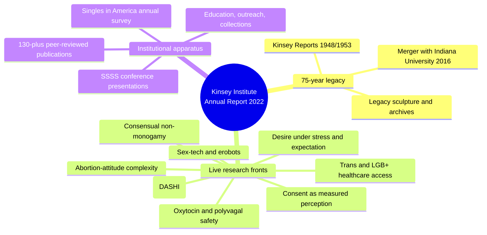
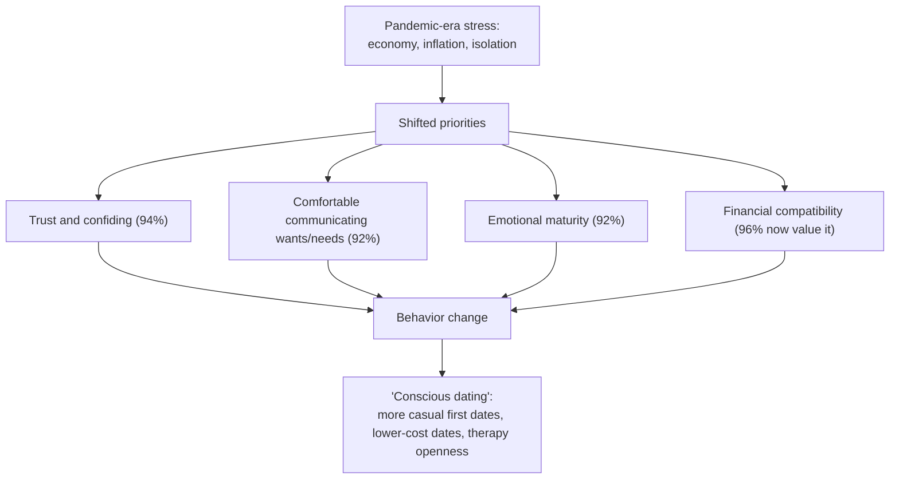
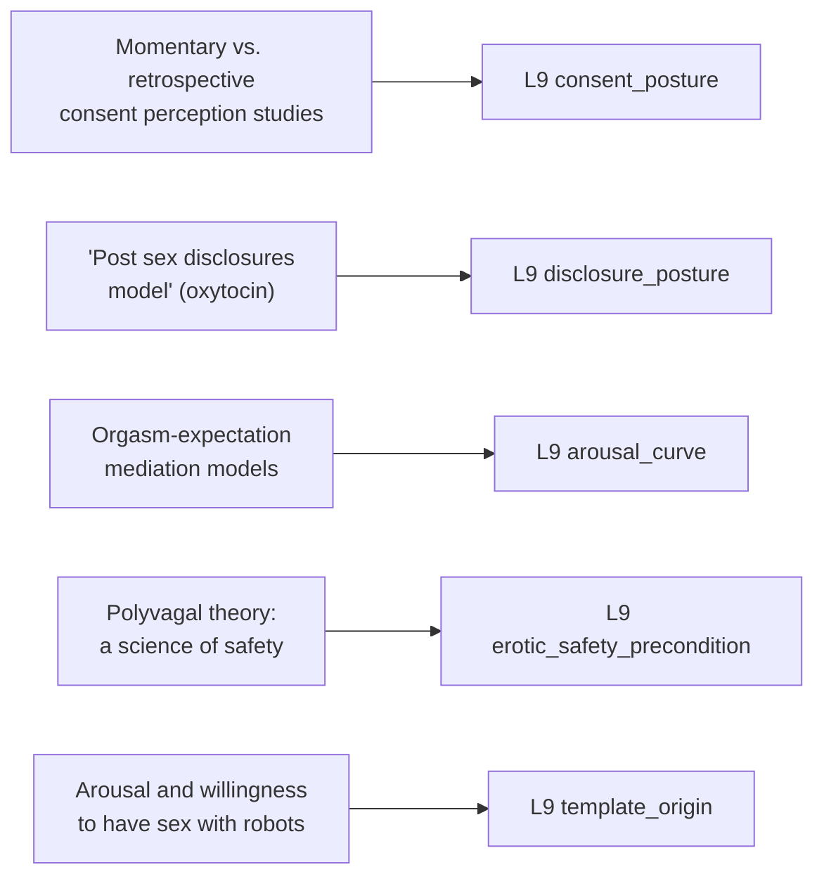

# 🧬 PSY.32 — Kinsey Institute Annual Report 2022 — The Kinsey Institute (2022)
### Knowledge Entry — Distill

An institutional annual report, not a monograph: a 75th-anniversary retrospective plus a full-year census of one research center's output — consent psychometrics, oxytocin/polyvagal neuroscience, sex-tech, non-monogamy, disability and trans health, and abortion-attitude research — useful here as a breadth map of where the empirical field actually is, not as a single argument.

## TABLE OF CONTENTS
- [Core Thesis](#1-core-thesis)
- [Mind Models](#2-mind-models)
- [Framework](#3-framework--structure)
- [Key Concepts](#4-key-concepts)
- [Heuristics](#5-heuristics--decision-rules)
- [Invariants](#6-invariants)
- [Pitfalls](#7-pitfalls--myths)
- [Application](#8-application)
- [Cross-References](#9-cross-references)
- [Provenance](#10-provenance--confidence)

---

## 1 · CORE THESIS

The Kinsey Institute's 2022 portfolio shows institutional sex research has fragmented past a single-survey model into distinct, separately measured variables: consent as moment-specific perception, desire under stress, safety as a neurobiological substrate, and sex-tech, disability, and non-monogamy as their own studied categories. No unifying theory is offered; methodological breadth is the field's current state.

---

## 2 · MIND MODELS

*Required. Minimum two diagrams, maximum five.*

**Diagram 1 — the whole argument.**
Caption: *this is a census, not a thesis — one institution's 2022 output sorts into eight live research fronts plus its own 75-year legacy.*

**Diagram 2 — the central mechanism (a process: what shifted dating priorities post-pandemic).**
Caption: *the 2022 Singles in America findings trace one clear causal chain — pandemic stress reordered what daters screen for, and that reordering shows up as concrete behavior change, not just stated preference.*

**Diagram 3 — mapped onto the Command's L9 fields.**
Caption: *five separate 2022 research strands land on five separate L9 variables — this source supplies citable empirical mechanisms, not craft advice.*

---

## 3 · FRAMEWORK / STRUCTURE

No single argument; the report's own section order is the skeleton, moving from institutional legacy through a live research census to education and archives.

| Section | What it covers |
|---|---|
| 75th Anniversary / Legacy | Founding in 1947, the 1948/1953 Kinsey Reports, directorial succession, the 2016 merger with Indiana University, the 2022 bronze legacy sculpture |
| Research spotlights | Three narrative deep-dives: the 2022 Singles in America "conscious dating" survey, the new Disability and Sexual Health Initiative (DASHI), and Dr. Jozkowski's abortion-attitude-complexity research |
| SSSS conference presentations | A snapshot of live talks: webcam intimacy, sex robots and arousal, consensual non-monogamy, orgasm/desire mediation, refusal-cue interpretation, chronic vulvovaginal pain in people of color, LGB+ healthcare gaps |
| Publications (Jan–Dec 2022) | Roughly 130 peer-reviewed papers spanning consent psychometrics, oxytocin/polyvagal neuroscience, abortion attitudes, PrEP/HIV prevention among Black and Latinx adults, trans and LGB healthcare access, and COVID-era desire and relationship functioning |
| Education and Outreach | Book Club, the Human Sexuality Intensive course, a medical-student Scholarly Concentration producing trans- and LGB-health publications |
| Collections | Archival donations: June Reinisch's global pregnancy-art collection; Julia Heiman's *Becoming Orgasmic* archive and reader correspondence |

---

## 4 · KEY CONCEPTS

| Concept | What it is | Why it matters |
|---|---|---|
| **Conscious dating (Singles in America 2022)** | Post-pandemic daters rank trust, communication comfort, emotional maturity, humor, and self-acceptance of one's own sexuality above physical attractiveness; financial compatibility has risen sharply (96% now call it important) | A dated, sourced, large-sample (largest annual U.S. singles study) snapshot of what daters actually screen for right now, useful as a reality check against generic "chemistry" writing |
| **Consent as measured perception, not a fixed fact** | Multiple 2022 papers study consent and refusal as time- and context-dependent: momentary perception differs from retrospective recall; refusal is frequently read from indirect cues, not only explicit words; alcohol measurably changes consent communication | Consent research here is a live, separately funded psychometric field, not a single settled definition — gives a writer permission to render consent as something that can be perceived differently by two people in the same scene |
| **The post-sex disclosure window** | A named research model (the "post sex disclosures model") studies what partners say to each other immediately after sex, and oxytocin's role in that specific communication window | Distinguishes a concrete, citable beat — the minutes right after sex — as its own studied event, distinct from "communication" as a general relationship skill |
| **Polyvagal theory: safety as a nervous-system state** | Stephen Porges's "Polyvagal Theory: A Science of Safety" and related oxytocin research treat felt safety as a measurable autonomic/neuroendocrine state, not just a psychological judgment | Supplies a biological substrate under "safety" as an erotic precondition — safety is something a nervous system registers, not only something a mind decides |
| **Sex-tech and erobots as a distinct intimacy channel** | 2022 papers study webcam-mediated intimacy between performers and consumers, remote sexual technologies, and sexual arousal's effect on willingness to have sex with robots | Documents synthetic and remote intimacy as a genuinely new, separately studied erotic category rather than a lesser substitute for partnered sex |
| **Consensual non-monogamy as a clinical population** | A 2022 conference talk explicitly addresses "clinical implications: understanding engagement, emotions, and affirming practices" for consensually non-monogamous people | Treats CNM as a structured relational form with its own best practices, not a symptom of instability |
| **Disability and sexual health as an under-researched population, named directly** | The new Disability and Sexual Health Initiative (DASHI) opens with a study of condom use among people with blindness or visual impairment, explicitly because this population had no prior dedicated research program | A direct, current example of a sexuality shelf category the field itself flags as historically invisible |
| **Documented healthcare gaps for trans and gender-minority patients** | A 2022 paper title states it plainly: gender minorities in Indiana report providers "don't know how to deal with people like me"; a companion study finds medical students inconsistently ask about sexual orientation and gender identity | Grounds a trans or gender-nonconforming character's healthcare frustration in documented, patterned system failure rather than an invented one-off incident |

---

## 5 · HEURISTICS & DECISION RULES

| Situation | Do this | Not this |
|---|---|---|
| Writing a consent negotiation scene | Let the two partners' in-the-moment read of the encounter genuinely differ from how each later recalls it | Treat consent as a single fixed fact both parties would necessarily state identically afterward |
| Writing a refusal within a sexual scene | Render it through the ambiguous, indirect cues research finds people actually use and often miss | Default to a clean, unambiguous verbal "no" as the only realistic form refusal takes |
| Writing desire during a crisis, pandemic, or upheaval | Let desire move in either direction — suppressed or intensified — depending on the specific stressor and relationship | Assume any crisis automatically kills desire |
| Writing the minutes right after sex | Use it as a real disclosure beat with its own weight, not a fade-to-black | Skip straight from the act to the next scene with nothing said between partners |
| Writing a character drawn to sex-tech, webcamming, or a synthetic partner | Ground their arousal or willingness in real correlates (novelty, control, safety, remote access) | Default to loneliness or deficiency as the only explanation |
| Writing a non-monogamous relationship | Render its negotiated structure and emotional practices as a legitimate, literature-backed relational system | Use non-monogamy as shorthand for instability or immaturity |
| Writing a disabled, trans, or otherwise marginalized character's healthcare experience | Ground it in the documented pattern (providers not asking, "don't know how to deal with people like me") | Invent a generic, unresearched version of prejudice |
| Establishing what a contemporary character screens for in a partner | Lead with trust, communication comfort, emotional maturity, and humor, with physical attractiveness lower on the list | Default to looks and chemistry as the primary or only screening criteria |

---

## 6 · INVARIANTS

1. **Consent is measured as a moment-specific perception, not a single retrospectively stable fact** — the same encounter can be read differently in the moment than in memory.
2. **Refusal is frequently communicated through indirect, non-verbal cues**, and misreading them is common enough to be its own research subject.
3. **External stress does not uniformly suppress desire**; its effect on desire and relationship functioning is contingent and, in some 2022 findings, reversed.
4. **Felt safety is registered by the nervous system**, not only judged by the conscious mind — polyvagal and oxytocin research treat it as a physiological state with behavioral consequences.
5. **Categories once marginal to research — disability, trans health, non-monogamy, sex-tech — are now studied on their own terms**, with dedicated initiatives and named populations, not folded into a majority-population default.

---

## 7 · PITFALLS / MYTHS

- Treating "consent" as a single binary fact settled at one moment, when the field's own 2022 output studies it as perception- and time-dependent.
- Assuming refusal is always explicit and verbal, when the research this report cites specifically exists because people miss indirect refusal cues.
- Defaulting to "crisis always kills desire" as a universal rule, when 2022 COVID-era desire research found more complex and sometimes opposite effects.
- Treating interest in sex-tech, webcamming, or sex robots as inherently pathological, when the research treats it as a distinct intimacy channel with its own measurable correlates.
- Writing non-monogamy as inherently unstable or a phase, when the Institute's own clinical research treats it as a structure with documented affirming practices.
- Treating a documented healthcare gap (disability, trans status) as one provider's rare individual failure rather than a patterned, institutionally studied problem.
- Reading this report as a monograph with a single thesis — it is a field census, and forcing one narrative onto it flattens exactly the breadth that makes it useful.

---

## 8 · APPLICATION

- **Spine level:** L5, the relational/intimate-arc register, though several findings (consent perception, refusal cues, post-sex disclosure) operate at single-scene (L4) granularity within that arc.
- **12-layer character stack:** L9 consent_posture (primary), L9 disclosure_posture (primary), L9 arousal_curve (supporting), L9 erotic_safety_precondition (supporting), L9 template_origin (supporting). See frontmatter `feeds:` for the full wiring.
- **plot_systems:** contextual candidate once `04_PLOT_SYSTEMS/` opens — the momentary-vs-retrospective consent finding (Diagram 3) is a ready-made engine for a plot built on two characters genuinely, honestly misremembering the same encounter differently.
- **Setting:** not applicable; this is an empirical field-survey source, not a setting source.

Unlike the wave's craft manuals or its mythic urtext, this source's value is citational grounding: it supplies real, dated, named research mechanisms a writer can point to rather than invent from scratch. Its clearest exports are the consent-perception literature, which gives `consent_posture` genuine psychometric texture (a measured, time-dependent variable rather than a single fact), and the "post sex disclosures model," which gives `disclosure_posture` a named, specific beat. Because the report spans disability, trans health, non-monogamy, and sex-tech as distinct, currently-funded research fronts, it is also the wave's clearest evidence that "the whole spectrum" the L9 layer is meant to cover is not a writer's invention — the field itself now studies these categories as separate, legitimate objects of study, each with its own emerging literature.

---

## 9 · CROSS-REFERENCES

| Related entry | Relation |
|---|---|
| [[🧬 PSY.10 — Magnificent Sex — Kleinplatz & Ménard (2020)]] | Sibling empirical register: Kleinplatz's phenomenological interview study and this report's psychometric consent/desire literature are two different methods studying overlapping questions about what makes sex work |
| [[🧬 PSY.28 — The New Naked — Fisch with Moline (2014)]] | Direct corrective pairing: where Fisch's clinical-popular book treats being closeted as a diagnostic checklist item, this report's own 2022 output (LGB+ healthcare, trans health, DASHI) shows the field's actual, more careful current treatment of marginalized sexualities |
| [[🧬 PSY.22 — Eros and Psyche — Carus after Apuleius (1900)]] | Extreme register contrast: myth versus psychometrics on the same underlying questions (trust, disclosure, safety as precondition) — useful as a reminder that this report's empirical answers and the myth's symbolic ones point at the same structural concerns |

---

## 10 · PROVENANCE & CONFIDENCE

Full text, loose-attachment extraction of a 43-page institutional annual report (Kinsey Institute, Indiana University, 2022), clean text layer with page-break artifacts typical of a design-heavy PDF (running headers, photo captions interleaved with body text). Read in full: front matter and research faculty roster, the Director's letter, the 75th-anniversary institutional history, all three research spotlights (Singles in America "conscious dating," DASHI, abortion-attitude complexity), the full SSSS 2022 conference presentation and poster list, roughly the first half of the 130-entry publications bibliography (through the "K" surnames) read in full with the remainder scanned by title and journal for additional relevant strands, and the Education/Outreach and Collections sections. This is a public-facing institutional report, not a peer-reviewed synthesis; its research spotlights are the Institute's own selected highlights, and the publications list is titles and venues only (no abstracts extracted) — this distill's key concepts are built from the researchable claims embedded in titles, spotlight narratives, and presentation abstracts actually present in the source, not from reading the underlying 130 papers themselves.

## META
- Template: BVX-LEARN-v4.0
- Source classification: institutional annual report (full-text extraction), not a monograph; three research spotlights read in full, publications bibliography sampled by title/venue after full read of first half
- Created / Updated: 2026-09-29
