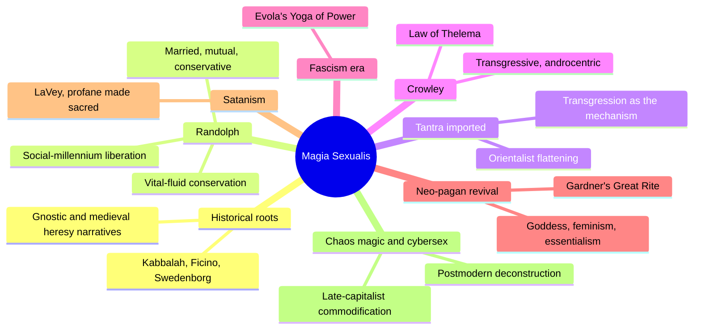
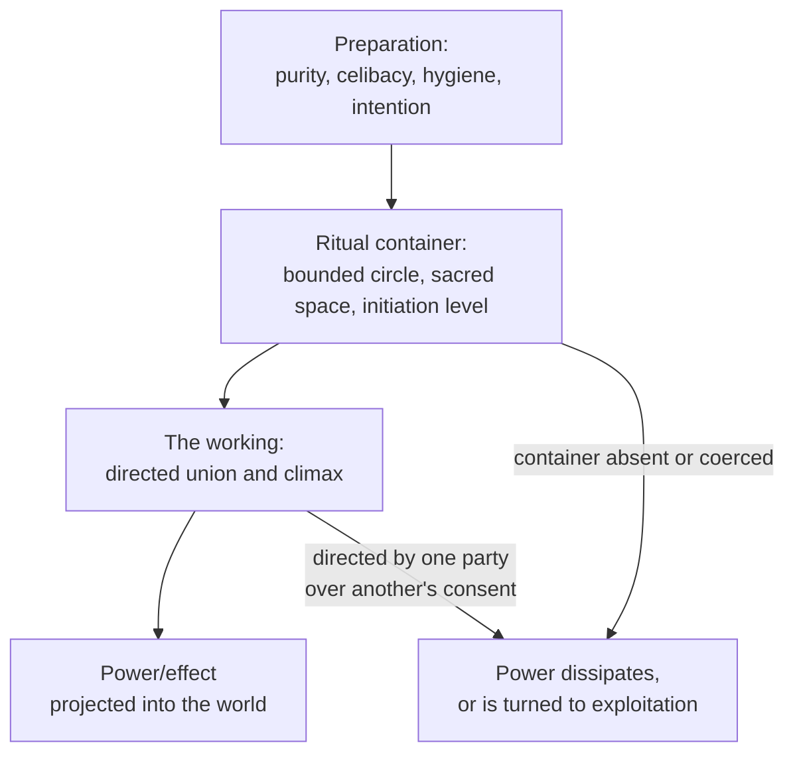
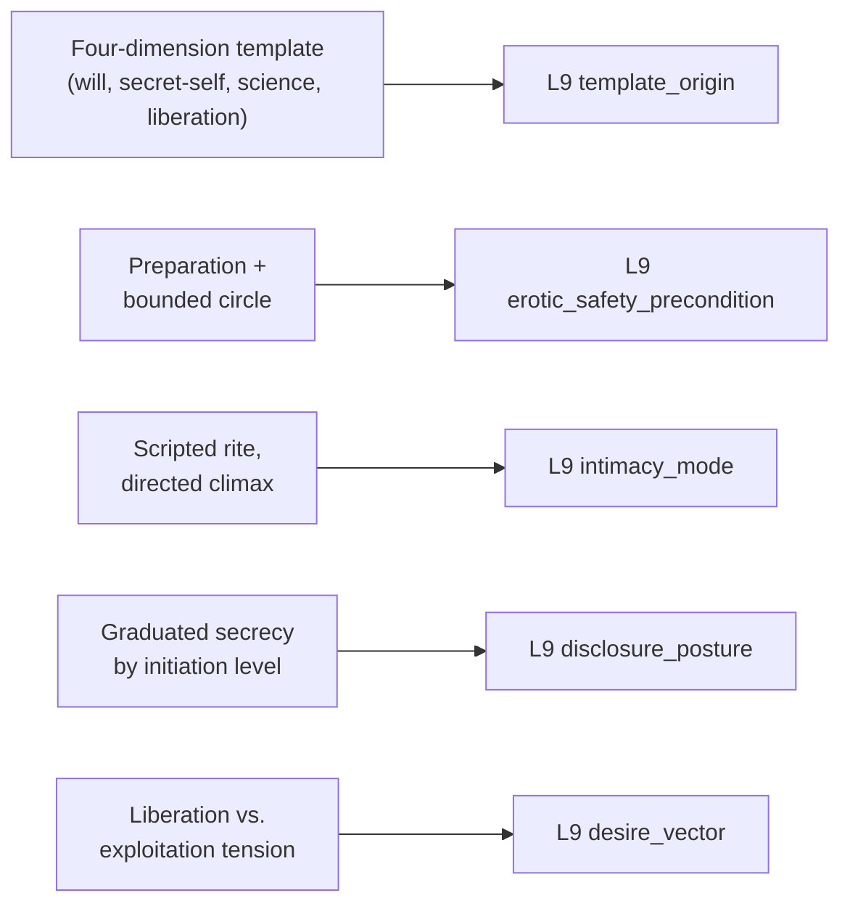

# 🧬 PSY.33 — Magia Sexualis — Urban (2006)
### Knowledge Entry — Distill

A critical cultural history of Western sexual magic from Victorian America to postmodern chaos magic, arguing that each generation's ritual system reframes orgasm as a technology of personal and political liberation while simultaneously risking new forms of exploitation — the library's first entry to model eroticism as an explicitly constructed ritual technology rather than a psychological or clinical phenomenon.

## TABLE OF CONTENTS
- [Core Thesis](#1-core-thesis)
- [Mind Models](#2-mind-models)
- [Framework](#3-framework--structure)
- [Key Concepts](#4-key-concepts)
- [Heuristics](#5-heuristics--decision-rules)
- [Invariants](#6-invariants)
- [Pitfalls](#7-pitfalls--myths)
- [Application](#8-application)
- [Cross-References](#9-cross-references)
- [Provenance](#10-provenance--confidence)

---

## 1 · CORE THESIS

From Victorian America to postmodern chaos magic, successive occult traditions have built explicit ritual technologies that use orgasm to produce effects in the world, each pairing sex with an ideal of personal and social liberation. Every one of these systems is haunted by the same unresolved tension: the same ritual grammar that liberates a practitioner can, in the hands of whoever directs it, exploit their partner instead.

---

## 2 · MIND MODELS

*Required. Minimum two diagrams, maximum five.*

**Diagram 1 — the whole argument.**
Caption: *one ritual grammar (preparation, containment, directed climax) gets inherited and reshaped by eight successive movements, each bending it toward a different ethics and politics.*

**Diagram 2 — the central mechanism (the sex-magic ritual protocol).**
Caption: *every tradition surveyed runs the same three-stage engine — preparation, containment, directed climax — and the same engine fails toward harm or exploitation whenever one stage is skipped.*

**Diagram 3 — mapped onto the Command's L9 EROS fields.**
Caption: *the book's own recurring structures — the ritual protocol, graduated secrecy, the liberation/exploitation split — key directly onto five L9 fields.*

---

## 3 · FRAMEWORK / STRUCTURE

An introduction and eight chronological chapters, each a case study testing the same liberation/exploitation tension against a new tradition:

| Chapter | Case study | Governing question |
|---|---|---|
| Introduction | Method and theory | What makes sex magic distinctly "modern," and why the liberation/exploitation tension? |
| 1 · The Recurring Nightmare, the Elusive Secret | Medieval and early-modern roots | How did sexuality and heresy become linked in the Western imagination before sex magic existed as such? |
| 2 · Sex Power Is God Power | Paschal Beverly Randolph | What does the first fully worked-out modern sex-magic protocol actually require? |
| 3 · The Yoga of Sex | Tantra's Western import | How did a Western audience reshape (and largely misread) Asian Tantra into its own image? |
| 4 · The Beast with Two Backs | Aleister Crowley | What happens when the same ritual grammar is redirected toward transgression and self-deification? |
| 5 · The Yoga of Power | Sex magic and fascism (Julius Evola) | Can the same technology of liberation be annexed to an authoritarian political project? |
| 6 · The Goddess and the Great Rite | Gerald Gardner, Wicca, neo-paganism | How does the ritual grammar reshape itself around feminism and Goddess worship? |
| 7 · The Age of Satan | Anton LaVey and Satanism | What happens when transgression itself, rather than liberation, becomes the stated goal? |
| 8 · Sexual Chaos | Chaos magic and cybersex | How does the tradition mutate again under postmodern and digital conditions? |
| Conclusion | Synthesis | What are the lessons of two centuries of sex magic for religion, sexuality, and liberation? |

---

## 4 · KEY CONCEPTS

| Concept | What it is | Why it matters |
|---|---|---|
| **Sex magic, precisely defined** | Not any loose association of sex and spirituality, but the explicit use of orgasm (hetero-, homo-, or autoerotic) as a means to produce magical effects in the external world | Distinguishes the book's actual subject from the vaguer "tantric sex" marketing it critiques; a useful precision for any fictional system: is sex symbolic of power, or literally the mechanism that generates it? |
| **The four dimensions of modern sex magic** | (1) supreme individual will, (2) sex as the innermost secret/truth of the self, (3) a scientistic idiom of "laws" and "energy," (4) a stated goal of radical personal and social liberation | A reusable four-part recipe for building any fictional esoteric-erotic belief system so it reads as genuinely "modern" in Urban's sense, not generically mystical |
| **The liberation/exploitation tension** | Every sex-magic tradition studied claims to liberate its practitioners from repression, yet also risks (and often enacts) the exploitation of the less powerful partner by the one who directs the rite | The book's central, recurring finding; a structural warning for any story featuring a guru, magus, or spiritual-sexual teacher character |
| **Randolph's protocol** | Married heterosexual couples only; love, not lust; pure unselfish intention kept secret; 10-41 days' preceding celibacy; strict hygiene; mutual, ideally simultaneous orgasm | The first fully worked-out ritual technology in the tradition — concrete enough to lift directly into a fictional practice, conservative enough to contrast against every later variant |
| **The vital-fluid conservation model** | Randolph's belief in a shared sexual secretion ("the Lymphication of Love") whose loss through "waste" (masturbation, promiscuity) drains a person's spiritual and physical power | A scarcity-based erotic template distinct from abundance-based models elsewhere on the shelf — desire here is a finite resource to be husbanded, not an endlessly renewable wellspring |
| **The bounded ritual container** | Gardner's explicit rule that magical power raised through dance, chant, or the Great Rite "will be swiftly dissipated" unless "confined in a circle" | A near-identical structural cousin to Perel's "bounded space of eroticism" (already keyed from MSX.17), but here an explicit technical requirement of the ritual system itself, not a psychological observation about desire |
| **Transgression as the mechanism** | Following Bataille, the book argues potency in these systems comes specifically from deliberately overstepping a named taboo (nonreproductive acts, caste/class violation, incest symbolism), not from generic sexual intensity | Explains why "deviant" content escalates across the tradition's history — each new movement needs a fresh, more extreme transgression to generate the same charge |
| **Graduated initiation** | Gardner reserved the literal Great Rite for third-degree initiates, with a symbolic substitute (athame lowered into a chalice) performed for those not yet admitted to the physical rite | A workable disclosure_posture model: secrecy calibrated to trust and readiness within a community, with symbolic stand-ins available at lower tiers |
| **Transmission as reinterpretation, not copying** | The same core ritual grammar passes from Randolph to the Hermetic Brotherhood of Luxor to Crowley to Gardner, and each inheritor reshapes its ethics and purpose (conservative-marital -> transgressive-androcentric -> feminist-Goddess-centered) while keeping the underlying structure | A model for how a fictional tradition, cult, or lineage can visibly evolve across "generations" of practitioners without losing its recognizable shape |
| **Essentialism inside a liberation movement** | Neo-pagan Goddess worship empowers women as ritual authorities while still relying on a fairly rigid, binary, complementarity-based model of male and female energy | A caution against writing a liberationist erotic subculture as automatically free of its own new orthodoxies |

---

## 5 · HEURISTICS & DECISION RULES

| Situation | Do this | Not this |
|---|---|---|
| Building a fictional sex-magic or ritual-eroticism system | Give it explicit rules: preparation, timing, hygiene, stated intention, and a defined container | Leave "sex magic happens" vague or purely atmospheric |
| Depicting ritual erotic power being raised | Require a bounded container (a circle, a rite, an initiation level) for it to be safe or effective | Let power be raised and used with no containment shown |
| Writing a transgressive or taboo-breaking erotic practice | Tie its potency explicitly to the specific taboo being broken | Treat transgression as generic intensity or shock value alone |
| A guru, magus, or spiritual-sexual teacher character directs a rite involving others | Show the liberation/exploitation tension openly — whose desire is actually being served | Let the character's spiritual framing go unexamined by the narrative |
| Building an esoteric community's internal culture | Use graduated initiation: symbolic substitutes for novices, the literal practice reserved for trusted adepts | Make all practice uniformly open or uniformly secret |
| A character or tradition inherits an older ritual system | Show them keeping its structure while redirecting its ethics and purpose | Have them adopt it unchanged, or invent an entirely new system from nothing |
| Depicting a liberation-coded erotic subculture (feminist, queer, countercultural) | Let it carry its own internal contradictions or new orthodoxies | Write it as a pure, frictionless alternative to the mainstream it opposes |
| Importing an "exotic" or foreign-coded tradition into a fictional practice | Engage its actual source content and note where it's been reshaped for a new audience | Flatten it into costume and atmosphere divorced from its origin |

---

## 6 · INVARIANTS

1. **Ritual erotic power requires a bounded container.** Across every tradition studied, power raised through sex or ritual either dissipates or turns dangerous without a defined space, protocol, or level of initiation to hold it.
2. **Potency is tied to specific transgression, not generic pleasure.** The particular taboo broken determines the character and intensity of the power a system claims to release.
3. **Liberation and exploitation are structurally entangled, not opposites.** The same ritual grammar that frees one practitioner's desire can, redirected by whoever holds authority in the rite, appropriate another's.
4. **Systems are transmitted by reinterpretation, not verbatim copying.** Each new inheritor of a ritual tradition reshapes its ethics and purpose while preserving its recognizable underlying structure.
5. **Secrecy within an esoteric erotic tradition is graduated by trust and readiness, not a simple binary.** Initiation systems reveal different content to different tiers of member.
6. **A liberationist erotic movement is not automatically free of its own new orthodoxies or essentialisms.** Empowering one axis (e.g., gender) can coexist with rigid assumptions on another.

---

## 7 · PITFALLS / MYTHS

- Treating historical "sex magic" or ritualized eroticism as pure ancient wisdom without also showing the exploitation risk the historical record consistently reveals.
- Importing "Tantra" (or any "exotic" tradition) as costume and atmosphere without engaging its actual source-culture content — the book explicitly names this as a Western, largely Orientalist flattening.
- Writing ritual eroticism as spontaneous or unstructured when the historical pattern is the opposite: maximally scripted, with explicit preparatory, hygienic, and intentional rules.
- Reading secrecy in an esoteric erotic tradition as necessarily about shame, when it is at least as often about graduated initiation and protecting a rite's potency.
- Collapsing "liberation" and "exploitation" into a single simple verdict on a tradition or character, when the sources studied consistently hold both at once.
- Assuming a spiritual or magical framing around sex automatically legitimizes it — the book repeatedly shows this framing used both sincerely and as cover for abuse.

---

## 8 · APPLICATION

- **Spine level:** L5 — assigned per the wave's shelf-wide spine key; this source's actual center of gravity is template-construction and ritual technology rather than a single wound arc, though the recurring exploitation pattern (a teacher's authority used against a follower's consent) supplies concrete wound material for any character emerging from such a system.
- **12-layer character stack:** primary at L9 (template_origin, erotic_safety_precondition, intimacy_mode); supporting at L9 (disclosure_posture, desire_vector).
- **plot_systems:** contextual — the transmission-as-reinterpretation pattern (§4) is a ready-made model for a multi-generational cult, order, or lineage subplot whose core practice visibly mutates as it passes between characters with different ethics.
- **Setting:** contextual — the graduated-initiation structure and ritual-container mechanics are directly reusable for building a fictional esoteric or magical order's internal culture and practice.

For the EROS layer, this book's distinctive contribution is treating eroticism itself as an explicitly engineered ritual technology, complete with a stated protocol, a required container, and a theorized mechanism (transgression) for how it generates power. The template_origin material is unusually generative: the four-dimension recipe (supreme will, sex as innermost truth, scientistic idiom, liberation goal) can build a self-consistent erotic belief system for any character or culture from first principles. The bounded-container invariant gives erotic_safety_precondition a hard technical form to match Perel's psychological one, and the liberation/exploitation tension is a built-in, reusable source of dramatic irony for any character whose desire is framed by someone else's spiritual or ideological system.

---

## 9 · CROSS-REFERENCES

| Related entry | Relation |
|---|---|
| [[🧬 MSX.17 — Mating in Captivity — Perel (2006)]] | Direct structural echo: Gardner's ritual circle and Perel's "bounded space of eroticism" are the same invariant in two registers, one a technical requirement of magical practice, the other a psychological requirement of sustained desire |
| [[🧬 PSY.23 — Lesbian Porn Magazines and the Sex Wars — Groeneveld (2023)]] | Shared method: both trace how a community builds an explicit, internally coherent vocabulary and practice around eroticism (frictional space; ritual protocol) that outsiders consistently misread or flatten |
| [[🧬 PSY.29 — The Routledge International Handbook of Sexual Addiction — Birchard & Benfield (2018)]] | Shared caution on authority: Keane's critique of a "sex addiction" discourse that erases a partner's agency parallels this book's repeated finding that a spiritual-erotic teacher's authority can mask the exploitation of a follower |

---

## 10 · PROVENANCE & CONFIDENCE

Full text available (860 KB extraction, 331pp); read directly and in depth: the Preface and full Introduction (definition of sex magic, the four dimensions of modernity, the Foucault engagement, and the liberation/exploitation thesis), the majority of Chapter 2 "Sex Power Is God Power" on Randolph (his protocol, the vital-fluid model, the social-millennium argument, and the H.B. of L.'s reinterpretation), the opening of Chapter 3 "The Yoga of Sex" (the Tantra-import argument and its Orientalism critique), and a substantial portion of Chapter 6 "The Goddess and the Great Rite" (Gardner's biography, the Book of Shadows lineage, the bounded-circle rule, and the Great Rite's graduated initiation). Sampled at chapter-title/table-of-contents level only, not deep-extracted: Chapter 1 (medieval/early-modern roots), the remainder of Chapter 3, Chapter 4 (Crowley in full), Chapter 5 (Evola and fascism), the remainder of Chapter 6, Chapter 7 (Satanism), Chapter 8 (chaos magic and cybersex), and the Conclusion. The chapters read in depth were selected for the clearest, most concrete ritual-protocol detail per the wave 3 brief's focus on L9 mechanism; the unread chapters (especially Crowley, Evola, and LaVey) likely carry additional detail on the exploitation side of the liberation/exploitation tension not fully reflected here. The `feeds:` keying against L9 EROS fields is this distill's synthesis, built by direct analogy between the book's own named mechanisms (the ritual protocol, the bounded circle, graduated initiation) and the field definitions supplied in the wave 3 brief.

## META
- Template: BVX-LEARN-v4.0
- Source classification: full-text academic monograph, deep read on the Introduction and substantial portions of Chapters 2 and 6, remainder sampled at chapter-title level
- Created / Updated: 2026-09-29
