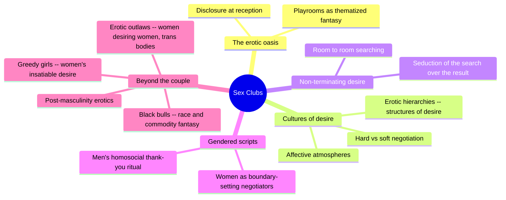
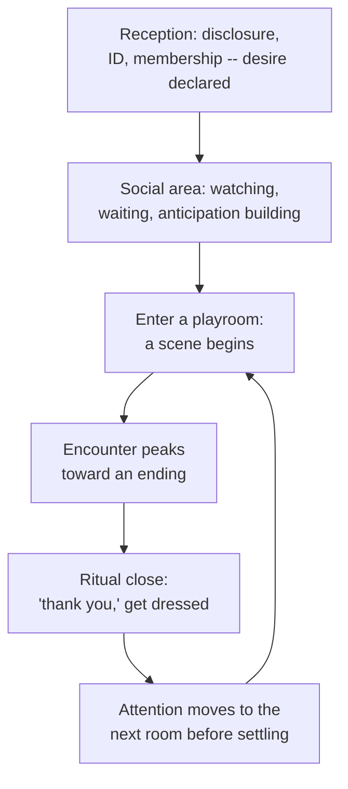
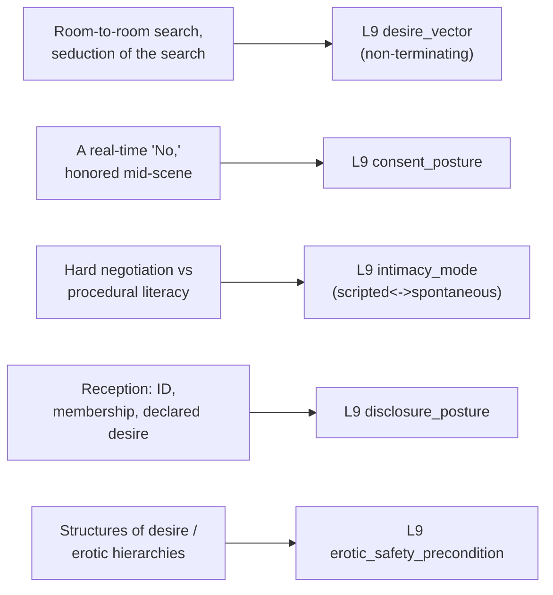

# 🧬 PSY.34 — Sex Clubs — Haywood (2022)
### Knowledge Entry — Distill

An ethnography of UK heterosexual and mixed sex clubs, built from fieldwork and interviews. Haywood argues clubs generate "cultures of desire" at the intersection of erotic hierarchies (imported social status re-priced as sexual capital) and affective atmospheres (color, texture, space) -- a directly observed, present-day field study of desire's real mechanics in a non-monogamous, semi-public setting.

## TABLE OF CONTENTS
- [Core Thesis](#1-core-thesis)
- [Mind Models](#2-mind-models)
- [Framework](#3-framework--structure)
- [Key Concepts](#4-key-concepts)
- [Heuristics](#5-heuristics--decision-rules)
- [Invariants](#6-invariants)
- [Pitfalls](#7-pitfalls--myths)
- [Application](#8-application)
- [Cross-References](#9-cross-references)
- [Provenance](#10-provenance--confidence)

---

## 1 · CORE THESIS

Sex clubs manufacture cultures of desire through erotic hierarchies (imported social status re-priced as sexual capital) and affective atmospheres (color, texture, room layout), inside a structure built to defer its own resolution -- desire moves room to room, seeking the next possibility more than consuming the current one. Real-time consent still cuts cleanly through the surrounding chaos when stated.

---

## 2 · MIND MODELS

*Required. Minimum two diagrams, maximum five.*

**Diagram 1 — the whole argument.**
Caption: *one ethnography, five thematic chapters -- the club's own spatial and social architecture is the actual subject, more than any single sex act inside it.*

**Diagram 2 — the central mechanism (the non-terminating search loop).**
Caption: *the club is built to outrun any single room -- the same 'seduction of the search over the pleasure of the result' that describes scrolling porn describes walking the corridor, and the loop itself, not any one scene, is the actual object of desire.*

**Diagram 3 — mapped onto the Command's L9 EROS fields.**
Caption: *five field-observed mechanisms key cleanly to five L9 fields -- three of them primary, because Haywood gives directly witnessed scenes, not theory alone.*

---

## 3 · FRAMEWORK / STRUCTURE

Eight chapters, moving from the club as a physical/social space, through its central theoretical apparatus, to specific desire-communities within it:

| Chapter | Focus | Read for this distill |
|---|---|---|
| 1. Welcome to the Erotic Oasis | The club as a space -- reception as disclosure threshold, thematized playrooms, cultures of desire vs. sexual cultures | Full |
| 2. Secret Sex Clubs | Definitions, UK geography, legal status, who attends | Sampled |
| 3. Cultures of Desire: Erotic Hierarchies and Affective Atmospheres | The book's theoretical core -- Green's structures of desire, hard/soft negotiation, non-terminating search, a directly witnessed consent-refusal scene | Full |
| 4. 'Greedy Girls': Women and the Insatiable Abject | Women's desire framed outside respectability politics | Sampled |
| 5. Sex Clubs, Dark Rooms and Post-Masculinity Erotics | Masculinity, consent, and same-sex practices among men | Sampled |
| 6. 'You Lot Are So Hot': Race, Black Men and Commodity Fantasies | Racialized desire, "Black Bulls," cuckolding/hotwifing | Sampled |
| 7. Erotic Outlaws: Tactile Looks, Women Desiring Women and Transgender Bodies | Female-on-female desire, transgender bodies, transgression beyond heteronormativity | Sampled |
| 8. Conclusion | Leaving with the lights on | Sampled |

---

## 4 · KEY CONCEPTS

| Concept | What it is | Why it matters |
|---|---|---|
| **Cultures of desire vs. sexual cultures** | Haywood's deliberate choice of "cultures of desire" (momentary, here-and-now, identity-fluid) over the more stable, enduring "sexual cultures" | Names a register where a sexual identity can be "publicly stated in one moment and cast aside" the next -- useful for writing desire as situational rather than a fixed trait |
| **Erotic hierarchies / structures of desire** (Green) | Pre-existing social status (race, age, body type, ethnicity) imported wholesale into a supposedly rule-free erotic space and re-priced as sexual capital | Explains why "anything goes" spaces reliably reproduce the exact inequalities they claim to suspend -- hierarchy and hedonism coexist, not alternate |
| **Affective atmospheres** (Bissell, Anderson) | Nonhuman elements -- color (red, black, purple), texture, lighting, room layout -- that shape an encounter's feel independent of any single participant's intentions or meanings | A craft tool for building a scene's mood from environment rather than only from character interiority |
| **The reception as disclosure threshold** | A liminal "non-place" (Augé) where ID is checked, membership arranged, and desire is declared -- "walking through the door is exposure at a new level" | Gives a concrete, stageable beat for the moment private desire becomes socially declared, before any sexual content begins |
| **Hard negotiation vs. soft negotiation** (Harviainen & Frank) | Hard: pre-designated, explicit rules (entry criteria, dress, permitted acts). Soft/"procedural literacy": reading nonverbal cues live, being a "good player" who signals interest with respect and emotional distance | A concrete, named scripted<->spontaneous axis for negotiating a new sexual encounter, usable in combination rather than as an either/or choice |
| **The non-terminating search** | Patrons move room to room, "waves of onlookers ... edging closer," in anticipation of the next encounter more than completion of the current one | A structural (not just psychological) account of desire's non-terminating mode -- built into the space's architecture, not only a character trait |
| **The gendered negotiation script** | Men typically make first contact; women are the key decision-makers and boundary-setters, often speaking for their partner's limits ("he's as straight as a die") | Complicates a simple "men pursue, women gatekeep" cliché by showing women managing men's desire and limits, not only their own |
| **The "thank you" ritual** | A small, repeatable closing gesture (a kiss, a handshake, a spoken "thank you") that manages the emotional exit from an anonymous or casual encounter | Names the otherwise unscripted, "clumsy" moment of ending a sexual encounter as itself a site of craft and characterization |
| **Racialized erotic capital, witnessed live** | A woman explicitly solicits "young black cocks" from a queue of men, then, minutes later, refuses a South Asian man mid-scene with a slur -- both racial preference and a real-time consent refusal happening in the same encounter | Demonstrates that hierarchy/prejudice and honored, explicit consent are not mutually exclusive registers -- a scene can contain both without contradiction |

---

## 5 · HEURISTICS & DECISION RULES

| Situation | Do this | Not this |
|---|---|---|
| Writing a group or anonymous sexual encounter | Give it an explicit, in-scene refusal that is honored immediately, even amid other hierarchies operating simultaneously | Write group scenes as either fully lawless or fully sanitized, with no live boundary-work visible |
| Writing a character entering a space built for sex | Give the entry itself a disclosure beat (an ID check, a form, a declared intent) before any sexual content | Cut straight to the erotic scene with no threshold marking private desire becoming declared |
| Writing negotiation between new sexual partners | Alternate an explicit "hard negotiation" beat (rules, limits, safety) with nonverbal, improvised reading of cues | Write all negotiation as either fully scripted dialogue or fully wordless instinct |
| Writing a character's desire across a scene or a night | Let satisfaction be deferred by design -- attention moving to the next possibility before the current one is exhausted | Write desire as resolving cleanly the moment a single encounter concludes |
| Writing sexual status within a subculture or venue | Import the characters' real-world social hierarchies (race, age, body) into the erotic economy | Write a "liberated" sexual space as automatically egalitarian just because clothes or rules are relaxed |
| Writing a couple negotiating an outside encounter together | Give the partner managing boundaries the active decision-making role, distinct from whoever makes the initial approach | Default to the more "extroverted" or approach-making partner as automatically the one in control |
| Ending a casual or anonymous sexual scene | Give it its own small ritual (a phrase, a gesture) that manages the emotional exit | Let the scene simply stop, or escalate straight into full intimacy or a cold cut |

---

## 6 · INVARIANTS

1. **A real-time, explicit refusal can be honored immediately inside an otherwise loosely ruled, hierarchy-saturated scene.** Consent operates as a live boundary that cuts through surrounding chaos, not something chaos overrides by default.
2. **Entry into a declared sexual space is itself a disclosure event** -- an ID check, a form, a stated intent -- distinct from and prior to any sexual act.
3. **Negotiation between new partners runs on two registers at once**, explicit pre-agreed rules and improvised nonverbal reading, and skilled participants move fluidly between both.
4. **Desire inside a space built for it can be structured to defer its own resolution** -- the search for the next room or partner functions as more central to the experience than any single encounter's completion.
5. **Relaxing clothing or explicit rules does not by itself flatten participants' pre-existing social hierarchies.** Race, age, and body status are imported and re-enacted, not dissolved, inside "anything goes" spaces.
6. **Closing a casual or anonymous encounter requires its own small, repeatable ritual**; without a shared script, the ending is visibly clumsier than the encounter itself.

---

## 7 · PITFALLS / MYTHS

- Writing a group or club sex scene as either a lawless free-for-all or a fully sanitized negotiation -- the source shows hierarchy/prejudice and honored real-time consent operating in the same five minutes of the same scene.
- Treating "anything goes" venue marketing as descriptive rather than aspirational -- pre-existing status hierarchies (race, age, body) reliably reassert themselves inside spaces that advertise as non-judgmental.
- Skipping the disclosure threshold (an entry, a declaration, an ID check) that precedes sexual content in a venue built for it -- the source treats this moment as erotically and socially significant, not administrative filler.
- Writing negotiation between new partners as either fully verbal contract or fully wordless chemistry -- skilled participants use and switch between both registers.
- Assuming desire in an erotic space organizes around climax or completion -- the source's own account shows the search itself, moving toward the next room or partner, functioning as the more central pleasure.
- Writing same-sex contact within a nominally "anything goes" space as equally available regardless of gender -- the source notes male-male contact is informally policed even at events explicitly billed as open, while female-female contact is not.

---

## 8 · APPLICATION

- **Spine level:** L5
- **12-layer character stack:** L9 EROS (primary: desire_vector, the non-terminating search loop where moving toward the next possibility outweighs any single encounter's completion; primary: consent_posture, a real-time explicit refusal honored immediately inside an otherwise loosely ruled scene; primary: intimacy_mode, the hard-negotiation/soft-negotiation scripted<->spontaneous axis for establishing terms with a new partner; supporting: disclosure_posture, the entry threshold as a declared-desire event distinct from any sex act; supporting: erotic_safety_precondition, pre-existing social hierarchies imported as external preconditions on erotic access regardless of a space's stated rules)
- **plot_systems:** contextual -- the non-terminating search structure (Diagram 2) is a reusable engine for any scene or arc built around pursuit outlasting any single encounter's resolution
- **Setting:** contextual -- the club's spatial architecture (reception as disclosure threshold, social area vs. playrooms, color/texture as atmosphere) is a directly reusable model for a setting where the space itself manufactures erotic possibility; dovetails with, but does not formally feed, the SETTING SLICE's S3 SENSORIUM

The book's real usefulness for a writer building L9 EROS across the full spectrum -- kink, non-monogamy, group and anonymous sex, and the way race and gender inflect desire in a real, present-day venue -- is that it supplies field-witnessed, not theorized, mechanics: an actual "No" spoken mid-orgy and immediately honored, an actual reception-desk disclosure ritual, an actual room-to-room search pattern the club's own architecture is built to sustain. Read against [[🧬 MSX.17 — Mating in Captivity — Perel (2006)]], this book is close to a direct field test of Perel's "bounded space of eroticism" claim: the club is a literal, built bounded space where ordinary social rules are suspended for some registers (nudity, anonymous contact) while others (racial and status hierarchy) are imported unchanged, which sharpens Perel's abstraction into a concrete, mixed result. Against [[🧬 MSX.37 — Dangerous Love — Syvertsen (2022)]], both sources show desire running on more than one register at once inside a single relationship or scene without collapsing into contradiction -- Syvertsen's rational/irrational sex split and Haywood's simultaneous hierarchy/consent are the same underlying craft move in different settings.

---

## 9 · CROSS-REFERENCES

| Related entry | Relation |
|---|---|
| [[🧬 MSX.17 — Mating in Captivity — Perel (2006)]] | The sex club is close to a literal field test of Perel's "bounded space of eroticism" -- a built space where ordinary rules are suspended for some registers and imported unchanged for others |
| [[🧬 MSX.37 — Dangerous Love — Syvertsen (2022)]] | Both sources show desire running on more than one non-competing register at once inside a single scene or relationship -- Syvertsen's rational/irrational sex split and Haywood's simultaneous hierarchy/honored-consent are the same craft move in different settings |

---

## 10 · PROVENANCE & CONFIDENCE

Full text, pdftotext extraction, 193pp. Read in full: Chapter 1, "Welcome to the Erotic Oasis" (the club as space, the reception as disclosure threshold, cultures of desire vs. sexual cultures, the rationale and scope of the study); Chapter 3, "Cultures of Desire: Erotic Hierarchies and Affective Atmospheres" (the book's theoretical core -- Green's structures of desire, hard/soft negotiation and procedural literacy, the directly witnessed sauna consent-refusal scene, affective atmosphere theory, the "thank you" closing ritual).

Sampled by chapter title, section headers, and introduction/conclusion framing only, not deep-extracted: Chapter 2 (club definitions, UK geography, legal status), Chapter 4 ("Greedy Girls," women's desire beyond respectability), Chapter 5 (post-masculinity erotics, consent and same-sex practices among men), Chapter 6 (race, "Black Bulls," commodity fantasies, cuckolding/hotwifing), Chapter 7 ("Erotic Outlaws," women desiring women, transgender bodies), and the Conclusion. This is a deliberate scope cut toward the two chapters carrying the book's central, most transferable L9 mechanics (the space's own architecture and its theory of erotic hierarchy/negotiation), at the cost of the four chapters addressing specific desire-communities (women's insatiability, masculinity/consent among men, race, and WLW/trans bodies) in more granular depth than this distill can responsibly claim to have read closely.

The `feeds:` keying (L9 primary x3, supporting x2) is this distill's own synthesis against the Command's 12-layer character stack; the source uses none of that vocabulary. The `spine: [L5]` value follows the assigning brief's explicit instruction.

## META
- Template: BVX-LEARN-v4.0
- Source classification: full-text ethnographic monograph, deep extraction on two of eight chapters (the book's spatial and theoretical core), sampled by TOC/section headers on the remainder
- Created / Updated: 2026-09-29
