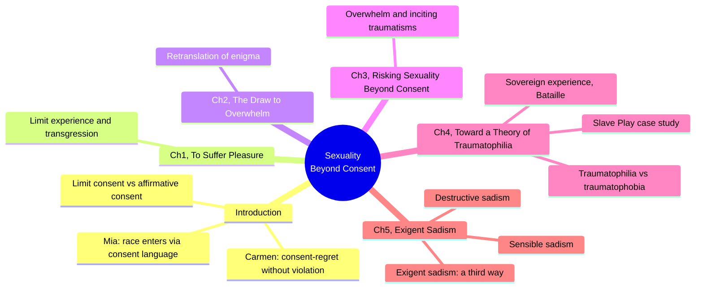
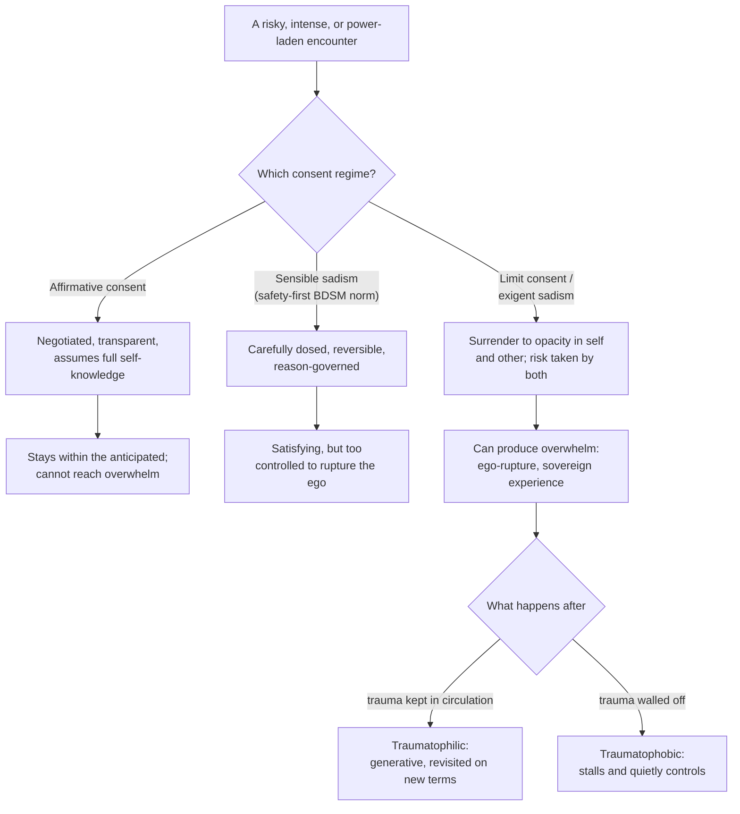
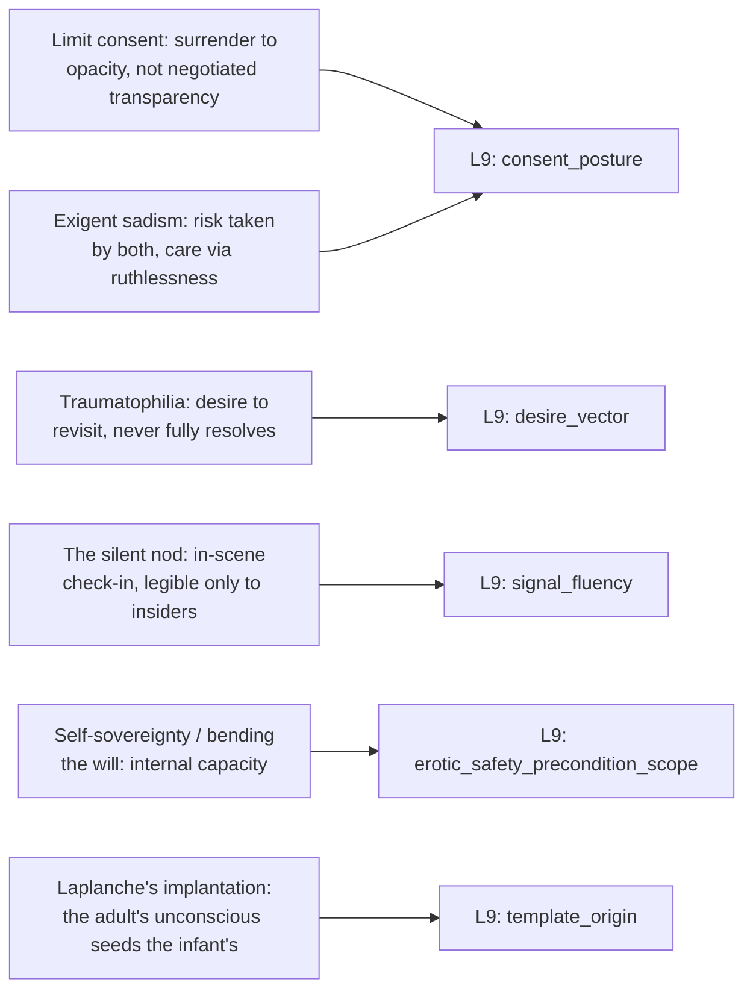

# 🧬 PSY.35 — Sexuality Beyond Consent — Saketopoulou (2023)
### Knowledge Entry — Distill

A practicing psychoanalyst's theoretical intervention arguing that affirmative consent, however necessary as a violation standard, cannot describe what actually happens in intense erotic, aesthetic, or racially charged encounters; the first BVX-LEARN entry to supply a rigorous psychoanalytic (Laplanche, Bataille, Glissant) alternative vocabulary for consent, desire, and power that does not collapse into either "safe" or "abusive."

## TABLE OF CONTENTS
- [Core Thesis](#1-core-thesis)
- [Mind Models](#2-mind-models)
- [Framework](#3-framework--structure)
- [Key Concepts](#4-key-concepts)
- [Heuristics](#5-heuristics--decision-rules)
- [Invariants](#6-invariants)
- [Pitfalls](#7-pitfalls--myths)
- [Application](#8-application)
- [Cross-References](#9-cross-references)
- [Provenance](#10-provenance--confidence)

---

## 1 · CORE THESIS

Affirmative consent assumes a subject fully known to herself, negotiating a transparent contract in advance; real erotic and aesthetic risk instead runs on "limit consent" — a surrender to the opacity in oneself and the other that can produce genuine overwhelm without that overwhelm being a violation, and trauma is best related to not by curing it but by keeping it in circulation ("traumatophilia").

---

## 2 · MIND MODELS

*Required. Minimum two diagrams, maximum five.*

**Diagram 1 — the whole argument.**
Caption: *five chapters plus an introduction build one argument in stages — from limit consent's theory, through overwhelm and trauma's return, to a fully reworked concept of sadism as care.*

**Diagram 2 — the central mechanism (three consent regimes and what each can and cannot reach).**
Caption: *only one of three regimes can reach overwhelm at all — and what happens after overwhelm depends on whether trauma is allowed to keep circulating (traumatophilic) or is walled off (traumatophobic).*

**Diagram 3 — mapped onto the Command's L9 EROS.**
Caption: *the book's five load-bearing concepts split across consent, non-terminating desire, in-scene fluency, internal safety, and the deep origin of a template — five distinct EROS sub-fields, each with a precise theoretical mechanism behind it.*

---

## 3 · FRAMEWORK / STRUCTURE

Introduction plus five chapters, each building the theoretical apparatus one layer at a time, grounded throughout in extended case studies (a patient, "Carmen"; a patient, "Mia"; the playwright Jeremy O. Harris's *Slave Play*; the documentary *The Artist and the Pervert*):

| Chapter | Governing question | Key theoretical move |
|---|---|---|
| Introduction, Erotics of the Terribly Beautiful | What does consent actually govern, if not full self-transparency? | Introduces limit consent, traumatophilia/traumatophobia, and self-sovereignty via Carmen and Mia |
| 1, To Suffer Pleasure | What is "limit experience," and how does transgression relate to it? | Grounds the book's method in Bataille and Laplanche |
| 2, The Draw to Overwhelm | How does the psyche's "translation" of enigmatic, unmetabolized material work, and what draws a subject past it? | "Retranslation of enigma" — the ego's ordinary meaning-making can be pushed past its own limits |
| 3, Risking Sexuality Beyond Consent | What happens when overwhelm actually arrives, and how does it relate to trauma? | "Inciting traumatisms" — repetition that escalates toward overwhelm on purpose |
| 4, Toward a Theory of Traumatophilia | Should trauma be cured, or related to differently? | Full traumatophilia/traumatophobia argument via the *Slave Play* case study and Bataille's "sovereign experience" |
| 5, Exigent Sadism | Is there a form of sadism that is neither destructive nor merely "sensible" (safety-first)? | Splits sadism into three types: Sadean/destructive, sensible/BDSM-mimetic, and exigent |
| Epilogue, Like a Spider or Spit | — | Closing reflection, not deep-extracted for this distill |

The book's throughline: every chapter refuses a clean binary (safe/dangerous, consensual/violating, healed/traumatized, sadistic/caring) in favor of a third term that holds both sides in tension — limit consent between affirmative consent and violation, traumatophilia between cure and damage, exigent sadism between destruction and mere safety.

---

## 4 · KEY CONCEPTS

| Concept | What it is | Why it matters |
|---|---|---|
| **Affirmative consent** | The now-standard paradigm: a subject transparent enough to herself to know and communicate her wants in advance, negotiating a shared, communicable agreement | Necessary as a standard for what counts as violation, but the book argues it cannot describe or authorize what actually happens in intense erotic or aesthetic encounters |
| **Limit consent** | A different kind of consent, grounded in negotiating the limits of what belongs neither purely to activity nor to passivity; not something "exercised" but something closer to surrendering to the opacity in oneself and the other | The book's central proposed replacement/supplement; consent becomes partly an internal affair, not only an interpersonal negotiation |
| **Opacity** (after Glissant) | "That which cannot be reduced" to demands for transparency — the part of the self and the other that resists being fully known or grasped | Grounds why full, advance, communicable consent is structurally impossible for genuinely risky encounters; something always exceeds what was bargained for |
| **Bending one's will** | Countering the ego's own resistance to being overwhelmed — not willfulness or masochistic self-diminishment, but a fleeting receptivity that must be "wrested each time" against the ego's self-protective instinct | The actual mechanism by which a subject moves from ordinary experience toward overwhelm; distinguishes genuine risk-taking from either control or surrender-as-collapse |
| **Traumatophobia / traumatophilia** | Traumatophobia: treating trauma as something to be cured, drained, or eliminated. Traumatophilia: a "hospitable attitude to the revisitation of trauma" — recognizing trauma cannot be eliminated, only lived in its aftermath on different terms | Reframes "healing" away from resolution and toward an ongoing, sometimes generative relationship with what cannot be undone; explicitly not the same as minimizing harm |
| **Sovereign experience** (after Bataille) | A brief, involuntary "startled jump of our entire being" — a transient loss of willed ego-control, an escape from productivity and relational demands, not political or consumer sovereignty | Names what overwhelm feels like from the inside: intensely alive, self-divesting, and explicitly not something one can plan, will, or purchase |
| **Destructive sadism** (Sade) | Limitless, cold, formally reasoned destructiveness with total disregard for the other's subjectivity; mastery through domination, executed apathetically | One of two poles the book rejects as a full account of sadism; historically linked to fascist logics of the expendable other |
| **Sensible sadism** (much BDSM theory) | Carefully dosed, reversible, "as-if" simulated cruelty, governed by reason, negotiated safety, and mutual trust; a safeword can stop it at any time | The other rejected pole: safe and satisfying but, per the book, "too asthenic" (too weak) to reach real overwhelm or sovereign experience — it stays inside what was already anticipated |
| **Exigent sadism** | A third category: sadism that risks the "sadist" too — she cannot know in advance what her own ruthlessness will evoke in herself or the other — making it a form of care built from mutual vulnerability, not mastery or mere simulation | The book's most original contribution to power-exchange dynamics; a dominant figure whose authority is itself exposed and uncertain, not simply in control |
| **Implantation and translation** (Laplanche) | The infant's unconscious is formed by indecipherable ("enigmatic") messages from the adult's own sexual unconscious, injected via ordinary care; the growing ego spends a lifetime "translating" these into meaning, never fully succeeding | A universal (not only traumatic) account of how adult desire is structurally downstream of a non-chosen, pre-verbal imprint — the theoretical bedrock under `template_origin` |

---

## 5 · HEURISTICS & DECISION RULES

| Situation | Do this | Not this |
|---|---|---|
| A character consents to an intense scene that then exceeds what they imagined | Let the overwhelm be real and let the character's consent still stand — being overtaken is not automatically a violation | Force a binary verdict (either it was fully fine, or it was assault) |
| Writing a dominant/top character whose power feels genuinely dangerous, not merely staged | Give them real uncertainty about what their own intensity will evoke in themselves and the other — a risk they also run | Write their control as total, calculated, and risk-free to themselves |
| A character keeps returning to a painful memory, place, or practice without "resolving" it | Write the return as potentially generative — a way of staying in relation to the wound, not evidence of being stuck | Frame every unresolved return to trauma as pathological or as a sign the character needs to "move on" |
| Two characters use an established, minimal signal (a look, a specific word, a nod) to check in mid-scene without breaking the scene's reality | Make the signal specific to their relationship or subculture, legible to insiders and invisible to outside observers | Default to an explicit verbal pause every time, which breaks the scene's internal logic |
| A character claims to have fully negotiated and anticipated a risky encounter in advance | Let something still exceed what was planned — the encounter is allowed to surprise even a careful negotiator | Treat thorough advance negotiation as a guarantee that nothing unexpected can happen |
| Depicting race, power, or historical trauma surfacing inside an intimate or erotic scene | Let it arrive obliquely — through the register of consent, body, or nonverbal signal — rather than only through explicit dialogue about race | Confine all racial or power dynamics to stated, articulate conversation |
| A character (analyst, director, dominant partner) deliberately creates a disorienting or overwhelming experience for someone else's growth | Show them also being exposed and uncertain of the outcome, and show real care alongside the ruthlessness | Write them as a safe, all-knowing guide who fully controls the process for the other's benefit |
| A character seeks out difficult, even painful, art or experience repeatedly | Let the compulsion be genuinely disorienting and costly to the character, not merely enjoyable or educational | Reduce the repeated exposure to either pure trauma-reenactment or pure self-improvement |

---

## 6 · INVARIANTS

1. **Full advance transparency about one's own wants is not actually available to anyone.** Opacity — in the self and in the other — is structural, not a failure of communication.
2. **Being overwhelmed by a consented-to encounter is not automatically the same as being violated.** Consent and mastery of the outcome are separable facts.
3. **A subject needs a stable-enough self (self-sovereignty) before they can safely risk having that self shattered.** One must have a will before one can bend it.
4. **Trauma cannot be eliminated, only related to differently, in its aftermath, on different terms than when it was inflicted.**
5. **Safety-maximizing, fully reversible, reason-governed power exchange (sensible sadism) cannot, by its own design, reach genuine overwhelm.** Safety and intensity trade off at the extreme.
6. **A genuinely risky power-exchange dynamic exposes both parties, not just the one with less power.** The one taking the dominant role also risks not knowing what their own force will evoke.
7. **Desire and its object are not always oriented toward resolution.** Some desire is structured around return and repetition (traumatophilia), not acquisition and closure.
8. **Adult desire is downstream of an early, non-chosen imprint (implantation) that is never fully translated into conscious meaning.** This is a universal structural condition, not evidence of individual damage.

---

## 7 · PITFALLS / MYTHS

- Treating affirmative consent as a complete account of sexual ethics; the book argues it is necessary as a violation standard but cannot describe what happens in genuinely intense or transformative encounters.
- Assuming that if a character is overwhelmed by something they consented to, someone must have done something wrong; the book explicitly separates "this exceeded what I bargained for" from "this violated me" (Carmen's case).
- Reading BDSM's safety apparatus (negotiation, safewords, aftercare) as the ceiling of what erotic risk can be; the book positions "sensible sadism" as real and valuable but structurally incapable of reaching the overwhelm that "exigent sadism" can.
- Collapsing sadism into either pure destructiveness or pure harmless performance; the book insists a third form exists that is neither, and that this third form is where real transformation (and real risk to the "sadist") happens.
- Treating trauma-processing as a project with a natural end point ("healing," "closure," "moving on"); the book argues this promise is both unrealistic and, in its "neoliberal" and "traumatophobic" form, actively unhelpful.
- Assuming racial or historical trauma surfacing in an intimate scene must be named explicitly in words to be present or to matter; the Mia case shows it entering the room encoded in the language of consent, long before race is discussed directly.
- Reading an exigent sadist's ruthlessness as one-directional power (they control, the other is controlled); the book insists the exigent sadist is also exposed, vulnerable, and cannot know in advance what their own force will produce.
- Mistaking a highly negotiated, contract-like arrangement (in Deleuze's reading, the masochist's own contract with a "sadist" they have enlisted) for a bending of the will; a partner enlisted into someone else's script by careful negotiation is not the same as someone who has genuinely surrendered control.

---

## 8 · APPLICATION

- **Spine level:** [L5] WOUND, per this batch's assigned keying (a theory-shelf source; its wound frame is explicitly traumatophilic — the wound is never resolved, only re-encountered on different terms, which is itself the book's central claim about how trauma should be handled)
- **12-layer character stack:** L9 EROS, primary (`consent_posture` x2, `desire_vector`, `signal_fluency`, `template_origin`); L9 EROS, supporting (`erotic_safety_precondition_scope`, internal register)
- **plot_systems:** contextual candidate once `04_PLOT_SYSTEMS/` opens — the three-consent-regime mechanism (Diagram 2) is directly reusable as a structural template for any plot arc built around a character risking genuine transformation through an intense, only-partially-controlled encounter (romantic, adversarial, or artistic)
- **Setting:** none directly; this is a psychoanalytic-theoretical source, not a setting-shelf one

This book's most portable, load-bearing contribution to the intimacy layer is giving `consent_posture` a real third option beyond "negotiated and safe" or "violated": a character can consent to something, be genuinely overwhelmed by it beyond what they imagined, and still have that be a consensual, even valuable, experience — provided the internal precondition (self-sovereignty) was there to begin with. Equally important, `desire_vector`'s non-terminating mode gets its deepest theoretical grounding here: traumatophilia gives a writer permission to let a character's desire orbit something it will never resolve, and to treat that as a form of aliveness rather than a symptom awaiting a cure. Finally, `template_origin` gains a universal mechanism (Laplanche's implantation) rather than only a trauma-specific one — every character's adult desire can be authored as downstream of an early, non-chosen imprint their ego has spent a lifetime imperfectly translating.

---

## 9 · CROSS-REFERENCES

| Related entry | Relation |
|---|---|
| [[🧬 PSY.13 — Psychology of the Unconscious — Jung (1916)]] | Shared psychoanalytic lineage on desire's object standing in for something else and on blocked material returning in displaced form; Saketopoulou's Laplanche-derived "implantation" is a more contemporary, differently-argued account of the same basic structure |
| [[🧬 PSY.08 — Lust, Men, and Meth — Fawcett (2015)]] | Shared territory on a fixed, early-formed "template" underlying adult desire (Money's "lovemap" there, Laplanche's "implantation" here); this book supplies a rigorous theoretical account where PSY.08 supplies the clinical-practitioner one |
| [[🧬 PSY.16 — Techniques of Pleasure — Weiss (2011)]] | Direct dialogue partner on SSC/RACK and negotiated consent as a community norm; this book explicitly argues that even careful, community-taught negotiation (Weiss's "sensible" register) cannot reach the overwhelm that "limit consent" and "exigent sadism" can |
| [[🧬 MSX.22 — The Ultimate Guide to Kink — Taormino (2012)]] | Practitioner-facing sibling on consent, power exchange, and aftercare; this book explicitly names and critiques the "sensible sadism" register that a how-to guide like this one is built to teach, without dismissing its real value |

---

## 10 · PROVENANCE & CONFIDENCE

Full text, pdftotext extraction (~260pp main text before notes/references/index), clean text layer with a machine-readable table of contents. Read in full: the Introduction, "Erotics of the Terribly Beautiful" (the full Carmen and Mia case studies, the limit consent/affirmative consent argument, the Glissant/Laplanche/Bataille theoretical setup). Read substantially: the opening and central sections of Chapter 4, "Toward a Theory of Traumatophilia" (the traumatophobia/traumatophilia argument, the *Slave Play* case study including the "nod" scene and third-act analysis, "Sovereign Experience"); the opening sections of Chapter 5, "Exigent Sadism" (the destructive/sensible/exigent sadism typology, the Sade/Deleuze/Foucault genealogy, the Robert O'Hara and Williams-Haas examples). Sampled, not deep-extracted: Chapter 1 ("To Suffer Pleasure"), Chapter 2 ("The Draw to Overwhelm"), Chapter 3 ("Risking Sexuality Beyond Consent") beyond their chapter-title framing and cross-references encountered while reading the Introduction and Chapters 4-5; the Epilogue ("Like a Spider or Spit") not read.

The `feeds:` variable names (`consent_posture`, `desire_vector`, `signal_fluency`, `erotic_safety_precondition_scope`, `template_origin`) are taken directly from L9 EROS and adjacent layer definitions in `ssot_02_character_systems_vertical_slice.md` PART A and the L9 EROS synthesis (`ssot_02_l9_eros_synthesis.md`), not inferred loosely; `consent_posture` and `template_origin` were fields the 9/29 synthesis pass already ruled onto L9 from an earlier wave of this shelf, and this entry supplies the deepest theoretical grounding for both found on the shelf to date, rather than a new proposal.

## META
- Template: BVX-LEARN-v4.0, sexuality variant (BOLO 87/88, `brief.DISTILL.md` as changed by `brief.DISTILL.wave3.md`)
- Source classification: full-text academic monograph, deep extraction on the introduction plus 2 of 5 chapters, partial extraction on the remaining 3 chapters, epilogue not read
- Created / Updated: 2026-09-29
