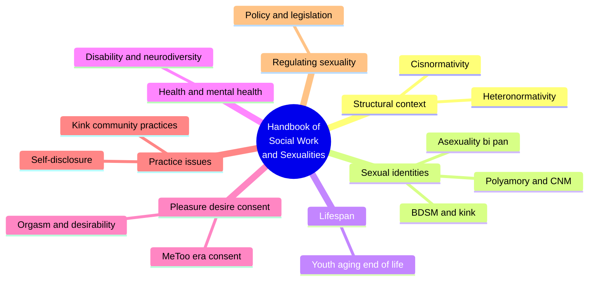
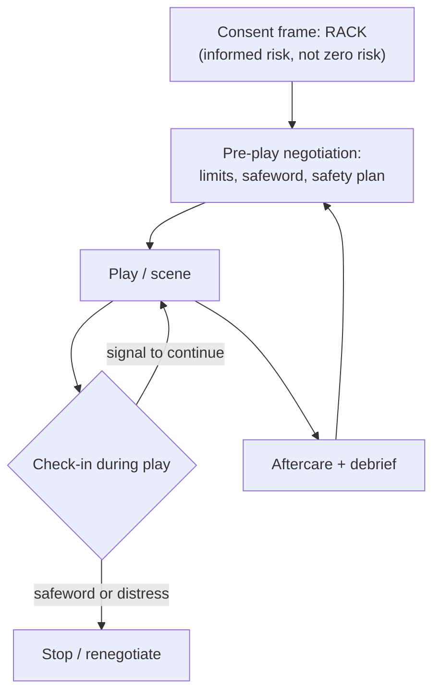
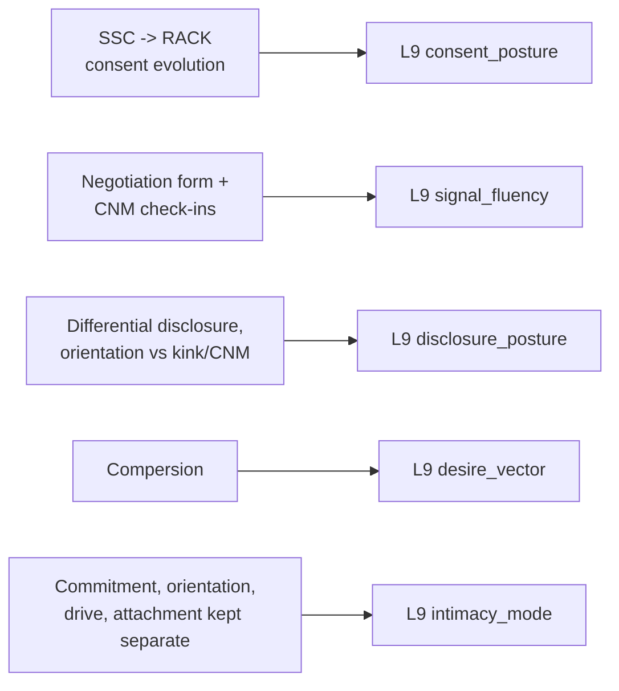

# PSY.36 — The Routledge International Handbook of Social Work and Sexualities — ed. SJ Dodd (2021)

### Knowledge Entry — Distill

A 37-chapter, seven-part clinical/academic handbook spanning the full sexuality spectrum from a social-work practice lens — the wave's broadest single source, and the THEORY-shelf anchor for consent, disclosure, and non-monogamy vocabulary that no other book in this wave covers as precisely.

## TABLE OF CONTENTS
- [Core Thesis](#1-core-thesis)
- [Mind Models](#2-mind-models)
- [Framework](#3-framework--structure)
- [Key Concepts](#4-key-concepts)
- [Heuristics](#5-heuristics--decision-rules)
- [Invariants](#6-invariants)
- [Pitfalls](#7-pitfalls--myths)
- [Application](#8-application)
- [Cross-References](#9-cross-references)
- [Provenance](#10-provenance--confidence)

---

## 1 · CORE THESIS

Practicing well with sexual diversity requires naming precise vocabulary and precise mechanisms rather than generic tolerance: consent evolves from a promise of safety to informed risk-acceptance, disclosure runs on differential trust per identity, and desire itself can point toward another person's pleasure (compersion) rather than only one's own.

---

## 2 · MIND MODELS

*Required. Minimum two diagrams, maximum five.*

**Diagram 1 — the whole argument.**
Caption: *seven parts sort the whole sexuality spectrum into practice-relevant clusters — Part V (Pleasure, Desire, and Consent) and the kink/polyamory chapters in Part II are where this distill concentrates, but the handbook's real claim is that no part can be skipped for competent practice.*

**Diagram 2 — the central mechanism (a kink negotiation, the book's clearest worked protocol).**
Caption: *consent in this model is a documented, sequenced process with a built-in return loop — the negotiation happens before play, not instead of it, and check-ins during and after keep the agreement live rather than treating the pre-negotiation as a one-time signature.*

**Diagram 3 — mapped onto the Command's L9 EROS layer.**
Caption: *this source's two sharpest, least-covered-elsewhere contributions are the SSC-to-RACK consent evolution and compersion as a named desire_vector shape — both fill precise L9 gaps this wave's other sources don't reach.*

---

## 3 · FRAMEWORK / STRUCTURE

Seven parts move from structural theory to applied practice to law: Structural Context (heteronormativity, cisnormativity in social work itself); Sexual Identities (asexuality, bi/pan, gay men's practice history, corrective-rape and Black lesbian sexuality in South Africa, BDSM/kink, polyamory); Sexuality through the Lifespan (youth, group homes, LGBT+ parenting, aging, end of life); Health, Mental Health, and Sexuality (cancer, autism, disability, neurodiversity); Sexual Health and Well-Being: Pleasure, Desire, and Consent (orgasm, consent among emerging adults, #MeToo-era consent, sexual violence recovery); Practice Issues (sex therapy, sexual risk, therapist self-disclosure, somatic trauma work, kink community practices, sex-trades praxis); and Regulating Sexuality (policy, migration, sex-work law, kink/BDSM pathologization history). Each chapter is independently authored and stands alone; the book's unity is coverage, not a single argument — it functions as a reference work rather than a monograph, which is why this distill concentrates on its two most L9-load-bearing chapters (kink/BDSM and polyamory/CNM) rather than attempting even coverage of all 37.

---

## 4 · KEY CONCEPTS

| Concept | What it is | Why it matters |
|---|---|---|
| **SSC to RACK** | Kink consent language evolved from Safe, Sane, and Consensual (1983) to Risk-Aware Consensual Kink — acknowledging no sexual activity is risk-free and rejecting "sanism" in gatekeeping who may consent | A precise historical model of a consent standard maturing from an impossible promise (zero risk) to an honest one (informed risk) |
| **The negotiation form** | A documented pre-play protocol (limits, safewords, safety plans) the chapter supplies as a literal sample (Figure 9.1) | Makes signal_fluency concrete and teachable rather than an intuitive-only skill |
| **Informed risk** | The RACK principle that all parties know the risks of an activity, disclose their experience level, and are equipped to mitigate and respond | Reframes "safety" as shared knowledge and preparation, not the absence of danger |
| **Kink identity disclosure asymmetry** | Clients disclose sexual orientation or gender identity to therapists more readily than kink identity, fearing pathologization even while using kink for therapeutic healing | A specific, measurable disclosure_posture gap between two adjacent stigmatized identities |
| **Kink and disability as asset** | Direct communication, asking for needs, and stating limits — core kink practices — transfer directly to navigating disability needs in sexual/romantic contexts | Reverses the assumption that kink and disability are separate topics; the same skill set serves both |
| **Compersion** | Joy, happiness, and sometimes arousal at a partner's pleasure with another person — explicitly defined as the opposite of jealousy, not merely its absence | Gives desire a second, other-directed vector most models don't name |
| **The four-continuum conceptualization table** | Relational commitment (monogamous<->non-monogamous), sexual orientation, sex drive (asexual<->highly sexual), and attachment style, held as four separate axes | A discipline against conflating "non-monogamous" with "highly sexual" or "insecurely attached" — the axes are independent |
| **Relationship agreements / the sexual credo** | Explicit, renegotiable documents CNM partners create together covering safer-sex practices, transparency, schedules, and boundaries | The non-kink parallel to the kink negotiation form — consent-as-document rather than consent-as-assumption |
| **CNM minority stress** | More than half of CNM-identified people report anti-CNM discrimination even while concealing their practice; disclosure to providers is often met with microaggression (biased language, jealousy projections, safety concerns) | Shows the disclosure-punishment mechanism directly — a bad disclosure experience teaches a client the space isn't safe for future honesty |
| **Kink and spirituality** | For some practitioners BDSM is not sexual at all — it produces surrender, transcendence, and energetic-connection experiences comparable to religious practice | Breaks the assumption that kink always maps onto sexual arousal or behavior |

---

## 5 · HEURISTICS & DECISION RULES

| Situation | Do this | Not this |
|---|---|---|
| A client or character discloses a kink identity | Treat it with the same care as any other identity disclosure, and ask what it means to them specifically | Assume shared vocabulary, pathologize, or react visibly with surprise/distaste |
| Writing or assessing consent for a scene involving risk | Frame it as informed risk-acceptance (RACK): named risks, disclosed experience, agreed mitigation | Frame it as a promise that nothing risky is happening |
| A partner's pleasure involves someone else | Consider compersion as a real, distinct emotional response, not only jealousy or its suppression | Assume any partner-elsewhere pleasure must default to jealousy |
| Conceptualizing a character's relationship style, orientation, sex drive, and attachment together | Treat all four as separate continuums that can combine in any way | Infer one axis from another (e.g., assume non-monogamous means high sex drive or insecure attachment) |
| A character needs to negotiate an intimate encounter with risk or novelty | Give them a pre-negotiation beat (limits, a stop signal, a plan) before the encounter, not only during it | Skip straight to the encounter and let consent be implied by proceeding |
| Depicting disclosure of a stigmatized practice or identity | Show the asymmetry — some identities disclose more easily than others to the same confidant | Treat all disclosure as equally risky or equally easy for a given character |

---

## 6 · INVARIANTS

1. **Consent standards that promise zero risk are less honest than ones that name risk and require informed acceptance of it** (the SSC-to-RACK shift).
2. **Pre-negotiation, in-scene check-in, and aftercare are three distinct moments**, not one signature standing in for the whole process.
3. **Disclosure risk is identity-specific, not identity-general** — a person can be comfortable disclosing one marginalized identity while concealing an adjacent one to the same confidant.
4. **Desire can point toward another person's pleasure (compersion)** as a real, named emotional state distinct from jealousy's absence.
5. **Relational commitment, sexual orientation, sex drive, and attachment style are independent axes** that co-occur in any combination.

---

## 7 · PITFALLS / MYTHS

- Assuming kink correlates with negative mental health outcomes — research cited shows neutral-to-positive correlation, and media portrayals (depressed submissives, narcissistic dominants) are not supported by evidence.
- Assuming a client's kink or CNM identity is relevant to whatever they've come in for — the chapter warns explicitly against foregrounding a disclosed identity in every subsequent interaction.
- Treating "informed risk" consent models as riskier or less rigorous than "guaranteed safe" models — RACK is a more honest standard, not a laxer one.
- Assuming CNM participants are compensating for an unsatisfying primary relationship — cited research finds the opposite is a common pattern (solid relationship, desire for diversity).
- Reacting visibly (shock, recoil) to a disclosure — named directly as a concrete relationship-damaging error ("work on your poker face").
- Collapsing kink identity and sexual orientation into one disclosure category — they carry different risk profiles and different disclosure comfort even for the same person.

---

## 8 · APPLICATION

- **Spine level:** none — this is an L9 EROS character-layer source, not a story-spine source (per the v4 template's binding rule that character-stack feeds sit beside the spine, not on it)
- **12-layer character stack:** L9 primary across four fields (consent_posture, signal_fluency, disclosure_posture, desire_vector), supporting on two more (intimacy_mode, erotic_safety_precondition)
- **plot_systems:** contextual — the negotiation-protocol mechanism (Diagram 2) is a directly stealable scene-structure for any character entering a risk-aware intimate encounter, kink or otherwise
- **Setting:** none

This handbook's clearest gift to L9 is precision where the wave's other sources are looser. consent_posture gets a historically grounded upgrade path (SSC to RACK) that a writer can use to date or characterize a community or a character's own consent literacy — an "SSC-era" character reads differently from a "RACK-era" one. signal_fluency gets literalized into an actual negotiation protocol with three distinct moments (pre-negotiation, in-scene check-in, aftercare), useful as a beat structure for any scene where an intimate encounter carries named risk. disclosure_posture gets sharpened by the asymmetry finding: a character can be safely out about one stigmatized identity while carefully closeted about an adjacent one to the exact same people, and a bad disclosure experience (visible shock, a dismissive reaction) is the specific mechanism that teaches a character to stop disclosing. desire_vector gets its most genuinely novel addition of the wave — compersion names a desire aimed at another's pleasure rather than one's own, giving a writer a real emotional target distinct from both jealousy and mere tolerance.

---

## 9 · CROSS-REFERENCES

| Related entry | Relation |
|---|---|
| [[🧬 PSY.04 — Women and Kink — Rehor & Schiffman (2021)]] | Sibling source — Rehor is cited directly in this handbook's kink chapter as a BDSM/spirituality researcher; that book is the deep-dive counterpart to this chapter's survey treatment |
| [[🧬 MSX.22 — The Ultimate Guide to Kink — Taormino (2012)]] | Sibling source — practitioner-facing technique counterpart to this chapter's clinical/social-work framing of the same consent and negotiation practices |
| [[🧬 MSX.17 — Mating in Captivity — Perel (2006)]] | Cited directly inside this handbook's polyamory chapter (Perel's security/passion polarity used to frame why some couples move toward CNM) — a confirmed, source-internal cross-reference |

---

## 10 · PROVENANCE & CONFIDENCE

Full text, plain-text extraction, ~7,845 lines (~2,032 KB, the largest file in this wave and the widest in scope — 37 chapters across seven parts). Read via table of contents and grep-located chapter boundaries, then targeted full reads: front matter, full table of contents (all seven parts and 37 chapter titles/authors); the full body of Chapter 9, "Beyond 50 Shades: BDSM and Kink for Social Workers" (Kattari, Hecht, and Lopez — definitions, history, consent-model evolution, intersections with disability/race/sex-work/spirituality, strengths, challenges, and best-practices sections); and the full body of Chapter 10, "What the Heart Wants: Polyamory, Compersion and Monogamish Arrangements" (Andres — precursors to CNM, prevalence, the four-continuum table, vocabulary table, minority stress, and relationship-agreements sections). Not directly read: the remaining 35 chapters across all seven parts, confirmed only via table of contents. Given the handbook's reference-work structure (independently authored chapters, no single through-argument), this distill deliberately concentrates depth on the two chapters most load-bearing for L9 rather than sampling all 37 shallowly; no claim in this entry rests on unread chapter content.

## META
- Template: BVX-LEARN-v4.0
- Source classification: full-text edited academic handbook, deep extraction on 2 of 37 chapters plus full front matter/TOC, remainder confirmed structurally via TOC only
- Created / Updated: 2026-09-29
