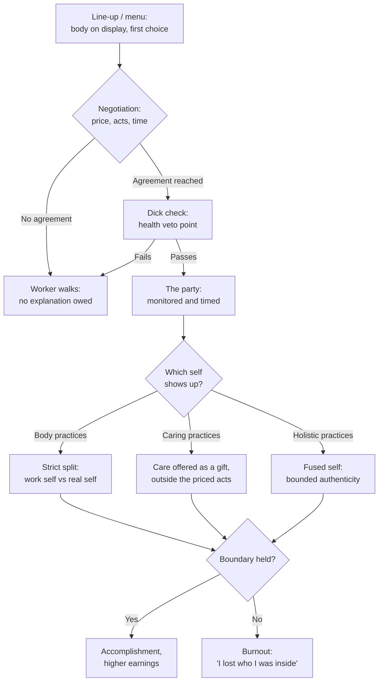
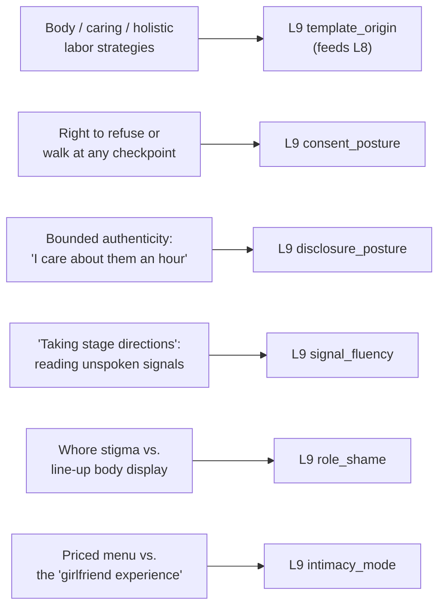

# 🧬 PSY.37 — The State of Sex — Brents, Jackson & Hausbeck (2010)
### Knowledge Entry — Distill

A decade of ethnographic sociology on Nevada's legal brothels: how the industry sells sex as a negotiated, safety-infrastructured commercial transaction, and how the women who work there build, name, and protect a professional self across three distinct, coherent strategies for combining body labor and emotional labor.

## TABLE OF CONTENTS
- [Core Thesis](#1-core-thesis)
- [Mind Models](#2-mind-models)
- [Framework](#3-framework--structure)
- [Key Concepts](#4-key-concepts)
- [Heuristics](#5-heuristics--decision-rules)
- [Invariants](#6-invariants)
- [Pitfalls](#7-pitfalls--myths)
- [Application](#8-application)
- [Cross-References](#9-cross-references)
- [Provenance](#10-provenance--confidence)

---

## 1 · CORE THESIS

Selling sex runs on two separable skills: negotiating an explicit, revocable consent architecture (price, act, time, walk-away), and managing which self shows up in the room. Workers split into three strategies — body, caring, holistic — each drawing a different line between paid performance and "real" self. None is inherently more authentic; each answers the same problem differently.

---

## 2 · MIND MODELS

*Required. Minimum two diagrams, maximum five.*

**Diagram 1 — the whole argument.**
Caption: *a legal, institutionalized sex trade generates both a formal consent architecture and a set of named strategies for managing the self — the book's real subject is how both are built, not whether the trade should exist.*

```mermaid
mindmap
  root((The State of Sex))
    Legal brothel system
      Line-up and menu ritual
      Dick check and safety infrastructure
      Independent contractor status
    Consent architecture
      Right to walk any customer
      Intercom and panic button
      Legality as leverage against pimps
    Three labor strategies
      Body practices
      Caring practices
      Holistic practices
    Selling a self
      Manufactured identity
      Bounded authenticity
      Surface vs deep acting
    Stigma and burnout
      Whore stigma
      Losing the line between self and role
```

**Diagram 2 — the central mechanism (a chain of consent checkpoints feeding a choice of self-management strategy).**
Caption: *consent is never a single yes at the door — it is a chain of checkpoints, each with a walk-away exit — and only after that chain closes does the question of which self-management strategy to use even arise.*

**Diagram 3 — mapped onto the Command's L9 EROS fields.**
Caption: *six pieces of documented brothel practice give six L9 variables mechanisms grounded in field data rather than theory alone.*

---

## 3 · FRAMEWORK / STRUCTURE

Seven chapters moving from context to mechanism to identity:

| Chapter | Focus | Governing question |
|---|---|---|
| 1. Introduction | Mapping Nevada's brothel laws and the book's decade of ethnographic method | What does the legal brothel industry actually look like, and how was it studied? |
| 2. Contexts of Sexual Commerce | The growth of the leisure economy and commercial sex in late capitalism | Why does selling sexual fantasy fit the broader service economy's trajectory? |
| 3. The Making of Nevada Prostitution | History from Wild West mining-camp brothels to the modern resort industry | How did an outlaw industry become a licensed one? |
| 4. The Business of Selling Sex | Marketing, the line-up, negotiation, the dick check, safety infrastructure, contracts, lockdown, management | How is sex actually sold, priced, and made safe, checkpoint by checkpoint? |
| 5. Paths to Brothel Work | Who works in the brothels and how they got there | What routes (service work, illegal prostitution, financial need) lead women here? |
| 6. Brothel Labor: Making Fantasies at Work | Body/caring/holistic labor strategies, manufactured identity, authenticity, stigma, burnout | How do workers manage the self while selling intimacy, and at what cost? |
| 7. Conclusion: Learning from Nevada | What the legal model does and doesn't fix, and whether it generalizes | Is Nevada's legal brothel industry a viable model elsewhere? |

The throughline: every chapter treats commercial sex as ordinary interactive service labor first, revealing that its distinctive features (safety infrastructure, consent checkpoints, identity management) are elaborations of patterns found across the whole service economy, not a separate moral category.

---

## 4 · KEY CONCEPTS

| Concept | What it is | Why it matters |
|---|---|---|
| **The party** | The full negotiated unit of a brothel transaction: line-up or menu choice, tour, negotiation of acts/time/price, dick check, booking, timed service, renegotiation or exit | Shows that "the encounter" is actually a sequence of distinct, separately-consented stages, not one continuous event |
| **The line-up / menu** | A highly scripted, rationalized first choice-point where women present themselves (hands behind back, no "dirty hustling") or a customer picks from a photo/online menu instead | The most literal template for a character's first-contact self-presentation ritual, including the rules on what performance is and isn't allowed at that stage |
| **The dick check** | A worker-performed visual health inspection, done after price/act negotiation but before any sexual contact, that can void the whole transaction | A concrete, embodied veto point located deliberately late in the sequence — consent is not finished when money changes hands |
| **The right to walk** | A formal, house-backed ability to refuse any customer at any point, "for any reason," without justification | The structural feature that makes every other safety claim in the book credible; removing it collapses the whole system |
| **Safety infrastructure** | Intercom-monitored negotiations, panic buttons, timers, and — crucially — the legal status itself, which gives workers police backup against violent customers and leverage against pimps | Shows safety as a designed system with redundant layers, most of them symbolic-but-real (rarely used, still load-bearing) |
| **Three labor strategies** | Body practices (skill and appearance, strict split from emotion), caring practices (connection offered as an extra, gift-like gesture), and holistic practices (fused physical/emotional "sexual energy," highest earning) | Replaces a single "what sex work is like" narrative with three internally coherent, equally legitimate approaches |
| **Manufactured identity** (Teela Sanders) | A deliberately constructed alternate persona — stage name, invented backstory, a customized character ("Princess is whatever you want her to be") | A business strategy for managing emotion and maximizing income under demand for individualized fantasy, not evidence of psychological damage |
| **Bounded authenticity** (Elizabeth Bernstein) | Genuine emotional connection that exists precisely because both parties know it is contractually time-limited | Resolves the "is it real or fake" question by making the boundary itself the thing that permits realness |
| **Surface vs. deep acting** (Arlie Hochschild) | Surface acting fakes an emotion while feeling another; deep acting is the effort to actually feel it | Surface acting correlates with burnout and distress; deep acting correlates with accomplishment and satisfaction — a diagnostic, not just a description |
| **Whore stigma** (Gail Pheterson) | Social backlash against women who exert visible economic and sexual initiative, extending to all women regardless of whether they do sex work | The book's data locate most worker distress here, not in the sex acts themselves — stigma and precarity, not the work, cause the harm |

---

## 5 · HEURISTICS & DECISION RULES

| Situation | Do this | Not this |
|---|---|---|
| Writing a sex-work (or paid-intimacy) character's professional persona | Give them one of several distinct, coherent strategies (body-focused, caring, or fused/holistic) | Write all such characters with the same detached, or the same emotionally-fused, approach |
| Writing consent inside a commercial or transactional intimate scene | Give explicit, house-backed veto points before, during, and after negotiation, none requiring justification | Write consent as a single yes/no at the start that then holds for the whole scene |
| Writing a character who splits "work self" from "real self" | Make the split a deliberate, named strategy with a reason | Write the split as automatic damage that "just happens" from doing the work |
| Writing intimacy that is both genuine and paid for in the same scene | Let the connection be real because it is bounded (an hour, a contract) | Assume paid intimacy must be either wholly fake or indistinguishable from unpaid intimacy |
| Writing a character reading a client's or partner's unspoken wants | Give them a trained, describable signal-reading skill (posture, word choice, hesitation) | Have the character simply always already know what the other person wants |
| Writing the social cost of a sexual profession or reputation | Locate the damage in stigma and precarity, not in the sex acts themselves | Write the character's suffering as an inevitable consequence of the sex itself |
| Writing burnout in an emotionally intensive intimate role | Show it as a specific failure of boundary-management ("I lost who I was inside") | Skip the mechanism and just declare the character "burned out" |
| Writing a scripted, priced encounter next to a "spontaneous" one | Let both be genuinely satisfying in different registers | Treat the scripted or priced version as automatically lesser or hollow |

---

## 6 · INVARIANTS

1. **Consent inside a commercial sexual exchange is a chain of checkpoints** (choice, negotiation, health check, ongoing monitoring, timed renegotiation), not one moment at the door.
2. **A worker's unexplained right to refuse is what makes the rest of the system's safety claim credible.** Remove it and everything else is cosmetic.
3. **No single correct amount of emotional investment exists in paid intimate labor.** Internally consistent strategies (body, caring, holistic) coexist, and any can be profitable and sustainable.
4. **A performed identity is not automatically damaged or inauthentic.** Harm correlates with stigma, precarity, and loss of control, not with performance itself.
5. **Authenticity can be bounded rather than total.** A connection can be genuine specifically because both parties know its limits in advance.
6. **Burnout in emotionally intensive work is a specific event** — losing the ability to hold the boundary between roles — not a vague accumulation of tiredness.
7. **Stigma attaches to violating a gendered propriety norm** (visible sexual and economic initiative), independent of, and often larger than, any harm from the underlying acts.

---

## 7 · PITFALLS / MYTHS

- Writing every sex worker, or every character who performs intimacy for pay, with the same relationship to body and emotion — the data show at least three distinct, coherent strategies.
- Treating persona-adoption in a sexual-labor context as inherently damaging, when workers describe it as a trained skill, a chosen boundary, or simply an expression of who they already are.
- Writing paid intimacy as fake by definition; "bounded authenticity" argues the opposite — realness precisely inside a known limit.
- Skipping the concrete mechanics of consent (a veto point, a signal, a walk-away) in favor of a single vague "yes" at the top of a scene.
- Attributing a character's distress to the sex itself rather than to stigma, unsafe conditions, or loss of control — conflating these erases the book's actual, sourced finding.
- Writing burnout as ambient exhaustion rather than as the specific collapse of a maintained boundary between "who I am at work" and "who I am."

---

## 8 · APPLICATION

- **Spine level:** L5, the character register of the story-spine — this is a source about the mechanics of consent, persona-management, and stigma inside a professionalized intimate exchange, not plot mechanics or setting.
- **12-layer character stack:** L9 EROS primarily — template_origin (primary, feeding L8), consent_posture (primary), disclosure_posture, signal_fluency, role_shame, intimacy_mode (all supporting). See frontmatter `feeds:` for the full wiring.
- **plot_systems:** contextual candidate once `04_PLOT_SYSTEMS/` opens — the consent-checkpoint chain (Diagram 2) is a reusable structure for any negotiated-intimacy scene, transactional or not, and the three-strategy taxonomy is a ready character-generation tool for any cast who perform intimacy professionally (courtesans, hostesses, companions, or an invented in-universe equivalent).
- **Setting:** contextual — the brothel-as-institution (house rules, safety infrastructure, stigma management, licensing) is a small worked example of a SETTING-slice S4 LAW / S8 HABIT instance, useful if the Command's setting system ever needs a concrete model for a legal-commercial-intimacy institution.

For a writer rendering sex work, courtesan culture, or any professionalized intimacy truthfully, this book's use is mechanical and structural. The three labor strategies give `template_origin` a genuinely differentiated character-generation tool: a "body practices" character, a "caring practices" character, and a "holistic practices" character would speak, negotiate, and relate to their work self in observably different ways, and none needs to be coded as more damaged or more noble than the others. The consent-checkpoint chain gives `consent_posture` a structure with real narrative texture — a scene can turn on any single checkpoint (the dick check, the walk-away, the renegotiation knock) rather than resolving consent once at the start and never revisiting it. "Bounded authenticity" is the book's single most portable idea for `disclosure_posture`: a character can be written as genuinely caring, genuinely present, and genuinely honest about feeling that way, while both they and their partner understand exactly where the boundary sits — realness and a stated limit are not opposites here.

---

## 9 · CROSS-REFERENCES

| Related entry | Relation |
|---|---|
| [[🧬 MSX.17 — Mating in Captivity — Perel (2006)]] | Structural parallel: Perel argues eroticism needs a gap or separateness to survive; "bounded authenticity" is a worked, transactional instance of the same claim — the contractual limit is the gap that makes the connection function |
| [[🧬 PSY.18 — A Woman's Guide to Oral Sex — Fulbright (2012)]] | Shared method: both books supply a concrete, trainable signal-reading vocabulary (Fulbright's feedback-loop questions, this book's "taking stage directions") rather than treating attunement as innate |
| [[🧬 PSY.27 — Anal Pleasure and Health — Morin (2010)]] | Direct structural parallel: Morin's "no-pain-ever commitment" and Nice Person Syndrome map closely onto this book's right-to-walk and dick-check checkpoints — both sources build consent as an explicit, advance-committed, checkpointed system rather than a single moment |

---

## 10 · PROVENANCE & CONFIDENCE

Full text, plain-text extraction (~2,711 lines). Read in full: the front matter, back-cover synopsis, and complete table of contents; the opening pages of Chapter 1 (framing and method). Read in full: the "How Sex is Sold" and "Management and Workplace Relations" sections of Chapter 4 (the line-up, bar, and appointment systems; negotiation and "the party"; safe sex and the dick check; safety infrastructure including intercoms and panic buttons; contracts, house rules, shift structures, lockdown/mobility restrictions, and the pimp question). Read in full: Chapter 6, "Brothel Labor: Making Fantasies at Work," essentially cover to cover — "Doing Sex: Labor Strategies" (the mind/body framing and the three-practice taxonomy), "Body Practices" (packaging, skill, looks, intimacy), "Caring Practices," "Holistic Practices," and "Being a 'Prostitute'" (identity work, manufactured identity, bounded authenticity, surface/deep acting, stigma and burnout, managing well-being). Not directly read: Chapter 2 (leisure economy and late-capitalism context), Chapter 3 (Nevada prostitution history), the "Marketing Legal Sex" section of Chapter 4, Chapter 5 (paths into brothel work), and Chapter 7 (conclusion and policy implications) — these are historical, economic, and policy-context chapters, deprioritized against the wave 3 brief's focus on L9-relevant psychological and interpersonal mechanism, which is concentrated almost entirely in the two chapters read in full.

The frontmatter `feeds:` keying is this distill's own synthesis against the wave 3 brief's L9 field list (character v2.2.0): the three labor strategies plus manufactured identity map to `template_origin` (feeding L8); the line-up/negotiation/dick-check/walk-away chain maps to `consent_posture`; bounded authenticity maps to `disclosure_posture`; "taking stage directions" maps to `signal_fluency`; whore stigma maps to `role_shame`; the priced-menu-versus-GFE contrast maps to `intimacy_mode`.

`zotero_key` is blank: not checked against the live Zotero database in this pass; flagged for a future cataloging sweep rather than invented.

## META
- Template: BVX-LEARN-v4.0
- Source classification: full-text plain-text extraction; deep read on Chapter 4's selling/safety/management sections and all of Chapter 6; sampled TOC-only on the historical, economic, and policy chapters (2, 3, 5, 7)
- Created / Updated: 2026-09-29
