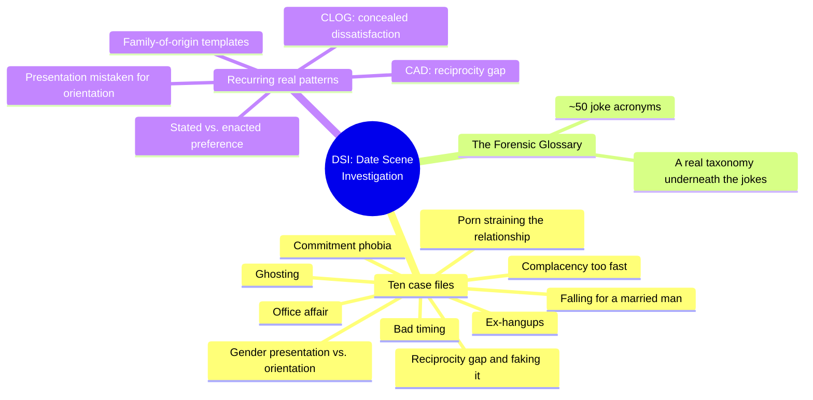
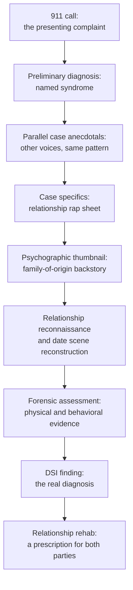
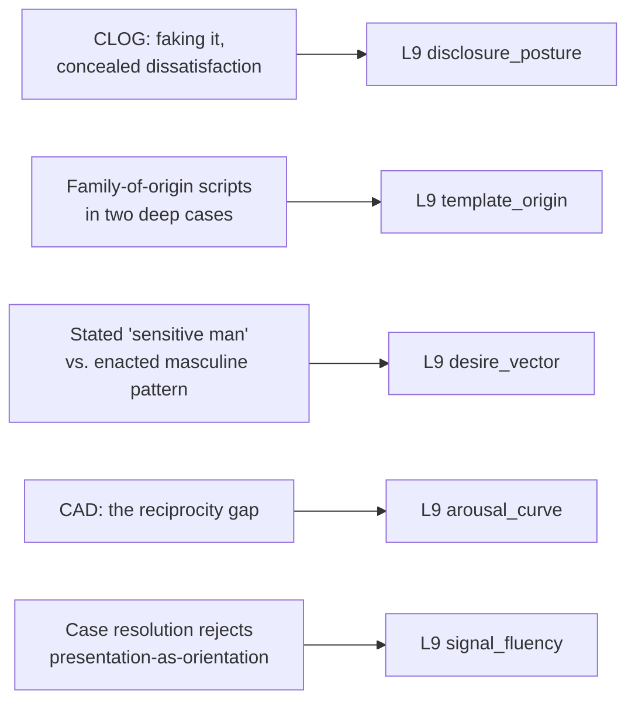

# 🧬 PSY.38 — DSI: Date Scene Investigation — Kerner (2006)
### Knowledge Entry — Distill

A parody self-help book: ten "case files" of dating dysfunction, narrated in a mock-forensic CSI conceit (a "Federal Bureau of Intimacy," a glossary of joke acronyms), whose real content is a dense, nameable taxonomy of concrete desire-and-disclosure patterns beneath the comedy — and one case study whose actual resolution quietly corrects the book's own dated premise about gender presentation and orientation.

## TABLE OF CONTENTS
- [Core Thesis](#1-core-thesis)
- [Mind Models](#2-mind-models)
- [Framework](#3-framework--structure)
- [Key Concepts](#4-key-concepts)
- [Heuristics](#5-heuristics--decision-rules)
- [Invariants](#6-invariants)
- [Pitfalls](#7-pitfalls--myths)
- [Application](#8-application)
- [Cross-References](#9-cross-references)
- [Provenance](#10-provenance--confidence)

---

## 1 · CORE THESIS

Presented as a parody forensic-detective manual, the book's real content is a dense, named taxonomy of dating-dysfunction patterns: faked orgasms, reciprocity gaps, stated-versus-enacted preference, and family-of-origin templates. Its own best case study quietly corrects its comedic premise, separating gender presentation from orientation and diagnosing real intimacy avoidance instead.

---

## 2 · MIND MODELS

*Required. Minimum two diagrams, maximum five.*

**Diagram 1 — the whole argument.**
Caption: *ten comedic case files and a fifty-term glossary sit on top of the same handful of real, recurring relationship patterns.*

**Diagram 2 — the central mechanism (a fixed nine-beat procedure, run identically in every case).**
Caption: *the comedy varies chapter to chapter, but the underlying investigative sequence never does — this fixed shape is the book's most portable, non-comedic export.*

**Diagram 3 — mapped onto the Command's L9 fields.**
Caption: *five patterns, extracted from beneath the parody, land cleanly on five separate L9 variables — the joke apparatus is not the export, the diagnosed pattern underneath it is.*

---

## 3 · FRAMEWORK / STRUCTURE

Ten chapters, each a self-contained "case," bookended by an introduction establishing the parody conceit and a closing glossary that collects every joke-acronym coined across the book.

| Chapter | The presenting dysfunction |
|---|---|
| 1. Should He Stay or Should He Go? | Commitment phobia ("FOCCed UP") |
| 2. The Honeymoon Is Over | A partner who settles into complacency too fast |
| 3. The Well-Groomed Man | Feminine presentation mistaken for closeted homosexuality |
| 4. The Permanent Mistress | Falling for a married man |
| 5. Cold Sheet Files | A sexless or unbalanced sex life (reciprocity gap, faking it) |
| 6. On the Clock | A relationship ruined by mistimed life stages |
| 7. Corporate Perks | An office affair |
| 8. Sticky Fingers | Pornography straining a relationship |
| 9. Stuck in the Past | Unresolved attachment to an ex |
| 10. Guess Who's Not Coming to Dinner | Disappearing boyfriends ("ghosting," pre-dating the term) |
| DSI Glossary of Forensic Terms | ~50 joke acronyms collecting the book's full taxonomy in one place |

Every chapter runs the same nine-beat procedure (Diagram 2) regardless of the specific dysfunction — the structure, not the content, is what repeats.

---

## 4 · KEY CONCEPTS

| Concept | What it is | Why it matters |
|---|---|---|
| **The fixed case-file procedure** | Every chapter runs the same sequence: 911 call, preliminary diagnosis, parallel anecdotes, case specifics, family-of-origin backstory, scene reconstruction, evidentiary analysis, finding, prescription | A reusable, genre-independent scene-organizing device for "investigate what actually went wrong" material, separable from the parody voice |
| **CLOG (Concealed Lack of Orgasmic Gratification)** | The glossary's term for faking orgasm, paired with its cause: fear of seeming ungrateful, fear of "ruining the moment," fear of a partner's ego | Names faking it as a specific disclosure failure with an identifiable driver, not a vague personality trait |
| **CAD (Cunnilingus Antagonist Disorder)** | A named reciprocity gap: a partner who expects to receive oral pleasure without a corresponding willingness to give it, often paired with anatomical unfamiliarity | A concrete, nameable imbalance in whose arousal a couple's sexual routine is actually built around |
| **Stated-versus-enacted preference** | The "Well-Groomed Man" case's real content: a woman who says she wants a "sensitive man" but has a documented history of pursuing, and staying with, masculine and emotionally unavailable ones | Dramatizes the gap between a character's avowed want and their actual attraction pattern as the real story, rather than treating the avowed want as reliable |
| **Family-of-origin templates** | Two deep cases each trace present behavior to a specific formative script: a son raised as his mother's "only man" who fears displacing her by committing elsewhere; a daughter raised on "marriage is the most important thing" who settles against her own stated standards | Gives template_origin two concrete, opposite-shape worked examples: one produces avoidance, the other produces over-eager settling |
| **The book's self-correcting case ("Well-Groomed Man")** | Despite a glossary full of "gaydar" jokes (HC, HID, MOD, LIMP), this case's actual finding states directly that feminine presentation is "by no means" proof of orientation, and relocates the real block in a fear of emotional intimacy rooted in family history | The book's most valuable moment is where it contradicts its own comedic premise; citable as the corrective, not the joke apparatus around it |
| **The Forensic Glossary as taxonomy** | ~50 acronym-coined terms (FOCCed UP, DUD, MARS, PAWS, SADD, RDB, and more) that collectively name dozens of specific, recognizable dating-dysfunction patterns in a few words each | A ready reference list of concrete, portable character-flaw and dynamic names, useful as a vocabulary bank independent of the parody frame |

---

## 5 · HEURISTICS & DECISION RULES

| Situation | Do this | Not this |
|---|---|---|
| Writing a character faking satisfaction to protect a partner or avoid conflict | Name the specific fear driving it (seeming ungrateful, derailing the mood, wounding an ego) | Leave the fabrication unmotivated or purely comedic |
| Writing an unequal oral-sex or reciprocity dynamic | Ground it in a specific anatomical unfamiliarity plus a named double standard (expects to receive, won't give) | Wave it off as generic "bad chemistry" |
| Writing a character whose stated relationship preference doesn't match who they're drawn to | Dramatize the gap itself as the real plot, and trace it to an earlier, specific pattern | Treat the stated preference as simply true and the attraction pattern as a coincidence |
| Writing a character whose gender presentation prompts a partner's doubt about their orientation | Follow the book's own correction: separate presentation from orientation explicitly, and locate the real block elsewhere | Use presentation itself as the evidence, the way the book's own glossary jokes do |
| Writing a character's fear of commitment | Root it in one specific, nameable formative event or family script | Leave it a generic, unexplained trait |
| Adapting a procedural or genre-parody voice (forensic, noir, investigative) for a relationship scene | Borrow the nine-beat structure (complaint, diagnosis, evidence, finding, prescription) as a scene-sequencing device | Import the jokes and acronyms wholesale without the underlying structure |
| Writing a character "settling" in a relationship against their own standards | Trace it to a specific external pressure (a timeline, family messaging, peer anxiety) | Write it as a simple, unexplained personality flaw |

---

## 6 · INVARIANTS

1. **Every case runs the same nine-beat procedure**, regardless of the specific dysfunction — structure, not content, is the constant.
2. **A stated preference and an enacted attraction pattern are treated as frequently, tellingly different things**, and the gap between them is where the real diagnosis lives.
3. **A present-day relationship pattern is traced to one specific, nameable family-of-origin event or script** in every deep case study, not left as unexplained temperament.
4. **Concealed sexual dissatisfaction (faking it) is treated as a disclosure failure with an identifiable cause**, never as a private, causeless choice.
5. **Gender presentation and sexual orientation are conflated throughout the book's comedic glossary**, but the one case study built to test this directly rejects the conflation explicitly in its resolution.

---

## 7 · PITFALLS / MYTHS

- **A real flaw in the source, worth naming rather than replicating:** the Forensic Glossary trades heavily on "gaydar"-style joke entries (HC "Homosexualis Closetus," HID "Homosexualis in Denius," LIMP "Latent Intimacy for Males Potential," MOD "Metrosexualis Over-Dosius") that treat sexual orientation as a trait diagnosable through fashion, grooming, or voice — dated 2006-era humor a writer should not import uncritically for a queer character's interiority.
- Reading the "Well-Groomed Man" case as endorsing that glossary framework, when its actual finding does the opposite and states the presentation-orientation conflation directly wrong.
- Treating "faking it" (CLOG) as a private personality quirk rather than the disclosure failure with a specific, named cause the book itself identifies.
- Extracting the book's comedic voice and acronyms alone while missing that its real, reusable export is the underlying nine-beat procedural structure and the taxonomy of concrete patterns it organizes.
- Treating low sexual reciprocity (CAD) as simple selfishness without the specific double standard the book names: expecting to receive without any obligation to give.
- Writing "settling" in a relationship as a simple character flaw rather than tracing it, as the book does, to a specific external pressure that produced it.

---

## 8 · APPLICATION

- **Spine level:** L5, the relational/intimate-arc register — every case traces a pattern across a relationship's history to its present crisis, not a single scene (L4) or an isolated want (L6).
- **12-layer character stack:** L9 disclosure_posture (primary), L9 template_origin (primary), L9 desire_vector (supporting), L9 arousal_curve (supporting), L9 signal_fluency (supporting). See frontmatter `feeds:` for the full wiring.
- **plot_systems:** contextual candidate once `04_PLOT_SYSTEMS/` opens — the fixed nine-beat procedure (Diagram 2) is a ready-made scene-sequencing device for any "investigate what actually went wrong between these two people" subplot, independent of the parody voice.
- **Setting:** not applicable; this is a character-psychology and craft-structure source, not a setting source.

This source's genuine value for L9 is not its jokes but the concrete taxonomy underneath them, and the one moment it corrects its own premise. CLOG gives `disclosure_posture` a named failure mode with a specific cause; the two family-of-origin case studies give `template_origin` two opposite-shape worked examples (one producing avoidance, one producing over-eager settling); and the "Well-Groomed Man" case, read past its own glossary's dated joke apparatus, is the wave's clearest example of a source actively correcting the presentation-equals-orientation conflation that both this book's glossary and PSY.28's diagnostic checklist otherwise traffic in — worth citing as the corrective, alongside naming the flaw it corrects.

---

## 9 · CROSS-REFERENCES

| Related entry | Relation |
|---|---|
| [[🧬 PSY.28 — The New Naked — Fisch with Moline (2014)]] | Direct sibling flaw: both 2006–2014 popular sources treat "is he gay" as a diagnosable dating problem; this book's own case resolution is the more self-aware of the two, explicitly rejecting the conflation it elsewhere jokes about |
| [[🧬 PSY.10 — Magnificent Sex — Kleinplatz & Ménard (2020)]] | Direct contrast in register and rigor: Kleinplatz's phenomenological interview data on faking orgasm and reciprocity is the empirical counterpart to this book's comedic CLOG and CAD |
| [[🧬 MSX.17 — Mating in Captivity — Perel (2006)]] | Same publication year, opposite register: Perel's theoretical account of family-of-origin patterns shaping adult intimacy is the serious counterpart to this book's "psychographic thumbnail" case-study device |

---

## 10 · PROVENANCE & CONFIDENCE

Full text, loose-attachment extraction of a satirical trade paperback (ReganBooks/HarperCollins, 2006, ~247pp), clean text layer with minor OCR ligature artifacts (fi/fl rendered as "fi"/"fl"). Read in full: front matter, full table of contents, introduction, Chapter 3 ("The Well-Groomed Man," the case testing gender presentation against orientation, read complete including its finding and prescription), the opening of Chapter 5 ("Cold Sheet Files," the reciprocity-gap and faking-it case, through its case specifics), and the complete DSI Glossary of Forensic Terms (all ~50 entries). Sampled, not deep-extracted: Chapters 1, 2, 4, 6, 7, 9, and 10 in outline via their titles and the glossary's cross-references to them, and the remainder of Chapter 5 and Chapter 8 ("Sticky Fingers," the pornography case) beyond their opening sections. This is a comedic, non-clinical trade book by a licensed sex therapist (Ian Kerner), written for entertainment and marketed as satire; its "diagnoses" are literary devices, not clinical claims, and this distill treats the family-of-origin and pattern material as craft-useful character psychology while flagging the orientation-related glossary content as a genuine, dated flaw rather than smoothing it over.

## META
- Template: BVX-LEARN-v4.0
- Source classification: satirical trade paperback, full extraction on introduction, one complete case study, one partial case study, and the complete glossary; remaining seven chapters sampled by title and cross-reference
- Created / Updated: 2026-09-29
