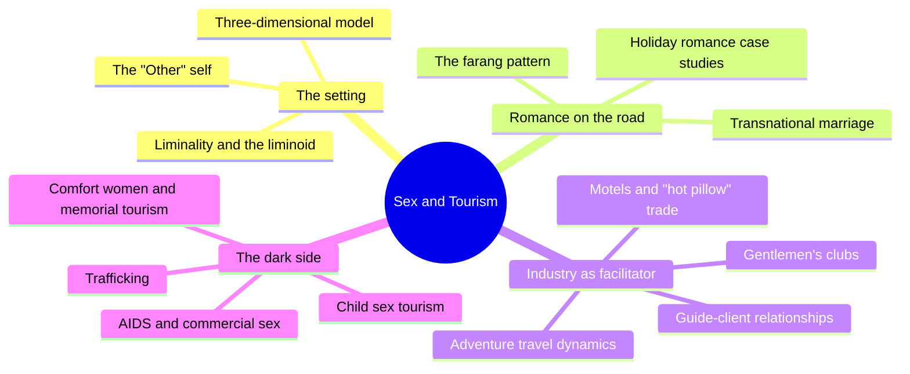
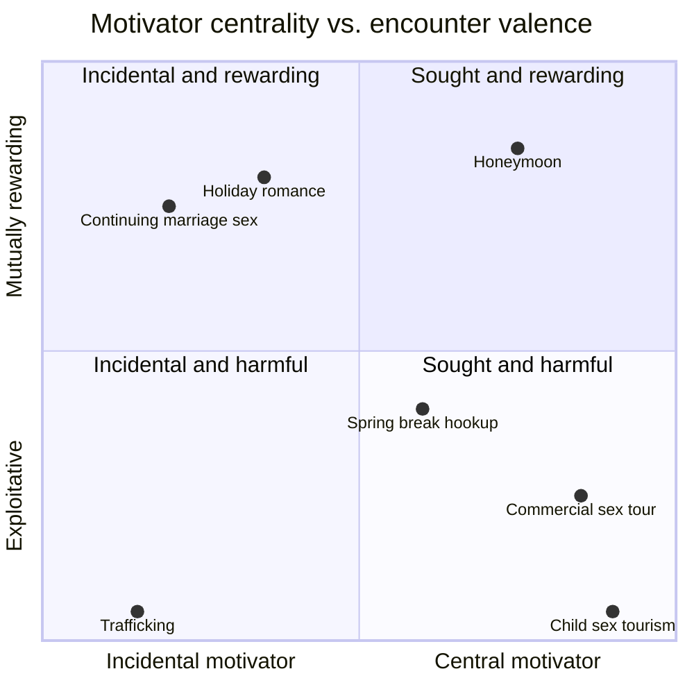
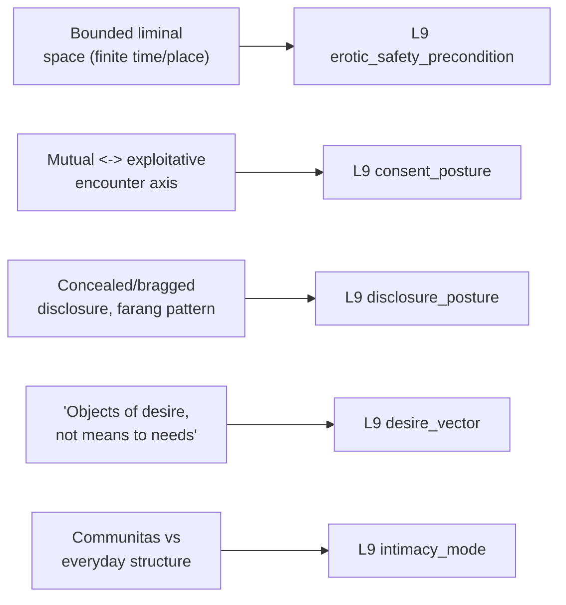

# 🧬 PSY.39 — Sex and Tourism — Bauer & McKercher (2003)
### Knowledge Entry — Distill

A multi-author collection on the full spectrum of travel-linked romance and sex, from holiday flings and industry facilitation to trafficking and child exploitation, built around one conceptual model (motivator centrality x encounter valence x industry facilitation) and one explanatory mechanism (liminality); the library's first entry to model desire as something a bounded change of place and time can switch on.

## TABLE OF CONTENTS
- [Core Thesis](#1-core-thesis)
- [Mind Models](#2-mind-models)
- [Framework](#3-framework--structure)
- [Key Concepts](#4-key-concepts)
- [Heuristics](#5-heuristics--decision-rules)
- [Invariants](#6-invariants)
- [Pitfalls](#7-pitfalls--myths)
- [Application](#8-application)
- [Cross-References](#9-cross-references)
- [Provenance](#10-provenance--confidence)

---

## 1 · CORE THESIS

Tourism is a bounded liminal space — finite in time, distant in place — that suspends a person's everyday social self and makes previously unavailable romantic or sexual behaviour feel safe to try, because the stakes of rejection or consequence end when the trip does. Whether the resulting encounter is mutually rewarding or exploitative is a separate axis entirely, independent of how central sex was to the trip in the first place.

---

## 2 · MIND MODELS

*Required. Minimum two diagrams, maximum five.*

**Diagram 1 — the whole argument.**
Caption: *four sections run the same two variables — how central sex was to the trip, and how the encounter turned out — from a conceptual model through lived case studies, industry mechanics, and the darkest exploitative extreme.*

**Diagram 2 — the central mechanism (the two-axis encounter model).**
Caption: *sex-as-motivator and encounter-valence are independent axes — a central-purpose sex trip can still be mutual, and an incidental holiday flirtation can still be exploitative; reading only one axis misreads the encounter.*

**Diagram 3 — mapped onto the Command's L9 EROS fields.**
Caption: *the book's own two theoretical anchors — the encounter model and liminality theory — key directly onto five L9 fields, with liminality doing most of the load-bearing work.*

---

## 3 · FRAMEWORK / STRUCTURE

Fourteen chapters in four sections, moving from theory through lived experience, industry mechanics, to exploitation:

| Section | Chapters | Focus |
|---|---|---|
| I · The Setting | 1–2 | The three-dimensional conceptual model; liminality/the liminoid as the explanatory mechanism |
| II · Romance on the Road | 3–5 | First-person and case-study accounts of holiday romance and transnational marriage |
| III · The Tourism Industry As Facilitator | 6–9 | How accommodation, adventure travel, guiding, and nightlife venues enable (or accidentally enable) romantic and sexual encounters |
| IV · The Dark Side | 10–14 | Sexual slavery memorialization, trafficking, AIDS and commercial sex, and child sex tourism |

---

## 4 · KEY CONCEPTS

| Concept | What it is | Why it matters |
|---|---|---|
| **The three-dimensional model** | Sex-as-travel-motivator (central to incidental), the nature of the encounter (mutual to exploitative), and tourism's role as facilitator (indirect setting to direct venue/partner provision) | The book's organizing framework; makes clear that "sex tourism" (commercial, exploitative, central-motivator) is only one small region of a much larger space |
| **Liminality / the liminoid** | Van Gennep and Turner's transition-rite structure (separation, liminal threshold, reintegration), adapted to secular tourism as the "liminoid" — individualized, fragmentary, but still suspending ordinary social structure | The mechanism that explains why travel specifically (not just any change of context) reliably loosens inhibition and enables behaviour unavailable at home |
| **Communitas** | Turner's term for the undifferentiated, direct, spontaneous social bonding characteristic of liminal space, which relieves individuals from normal social hierarchy and norms | Names the specific social-texture change (not just privacy) that liminal space produces — connection without the usual status machinery |
| **The "Other" self / antiself** | The version of a person — social, sensitive, and creative, or reckless and irresponsible — that self-control and social control keep suppressed at home, which liminal space lets surface | A ready character mechanism: a person's travel behaviour reveals a real, usually-suppressed self rather than being an aberration |
| **The fourfold transition** | Selänniemi's model of what a trip actually transitions: spatial (place to placelessness), temporal (clock time to timelessness), mental (suppressed self to surfaced self), and sensory (sight-dominant to full-body sensory engagement) | Breaks "getting away" into four separable mechanisms, useful for deciding which one(s) a given scene is actually leveraging |
| **"Objects of desire, not means to satisfy needs"** | Falk's framing of nonordinary bodily pleasures (the hot beach, the extra drink, the endorphin high) as sought for the nonordinary state itself, not to resolve any single need | A precise, citable description of a non-terminating desire_vector — wanting that doesn't converge on a fixed satisfaction point |
| **The encounter's built-in safety net** | Ryan and Kinder's observation that holiday romances carry finite time boundaries, making them "emotionally safe" — little risk of rejection, no obligation to continue, and the option to conceal or disclose on return | Explains why liminal space specifically lowers the psychological cost of vulnerability, not just the social cost |
| **The farang pattern** | A named, recognized role (the Thai term for a foreign man) for long-term but episodic transnational relationships, often beginning with a tourist and a sex worker or local partner and continuing across repeated, bounded visits | A concrete template for a recurring, bounded-but-real attachment that survives on repeated absence rather than continuous presence |
| **Who exploits whom?** | Oppermann's complicating question about the tourist-sex worker dynamic: the "exploited" party is not always the only or even the primary one left unsatisfied — clients seeking love from a commercial encounter can be the ones disappointed | A caution against assuming benefit and harm run in only one direction along an encounter's power asymmetry |
| **Facilitation as a spectrum** | Tourism industry actors range from unintentional facilitators (a hotel room with privacy) through mood-setters (marketed imagery, destination branding) to direct facilitators (arranged sex tours, brothels) | Prevents flattening "the industry" into one uniformly complicit or uniformly innocent actor; facilitation is graded, not binary |

---

## 5 · HEURISTICS & DECISION RULES

| Situation | Do this | Not this |
|---|---|---|
| Writing a character's travel romance | Let the trip's finite, bounded nature itself explain the felt safety of taking a risk | Rely only on chemistry or plot convenience to explain sudden openness |
| A character behaves very differently while away from home | Write it as a suppressed "Other" self surfacing under reduced social control | Treat it as an inconsistency to be explained away |
| Depicting an unequal cross-cultural or cross-class romantic/sexual encounter | Examine who actually benefits, and how, on both sides | Assume the wealthier or more mobile party is automatically the exploiter and the other automatically the victim |
| A character conceals or reveals a travel relationship after returning home | Tie the choice to audience and status, not just guilt or shame | Default every concealment to shame and every disclosure to pride |
| Building a destination's reputation for romance or sex | Show it as actively constructed (marketing, imagery, metaphor) as well as organically grown | Treat the reputation as pure, un-authored atmosphere |
| A character maintains a long-distance relationship across repeated, bounded absences | Use the farang pattern: real attachment sustained by the rhythm of return, not continuous contact | Write the relationship as either fully committed or purely transactional with no middle register |
| A hotel, guide, or venue enables a romantic/sexual encounter | Place their role somewhere on the spectrum from unintentional to deliberate facilitation | Treat "the industry" as a single monolithic actor |
| Pacing a scene of a character's arousal or wanting during a liminal/escape experience | Let some of the pleasure be sought for its own nonordinary quality, with no single resolving outcome | Write every desire beat as building toward one terminal payoff |

---

## 6 · INVARIANTS

1. **A bounded time/space container makes exploratory intimacy feel safe.** Finite duration reduces the stakes of rejection or long-term consequence, enabling roles, partners, or behaviours unavailable at home.
2. **Motivator centrality and encounter valence are independent axes.** How much a person sought sex on a trip says nothing on its own about whether the resulting encounter was mutual or exploitative.
3. **Liminal space produces a suppressed "Other" self that ordinary social control keeps hidden at home.** This self is typically temporary and reintegrates on return, but it is real, not performed.
4. **Communitas — direct, undifferentiated social bonding — is a structural feature of liminal space, not a trait of the specific people in it.**
5. **Who benefits and who is harmed in an unequal encounter is not always obvious from the outside.** Power asymmetry does not map cleanly onto satisfaction or exploitation in a single direction.
6. **Disclosure of a liminal relationship is renegotiated at every return to ordinary life**, and can run toward concealment or toward status-seeking display depending on the audience.

---

## 7 · PITFALLS / MYTHS

- Treating "sex tourism" as synonymous with all travel-linked romance and sex, when most of it is non-commercial, consensual, and often a continuation of an existing relationship.
- Assuming the less-resourced or local partner in a cross-border encounter is always the exploited party, or that the more mobile tourist always gets what they wanted from it.
- Writing a destination's romantic or sexual reputation as pure atmosphere rather than as something actively, often commercially, constructed.
- Reading a traveling character's uncharacteristic behaviour as a narrative inconsistency rather than a suppressed self surfacing under liminal conditions.
- Flattening a story's tourism-industry setting (hotel, guide, tour operator) into either full complicity or full innocence, rather than placing it on the actual facilitation spectrum.
- Collapsing every episodic, long-distance relationship into either "not real" or "fully committed," missing the farang-pattern middle register sustained by rhythm rather than continuity.

---

## 8 · APPLICATION

- **Spine level:** L5 — assigned per the wave's shelf-wide spine key; this source's actual center of gravity is setting-and-template (how a bounded space manufactures permission and a temporary self) rather than a single wound arc, though the Dark Side section's material on trafficking and exploitation supplies concrete wound and power-asymmetry content where a story needs it.
- **12-layer character stack:** primary at L9 (erotic_safety_precondition, consent_posture, disclosure_posture); supporting at L9 (desire_vector, intimacy_mode).
- **plot_systems:** contextual — the two-axis encounter model (§2 Diagram 2) is a fast, reusable tool for plotting any romantic or sexual subplot's actual shape (sought vs. incidental, mutual vs. exploitative) independent of genre conventions that assume the two axes move together.
- **Setting:** primary candidate — liminality theory and the facilitation spectrum are directly reusable for building any fictional "away from home" location (a resort, a ship, a festival, a frontier town) as a space that mechanically loosens character behaviour, not just a change of scenery.

For the EROS layer, this book's distinctive contribution is treating a bounded change of place and time as itself an active ingredient in desire, not a neutral backdrop. The liminality/communitas material gives erotic_safety_precondition and intimacy_mode a portable, non-psychological mechanism: put a character somewhere finite, distant, and socially loosened, and their "Other" self becomes available without any internal justification required. The two-axis encounter model is immediately useful for consent_posture, letting a writer set how sought-after and how mutual an encounter is as genuinely separate dials. And Falk's "objects of desire, not means to satisfy needs" is one of the cleanest available descriptions of a non-terminating desire_vector on this shelf — desire that is satisfied by the state itself, not resolved by any single outcome.

---

## 9 · CROSS-REFERENCES

| Related entry | Relation |
|---|---|
| [[🧬 MSX.17 — Mating in Captivity — Perel (2006)]] | Same invariant, different register: liminality's finite, bounded trip is a literal, spatio-temporal version of Perel's "bounded space of eroticism" — both require a container for desire to be safe to enter |
| [[🧬 PSY.33 — Magia Sexualis — Urban (2006)]] | Third instance of the same containment invariant: Gardner's ritual circle, Perel's psychological boundary, and this book's literal trip duration are three registers (magical, psychological, logistical) of one recurring Touchstone |
| [[🧬 PSY.23 — Lesbian Porn Magazines and the Sex Wars — Groeneveld (2023)]] | Shared caution: both books insist that "who benefits, who is exploited" in an asymmetric sexual encounter is a live, contextual question rather than a fact readable off the participants' relative power alone |

---

## 10 · PROVENANCE & CONFIDENCE

Full text available (481 KB extraction, 264pp); read directly and in depth: the Preface (full chapter-by-chapter overview across all fourteen chapters), Chapter 1 "Conceptual Framework of the Nexus Between Tourism, Romance, and Sex" (McKercher & Bauer, in full — the three-dimensional model, the centrality-of-sex discussion, the encounter's exploitative-to-mutual continuum, and all six facilitator roles), and Chapter 2 "On Holiday in the Liminoid Playground" (Selänniemi, in full — place/placelessness, the liminal/liminoid distinction, communitas, the fourfold transition, and the farang and Greek-island case material). Sampled at chapter-title/preface-summary level only, not deep-extracted: Chapters 3–5 (the Romance on the Road case studies — Island Girl, Crete, transnational Thai marriage), Chapters 6–9 (industry facilitation — motels, adventure travel, river guides, gentlemen's clubs), and Chapters 10–14 (the Dark Side — comfort women, Nepal-India trafficking, Vietnam AIDS/prostitution, Cambodia sex tourism, child sex tourism). The two theory chapters were selected for deep reading because they carry the book's full conceptual apparatus per the wave 3 brief's focus on L9 mechanism; the unread case-study and Dark Side chapters supply the empirical texture and the sharpest exploitation content, and should be consulted directly for any scene requiring specificity beyond the model itself. The `feeds:` keying against L9 EROS fields is this distill's synthesis, built by direct analogy between the book's own named mechanisms (liminality, the encounter model, the farang pattern) and the field definitions supplied in the wave 3 brief.

## META
- Template: BVX-LEARN-v4.0
- Source classification: full-text edited academic collection, deep read on the Preface and the two Section I theory chapters, remainder (12 of 14 chapters) sampled via preface summaries
- Created / Updated: 2026-09-29
