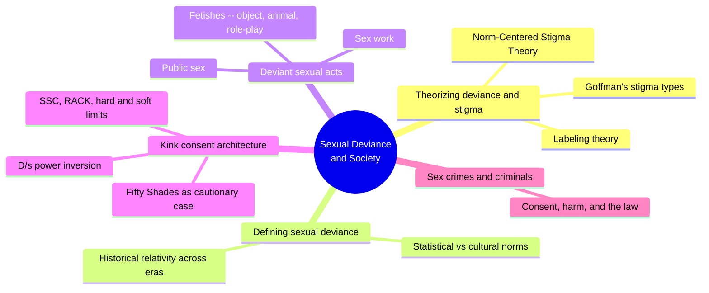
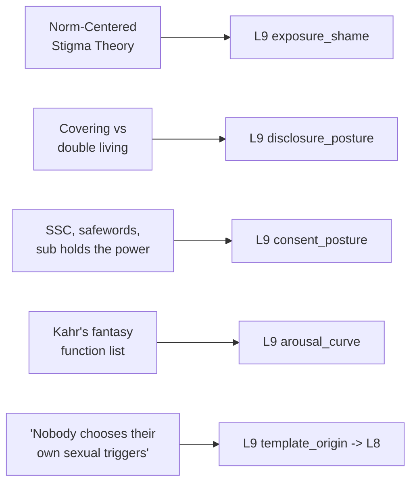

# 🧬 PSY.40 — Sexual Deviance and Society — Worthen (2021)
### Knowledge Entry — Distill

A sociology textbook (2nd ed.) integrating criminology, deviance theory, and sexuality studies to explain how "normal" and "deviant" sex get socially constructed, including Worthen's own original Norm-Centered Stigma Theory and a detailed sociological treatment of fetishes, kink consent culture, and sex crime.

## TABLE OF CONTENTS
- [Core Thesis](#1-core-thesis)
- [Mind Models](#2-mind-models)
- [Framework](#3-framework--structure)
- [Key Concepts](#4-key-concepts)
- [Heuristics](#5-heuristics--decision-rules)
- [Invariants](#6-invariants)
- [Pitfalls](#7-pitfalls--myths)
- [Application](#8-application)
- [Cross-References](#9-cross-references)
- [Provenance](#10-provenance--confidence)

---

## 1 · CORE THESIS

Stigma toward a sexual behavior is not fixed to the act itself; Worthen's Norm-Centered Stigma Theory shows it as a product of how far a norm is broken and how much social power the violator holds. Inside stigmatized kink communities, an explicit, negotiated consent architecture -- hard limits, safewords, the bottom's structural control -- does the opposite work: it makes desire survivable and safe.

---

## 2 · MIND MODELS

*Required. Minimum two diagrams, maximum five.*

**Diagram 1 — the whole argument.**
Caption: *four units, one throughline -- deviance and stigma are built by social process, and the book moves from theory to lived acts to crime, testing that claim at every scale.*



**Diagram 2 — the central mechanism (stigma as a two-axis outcome).**
Caption: *the same norm violation lands very differently depending on who commits it -- NCST's testable claim is that stigma is a product of two variables, not one, and a writer can dial either axis independently.*

```mermaid
quadrantChart
    title Stigma as norm violation x social power
    x-axis Low norm violation --> High norm violation
    y-axis Low social power --> High social power
    quadrant-1 High power tempers stigma
    quadrant-2 Powerful and compliant: minimal stigma
    quadrant-3 Powerless and compliant: mild stigma
    quadrant-4 Powerless and deviant: maximum stigma
    Wealthy kink practitioner: [0.70, 0.80]
    Marginalized survival sex worker: [0.60, 0.15]
    Ordinary conformist: [0.10, 0.50]
```

**Diagram 3 — mapped onto the Command's L9 EROS fields.**
Caption: *five theoretical or field-documented mechanisms key cleanly to five L9 fields, three of them primary, because the source gives named, structural models rather than vague description.*



---

## 3 · FRAMEWORK / STRUCTURE

Four units moving from theory to lived acts to criminal justice:

| Unit | Focus | Read for this distill |
|---|---|---|
| I. Sociology of Deviance and Sexuality | Foundations of deviance/crime theory; labeling, stigma, and Worthen's Norm-Centered Stigma Theory | Ch.3 (theories of crime and deviance, stigma) -- targeted deep read |
| II. Sexual Deviance | Statistical vs. cultural definitions of "normal" sex; historical relativity of sexual deviance across eras and cultures | Sampled by TOC |
| III. Deviant Sexual Acts | Sex in public, fetishes (object-, animal-, role-play-specific), sex work | Ch.10 (Fetishes) -- targeted deep read, including SM/SSC, role-play, "why fetishism," and the Fifty Shades case study |
| IV. Sex Crimes and Criminals | Rape/sexual assault, sex crimes against children, offender treatment and the criminal justice system | Sampled by TOC |

---

## 4 · KEY CONCEPTS

| Concept | What it is | Why it matters |
|---|---|---|
| **Norm-Centered Stigma Theory (NCST)** | Worthen's own model: stigma is produced by (1) a direct relationship between norm violation and stigma and (2) that relationship being moderated by social power between the stigmatized and the stigmatizer | Makes stigma testable and calibratable rather than a vague social mood -- the same act produces different stigma depending on who commits it |
| **Goffman's stigma typology** | Three types: abominations of the body, blemishes of character, and "tribal" stigmas (race, nationality, religion, transmissible through lineage); plus courtesy stigma (stigmatized by association) | A concrete taxonomy for what kind of stigma a character's trait or behavior falls into, and whether people near them inherit it |
| **Existential vs. achieved stigma** (Falk) | Existential: derived from a condition the target didn't cause or can't control. Achieved: derived from conduct the target actively contributed to | Splits "stigma" into two experientially different categories -- born-into vs. chosen -- that a character manages differently |
| **Covering vs. double living** (Goffman) | Covering: reducing visibility/obtrusiveness of a stigma across the board. Double living: keeping a stigma secret from one group while systematically revealing it to another | Two distinct, nameable concealment strategies, not one blanket "closeted" state -- a character's disclosure can differ by audience |
| **Link and Phelan's stigma process** | Labeling, stereotyping, separation ("us" vs. "them"), status loss/discrimination, and power dependence -- stigmatization requires access to social/economic/political power to execute | Confirms stigma is not self-executing; it requires a powerful group able to enforce separation and disapproval |
| **SSC / RACK / 4Cs / PRICK** | Competing named ethos-frameworks for kink safety: Safe-Sane-Consensual; Risk-Aware Consensual Kink; Caring-Communication-Consent-Caution; Personal Responsibility Informed Consensual Kink | A menu of real, citable frameworks a character or community could explicitly invoke rather than a vague "we're careful" gesture |
| **Hard limit vs. soft limit; the safeword** | Hard limit: an absolutely unsurpassable boundary (marked by a safeword that immediately ends a scene). Soft limit: a boundary that can be negotiated or pushed within a scene | Gives kink negotiation a precise vocabulary -- two tiers of boundary, not one flat "no" |
| **The D/s power inversion** | "The bottom (sub) player holds the most power in a scene, because they set the boundaries in relation to their mental, emotional, and physical limits" | Directly reverses the surface read of a dominance scene -- structural control belongs to whoever can end it, not whoever appears to be giving orders |
| **The Fifty Shades case study** | The series' Dom/sub relationship omits the leather/SM community's actual consent ethos (pre-negotiation, safewords); a post-release survey of BDSM practitioners found 25% had a pre-negotiated limit violated, with newcomers to the scene most at risk | A documented, real-world account of what happens when a popularized fictional depiction strips out a subculture's actual safety architecture |
| **Functions of sexual fantasy** (Kahr) | A named list: relieving boredom, cheering up when depressed, performing acts impossible in real life, exploring different sexual thoughts, aiding arousal with a partner, discharging aggression, mastering trauma, avoiding painful reality | Gives a fantasy a specific psychological job rather than treating all fantasy content as interchangeable arousal filler |

---

## 5 · HEURISTICS & DECISION RULES

| Situation | Do this | Not this |
|---|---|---|
| Writing a character's shame about a sexual identity or behavior | Calibrate its intensity by both how far it departs from the norm and how much social power the character holds | Write shame as a flat quantity attached to any "deviant" act regardless of who's doing it |
| Writing a character managing a stigmatized identity across different social groups | Give them a deliberate strategy -- covering everywhere, or double living (hidden here, disclosed there) | Write concealment as one uniform on/off "closeted" state with no variation by audience |
| Writing a kink or BDSM scene | Build in an explicit negotiated architecture -- hard limits, a safeword, pre-scene discussion -- and show the nominal submissive as the one actually controlling the scene's boundaries | Write D/s as unilateral dominant control, or skip consent mechanics as implied |
| Writing a popularized, mainstream depiction of a kink subculture (fiction within fiction, source material a character consumes) | Show the gap between the subculture's real consent ethos and a sanitized or sensationalized outside depiction | Present a mainstream-media version of BDSM as representative of how practitioners actually negotiate |
| Writing why a character desires a specific, unusual object or scenario | Let the "why" stay irreducible -- no single clean origin (trauma, culture, biology) fully explains it | Manufacture one tidy backstory event that fully "explains" and resolves the desire |
| Writing a character's sexual fantasy life | Draw on a specific function it serves (escape, mastery of past trauma, safe rehearsal of an impossible act) | Write fantasy content as interchangeable filler with no distinct psychological job |
| Assessing how harshly a fictional society punishes a sexual "deviance" | Run it through both axes -- degree of norm violation and the violator's social power -- expecting different outcomes for different characters | Assume every norm violation is punished uniformly regardless of who commits it |

---

## 6 · INVARIANTS

1. **Stigma is a function of two independent variables** -- degree of norm violation and social power -- not a fixed property of an act; the same behavior produces different stigma depending on who does it.
2. **A stigma someone did not choose (existential) and a stigma attached to a chosen behavior (achieved) are experienced and managed differently**, even when the outward social penalty looks similar.
3. **Concealment of a stigmatized identity is strategic and audience-specific** (covering everywhere vs. double living across different groups), not a single uniform "closeted" state.
4. **In a responsibly negotiated power-exchange dynamic, the party who appears to hold less power structurally holds the most control**, because they set and can invoke the limits.
5. **A popularized fictional depiction of a subculture's practices can drift far from that subculture's actual safety ethos**, with measurable real-world consequences among newcomers who learn from the fiction rather than the community.
6. **No single cause explains a specific sexual desire-object.** Biological, cultural, developmental, and idiosyncratic explanations all contribute partial, non-exclusive, non-provable accounts.

---

## 7 · PITFALLS / MYTHS

- Writing "deviance" or stigma as an intrinsic property of a sex act rather than a socially constructed, power-moderated label that shifts by context and by who commits it.
- Writing a kink scene with unilateral dominant control and no visible negotiation, safeword, or boundary-setting -- inverting the actual power structure the source describes.
- Treating a popular fictional BDSM narrative as an accurate model of community consent norms rather than a documented case of what happens when those norms are stripped out.
- Assigning a character's unusual desire a single, tidy causal origin story -- the source is explicit that no researcher can reliably do this for real people, and fiction that does it anyway flattens the desire into a symptom.
- Treating concealment of a stigmatized sexual identity as one uniform state rather than a strategy that differs by audience.
- Assuming everyone with an unusual fetish or desire is on a continuum toward criminal or violent behavior -- the source names the specific behavioral markers that actually predict harm (treating a partner as an object, compulsive repetition despite consequence, using the act to express hatred rather than intimacy) and is explicit that most fetishists show none of them.

---

## 8 · APPLICATION

- **Spine level:** L5
- **12-layer character stack:** L9 EROS (primary: exposure_shame, NCST's two-variable model of stigma intensity plus existential/achieved stigma; primary: disclosure_posture, covering vs. double living as two distinct, nameable concealment strategies; primary: consent_posture, the SSC/hard-soft-limit architecture and the structural power inversion where the sub sets the scene's real boundaries, plus the Fifty Shades case study of a scene missing that architecture; supporting: arousal_curve, Kahr's function-based taxonomy of what a fantasy is doing psychologically; contextual: template_origin -> L8, the explicit irreducibility of a specific desire-object's origin)
- **plot_systems:** contextual -- NCST's two-axis model (Diagram 2) is a reusable calibration tool for how harshly a fictional society punishes a given transgression across characters with different power levels
- **Setting:** contextual -- the historical-relativity material (what counts as sexual deviance shifts by era and culture) is a ready model for building a fictional culture's own shifting sexual norms; touches SETTING S4 LAW without being formally fed here

The book's real usefulness for a writer building L9 EROS across the kink, stigma, and consent-culture end of the spectrum is that it supplies named, structural, citable mechanics rather than a vague "society judges deviance" gesture: a testable two-variable model for how much shame a given desire earns a given character, two distinct named strategies for managing a stigmatized identity's visibility, and a real-world-documented account of what a kink scene looks like both with and without its actual safety architecture. Read against [[🧬 MSX.36 — The History of Sexuality — Foucault (1978)]], NCST and Goffman's labeling apparatus are a direct sociological operationalization of Foucault's claim that naming and classifying a behavior is itself an exercise of power -- Worthen gives the mechanism testable variables, Foucault gives it a genealogy.

---

## 9 · CROSS-REFERENCES

| Related entry | Relation |
|---|---|
| [[🧬 MSX.36 — The History of Sexuality — Foucault (1978)]] | NCST and Goffman's labeling/stigma apparatus operationalize Foucault's claim that naming and classifying a behavior is an exercise of power -- this source supplies the testable variables, Foucault the genealogy |
| [[🧬 MSX.17 — Mating in Captivity — Perel (2006)]] | The SSC/hard-soft-limit negotiated scene is a concrete, procedural instance of Perel's "bounded space of eroticism" -- a space where ordinary rules are explicitly suspended by mutual, structured agreement rather than left implicit |
| [[🧬 PSY.34 — Sex Clubs — Haywood (2022)]] | Complementary field data on the same subculture-consent territory -- Haywood's directly witnessed sauna refusal scene is a live instance of the hard-limit mechanic this source describes theoretically |

---

## 10 · PROVENANCE & CONFIDENCE

Full text, pdftotext extraction, roughly 520pp (second edition). Read in targeted depth: Chapter 3, "Theories of Crime and Deviance" (labeling theory, Goffman's stigma typology and management strategies, Falk's existential/achieved stigma, Link and Phelan's stigma process, and Worthen's own Norm-Centered Stigma Theory in full); Chapter 10, "Fetishes" (the closing third: role-play fetishes and the D/s power structure, the SSC ethos box by Samantha A. Wallace, the SM section in full, the Fifty Shades case study box, "Why fetishism?", Kahr's fantasy-function taxonomy, "Who are fetishists?", and "Perceptions of fetishists"). The chapter's earlier object- and animal-specific fetish material (balloon fetishism, objectum sexuality, zoophilia, furry fandom) was read for context but is represented at lower resolution in this distill's body sections.

Sampled by table of contents and chapter/section headers only, not deep-extracted: Chapters 1-2 (introduction, defining deviance), 4-9 (social power and gender/sex/sexuality, gender and deviance, defining sexual deviance, historical perspectives, adolescent sexual deviance, sex in public), 11 (sex work), and all of Unit IV (sex crimes and criminals, sex crimes against children, sex offender treatment). This is a deliberate scope cut toward the two chapters carrying the book's most original theoretical contribution (NCST) and its most concrete, transferable kink-consent mechanics, given the brief's per-book reading budget.

The `feeds:` keying (L9 primary x3, supporting x1, contextual x1) is this distill's own synthesis against the Command's 12-layer character stack; the source uses none of that vocabulary. The `spine: [L5]` value follows the assigning brief's explicit instruction.

## META
- Template: BVX-LEARN-v4.0
- Source classification: full-text academic textbook, targeted deep extraction on two of eleven+ chapters (the theoretical core and the fetish/kink-consent chapter), sampled by TOC on the remainder
- Created / Updated: 2026-09-29
