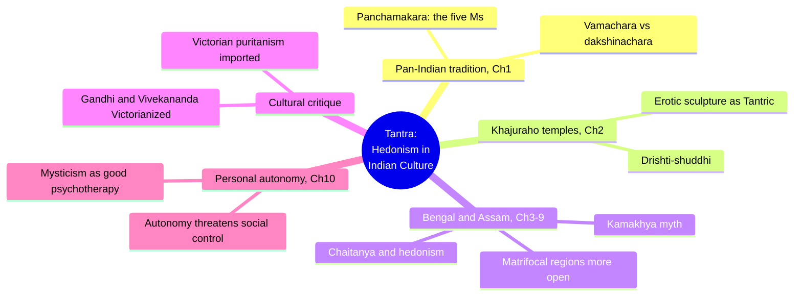
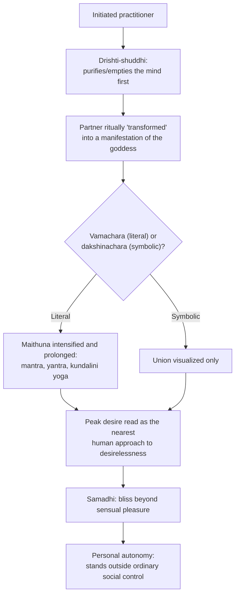
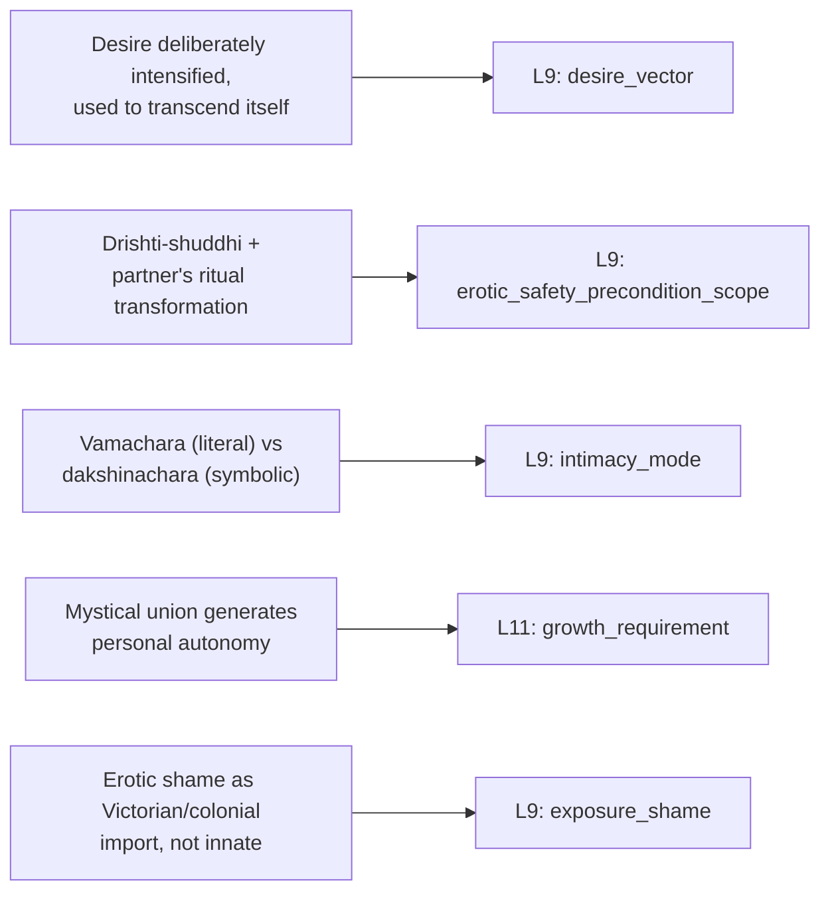

# 🧬 PSY.41 — Tantra, Hedonism in Indian Culture — Saran (2006)
### Knowledge Entry — Distill

A cultural anthropologist and Tantric initiate's short study of Tantrism as a pan-Indian, hedonistic mystical tradition, centered on Bengal and Assam, arguing that deliberate erotic and sensory intensification (not renunciation) is a legitimate, historically major Hindu path to mystical union, later suppressed by Victorian-colonial puritanism; the first BVX-LEARN entry to bring a non-Western, ritual-religious framework for desire onto the sexuality shelf.

## TABLE OF CONTENTS
- [Core Thesis](#1-core-thesis)
- [Mind Models](#2-mind-models)
- [Framework](#3-framework--structure)
- [Key Concepts](#4-key-concepts)
- [Heuristics](#5-heuristics--decision-rules)
- [Invariants](#6-invariants)
- [Pitfalls](#7-pitfalls--myths)
- [Application](#8-application)
- [Cross-References](#9-cross-references)
- [Provenance](#10-provenance--confidence)

---

## 1 · CORE THESIS

Tantrism is a major, ancient Hindu tradition that affirms sensory and sexual pleasure as a direct route to mystical union rather than an obstacle to it; the personal autonomy this union generates threatens social and caste control, which is why Tantrism was disreputable to orthodoxy long before Victorian colonial puritanism gave modern India additional reasons to disown it.

---

## 2 · MIND MODELS

*Required. Minimum two diagrams, maximum five.*

**Diagram 1 — the whole argument.**
Caption: *ten short chapters move from doctrine to regional case studies to a closing thesis — eroticism used deliberately is a path to autonomy, and that autonomy is what actually threatens the establishment.*

**Diagram 2 — the central mechanism (desire deliberately intensified as the vehicle to transcend desire).**
Caption: *the ritual does not suppress wanting to reach the sacred, it fuels wanting on purpose — the peak of desire, not its absence, is read as the nearest human approach to desirelessness.*

**Diagram 3 — mapped onto the Command's L9 EROS and L11 DESTINY.**
Caption: *the book's four load-bearing mechanisms split across a desire that fuels its own transcendence, two internal preconditions, a literal/symbolic enactment axis, and a growth vector, plus a direct challenge to treating shame as innate.*

---

## 3 · FRAMEWORK / STRUCTURE

Foreword plus preface plus ten short chapters, moving from doctrine and history through regional case studies (Khajuraho, Bengal, Assam) to a closing cultural-critique thesis:

| Chapter | Governing content |
|---|---|
| 1, The Pan-Indian Tantric Tradition | Defines Tantrism, the panchamakara (five-element) ritual, vamachara/dakshinachara, its social position and history |
| 2, Tantrism and the Khajuraho Temples | Argues the Khajuraho erotic sculptures are Tantric, and rebuts scholars who read them as "degenerate" or non-Tantric |
| 3, The Tantric Tradition in Bengal | Regional case study |
| 4, Chaitanya, Tantrism and Hedonism in Bengal | The Vaishnava devotional-erotic tradition's Tantric substrate |
| 5, "Cultural Debate" and Tantrism in Modern Bengal | Applies Agehananda Bharati's "cultural debate" method to Bengali attitudes toward Tantrism |
| 6, Tantrism and the "Hindu Renaissance" in Bengal | Colonial-era reform movements' relationship to Tantric heterodoxy |
| 7, The Tantric Tradition of Assam: Cultural Implications | Regional case study |
| 8, The Kamakhya Myth and Modern Indian Values | Goddess-worship mythology and its modern reception |
| 9, Tantrism and Modern Assamese Ideology | Regional case study |
| 10, Tantrism: A Quest for Personal Autonomy | Closing thesis: mystical union (via Tantra) generates personal autonomy, which is why it is resisted, and could function as cultural psychotherapy for a puritanical modern society |

The book's throughline, stated in the Foreword and closed in Chapter 10: Tantrism is not a degraded or magical fringe practice but a coherent, ancient "short-cut to redemption" that uses rather than represses the senses; its suppression in elite modern India is attributed specifically to two centuries of Victorian colonial influence layered onto older, unrelated Brahmanical objections (caste-breaking, priestly redundancy, secrecy).

---

## 4 · KEY CONCEPTS

| Concept | What it is | Why it matters |
|---|---|---|
| **Panchamakara (the five Ms)** | The five ritual elements sometimes used in Tantric worship: alcohol (madya), meat (mamsa), fish (matsya), parched grain/gesture (mudra), and sexual intercourse (maithuna) | The single most distinguishing marker separating Tantrism from mainstream Hinduism; not always all present, but the "fifth M" (maithuna) carries the tradition's reputation |
| **Vamachara vs. dakshinachara** | Left-hand practice (vamachara): the panchamakara literally, physically performed. Right-hand practice (dakshinachara): the same ritual performed symbolically or mentally only | The book treats both as legitimate; literal enactment is not required for the ritual's validity, only for its most controversial form |
| **The partner's ritual transformation** | A previously initiated woman is ritually "transformed" into a manifestation of the goddess (Shakti) before maithuna; "all men are Shiva and all women are Shakti during the actual rites" | Precondition, not incidental detail: the ritual frame itself is what converts an ordinary sexual act into a sacred one, for the duration of the rite only |
| **Drishti-shuddhi** ("purification of vision") | A practice of emptying or purifying the mind before entering sacred/erotic space, letting the devotee see divinity in what would otherwise be read as profane or obscene | Explains how the same image or act (an erotic temple sculpture, a ritual union) can be received as sacred by a purified viewer and as pornographic by an unpurified one — the difference is in the viewer's prepared state, not the content |
| **Samadhi / ananda** | The state of mystical bliss or union that is the tradition's actual goal; described as exceeding even sensual pleasure, with the orgasmic moment read as its nearest human approximation | Reframes sexual climax not as the endpoint of desire but as a signpost toward a further, non-sexual state; desire is instrumentalized rather than simply satisfied |
| **"Fun is out"** (Bharati) | The author's mentor's summary of how modern, puritanical Indian society actually regards Tantric hedonism, despite its historical prominence | A blunt index of how thoroughly the tradition's legitimacy has been suppressed in elite modern reception, even as it persists in regional folk practice |
| **Personal autonomy via mystical union** | The book's core claim: reaching samadhi (by Tantric or other means) generates a felt independence from ordinary social norms and control | Explains why Tantrism specifically, more than other mystical paths, draws institutional suspicion — the autonomy it produces is read as a social threat, not just a private experience |
| **The "Cultural Debate" method** (Bharati) | An anthropological tool for reading how a society argues internally about its own contested traditions (here, Tantrism's legitimacy) rather than assuming a single authoritative verdict | Frames Tantrism's modern reputation as an ongoing, unsettled cultural argument, not a closed historical judgment |
| **Matrifocal regions as more Tantra-friendly** | Bengal, Assam, Orissa, and Kerala are identified as having historically muted caste distinctions, stronger goddess-worship traditions, and comparatively higher status for women, correlating with greater openness to Tantric practice | Ties a specific eroticism to specific social/structural conditions (gender status, caste rigidity) rather than treating it as a free-floating individual trait |
| **Victorian puritanism as colonial import** | The book attributes elite modern Indian sexual shame specifically to two centuries of British missionary and administrative influence, not to an original feature of the culture | A historicized, denaturalizing account of sexual shame — directly useful for writing shame as contingent and imposed rather than intrinsic |

---

## 5 · HEURISTICS & DECISION RULES

| Situation | Do this | Not this |
|---|---|---|
| Writing a character or culture that treats eroticism as sacred or spiritually instrumental | Show desire being deliberately intensified and prolonged as a technique toward a further state, not simply indulged or suppressed | Default to eroticism as either pure hedonism or something to be renounced for spiritual advancement |
| A ritual or ceremonial context changes what a sexual act means to its participants | Show a specific precondition (preparation, initiation, a change of perceived identity) that converts the act from ordinary to sacred/significant for its duration | Assume the meaning of an act is fixed regardless of the frame surrounding it |
| Depicting the same explicit content received differently by different viewers | Root the difference in each viewer's own prepared state or purification (what they bring to it), not only in the content itself | Treat explicit content as having one single, fixed effect on every viewer |
| A character or community's spiritual/mystical practice produces increased independence from social norms | Show that independence being read by authority as a threat, not merely tolerated as personal growth | Write mystical or transformative experience as automatically socially sanctioned |
| Authoring a character's shame about their body or sexuality | Consider giving it a traceable historical or cultural origin (a specific imposed value system) rather than treating it as an innate, universal given | Write sexual shame as a natural, unexamined constant across all characters and cultures |
| Depicting two valid ways of performing the same ritual or intimate practice (one literal, one symbolic) | Let both be treated as legitimate within the practice's own logic, differing in register rather than in sincerity or intensity | Rank the literal/embodied version as automatically more authentic than the symbolic/visualized one |
| Showing which regions, classes, or communities within a culture are more or less open to a given erotic or mystical practice | Tie the openness to concrete structural conditions (gender status, rigidity of social hierarchy) rather than vague regional stereotype | Present cultural openness to eroticism as random or unexplained |

---

## 6 · INVARIANTS

1. **Deliberately intensifying desire can function as a technique toward a further, non-sexual state, not only as an end in itself.** The ritual instrumentalizes wanting rather than simply satisfying or suppressing it.
2. **A ritual frame (preparation, initiation, purification) can convert the same physical act's meaning for its participants and duration, without changing the act itself.**
3. **Reception of explicit or erotic material depends on the state the viewer brings to it, not solely on the material's content.**
4. **Personal autonomy generated by intense mystical or erotic experience is read by social/institutional authority as a threat, independent of any actual harm caused.**
5. **A literal, physically enacted version and a symbolic, purely mental version of the same ritual practice can both be treated as legitimate within a single tradition.**
6. **Openness to a given erotic or spiritual practice correlates with concrete social structure** (status of women, rigidity of caste/hierarchy), not with essential regional or ethnic character.
7. **Sexual shame can be a specific, datable historical import rather than a constant of human nature.**
8. **A society's official, elite-articulated value system and its regional/folk practice can diverge sharply**, with the folk practice preserving what the elite discourse has disowned.

---

## 7 · PITFALLS / MYTHS

- Reading explicit religious or ritual erotic art (temple sculpture, ritual practice) as evidence of "degeneration" from an original pure/ascetic form; the book treats this framing itself as a value-laden, "persuasive" rather than "descriptive" judgment, not a neutral historical finding.
- Assuming sexual repression is the default or "natural" response to eroticism in traditional or religious contexts; the book documents an entire major tradition built on the opposite premise.
- Treating literal (embodied) ritual practice as automatically more "real" or committed than symbolic/mental practice; the tradition itself holds both as valid registers.
- Assuming a culture's currently dominant sexual morality reflects its unbroken, original values; the book argues elite modern Indian puritanism is a specific, comparatively recent colonial-era layer over a very different earlier tradition.
- Conflating "used ecstasy/eroticism to reach a further state" with simple hedonistic indulgence; the book insists the goal (samadhi, desirelessness) is distinct from and beyond the sensual pleasure used to reach it.
- Assuming secrecy around a practice implies it is inherently shameful or illegitimate; the book frames Tantric secrecy partly as protective (against institutional control) rather than only as evidence of guilt.
- Reading mystical/ecstatic experience as apolitical or purely private; the book insists the personal autonomy it generates has direct, resisted social and institutional consequences.

---

## 8 · APPLICATION

- **Spine level:** [L5] WOUND, per this batch's assigned keying (a culture-and-theory source; the "wound" here is less a single injury than a historicized cultural rupture — a suppressed tradition and an imposed shame layered over it by colonial contact)
- **12-layer character stack:** L9 EROS, primary (`desire_vector`, `erotic_safety_precondition_scope`); L9 EROS, supporting (`intimacy_mode`, `exposure_shame`); L11 DESTINY, primary (`growth_requirement`, mystical/erotic union as an individuation vector)
- **plot_systems:** contextual candidate once `04_PLOT_SYSTEMS/` opens — "personal autonomy generated by mystical/erotic union, resisted by authority" (Diagram 2's endpoint) is a ready-made engine for any plot where a character's private transformation puts them into conflict with an institution
- **Setting:** contextual — the book's account of regional variation in openness to a practice, tied to concrete social structure (matrifocal Bengal/Assam/Orissa/Kerala vs. the puritanical English-speaking elite), is a portable model for building S4 LAW/S8 HABIT variation across regions of a single setting, keyed to structural conditions rather than flavor text

This book's most transferable contribution to the intimacy layer is a working non-Western alternative to "desire seeks satisfaction and then rests": here, desire is deliberately built up and used as fuel to reach a state past desire altogether, with a ritual precondition (purification, initiation, the partner's transformed status) doing the work of making that possible. A character's `desire_vector` can therefore be authored as instrumental — wanting something not primarily to have it, but to be carried somewhere by the wanting itself — and their `exposure_shame` can be given a specific, nameable historical origin rather than functioning as an unexamined given. The vamachara/dakshinachara distinction also supplies a clean, portable axis for `intimacy_mode`: the same significant ritual or intimate act can be legitimately literal or legitimately symbolic, without one being less "real" than the other.

---

## 9 · CROSS-REFERENCES

| Related entry | Relation |
|---|---|
| [[🧬 MSX.30 — Urban Tantra — Carrellas (2017)]] | Direct sibling on Tantric sexual practice; Carrellas supplies a contemporary, gender-free, practice-manual register, Saran supplies the historical, regional, and cultural-critique register for the same source tradition |
| [[🧬 PHI.01 — The Art of Sexual Ecstasy — Anand (1989)]]/[[🧬 MSX.32 — The Art of Sexual Ecstasy — Anand (1989)]] | Same underlying Tantric tradition (Kundalini/chakra-based sexual practice) catalogued twice on this shelf under different subject codes; this entry supplies the anthropological and historical grounding those two practitioner-facing entries assume but do not argue for |
| [[🧬 MSX.36 — The History of Sexuality — Foucault (1978)]] | Structural parallel: both books argue that a society's "naturalized" sexual morality is a specific, historically produced formation (Foucault's discursive "strategic unities"; Saran's Victorian-colonial layer over Hindu tradition), not a timeless given |
| [[🧬 PSY.13 — Psychology of the Unconscious — Jung (1916)]] | Shared interest (from very different traditions) in eroticism as a channel toward something beyond itself — Jung's libido as general life-energy differentiating into sexuality, Saran's desire deliberately fueled toward desirelessness |

---

## 10 · PROVENANCE & CONFIDENCE

Full text, pdftotext extraction (~97pp main text before bibliography/glossary/index), clean text layer with a machine-readable table of contents; a short monograph, read substantially rather than sampled given its size. Read in full: the Foreword (Mattison Mines' framing of the book's cultural-critique ambitions and its argument against Victorian-influenced Indian orthodoxy) and the Preface (the author's own methodological framing, debts to Agehananda Bharati); Chapter 1, "The Pan-Indian Tantric Tradition" (full — definitions of Tantrism, the panchamakara ritual, vamachara/dakshinachara, social position of Tantrics and of women within the cult, early and later history); Chapter 2, "Tantrism and the Khajuraho Temples" (full — the argument for reading the erotic sculptures as Tantric, drishti-shuddhi, the rebuttal of Desai's and Tripathi's "degeneration"/caricature readings); Chapter 10, "Tantrism: A Quest for Personal Autonomy" (full — the closing thesis on mystical union, personal autonomy, and Tantrism as potential cultural psychotherapy). Sampled via table of contents and cross-references only: Chapters 3-9 (the Bengal and Assam regional case studies, the Chaitanya/Vaishnava chapter, the "Cultural Debate" and "Hindu Renaissance" chapters, and the Kamakhya myth chapter) — not deep-extracted for this distill.

The `feeds:` variable names (`desire_vector`, `erotic_safety_precondition_scope`, `intimacy_mode`, `growth_requirement`, `exposure_shame`) are taken directly from L9 EROS and adjacent layer definitions in `ssot_02_character_systems_vertical_slice.md` PART A and the L9 EROS synthesis (`ssot_02_l9_eros_synthesis.md`), not inferred loosely.

## META
- Template: BVX-LEARN-v4.0, sexuality variant (BOLO 87/88, `brief.DISTILL.md` as changed by `brief.DISTILL.wave3.md`)
- Source classification: full-text short monograph, deep extraction on front matter plus 3 of 10 chapters, remaining 7 chapters represented via table of contents and cross-references only
- Created / Updated: 2026-09-29
