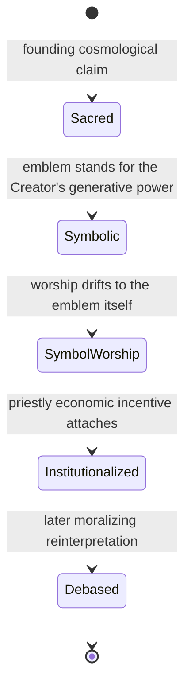
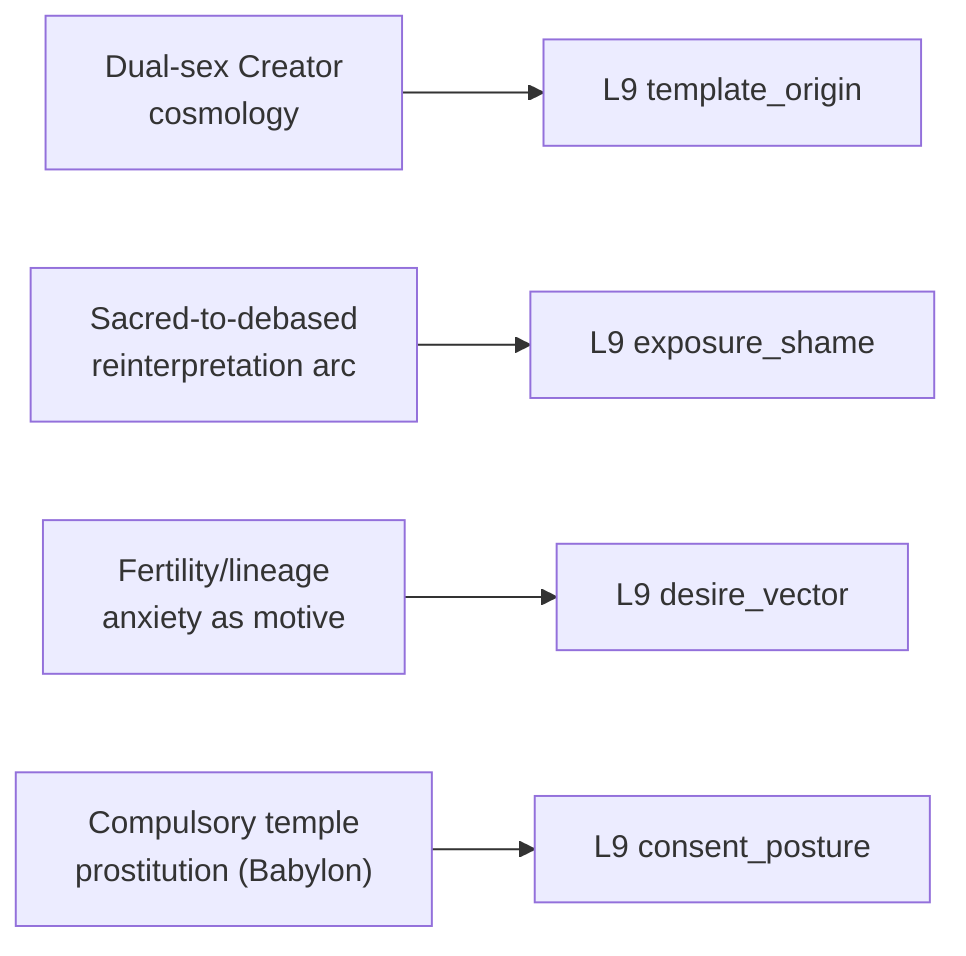

# PSY.42 — The Masculine Cross — Anonymous (1904)
### Knowledge Entry — Distill

A privately printed 1904 comparative-religion tract tracing cross symbolism and "phallic faiths" across ancient cultures — included in the sexuality shelf's THEORY category as a primary-source specimen of how sex-as-sacred cosmologies get built, argued, and later reinterpreted as shameful, rather than as a reliable modern reference.

## TABLE OF CONTENTS
- [Core Thesis](#1-core-thesis)
- [Mind Models](#2-mind-models)
- [Framework](#3-framework--structure)
- [Key Concepts](#4-key-concepts)
- [Heuristics](#5-heuristics--decision-rules)
- [Invariants](#6-invariants)
- [Pitfalls](#7-pitfalls--myths)
- [Application](#8-application)
- [Cross-References](#9-cross-references)
- [Provenance](#10-provenance--confidence)

---

## 1 · CORE THESIS

Ancient sex worship traces to a single cosmological claim — that the Creator contains both sexes — from which an entire value system (what's sacred, what's owed, what's shameful) descends; the same symbols and practices then drift from worship-of-the-referent to worship-of-the-symbol-itself, and later reinterpretation, not the original practice, produces the "debased" reading modern audiences inherit.

---

## 2 · MIND MODELS

*Required. Minimum two diagrams, maximum five.*

**Diagram 1 — the whole argument.**
Caption: *seven chapters trace one thread — the cross, the sacred triad, the golden calf, circumcision, and sex worship are all read as descendants of the same androgynous-creator cosmology, not as separate curiosities.*

```mermaid
mindmap
  root((The Masculine<br/>Cross))
    The cross
      Pre-Christian origins
      Universal symbol not doctrine
    Sacred Triad doctrine
      Male female union as creation
    The Golden Calf
      Cone or animal debate
      Priapus worship
    Circumcision
      Consecration vs mutilation
      Oath by the generative organ
    Androgynous deities
      Dual-sex Creator claim
      Lingam and Yoni worship
      Sacred prostitution
      Fertility and lineage anxiety
```

**Diagram 2 — the central mechanism (a state change: how a sacred symbol's meaning decays).**
Caption: *the book names this decay explicitly — the "debased" reading a later culture inherits is the output of two accumulated reinterpretations, not the original meaning; skipping straight to condemnation erases the intermediate steps.*

**Diagram 3 — mapped onto the Command's L9 EROS layer.**
Caption: *this source's real strength is template_origin, not the other L9 fields — it is a worked cosmology-to-shame pipeline more than a psychological mechanism book.*

---

## 3 · FRAMEWORK / STRUCTURE

Seven chapters move outward from a single symbol: Chapters I–II establish the cross as pre-Christian and near-universal; Chapters III–IV argue a "Sacred Triad" doctrine (male/female union as the mechanism of creation) underlies most ancient theologies; Chapter V reads the Golden Calf episode as a suppressed instance of the same phallic/Priapic worship; Chapter VI treats circumcision as consecration of the generative organ rather than mere hygiene or covenant marker; Chapter VII, the book's terminus, states the underlying doctrine directly — androgynous deities, Lingam/Yoni worship, sacred prostitution, and the Hindu law of inheritance and obsequies, all read as expressions of one root anxiety: the need for offspring to secure a good afterlife. The book has no separate conclusion chapter; Chapter VII's final paragraph functions as the thesis statement for the whole work.

---

## 4 · KEY CONCEPTS

| Concept | What it is | Why it matters |
|---|---|---|
| **The androgynous-deity doctrine** | The claim, cited across multiple ancient theologies, that "God created man in his own image, male and female," meaning the divine nature contains both sexes | The book's foundational cosmological claim — everything else (symbol systems, worship practices, oath-taking) is presented as descending from it |
| **Symbol-to-worship drift** | Worship of what a symbol represents degenerating, over generations, into worship of the symbol or emblem itself | A named mechanism for how sacred meaning decays without any single corrupting actor — drift, not conspiracy |
| **Lingam and Yoni worship** | Independent veneration of male and female generative organs as symbols of the Creator, at scales from household clay figures to temple-scale stone monuments | Demonstrates a sacred-sexuality system where male and female principles are worshipped separately as well as in union |
| **Sacred prostitution (three distinct structures)** | Babylon: compulsory, once-in-a-lifetime temple service to any stranger who throws a coin, by law. Armenia: lifelong temple-attached prostitution, including daughters of high rank, ending in ordinary marriage. Lydia: prostitution for personal profit, practiced by choice | The book's own evidence shows "sacred prostitution" was not one institution but several, with different degrees of compulsion and different motives — collapsing them into one practice misreads all of them |
| **Lineage/afterlife anxiety as root motive** | The Hindu doctrine that a son alone can perform the obsequies that spare a father's shade from Put (a hell for the dead), driving intense pressure toward fertility, adoption law, and temple fertility rites | Reveals that a great deal of historical "sex worship" was motivated by genealogical dread, not eroticism — a motive architecture worth distinguishing from desire |
| **The oath by the generative organ** | Touching the thigh (genitals) as the most binding form of oath in Genesis (Abraham's servant, Jacob and Joseph) | Shows the organ's sacredness extending into law and covenant-making, beyond sex itself |
| **Genital mutilation as status marker** | Circumcision as consecration versus enemy castration as the ultimate degradation (Egyptian bas-reliefs, Saul's bride-price demand for Philistine foreskins) | The same body part functions as the highest mark of honor or the deepest degradation depending entirely on context and consent |
| **Priestly economic incentive** | Temples offering fertility "cures" to anxious couples, with priests benefiting materially from the anxiety they addressed | A concrete mechanism (Diagram 2's "Institutionalized" state) by which religious reproductive anxiety became a revenue stream |

---

## 5 · HEURISTICS & DECISION RULES

| Situation | Do this | Not this |
|---|---|---|
| Building a fictional culture's sacred-sexuality system | Ground it in a specific cosmological claim about the Creator/origin, from which the culture's rules descend | Treat "sex-positive religion" as an undifferentiated vibe with no theological mechanism |
| Depicting a fertility cult or temple-sex institution | Give it a genuinely different motive architecture (lineage dread, afterlife insurance) distinct from erotic desire | Project modern erotic-liberation values onto a historical or fictional sacred-sex practice |
| Writing a culture whose sacred practice reads as "debased" to outsiders or descendants | Trace the specific reinterpretation that produced that judgment (economic corruption, conquest, moral reform) | Treat the shame or disgust as timeless or intrinsic to the practice itself |
| Depicting compulsory or civic sacred prostitution | Name the coercion plainly even when the culture's own frame calls it sacred duty | Launder structural coercion as consent because a religious system sanctions it |
| Wanting a constructed culture's oaths or vows to carry real weight | Consider grounding them physically or symbolically in something tied to procreation/legacy | Default to a modern verbal-only oath convention without in-world grounding |
| Using this book as a factual source | Treat its claims as period comparative-religion speculation to mine selectively | Cite its etymologies or cross-cultural equivalences as settled modern scholarship |

---

## 6 · INVARIANTS

1. **A culture's sexual value system can trace to one founding cosmological claim** about the Creator's own sex or nature.
2. **Symbol-worship reliably drifts from the referent to the symbol itself** over time, independent of original intent.
3. **Sacred-sex institutions are frequently motivated by lineage or afterlife anxiety**, not eroticism, and conflating the two misreads the institution.
4. **Shame attached to a sexual practice is often a later reinterpretation** layered onto an earlier, differently valued practice.
5. **A culture's own sacred framing of an institution does not eliminate structural coercion within it.**

---

## 7 · PITFALLS / MYTHS

- Treating this 1904 text's confident claims as settled fact — its etymologies and sweeping cross-cultural equivalences reflect period comparative-religion methods, not modern scholarship, and should be mined as raw material, not cited as established history.
- Collapsing "sacred prostitution" into one uniform practice — the book's own Babylon/Armenia/Lydia/Egypt examples show meaningfully different structures, compulsion levels, and motives.
- Reading historical "phallic worship" as equivalent to modern sex-positivity — the dominant motive described (lineage anxiety, religious obligation) is frequently the opposite of pleasure-seeking.
- Assuming a sacred or religious frame automatically implies consent — the Babylonian example is compulsory by law, dressed in sacred language.
- Treating "debased" or "licentious" as the true or final meaning of a symbol rather than one historical layer among several the book itself distinguishes.

---

## 8 · APPLICATION

- **Spine level:** none — this is an L9 EROS character-layer source, not a story-spine source (per the v4 template's binding rule that character-stack feeds sit beside the spine, not on it)
- **12-layer character stack:** L9 primary on template_origin, supporting on desire_vector and exposure_shame, contextual on consent_posture
- **plot_systems:** none identified
- **Setting:** none in frontmatter (this distill is scoped to L9 per the wave brief), but flagged here: this source's actual strongest use is adjacent to the SETTING SLICE's S10 UNDERSIDE (mystery-cult/public-religion split) and S9 ALLURE (what a belief system promises) from the setting-shelf method in [[BVX.0458]] — a writer building a fictional fertility cult or sacred-sexuality religion for a setting would mine this book directly for cosmology and ritual structure, then use template_origin to carry that cosmology down into an individual character's L9 fields

For character work, this source's real value is narrow but load-bearing: it is a worked example of how to build a character's sexual template_origin from the ground up — not "she grew up in a strict household" but a specific cosmological claim (what does this culture believe the Creator's sex/nature implies), a specific institutional structure built on that claim (temple, obsequies law, oath practice), and a specific decay arc by which the culture's own descendants came to find the practice shameful. A character whose homeland practiced something like Lingam devotion carries a traceable L8 template that determines their L9 baseline (what's sacred vs. shameful, what desire is *for*) differently from a character whose culture inherited only the debased, moralized end-state of the same practice — and the book's decay-arc mechanism (Diagram 2) is the tool for authoring that difference precisely rather than vaguely.

---

## 9 · CROSS-REFERENCES

| Related entry | Relation |
|---|---|
| [[🧬 MSX.36 — The History of Sexuality — Foucault (1978)]] | Sibling source on the historical construction of sexual meaning and shame — Foucault's discourse-analysis method is the rigorous modern counterpart to this book's amateur comparative-religion approach to the same question (how does a culture decide what's shameful about sex) |
| [[🧬 MSX.30 — Urban Tantra — Carrellas (2017)]] | Sibling sacred-sexuality source — Carrellas's tantra practice is a modern, practitioner-facing descendant of exactly the Lingam/Yoni devotional framework this book documents historically |
| [[BVX.0458]] | Cross-shelf SETTING source — this book's cosmology-to-ritual-to-institution chain is directly usable raw material for the S9 ALLURE / S10 UNDERSIDE method that BVX.0458 establishes for building a fictional religion's public and secret layers |

---

## 10 · PROVENANCE & CONFIDENCE

Full text, plain-text extraction (Project Gutenberg edition), ~740 lines of body text (~1,146 lines total including license boilerplate; ~263 KB). Read in full: front matter, introductory note, the complete table of contents (all seven chapters), the opening of Chapter I (the cross's pre-Christian origins), and the complete body of Chapter VII, "Androgynous Deities, Sex Worship, &c." (the androgynous-deity doctrine, Lingam/Yoni worship, sacred prostitution in Babylon/Armenia/Lydia/Egypt, Hindu inheritance and obsequies law, and the funeral-rite detail). Not directly read: the full bodies of Chapters II through VI (the cross's continued history, the Sacred Triad doctrine, the Golden Calf, and circumcision) — confirmed only via table of contents and chapter-heading summaries. Confidence is marked medium rather than high because the source itself is a 1904 anonymous, privately printed work of period comparative religion, not a peer-reviewed or modern scholarly source; its factual claims (etymologies, cross-cultural equivalences) are presented here as the book's argument, not as verified history.

## META
- Template: BVX-LEARN-v4.0
- Source classification: full-text public-domain monograph, deep extraction on 1 of 7 chapters (the terminal, thesis-bearing chapter) plus front matter and TOC, remainder confirmed structurally via TOC only
- Created / Updated: 2026-09-29
