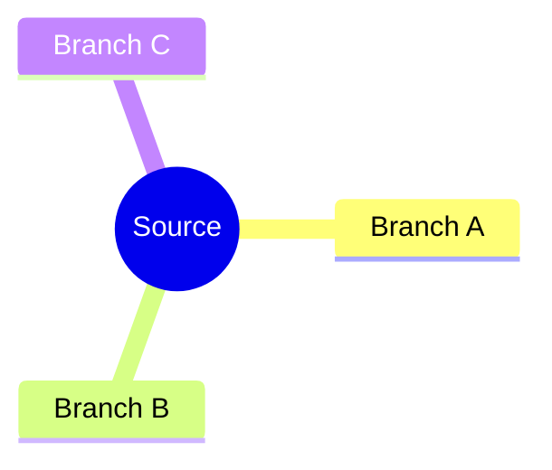
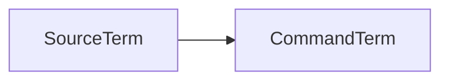
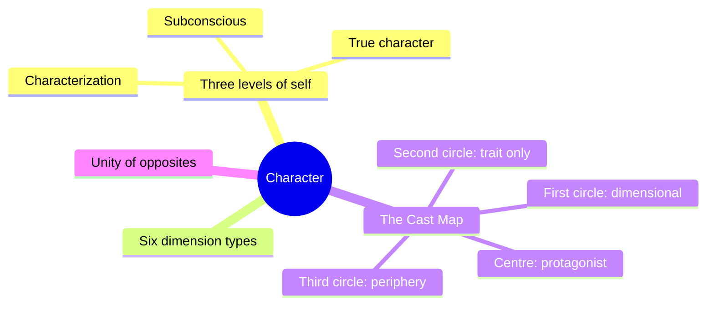
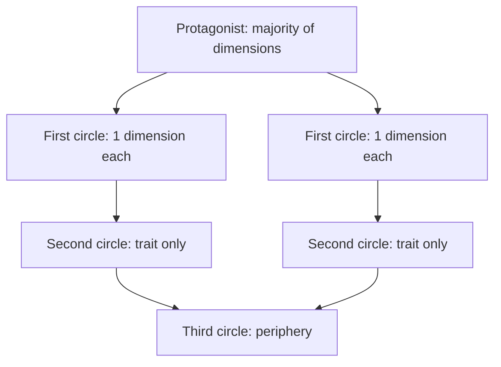

# BVX-LEARN Distill Template v4

**Ruling, 2026-09-16 (Chief):** *"Make sure there is a good template for distills; mind models, visual models using Mermaid or other, should be a huge thing of that; add it to the template."*

This file is the standalone copy-paste template — §14.7 of `SPEC.BVX-LEARN.v3.md`, deferred at the spec's completion, delivered now. It does not reopen D1–D5. It adds one new required section (**Mind Models**) and two new frontmatter keys (`spine`, mandatory `feeds`) on top of the v3 §6 skeleton, which otherwise stands unchanged.

**Governing principle, unchanged:** distill, don't summarize. An entry is a reference card, not a second copy of the source. The Mind Models section obeys the same law — a diagram is a compressed argument, not a decoration.

---

## TABLE OF CONTENTS

- [§A · What Changed from v3 §6](#a--what-changed-from-v3-6)
- [§B · The Template](#b--the-template)
- [§C · Mind Models Rules](#c--mind-models-rules)
- [§D · Quality Gates](#d--quality-gates)
- [§E · Fill Order](#e--fill-order)

---

## §A · What Changed from v3 §6

| Change | v3 §6 | v4 |
|---|---|---|
| **`spine:` key** | Absent | New frontmatter list, story-side sources only. Keys the entry to story-spine levels L0–L7 (e.g. `spine: [L4, L5]`). Texture/telling sources key `TEXTURE`; setting sources key `SETTING`. Separate axis from `feeds:` — `spine` is the story-spine (L0–L7), `feeds.layer` is the character stack (L1–L12) or `DRAMATICA`/`ASTROLOGY`. Same letter, different scale; never conflate them. |
| **Mind Models section** | Did not exist | New **§2, REQUIRED** for every entry regardless of `status`. Minimum two Mermaid diagrams: the source's whole argument, then its central mechanism. Rules in §C below. |
| **Diagram rules** | None | §C: diagram-type choice table by content shape, node-count ceiling, caption requirement, no external tools, no rendered images. |
| **`feeds:` block** | Introduced in D2, not yet mandatory at the template level | Now **mandatory on every entry** — `feeds: []` explicit when a source has nothing to feed the character system. Absent is a gate failure, not a stub. |
| **Quality gate additions** | Nine checks (§9) | Four new checks: Mind Models present and valid Mermaid · `spine:` set for every story-side source · `feeds:` present (empty allowed, absent not) · Core Thesis under 60 words. |

All nine v3 §6 sections survive under new numbers (Mind Models inserts as §2, pushing Framework through META down by one). No section was cut. `Application` keeps its D3 prose-plus-wiring split.

---

## §B · The Template

Copy the block below verbatim into a new entry. Replace every `[bracket]`. Delete no section — a thin entry sets `status: stub` honestly (v3 §6 rule) rather than omitting a heading.

````markdown
---
id: BVX.####
title: "[Full title]"
author: "[Author(s)]"
year: [YYYY]
type: distill              # distill | spine
source_type: book          # book | web | video | session | note | internal
subjects: [XXX]            # D5 taxonomy codes, ordered by relevance
primary_subject: XXX
trunk: BLACK                # BLACK | ORANGE | BOTH
spine: [L#]                 # story-spine levels L0–L7; TEXTURE or SETTING; [] if non-story source
feeds:                      # D2 — mandatory, [] explicit if nothing to feed
  - layer: L#                # L1–L12, or DRAMATICA, or ASTROLOGY
    variable: [field_name]
    strength: primary        # primary | supporting | contextual
    note: "[why]"
zotero_key: "[key]"
pdf_pages: [n]
status: complete            # complete | draft | stub
confidence: high            # high | medium | low
date_created: YYYY-MM-DD
---

# BVX.#### — [Title] — [Author] ([Year])
### Knowledge Entry — Distill

[One-line orientation: what this source is and why it's in the library.]

## TABLE OF CONTENTS
- [Core Thesis](#1-core-thesis)
- [Mind Models](#2-mind-models)
- [Framework](#3-framework--structure)
- [Key Concepts](#4-key-concepts)
- [Heuristics](#5-heuristics--decision-rules)
- [Invariants](#6-invariants)
- [Pitfalls](#7-pitfalls--myths)
- [Application](#8-application)
- [Cross-References](#9-cross-references)
- [Provenance](#10-provenance--confidence)

---

## 1 · CORE THESIS

[The single load-bearing idea. Three sentences max, under 60 words. If it needs a fourth sentence, it isn't distilled yet.]

---

## 2 · MIND MODELS

*Required. Minimum two diagrams, maximum five. See §C for the rules.*

**Diagram 1 — the whole argument.**
[One-line caption: what to read off it.]



**Diagram 2 — the central mechanism.**
[One-line caption: what to read off it.]

```mermaid
[flowchart | stateDiagram-v2 | timeline | sequenceDiagram | quadrantChart | classDiagram | erDiagram]
  ...
```

**Diagram 3 (optional) — mapped onto the Command's systems.**
[One-line caption: what to read off it.]



---

## 3 · FRAMEWORK / STRUCTURE

[The skeleton: how the source organizes its argument or system.]

---

## 4 · KEY CONCEPTS

[Each: name → what it is → why it matters. Table or numbered list, not prose paragraphs.]

---

## 5 · HEURISTICS & DECISION RULES

| Situation | Do this | Not this |
|---|---|---|
| [ ] | [ ] | [ ] |

---

## 6 · INVARIANTS

[What's always true regardless of context. Numbered list.]

---

## 7 · PITFALLS / MYTHS

[Common errors the source corrects. Short bullets, not paragraphs.]

---

## 8 · APPLICATION

*Prose carries the why; `feeds:` carries the wiring (D3). Both required, neither redundant.*

- **Spine level:** [how this maps to story-spine L0–L7, or TEXTURE/SETTING]
- **12-layer character stack:** [which layers, if any]
- **plot_systems:** [if applicable]
- **Setting:** [if applicable]

[Free prose: ties to active Command systems, kept clearly separate from source extraction.]

---

## 9 · CROSS-REFERENCES

| Related entry | Relation |
|---|---|
| [[BVX.####]] | [ ] |

---

## 10 · PROVENANCE & CONFIDENCE

[What was sourced from full text vs. research vs. inference. Source-type notes per SPEC v3 §4 land here.]

## META
- Template: BVX-LEARN-v4.0
- Source classification: [ ]
- Created / Updated: [ ]
````

---

## §C · Mind Models Rules

The heart of the ruling. Every distill carries at least two diagrams; more than five means the source wasn't distilled, it was transcribed.

1. **Minimum two, maximum five diagrams per distill.** Two is the floor for `stub`; five is the ceiling for `complete`. A source that needs a sixth diagram to be understood needs a second entry, not a bigger one.

2. **Diagram 1 is always the whole argument, one `mindmap`, depth 3 max.** The book on one screen. Root = the source; branches = its top-level claims or parts; leaves = their immediate sub-points, no further. This is the fast reader's entry point — if they read nothing else, they read this.

3. **Diagram 2 is the central mechanism, in whichever Mermaid type fits its shape.** Choose by what the mechanism *is*, not by habit:

   | Content shape | Mermaid type |
   |---|---|
   | A process (steps in order) | `flowchart` |
   | A state change (before → after, conditions) | `stateDiagram-v2` |
   | A taxonomy (kinds of a thing) | `mindmap` |
   | A timeline or sequence of events/turns | `timeline` or `sequenceDiagram` |
   | A quadrant or two-axis tradeoff | `quadrantChart` |
   | Relationships between entities | `classDiagram` or `erDiagram` |

4. **Diagram 3 is optional: the source mapped onto the Command's own systems.** A `flowchart LR` running source terms into Command terms — spine level, or one of the 12 character layers. Only draw it when the mapping itself is non-obvious; don't force one.

5. **Every diagram carries a one-line caption stating what to read off it.** Not a title restating the diagram's subject — an instruction: what conclusion or pattern the reader should walk away with.

6. **Diagrams live in fenced ` ```mermaid ` blocks only.** Nothing rendered as an image, no external diagramming tool, no screenshot. Artifacts render Mermaid natively; the entry stays plain markdown.

7. **Node labels under six words, no prose in nodes.** A node is a handle, not a sentence. If a node needs a sentence, that content belongs in Key Concepts, with the node just naming it.

8. **A diagram needing more than ~25 nodes is two diagrams.** Split by branch, not by shrinking labels further. Density is the enemy of the ten-second scan.

**Worked example — BVX.0064 (McKee, Character):**

*Diagram 1 — the whole argument.*
Caption: *the three levels of self and the two things that convert a type into a character.*



*Diagram 2 — the central mechanism (the Cast Map, a relationship structure).*
Caption: *dimensions concentrate at the centre and thin to nothing at the edge — that thinning is the time budget, not an oversight.*



Two diagrams, both under 25 nodes, both captioned. This is the floor a `complete` distill must clear.

---

## §D · Quality Gates

Carried forward from SPEC v3 §9, plus the v4 additions (marked **new**).

- [ ] YAML present, valid, and complete (no blank `status` / `confidence` / `id`)
- [ ] `id` is unique against `_INDEX.md`
- [ ] Title and one-line orientation present
- [ ] TOC present and its anchors resolve
- [ ] Required body sections present for the declared `type` (or `status: stub` is set honestly)
- [ ] No unfilled `[bracketed placeholders]` left in the body
- [ ] Provenance flagged (full-text / research / inference) in §10
- [ ] `source_url` present when `source_type` is web/video
- [ ] Cross-reference links are well-formed `[[wikilink]]` syntax (targets need not exist yet)
- [ ] Length within target band for the type (stub < 1 page; standard 1–2; deep dive flagged)
- [ ] **new** — Mind Models section present, minimum two diagrams, each a valid Mermaid block that parses
- [ ] **new** — `spine:` set (non-empty) for every story-side source; `[]` or `TEXTURE`/`SETTING` only when genuinely not story-structural
- [ ] **new** — `feeds:` present in every entry; `feeds: []` explicit when empty, never omitted
- [ ] **new** — Core Thesis is three sentences or fewer and under 60 words

Fail any → loop back to Structure (SPEC v3 Pipeline stage 4), same as v3.

---

## §E · Fill Order

The sequence a specialist follows when distilling a source, front to back:

1. **Read the TOC and intro.** Get the source's own shape before imposing one on it.
2. **Draft Diagram 1** (the whole-argument `mindmap`). Forces you to name the top-level parts before you've over-read the detail.
3. **Fill Key Concepts.** The mechanics surface naturally once the mindmap exists — this section writes fast off Diagram 1's branches.
4. **Draft Diagram 2** (the central mechanism). Pick its Mermaid type from the §C table; this section usually reveals itself once Key Concepts is written.
5. **Fill Framework/Structure, Heuristics, Invariants, Pitfalls.** These four draw directly on Key Concepts and Diagram 2; write them as a block.
6. **Draft Diagram 3 if the Command-system mapping earns one.** Skip it if forced.
7. **Fill Application, Cross-References, Provenance.** Application last among the content sections — it needs everything above it settled first.
8. **Run the quality gate (§D) before export.** Fix in place; never ship a failing gate.

---

## META
- Template: BVX-LEARN-v4.0
- Supersedes: SPEC.BVX-LEARN.v3 §6
- Status: ruled 2026-09-16, provisional
- Created: 2026-09-16
