# 23 HN-3701 HOLISTIC NARRATIVE ANALYSIS

### **Holistic Narrative Analysis**

- **Combining all narratological competencies to perform comprehensive analysis.**
  - **Application**: Analyzing complex narratives using the full range of competencies.
  - **Outcome**: Demonstrates the interconnectedness of narrative elements.

---

### **Key Concepts**

---

#### **Holistic Narrative Analysis**

- **Definition**:
  - In narratology, **holistic narrative analysis** refers to the comprehensive examination of a narrative by integrating all narratological competencies and concepts. This approach considers the interplay between structural elements, narrative frameworks, characterization, plot dynamics, setting, focalization, voice, coherence, semiotics, genre, functions, audience engagement, and ethical dimensions. By synthesizing these components, holistic narrative analysis provides a deep and nuanced understanding of the narrative's construction, meaning, and impact.

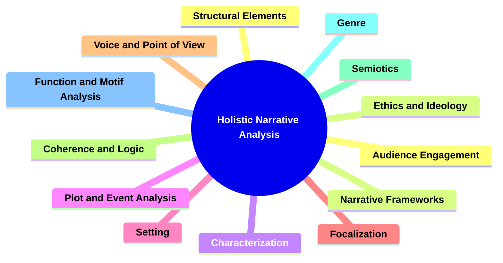

##### **Components of Holistic Narrative Analysis**

###### **Integration of Structural Elements**

- **Definition**:
  - Combining exposition, rising action, climax, falling action, and resolution to understand the narrative's overall structure and flow.

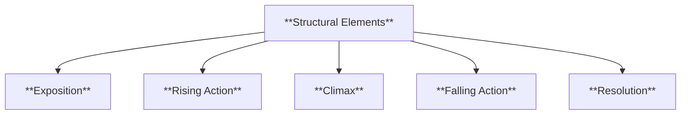

- **Characteristics**:
  - **Exposition**: Introduction of characters, setting, and primary conflict.
  - **Rising Action**: Development of conflict through complications and increased stakes.
  - **Climax**: The peak of narrative tension and turning point.
  - **Falling Action**: Events following the climax leading to resolution.
  - **Resolution**: Conclusion where conflicts are resolved.

###### **Synthesis of Narrative Frameworks**

- **Definition**:
  - Utilizing linear, non-linear, and circular narrative structures to analyze how the story is organized and presented.

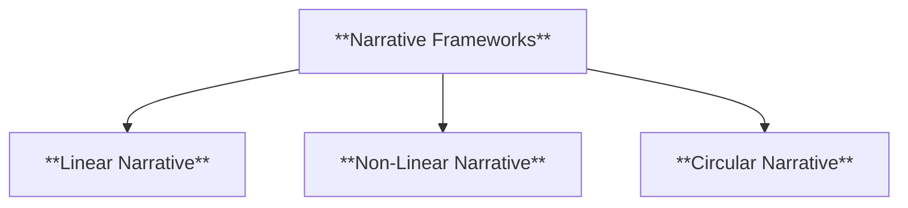

- **Characteristics**:
  - **Linear Narrative**: Chronological progression of events.
  - **Non-Linear Narrative**: Events presented out of chronological order.
  - **Circular Narrative**: Story ends where it begins, creating a full circle.

###### **Comprehensive Characterization**

- **Definition**:
  - Analyzing characters' traits, motivations, relationships, and development throughout the narrative.

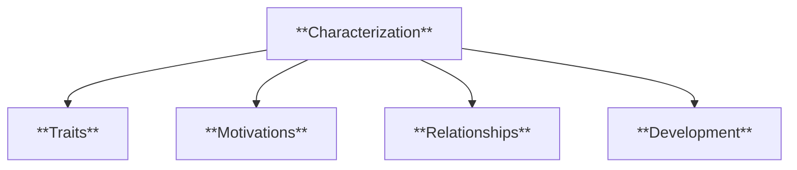

- **Characteristics**:
  - **Traits**: Physical, personality, and behavioral attributes.
  - **Motivations**: Desires, fears, goals, and values driving actions.
  - **Relationships**: Interactions and connections between characters.
  - **Development**: Growth or changes in characters over time.

###### **Integrated Plot and Event Analysis**

- **Definition**:
  - Examining the sequence, causality, and conflict within the narrative to understand the plot's structure and dynamics.

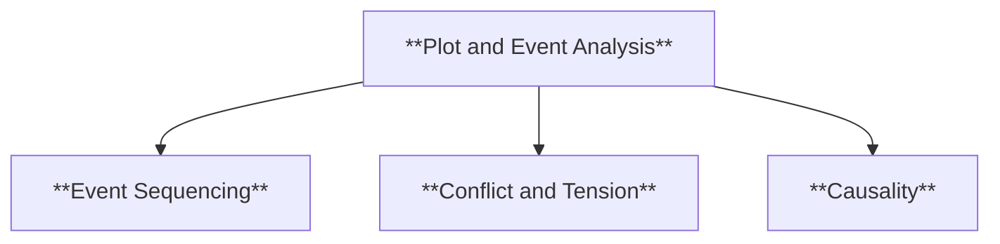

- **Characteristics**:
  - **Event Sequencing**: Order and arrangement of events.
  - **Conflict and Tension**: Sources of opposition and suspense.
  - **Causality**: Cause-and-effect relationships driving the narrative.

###### **Comprehensive Setting Analysis**

- **Definition**:
  - Analyzing the physical, social, and symbolic aspects of the setting and their impact on the narrative.

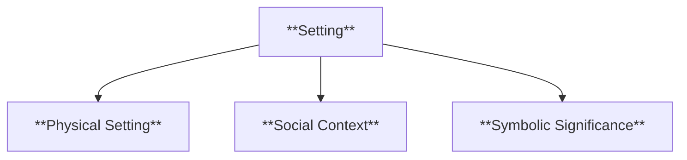

- **Characteristics**:
  - **Physical Setting**: Geographic locations, landscapes, and temporal conditions.
  - **Social Context**: Cultural norms, social structures, and interpersonal relationships.
  - **Symbolic Significance**: Metaphorical locations and thematic representations.

###### **Focalization and Perspective Integration**

- **Definition**:
  - Understanding through whose perspective the story is perceived and how it shapes the narrative.

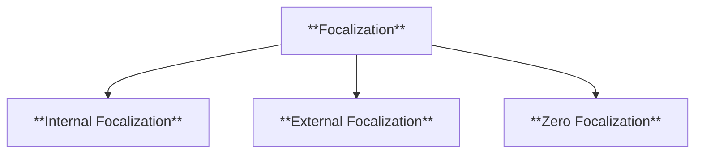

- **Characteristics**:
  - **Internal Focalization**: Through a character's thoughts and feelings.
  - **External Focalization**: Through observable actions and dialogue.
  - **Zero Focalization**: Omniscient perspective with comprehensive knowledge.

###### **Voice and Point of View Synthesis**

- **Definition**:
  - Analyzing the narrator's voice, tone, style, and attitude to understand how the story is conveyed.

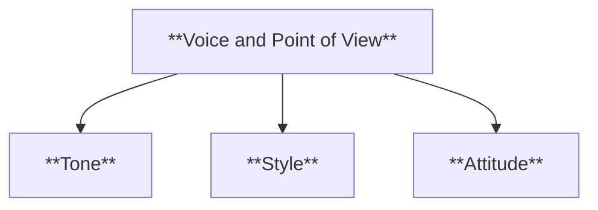

- **Characteristics**:
  - **Tone**: Formal, informal, sarcastic, optimistic.
  - **Style**: Descriptive, concise, lyrical, minimalist.
  - **Attitude**: Objective, subjective, sympathetic, detached.

###### **Narrative Coherence and Logic Integration**

- **Definition**:
  - Ensuring the internal consistency and plausibility of the narrative through logical progression, consistent character actions, and effective world-building.

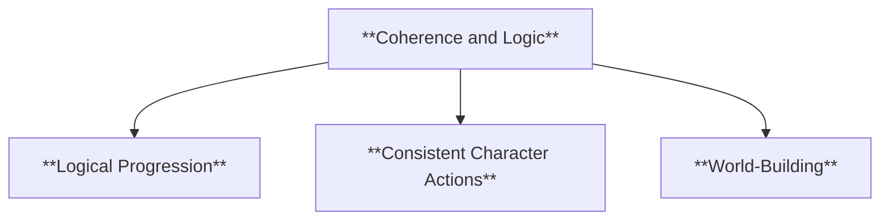

- **Characteristics**:
  - **Logical Progression**: Cause-and-effect relationships and clear event sequencing.
  - **Consistent Character Actions**: Characters act in accordance with their established traits and motivations.
  - **World-Building**: Detailed and believable narrative environments.

###### **Advanced Semiotics and Symbolic Interpretation**

- **Definition**:
  - Deep exploration of symbols and signs within cultural and historical contexts to interpret complex symbolic systems in narratives.

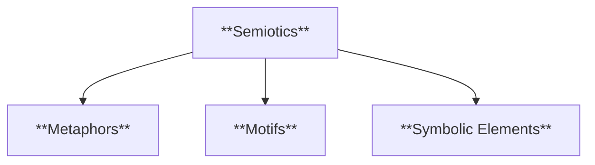

- **Characteristics**:
  - **Metaphors**: Comparative imagery and symbolic representation.
  - **Motifs**: Recurring elements that reinforce themes.
  - **Symbolic Elements**: Objects, characters, and events representing larger ideas.

###### **Genre and Narrative Typology Integration**

- **Definition**:
  - Understanding genre conventions and their influence on narrative techniques and audience expectations.

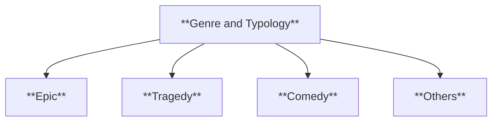

- **Characteristics**:
  - **Epic**: Heroic deeds, grand settings, mythological elements.
  - **Tragedy**: Downfall of protagonist, tragic flaw, emotional catharsis.
  - **Comedy**: Humorous situations, satire, happy resolutions.
  - **Others**: Romance, horror, science fiction, fantasy, mystery.

###### **Function and Motif Analysis Integration**

- **Definition**:
  - Identifying and examining recurring elements and their roles in advancing the plot, developing characters, and reinforcing themes.

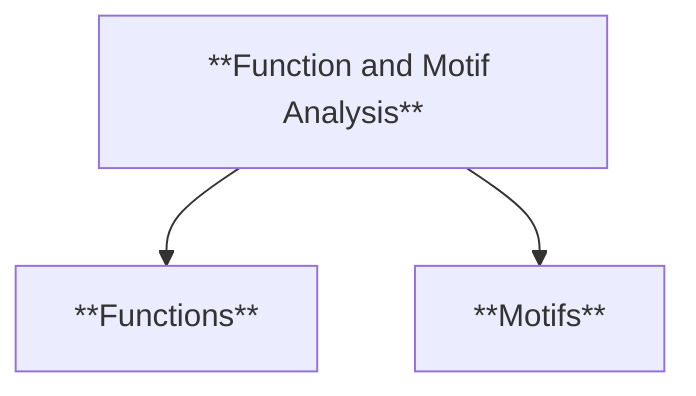

- **Characteristics**:
  - **Functions**: Narrative drivers, Propp's functions, character roles.
  - **Motifs**: Symbolic elements, recurring themes, structural patterns.

###### **Audience Engagement and Ethical Analysis**

- **Definition**:
  - Analyzing how narratives engage audiences and convey moral, ethical, and ideological messages.

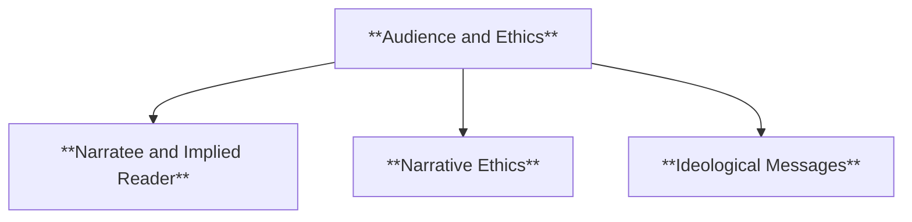

- **Characteristics**:
  - **Narratee and Implied Reader**: Recognizing the internal and ideal audience.
  - **Narrative Ethics**: Moral principles and ethical dilemmas.
  - **Ideological Messages**: Societal norms, values, and challenges to the status quo.

---

### **Theoretical Significance**

- **Comprehensive Understanding of Narratives**:

  - Holistic narrative analysis provides a unified framework for understanding how various narrative elements interact and contribute to the overall story. It allows for a deeper and more integrated comprehension of complex narratives by considering all aspects of narratological competencies.

- **Interconnectedness of Narrative Elements**:

  - This approach highlights the synergy between different narrative components, demonstrating how structural elements, character development, plot dynamics, and symbolic systems work together to create a cohesive and compelling narrative.

- **Enhanced Analytical Precision**:

  - By utilizing a holistic perspective, analysts can identify subtle interactions and dependencies among narrative elements that might be overlooked in isolated analyses. This precision leads to more accurate and insightful interpretations of the narrative.

- **Facilitating Multi-Dimensional Analysis**:

  - Holistic narrative analysis supports multi-dimensional approaches, allowing scholars to explore narratives from various angles simultaneously. This enhances the richness of narrative studies and fosters comprehensive scholarly discourse.

- **Supporting Complex Narrative Structures**:

  - For narratives that employ intricate structures, such as non-linear timelines, multiple perspectives, and layered storylines, holistic analysis is essential. It ensures that all elements are accounted for and understood in relation to one another.

- **Promoting Critical Engagement**:

  - Engaging with narratives holistically encourages critical thinking and deeper engagement with the text. It prompts analysts and readers to consider the full spectrum of narrative techniques and their cumulative effect on the story's meaning and impact.

- **Influencing Narrative Creation**:
  - Understanding holistic narrative analysis informs authors and creators about the importance of balancing and integrating various narrative elements. This knowledge can guide the development of more sophisticated and resonant stories.

---

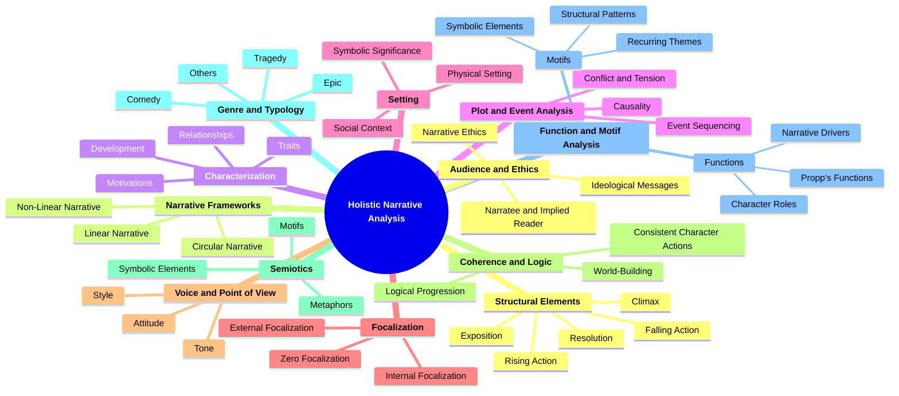
