- [1. Title: **Ryan's Immersion Framework**](#1-title-ryans-immersion-framework)
- [2. Key Concepts](#2-key-concepts)
  - [2.1. Traditional vs. Digital Narratives](#21-traditional-vs-digital-narratives)
  - [2.2. Traditional Narratives](#22-traditional-narratives)
    - [2.2.1. **Components of Traditional Narratives**](#221-components-of-traditional-narratives)
      - [2.2.1.1. **Imaginative Immersion**:](#2211-imaginative-immersion)
      - [2.2.1.2. **Narrative Techniques**:](#2212-narrative-techniques)
      - [2.2.1.3. **Reader's Role**:](#2213-readers-role)
      - [2.2.1.4. **Challenges**](#2214-challenges)
      - [2.2.1.5. **Limitations**](#2215-limitations)
  - [2.3. Digital Narratives](#23-digital-narratives)
    - [2.3.1. **Components of Digital Narratives**](#231-components-of-digital-narratives)
      - [2.3.1.1. **Sensory Engagement**](#2311-sensory-engagement)
      - [2.3.1.2. **Visual Realism**](#2312-visual-realism)
      - [2.3.1.3. **Sound Design**](#2313-sound-design)
      - [2.3.1.4. **Interactivity**](#2314-interactivity)
      - [2.3.1.5. **Immersive Techniques**](#2315-immersive-techniques)
  - [2.4. Virtual Narratives](#24-virtual-narratives)
    - [2.4.1. **Components of Virtual Narratives**](#241-components-of-virtual-narratives)
      - [2.4.1.1. **Sensory Engagement**](#2411-sensory-engagement)
      - [2.4.1.2. **Immersive Environment**](#2412-immersive-environment)
      - [2.4.1.3. **Tactile Feedback**](#2413-tactile-feedback)
      - [2.4.1.4. **Interactivity**](#2414-interactivity)
      - [2.4.1.5. **Immersive Techniques**](#2415-immersive-techniques)
- [3. Implications of Immersion Framework](#3-implications-of-immersion-framework)

---

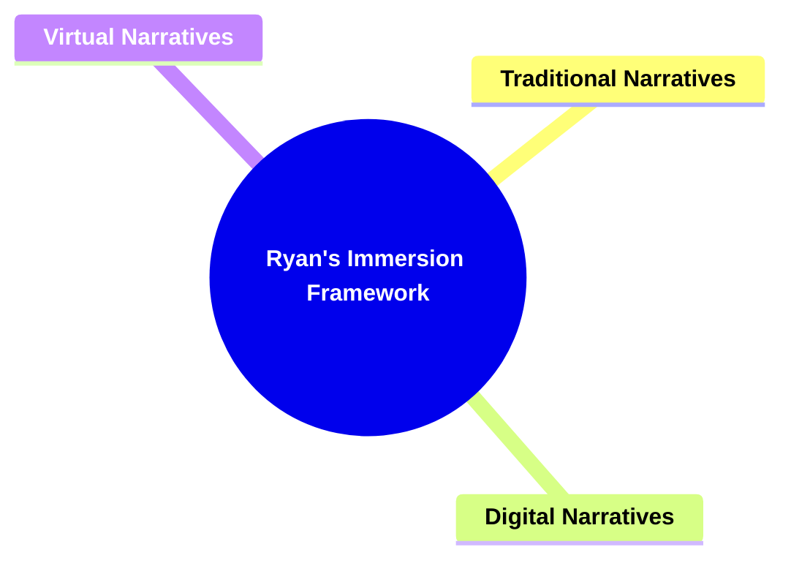

---

### 1. Title: **Ryan's Immersion Framework**

**Immersion**:
**Definition**: Marie-Laure Ryan defines _immersion_ as the experience of being transported into a fictional world, where the reader or viewer becomes fully absorbed in the narrative. In her work _"Narrative as Virtual Reality,"_ she explores how different media—literature, film, video games, and virtual reality—create immersive experiences.

---

### 2. Key Concepts

#### 2.1. Traditional vs. Digital Narratives

**Definition**:
Ryan differentiates between traditional and digital narratives in how they achieve immersion. Traditional narratives, such as those found in literature, rely heavily on the reader’s imagination to create a sense of immersion. In contrast, digital and virtual narratives, such as those in video games or virtual reality, achieve immersion through sensory engagement and interactivity, allowing the audience to experience the fictional world more directly.

---

#### 2.2. Traditional Narratives

**Definition**:
Traditional narratives are narrative forms, typically found in literature, that rely on descriptive language, plot, and character development to create an immersive experience. Unlike digital narratives, which employ sensory and interactive elements, traditional narratives depend primarily on the reader’s imagination to construct the narrative world, derive meaning, and engage emotionally.

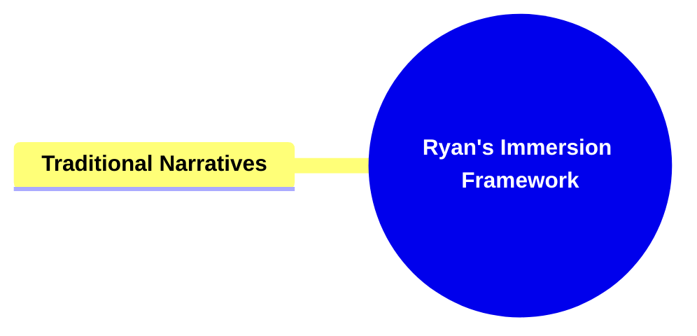

##### 2.2.1. **Components of Traditional Narratives**

---

###### 2.2.1.1. **Imaginative Immersion**:

**Definition**: Imaginative immersion is the process in traditional narratives where readers use their imagination to create vivid mental images, emotions, and sensory experiences. Through language, the narrative evokes a personal, interpretive engagement that differs uniquely for each reader, fostering a deep connection to the story.

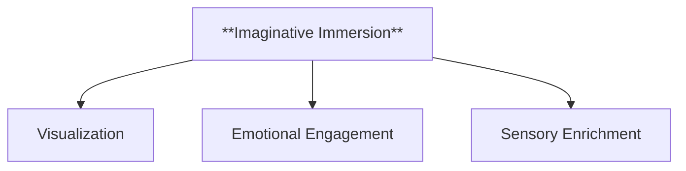

**Characteristics**

- **Visualization**: Readers mentally create images of characters, settings, and events, which helps them feel present within the story world.
- **Emotional Engagement**: Imaginative immersion allows readers to empathize with characters and feel emotional responses to events, enhancing their connection to the narrative.
- **Sensory Enrichment**: Through descriptive language, readers mentally experience sensations such as sounds, smells, and textures, enriching the immersive quality of the story.

---

###### 2.2.1.2. **Narrative Techniques**:

**Definition**: Narrative techniques are stylistic methods used by authors in traditional narratives to create immersion and engagement. These techniques leverage descriptive language, emotional depth, and pacing to guide the reader’s imagination and emotional response, enhancing the narrative experience.

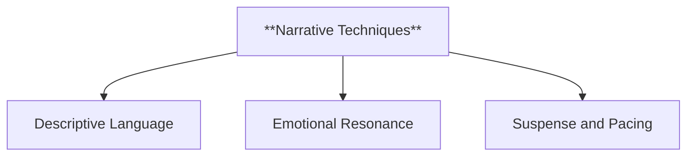

**Characteristics**

- **Descriptive Language**: Detailed descriptions help readers visualize the story’s world.
- **Emotional Resonance**: Relatable characters and emotional depth foster a connection between reader and narrative.
- **Suspense and Pacing**: Gradual unfolding of events keeps readers engaged.

---

###### 2.2.1.3. **Reader's Role**:

**Definition**: In traditional narratives, the reader's role is to actively engage by using their imagination to construct the narrative world, draw inferences, and emotionally invest in the story. This active participation means each reader’s experience is unique, influenced by their personal and cultural contexts.

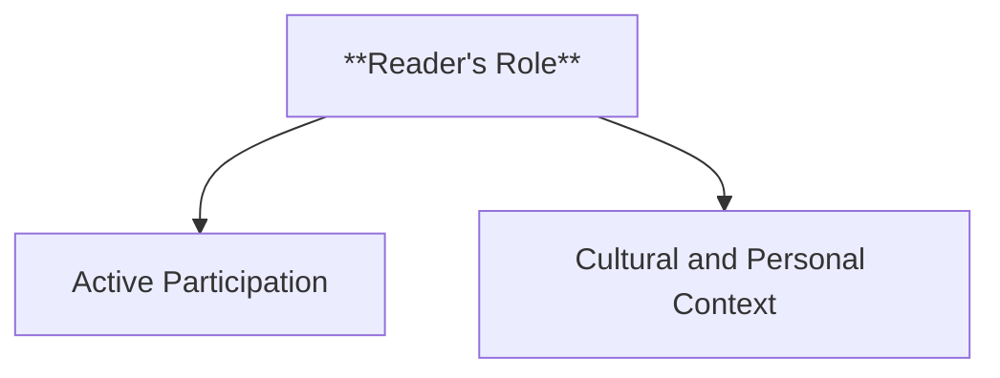

**Characteristics**

- **Active Participation**: Readers mentally construct the narrative world, infer meaning, and invest emotionally.
- **Cultural and Personal Context**: Personal experiences shape how readers interpret the narrative.

---

###### 2.2.1.4. **Challenges**

**Definition**: Challenges in traditional narratives refer to factors that can impact the reader’s immersion, including the variability in individual interpretation and the mental effort required. These challenges may either enhance or diminish the reader's experience, depending on personal ability and preference.

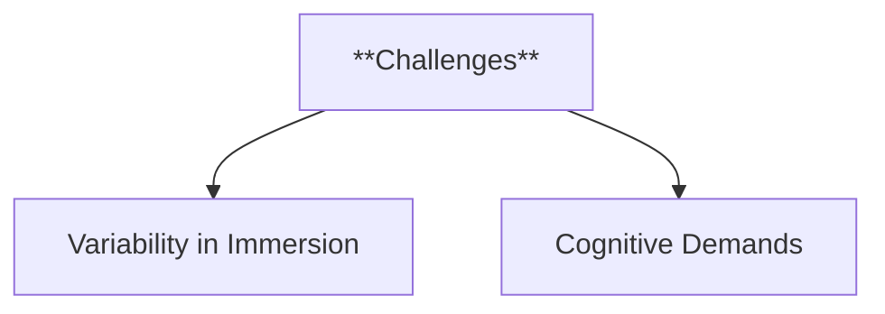

**Characteristics**

- **Variability in Immersion**: Immersion varies between readers based on their ability to visualize or relate to the narrative.
- **Cognitive Demands**: Traditional narratives require cognitive effort, which can either enhance or hinder immersion.

---

###### 2.2.1.5. **Limitations**

**Definition**: Constraints that may reduce engagement or accessibility, such as cognitive load and structural limits.

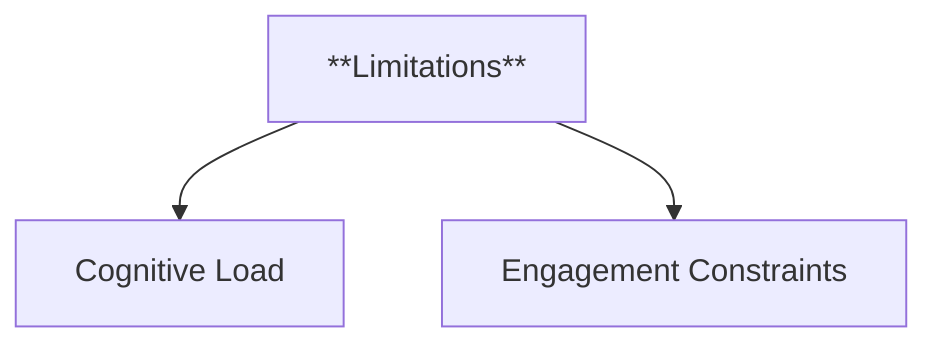

**Characteristics**

- **Cognitive Load**: Traditional narratives can overwhelm some readers, detracting from their ability to engage with the material.
- **Engagement Constraints**: Certain narrative structures may limit the depth of engagement for different readers.

---

#### 2.3. Digital Narratives

**Definition**:
Digital narratives are interactive and multimedia-driven forms of storytelling found in platforms such as video games, virtual reality, and online storytelling environments. They integrate sensory engagement, interactivity, and branching pathways, allowing audiences to actively shape their experience within the fictional world.

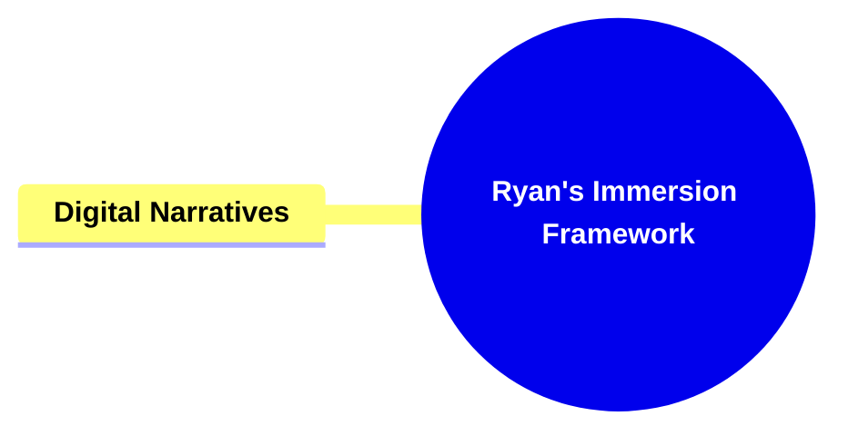

##### 2.3.1. **Components of Digital Narratives**

###### 2.3.1.1. **Sensory Engagement**

- **Definition**: Digital narratives, like those found in video games, engage multiple senses. Visual and auditory stimuli create more immediate immersion, allowing users to explore fully realized environments.
- **Characteristics**
  - **Multi-Sensory Experience**: Integrates visuals and audio to create a cohesive and immersive narrative environment.
  - **Immediate Engagement**: Captures user attention quickly through dynamic sensory input, fostering deeper involvement in the story.
  - **Enhanced Realism**: Utilizes sensory details to simulate a believable world that feels more tangible and interactive.

###### 2.3.1.2. **Visual Realism**

- **Definition**: High-quality graphics enhance the realism of the narrative world.
- **Characteristics**
  - **Detailed Environments**: Provides intricate visual details that make the setting more lifelike.
  - **Character Lifelikeness**: Realistic graphics contribute to relatable and expressive characters.
  - **Immersive Worldbuilding**: Creates a believable atmosphere where users feel fully immersed in the narrative space.

###### 2.3.1.3. **Sound Design**

- **Definition**: Audio effects and dynamic soundscapes enhance immersion.
- **Characteristics**
  - **Atmospheric Audio**: Background sounds and music set the mood, enhancing the narrative's tone.
  - **Interactive Sound Cues**: Audio reacts to player actions, deepening the sense of agency.
  - **Spatial Awareness**: Surround sound effects contribute to the realism of the environment and user orientation.

###### 2.3.1.4. **Interactivity**

- **Definition**: Users interact with the narrative, influencing its progression and outcomes.
- **Characteristics**
  - **Player Agency**: Users make choices that shape the narrative and character development.
  - **Adaptive Storylines**: The plot changes based on user decisions, leading to unique experiences.
  - **Active Participation**: Engages users by allowing them to contribute to the unfolding story through their actions.

###### 2.3.1.5. **Immersive Techniques**

- **Definition**: Methods employed to deepen user engagement within the digital narrative.
- **Characteristics**
  - **First-Person Perspective**: Enhances immersion by placing users directly in the protagonist's viewpoint.
  - **Exploratory Learning**: Environmental storytelling allows users to piece together the narrative through in-game exploration.
  - **Narrative Discovery**: Objects, clues, and settings convey parts of the story organically, without direct exposition.

---

#### 2.4. Virtual Narratives

**Definition**:
Virtual narratives are immersive storytelling experiences that use virtual reality (VR) or augmented reality (AR) technologies to create a fully interactive, sensory environment. These narratives provide users with a sense of "being" within the story, where they can explore and interact with the virtual world as if physically present, often making real-time choices that influence the outcome.

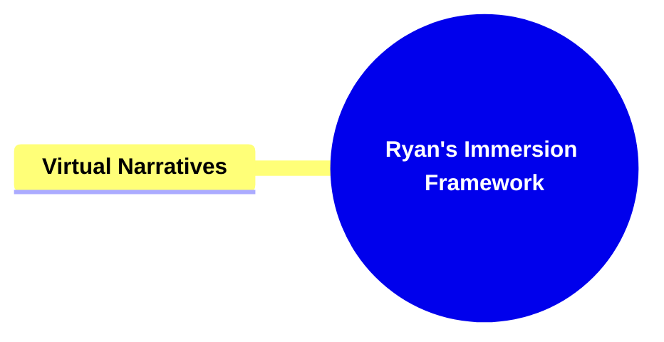

##### 2.4.1. **Components of Virtual Narratives**

###### 2.4.1.1. **Sensory Engagement**

- **Definition**: Virtual narratives, particularly in virtual reality (VR), elevate sensory engagement to a new level by providing an immersive, 360-degree environment that users can physically navigate and explore.

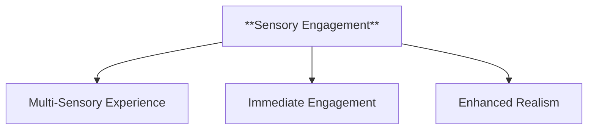

- **Characteristics**
  - **Total Immersion**: Offers users a complete sensory experience that mimics reality, deepening engagement.
  - **Multi-Sensory Stimulation**: Engages sight, sound, and sometimes touch to create a comprehensive narrative environment.
  - **Heightened Presence**: Allows users to feel as if they are inside the story, enhancing emotional and cognitive connections.

###### 2.4.1.2. **Immersive Environment**

- **Definition**: VR offers a fully immersive environment that places users directly inside the narrative world.

- **Characteristics**
  - **360-Degree View**: Users can look around and interact with the world in all directions, enhancing realism.
  - **Interactive Elements**: Users engage with objects and characters as if they were physically present.
  - **Dynamic Surroundings**: The virtual world reacts to user movement and decisions, reinforcing immersion.

###### 2.4.1.3. **Tactile Feedback**

- **Definition**: Advanced VR systems provide tactile or haptic feedback, enhancing the sense of presence and interaction within the narrative.

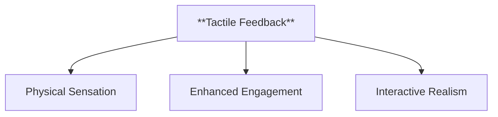

- **Characteristics**
  - **Physical Sensation**: Simulates touch or pressure, making interactions with the environment more realistic.
  - **Enhanced Engagement**: Increases user involvement by adding a sensory dimension beyond visuals and audio.
  - **Interactive Realism**: Reinforces the user’s belief in the reality of the narrative space through touch.

###### 2.4.1.4. **Interactivity**

- **Definition**: Users interact with the VR narrative, influencing the environment and outcomes in real time.

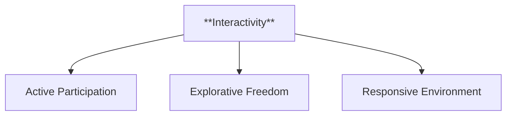

- **Characteristics**
  - **Active Participation**: Users’ actions and decisions directly affect the story, fostering a sense of agency.
  - **Explorative Freedom**: Allows users to navigate and discover elements within the narrative world at their own pace.
  - **Responsive Environment**: The narrative world changes and reacts based on user behavior, enhancing immersion.

###### 2.4.1.5. **Immersive Techniques**

- **Definition**: Methods used to create a fully immersive VR experience that responds to user input.

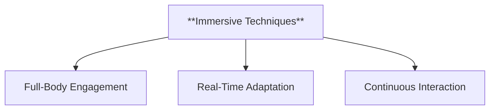

- **Characteristics**
  - **Full-Body Engagement**: Utilizes body tracking to mirror user movements, making interactions feel authentic.
  - **Real-Time Adaptation**: The story evolves based on user decisions, creating a personalized narrative.
  - **Continuous Interaction**: Encourages users to remain engaged by requiring ongoing interaction with the environment.

---

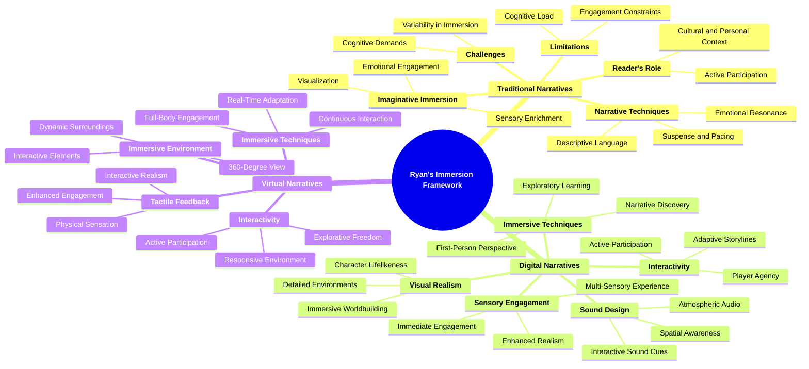

---

### 3. Implications of Immersion Framework

**Key Insight or Implication**:
Ryan’s work on immersion provides a comprehensive framework for analyzing how different media engage audiences. Her distinction between traditional, digital, and virtual narratives underscores the diverse methods through which stories capture our imagination.

**Collaborative or Future-Oriented Insight**:
By exploring the mechanics of immersion, Ryan offers insights into the future of storytelling in an increasingly digital and interactive world, highlighting the potential of interactive and immersive narratives to transform the audience's experience.

---
