- [1. **Title: Chatman's Narrative Communication Model**](#1-title-chatmans-narrative-communication-model)
- [2. **Key Concepts**](#2-key-concepts)
  - [2.1. **Real Author**](#21-real-author)
    - [2.1.1. **Components of Real Author**](#211-components-of-real-author)
      - [2.1.1.1. **Personal Identity**](#2111-personal-identity)
      - [2.1.1.2. **Intentionality**](#2112-intentionality)
      - [2.1.1.3. **Distinct from Implied Author**](#2113-distinct-from-implied-author)
  - [2.2. **Implied Author**](#22-implied-author)
    - [2.2.1. **Components of Implied Author**](#221-components-of-implied-author)
      - [2.2.1.1. **Constructed Persona**](#2211-constructed-persona)
      - [2.2.1.2. **Ethical and Stylistic Guide**](#2212-ethical-and-stylistic-guide)
      - [2.2.1.3. **Tone**](#2213-tone)
      - [2.2.1.4. **Style**](#2214-style)
  - [2.3. **Narrator**](#23-narrator)
    - [2.3.1. **Components of Narrator**](#231-components-of-narrator)
      - [2.3.1.1. **First-Person Narrator**](#2311-first-person-narrator)
      - [2.3.1.2. **Third-Person Narrator**](#2312-third-person-narrator)
  - [2.4. **Narratee**](#24-narratee)
    - [2.4.1. **Components of Narratee**](#241-components-of-narratee)
      - [2.4.1.1. **Internal Audience**](#2411-internal-audience)
      - 
      - [2.4.1.3. **Varied Presence**](#2413-varied-presence)
  - [2.5. **Implied Reader**](#25-implied-reader)
    - [2.5.1. **Components of Implied Reader**](#251-components-of-implied-reader)
      - [2.5.1.1. **Idealized Audience**](#2511-idealized-audience)
      - [2.5.1.2. **Guided Engagement**](#2512-guided-engagement)
      - [2.5.1.3. **Narrative Alignment**](#2513-narrative-alignment)
  - [2.6. **Real Reader**](#26-real-reader)
    - [2.6.1. **Components of Real Reader**](#261-components-of-real-reader)
      - [2.6.1.1. **Personal Background**](#2611-personal-background)
      - [2.6.1.2. **Diverse Interpretations**](#2612-diverse-interpretations)
      - [2.6.1.3. **Active Engagement**](#2613-active-engagement)
- [3. Implications of **Narrative Communication**](#3-implications-of-narrative-communication)

---
### 1. **Title: Chatman's Narrative Communication Model**

**Narrative Communication**:
   **Definition**: Seymour Chatman’s *Narrative Communication Model* provides a comprehensive framework for understanding the intricate relationships between the various agents involved in both the creation and reception of a narrative. This model identifies key participants in the narrative process, including the *real author*, *implied author*, *narrator*, *narratee*, *implied reader*, and *real reader*. Chatman’s model emphasizes that narrative communication is a complex, layered process in which each agent plays a distinct role in shaping the narrative and its interpretation.

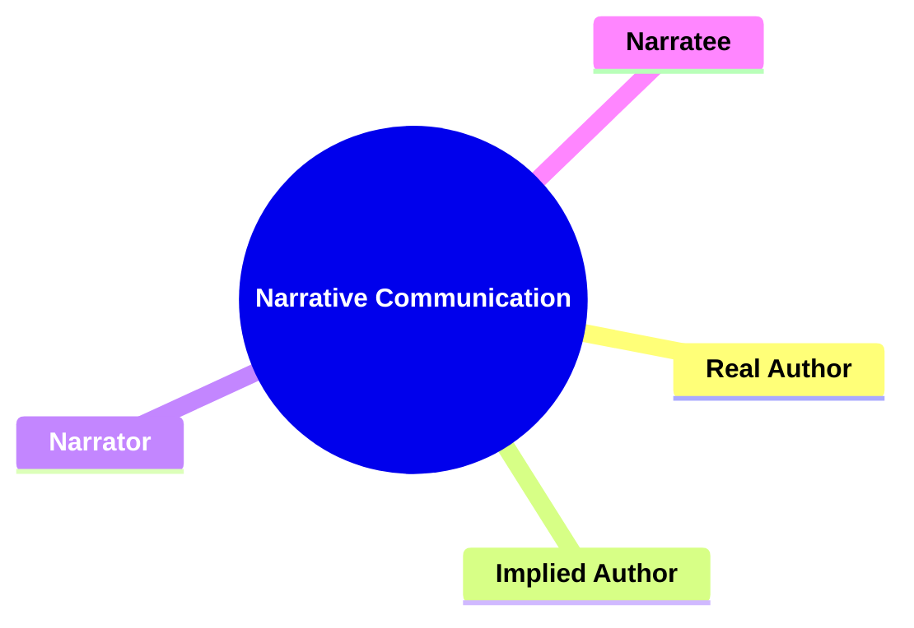

---

### 2. **Key Concepts**

#### 2.1. **Real Author**

**Definition**:
   The *real author* is the actual, living person who creates the narrative, writing the text with their own intentions, beliefs, and experiences.

##### 2.1.1. **Components of Real Author**

###### 2.1.1.1. **Personal Identity**
- **Definition**: The real author exists outside the text, and their personal life may influence their work, but they are not directly accessible through the narrative.

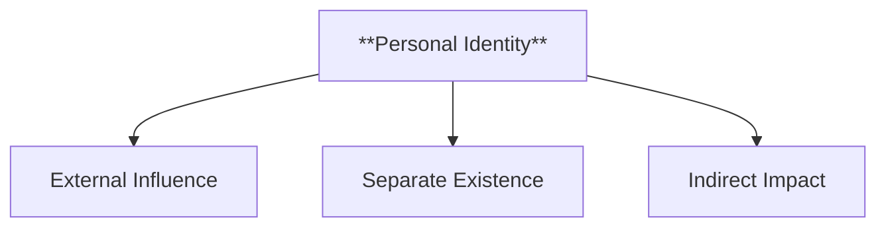

  - **Characteristics**
    - **External Influence**: The author’s experiences, beliefs, and background can shape the themes and content of their work.
    - **Separate Existence**: The real author is distinct from the narrative itself and cannot be fully understood through the text alone.
    - **Indirect Impact**: Personal identity may be inferred through recurring themes or stylistic choices that reflect the author’s worldview.

###### 2.1.1.2. **Intentionality**
- **Definition**: The real author’s personal goals, beliefs, and circumstances may shape the themes and content of the narrative.

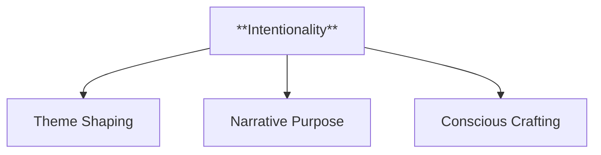

  - **Characteristics**
    - **Theme Shaping**: The author’s intentions influence the message and moral direction of the story.
    - **Narrative Purpose**: The plot and character arcs are often designed to reflect the author’s personal objectives or beliefs.
    - **Conscious Crafting**: Indicates that certain elements in the narrative were intentionally included to convey specific ideas or provoke reactions.

###### 2.1.1.3. **Distinct from Implied Author**
- **Definition**: While the real author creates the narrative, the implied author represents the version of the author constructed by the reader.

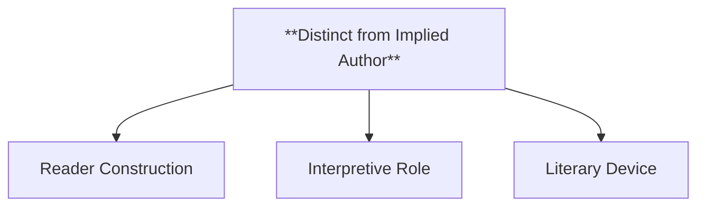

  - **Characteristics**
    - **Reader Construction**: The implied author is formed based on the narrative’s voice, style, and tone, separate from the actual author.
    - **Interpretive Role**: Acts as a bridge between the text and reader, guiding how the story’s values are perceived.
    - **Literary Device**: Functions as a narrative element, representing an idealized version of the author embedded within the story.

---

#### 2.2. **Implied Author**

**Definition**:
   The *implied author* is the abstract version of the author that the reader infers from the narrative. It is a persona that embodies the values, tone, and style suggested by the text.

##### 2.2.1. **Components of Implied Author**

###### 2.2.1.1. **Constructed Persona**
- **Definition**: The implied author is not the real author but a narrative construct inferred by the reader.

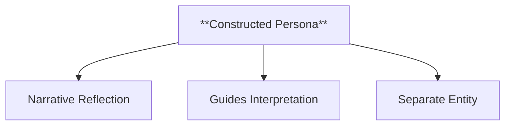

  - **Characteristics**
    - **Narrative Reflection**: Embodies the voice, style, and values conveyed through the text.
    - **Guides Interpretation**: Helps the reader understand the ethical stance and underlying themes of the story.
    - **Separate Entity**: Exists only within the context of the narrative, distinct from the real-life author’s identity.

###### 2.2.1.2. **Ethical and Stylistic Guide**
- **Definition**: The implied author represents the values and attitudes that guide the narrative, helping to convey its thematic concerns.

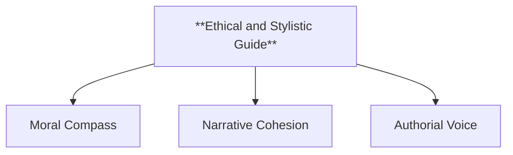

  - **Characteristics**
    - **Moral Compass**: Reflects the ethical position embedded in the story, subtly directing reader interpretations.
    - **Narrative Cohesion**: Ensures consistency in the story’s tone and moral implications, providing a unified perspective.
    - **Authorial Voice**: Shapes how the text is perceived, reinforcing the narrative’s themes and values through stylistic choices.

###### 2.2.1.3. **Tone**
- **Definition**: The implied author sets the tone, influencing how readers emotionally engage with the narrative and interpret its underlying themes.

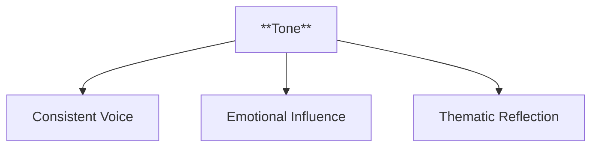

  - **Characteristics**
    - **Consistent Voice**: Maintains a uniform tone that sets the mood and evokes specific emotions throughout the story.
    - **Emotional Influence**: Guides the reader’s emotional response to events, characters, and themes, shaping their connection to the narrative.
    - **Thematic Reflection**: Aligns with the story’s message, ensuring that the tone supports and reinforces the overall theme.

###### 2.2.1.4. **Style**
- **Definition**: The implied author’s choice of language, structure, and pacing creates a unique style that shapes the reader’s experience.

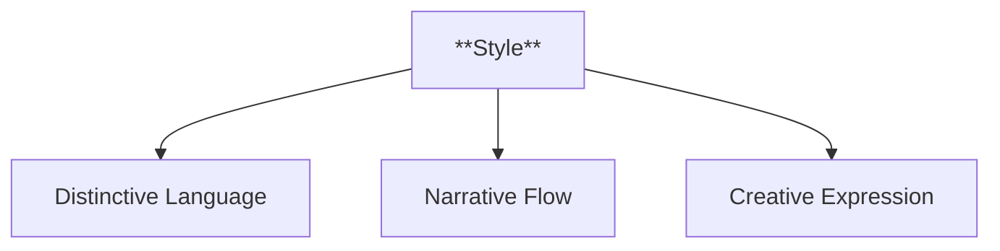

  - **Characteristics**
    - **Distinctive Language**: Utilizes specific word choices, sentence structures, and literary devices to create a recognizable narrative style.
    - **Narrative Flow**: Controls the pacing and rhythm of the story, influencing how quickly or slowly the narrative unfolds.
    - **Creative Expression**: Demonstrates the author’s voice through artistic elements, such as metaphors, similes, and symbolism, adding depth to the narrative.

---

#### 2.3. **Narrator**

**Definition**:
   The *narrator* is the voice or entity within the text that tells the story, presenting the events and guiding the reader’s understanding of the narrative.

##### 2.3.1. **Components of Narrator**

###### 2.3.1.1. **First-Person Narrator**
- **Definition**: A character within the story recounting personal experiences.

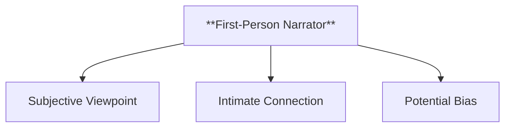

  - **Characteristics**
    - **Subjective Viewpoint**: Offers a limited, personal perspective that reveals the narrator’s thoughts and feelings.
    - **Intimate Connection**: Creates a closer relationship between the narrator and the reader, fostering empathy and engagement.
    - **Potential Bias**: The narrator’s account may be unreliable or skewed by personal biases and limited knowledge.

###### 2.3.1.2. **Third-Person Narrator**
- **Definition**: An external voice providing a more detached or omniscient perspective.

  - **Characteristics**
    - **Broader Scope**: Can offer insights into multiple characters’ thoughts and a wider view of events.
    - **Objective Stance**: Often presents events with less bias, allowing readers to form their own opinions.
    - **Flexible Perspective**: Can shift between an omniscient view and limited focus on specific characters.

---

#### 2.4. **Narratee**

**Definition**:
   The *narratee* is the imagined audience within the text to whom the narrator addresses the story. This entity may be explicitly mentioned or implied by the tone and style of the narration.

##### 2.4.1. **Components of Narratee**

###### 2.4.1.1. **Internal Audience**
- **Definition**: The narratee exists within the narrative structure and shapes the way the narrator tells the story.

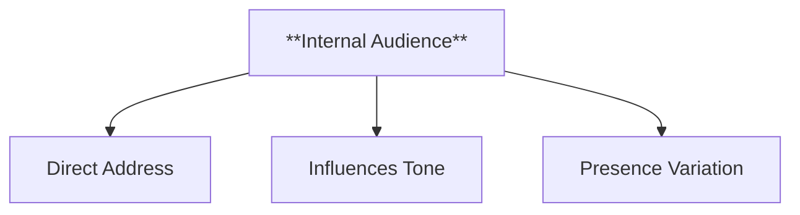

  - **Characteristics**
    - **Direct Address**: The narrator may speak directly to the narratee, influencing how information is conveyed.
    - **Influences Tone**: The perceived relationship between narrator and narratee affects the tone, whether formal, intimate, or conversational.
    - **Presence Variation**: The narratee may be explicitly referenced or implied through the narrative’s style and delivery.

######

 2.4.1.2. **Influences Narrative Tone**
- **Definition**: The relationship between narrator and narratee affects how much information is revealed and the tone of the narration.

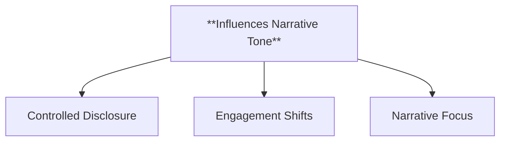

  - **Characteristics**
    - **Controlled Disclosure**: The narrator may adjust the level of detail or emotional tone based on the intended audience within the story.
    - **Engagement Shifts**: Tone may become more personal or detached depending on the relationship between the narrator and the narratee.
    - **Narrative Focus**: Determines which aspects of the story are emphasized or downplayed, shaping the reader’s perception.

###### 2.4.1.3. **Varied Presence**
- **Definition**: The narratee may be directly addressed, or implied based on how the story is told (e.g., formal, conversational, etc.).

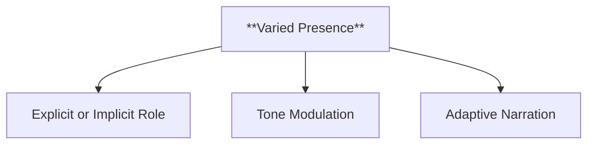

  - **Characteristics**
    - **Explicit or Implicit Role**: The narratee can be a defined character or remain an unseen audience inferred by the narrative.
    - **Tone Modulation**: Changes in the narratee’s presence can alter the delivery, making it feel more direct or general.
    - **Adaptive Narration**: The story adapts its presentation style depending on the narratee’s assumed characteristics and role.

---

---

#### 2.5. **Implied Reader**

**Definition**:
   The *implied reader* is the hypothetical, ideal reader that the narrative seems to be addressing. This reader is constructed by the text and represents the audience anticipated by the narrative’s structure and style.

##### 2.5.1. **Components of Implied Reader**

###### 2.5.1.1. **Idealized Audience**
- **Definition**: The implied reader is assumed to understand the narrative’s nuances, themes, and values.

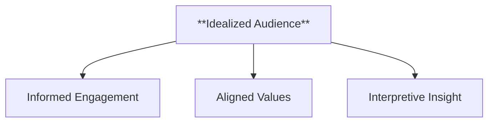

  - **Characteristics**
    - **Informed Engagement**: Expected to pick up on subtle themes, symbolism, and literary techniques.
    - **Aligned Values**: Shares an understanding with the narrative, aligning with its moral and thematic stance.
    - **Interpretive Insight**: Interprets the story as intended, grasping the deeper meanings and implications.

###### 2.5.1.2. **Guided Engagement**
- **Definition**: The narrative anticipates a specific type of reader response, aiming to guide the implied reader toward particular interpretations or emotional reactions.

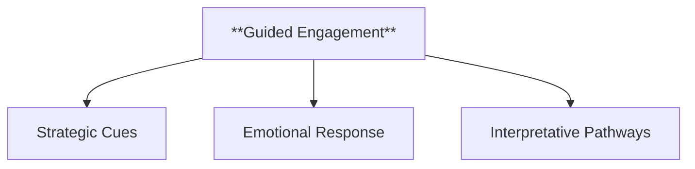

  - **Characteristics**
    - **Strategic Cues**: Uses narrative techniques that direct the implied reader’s responses and interpretations.
    - **Emotional Response**: Designed to evoke particular feelings, shaping how the story is experienced.
    - **Interpretative Pathways**: Provides enough context and cues for readers to follow the narrative’s intended analysis or viewpoint.

###### 2.5.1.3. **Narrative Alignment**
- **Definition**: The implied reader’s values and expectations align with the narrative’s intended message and ethical stance.

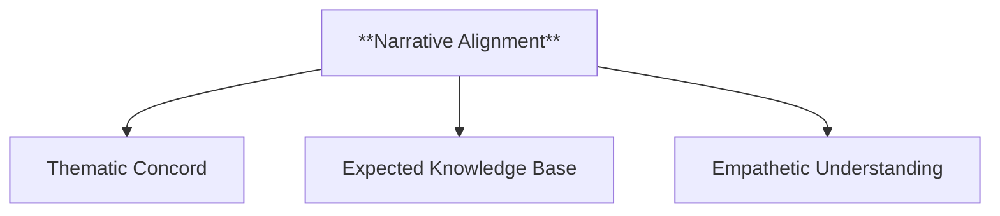

  - **Characteristics**
    - **Thematic Concord**: Engages with the story in a way that aligns with its underlying moral and thematic elements.
    - **Expected Knowledge Base**: Assumes familiarity with cultural references, themes, or language used in the story.
    - **Empathetic Understanding**: Connects with the characters and plot in a manner that reflects the story’s intended impact.

---

#### 2.6. **Real Reader**

**Definition**:
   The *real reader* is the actual person who reads the text, bringing their own experiences, interpretations, and responses to the narrative.

##### 2.6.1. **Components of Real Reader**   

###### 2.6.1.1. **Personal Background**
- **Definition**: The real reader’s unique background influences how they engage with and interpret the text.

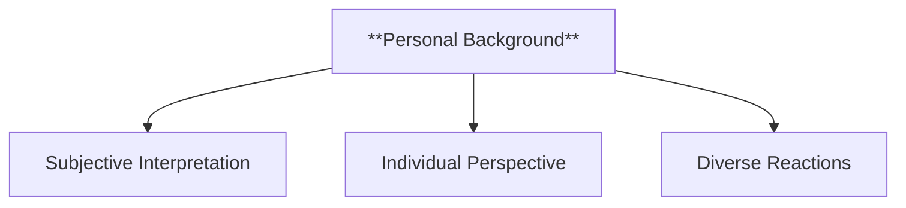

  - **Characteristics**
    - **Subjective Interpretation**: Brings personal experiences and beliefs that shape their understanding and reactions to the story.
    - **Individual Perspective**: Influences how themes and characters are perceived, potentially differing from the implied reader’s viewpoint.
    - **Diverse Reactions**: Creates varied responses to the same text, as each real reader brings their own lens to the narrative.

###### 2.6.1.2. **Diverse Interpretations**
- **Definition**: Unlike the implied reader, the real reader may interpret the text in ways that diverge from the narrative’s expectations.

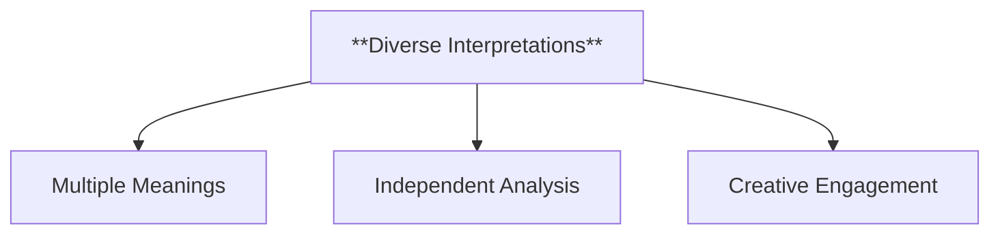

  - **Characteristics**
    - **Multiple Meanings**: Extracts different meanings based on personal context, culture, and background.
    - **Independent Analysis**: May draw conclusions that challenge or expand on the intended reading, offering unique insights.
    - **Creative Engagement**: Engages with the story beyond its intended boundaries, exploring alternative interpretations.

###### 2.6.1.3. **Active Engagement**
- **Definition**: The real reader plays an active role in shaping their understanding of the narrative, which may differ from the intended or implied reading.

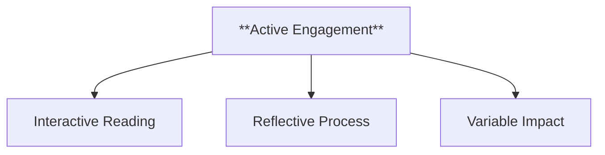

  - **Characteristics**
    - **Interactive Reading**: Actively questions, interprets, and analyzes the text, making the reading experience dynamic and personal.
    - **Reflective Process**: Considers personal values, emotions, and thoughts when processing the narrative, adding a subjective layer to interpretation.
    - **Variable Impact**: Experiences the text in a unique way that may shift over time as new insights and experiences influence their perception.

---

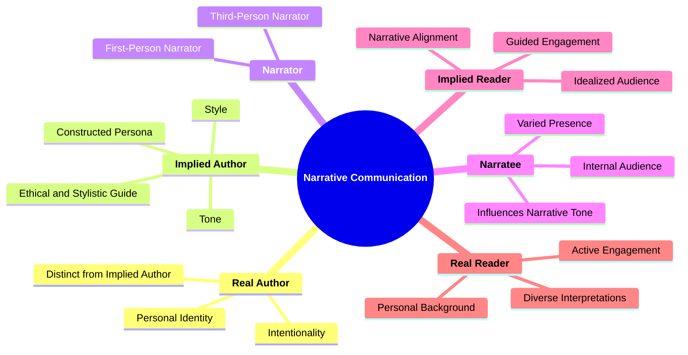
---

### 3. Implications of **Narrative Communication**

**Impact on Narrative Theory**:
   Chatman’s *Narrative Communication Model* has had a profound impact on narrative theory, providing a structured approach to understanding how narratives are constructed and received. By defining the roles of the real author, implied author, narrator, narratee, implied reader, and real reader, Chatman allows for a more precise analysis of how meaning is conveyed and interpreted in storytelling.

**Application Across Media**:
   Chatman’s concepts are applicable across various media, including film, theater, and digital narratives. In these formats, understanding the distinctions between authorial roles and reader/viewer responses enhances insight into how narratives are constructed and consumed.

---
