- [1. Title: **Forster's Pattern and Rhythm Framework**](#1-title-forsters-pattern-and-rhythm-framework)
- [2. Key Concepts](#2-key-concepts)
  - [2.1. Pattern](#21-pattern)
    - [2.1.1. **Components of Pattern**](#211-components-of-pattern)
  - [2.2. Rhythm](#22-rhythm)
    - [2.2.1. **Components of Rhythm**](#221-components-of-rhythm)
      - [2.2.1.1. **Repetition**](#2211-repetition)
      - [2.2.1.2. **Pacing**](#2212-pacing)
      - [2.2.1.3. **Rhythmic Imagery**](#2213-rhythmic-imagery)
      - [2.2.1.4. **Thematic Resonance**](#2214-thematic-resonance)
      - [2.2.1.5. **Structural Rhythm**](#2215-structural-rhythm)
      - [2.2.1.6. **Dialogue**](#2216-dialogue)
      - [2.2.1.7. **Voice**](#2217-voice)
- [3. Theoretical Significance](#3-theoretical-significance)
- [4. Conclusion](#4-conclusion)

---
---
---

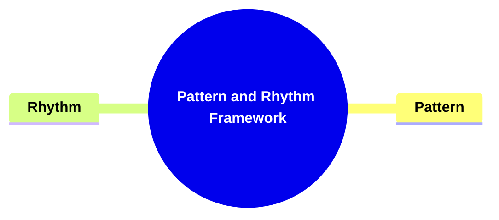
---
### 1. Title: **Forster's Pattern and Rhythm Framework**

**Pattern and Rhythm**:
   **Definition**: E.M. Forster, in his analysis of the novel's form, discusses *pattern* and *rhythm* as essential structural elements that contribute to the overall coherence and aesthetic of a narrative. These elements shape how the story is perceived and experienced, influencing both its structure and emotional resonance.

---

### 2. Key Concepts

#### 2.1. Pattern

**Definition**:
   Pattern refers to the overarching design or structure of a novel. Forster likens pattern to a tapestry, where narrative elements like plot, characters, and themes are intricately woven together to create a coherent and aesthetically pleasing whole. It’s not only the sequence of events but how they are arranged and connected to convey meaning.

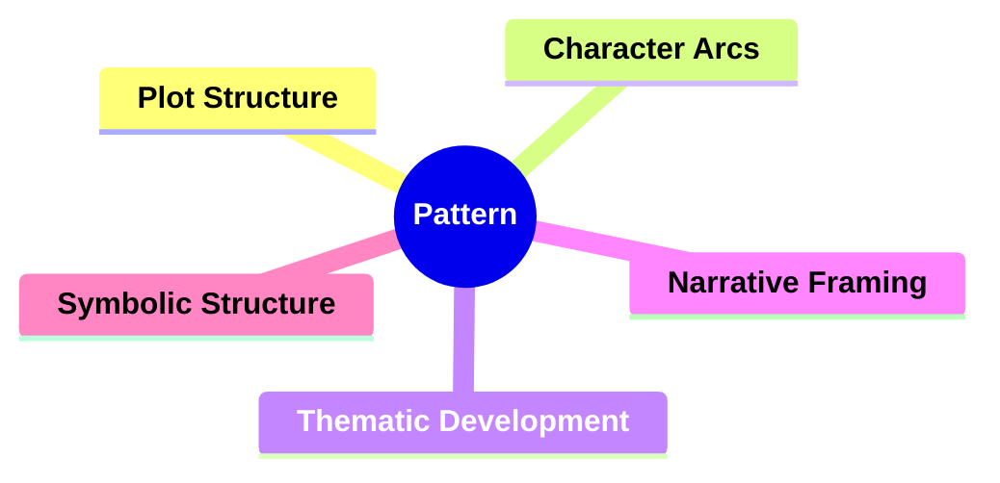
##### 2.1.1. **Components of Pattern**

**Types**:
   - **Plot Structure**: The backbone of the novel’s pattern, determining whether the arrangement of events is linear, non-linear, or cyclical.
   - **Character Arcs**: The development of characters and their transformations throughout the narrative.
   - **Thematic Development**: The evolution of central themes throughout the novel, ensuring that these ideas are introduced, explored, and resolved cohesively.
   - **Narrative Framing**: Structural devices like a story within a story or framing characters that provide a lens for how the novel is perceived.
   - **Symbolic Structure**: Recurring symbols or motifs that carry deeper meaning and contribute to thematic unity and aesthetic coherence.

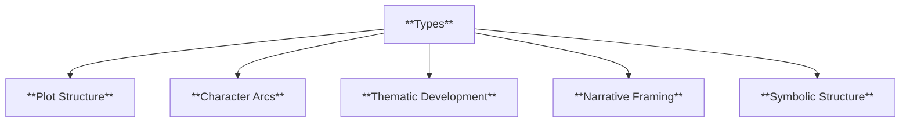

**Characteristics**:
   - **Coherence**: A well-constructed pattern ensures the story’s elements are logically connected, giving the narrative a sense of unity.
   - **Complexity**: A sophisticated pattern may involve multiple storylines, layers of meaning, or intricate character developments that interweave throughout the novel.
   - **Aesthetic Design**: The arrangement of narrative elements is not only functional but also contributes to the beauty and harmony of the novel’s structure.

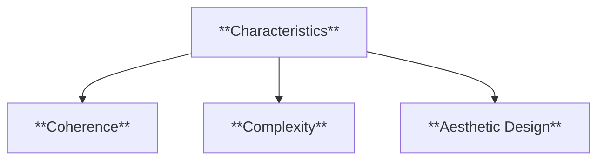

**Contextualization**:
   Pattern is essential for giving structure and cohesion to a novel. It organizes the plot, characters, and themes into a unified design, ensuring that the narrative resonates both structurally and thematically. Forster’s emphasis on pattern reveals how an intentional arrangement of elements creates a more impactful story.

---

#### 2.2. Rhythm

**Definition**:
   Rhythm refers to the recurrence of themes, motifs, or narrative elements that create continuity, flow, and emotional resonance. It functions as the novel’s heartbeat, engaging readers by establishing patterns of repetition and thematic consistency.

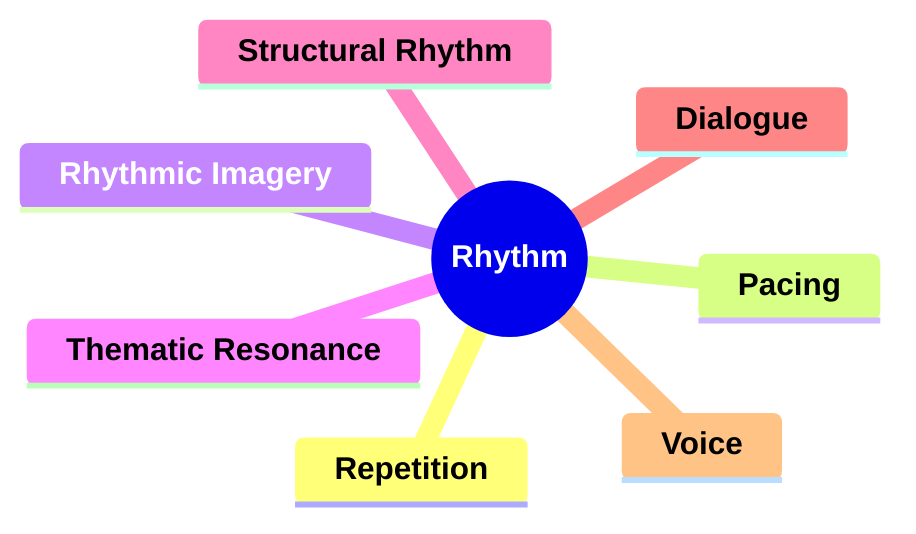

##### 2.2.1. **Components of Rhythm**

###### 2.2.1.1. **Repetition**
  - **Definition**: The recurrence of specific words, phrases, themes, or motifs throughout the narrative, linking different parts of the story.

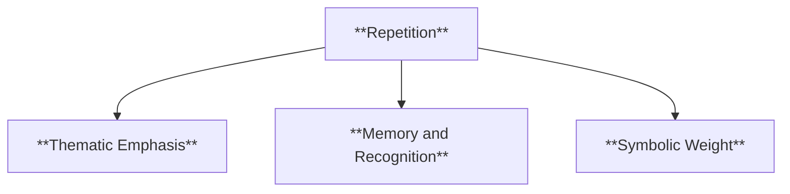

  - **Characteristics**
    - **Thematic Emphasis**: Reinforces key themes by repeating elements that resonate throughout the story.
    - **Memory and Recognition**: Helps readers recall important ideas and creates a sense of continuity.
    - **Symbolic Weight**: Adds layers of meaning as repeated motifs or phrases take on deeper significance with each appearance.

###### 2.2.1.2. **Pacing**
  - **Definition**: The balance between fast-paced action and slower, reflective passages, which contributes to the rhythm of the storytelling.

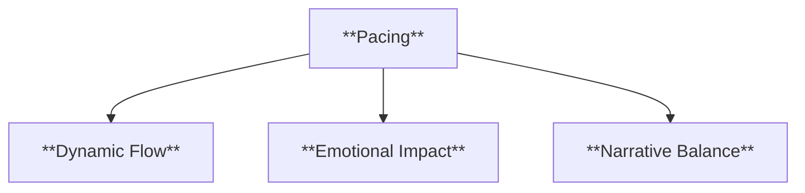

  - **Characteristics**
    - **Dynamic Flow**: Shifts between fast and slow sections to maintain reader interest and reflect the tension of the narrative.
    - **Emotional Impact**: Adjusts pacing to heighten suspense during action scenes or allow for introspection during reflective moments.
    - **Narrative Balance**: Ensures that the story progresses smoothly without feeling rushed or stagnant.

###### 2.2.1.3. **Rhythmic Imagery**
  - **Definition**: Repeated visual or sensory imagery that evokes emotional responses and deepens thematic connections.

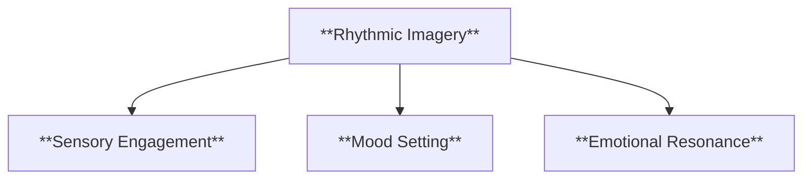

  - **Characteristics**
    - **Sensory Engagement**: Invites readers to experience the story on a deeper level through vivid, recurring imagery.
    - **Mood Setting**: Reinforces the tone and atmosphere by using consistent visual elements that echo the story’s themes.
    - **Emotional Resonance**: Connects readers with the narrative by repeating imagery that triggers specific emotional reactions.

###### 2.2.1.4. **Thematic Resonance**
  - **Definition**: The echoing of central themes throughout the novel, ensuring their continued presence and influence.

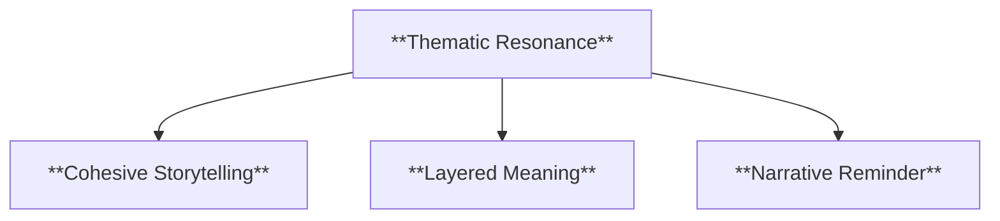

  - **Characteristics**
    - **Cohesive Storytelling**: Maintains a unified narrative by subtly weaving themes into different parts of the story.
    - **Layered Meaning**: Adds depth by revisiting themes in varied contexts, allowing for new interpretations.
    - **Narrative Reminder**: Keeps the reader focused on the core ideas and messages the story seeks to convey.

###### 2.2.1.5. **Structural Rhythm**
  - **Definition**: The repetition of structural elements, such as chapter length or shifts in perspective, to create a consistent narrative rhythm.

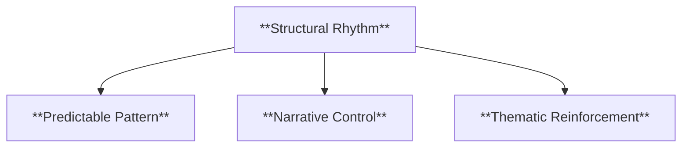

  - **Characteristics**
    - **Predictable Pattern**: Establishes a flow that readers can become familiar with, enhancing the reading experience.
    - **Narrative Control**: Uses consistent structure to manage pacing and transitions between sections or chapters.
    - **Thematic Reinforcement**: Mirrors the content’s themes through the structure, such as alternating viewpoints that emphasize duality or contrast.

###### 2.2.1.6. **Dialogue**
  - **Definition**: The spoken exchanges between characters that contribute to character development, plot progression, and the rhythm of scenes.

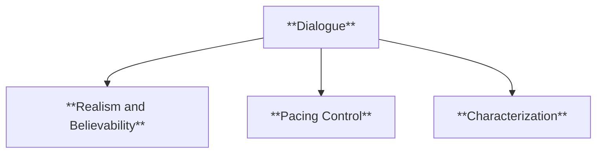

  - **Characteristics**
    - **Realism and Believability**: Reflects how people naturally speak, making characters more relatable and authentic.
    - **Pacing Control**: Speeds up or slows down scenes based on the length and style of the conversation, influencing the story’s tempo.
    - **Characterization**: Reveals personalities, backgrounds, and relationships through the way characters speak and respond to one another.

###### 2.2.1.7. **Voice**
  - **Definition**: The unique style and tone of the narrator or author that shapes how the story is told and how readers perceive it.

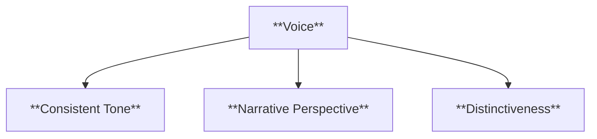

  - **Characteristics**
    - **Consistent Tone**: Maintains a steady voice that aligns with the mood of the story, whether serious, humorous, or reflective.
    - **Narrative Perspective**: Shapes the reader’s understanding by conveying the narrator’s or author’s attitude and personality.
    - **Distinctiveness**: Differentiates the narrative through a unique choice of words, phrases, and storytelling approach, making the writing recognizable and engaging.

---

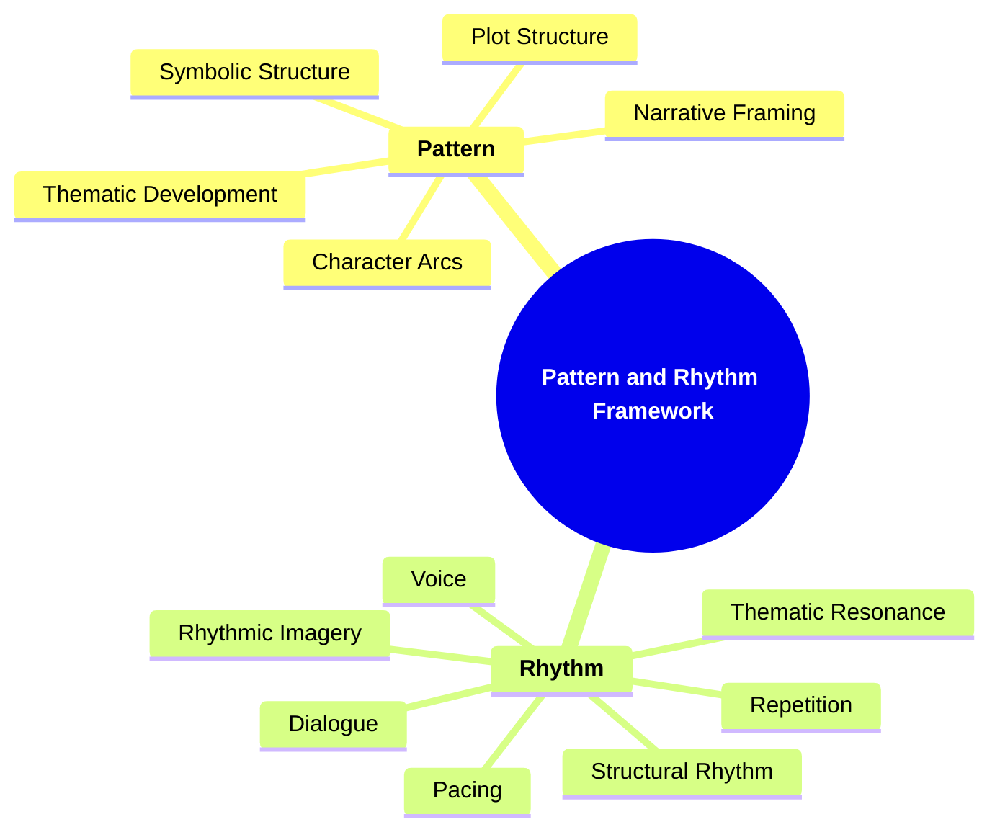
---
---

### 3. Theoretical Significance

**Forster’s Contribution to Literary Theory**:
   - **Structural Analysis**: Forster's ideas on pattern and rhythm offer tools for analyzing how structure shapes meaning and emotional engagement in a novel.
   - **Artistic Unity**: He highlights the importance of integrating narrative elements harmoniously, creating a unified, aesthetically cohesive work.
   - **Influence on Modernism**: Forster’s framework influenced modernist writers who experimented with form, using pattern and rhythm to evoke meaning and emotions in non-traditional ways.

**Application in Narrative Analysis**:
   - **Analyzing Structure**: Forster's framework aids in dissecting complex narrative structures and understanding how pattern and rhythm contribute to thematic and emotional impact.
   - **Reader Engagement**: Both elements—pattern and rhythm—are critical for guiding readers' emotional journeys and keeping them connected to the novel's flow.
   - **Creative Writing**: For writers, understanding pattern and rhythm is essential for crafting narratives that are structurally sound and emotionally resonant, leading to a more immersive reading experience.

---

### 4. Conclusion

**Integrating Pattern and Rhythm**:
   Forster’s framework emphasizes how the integration of pattern and rhythm creates a cohesive and compelling narrative. Pattern provides structural coherence, while rhythm ensures continuity and emotional resonance. Together, they create an aesthetically rich and engaging novel.

**Forster’s Lasting Impact**:
   E.M. Forster’s analysis of pattern and rhythm has left a lasting mark on literary theory, offering a way to understand the structural and emotional underpinnings of a narrative. His ideas continue to resonate in contemporary analysis and creative writing, providing insights into how a well-crafted novel can achieve both structural integrity and emotional depth.

---
