- [1. **Herman's Story Logic Framework**](#1-hermans-story-logic-framework)
- [2. **Key Concepts**](#2-key-concepts)
  - [2.1. **Narrative Coherence**](#21-narrative-coherence)
    - [2.1.1. **Components of Narrative Coherence**](#211-components-of-narrative-coherence)
      - [2.1.1.1. **Causal Relationships**](#2111-causal-relationships)
      - [2.1.1.2. **Thematic Connections**](#2112-thematic-connections)
      - [2.1.1.3. **Narrative Structure**](#2113-narrative-structure)
      - [2.1.1.4. **Character Consistency**](#2114-character-consistency)
      - [2.1.1.5. **Temporal Coherence**](#2115-temporal-coherence)
      - [2.1.1.6. **Spatial Coherence**](#2116-spatial-coherence)
  - [2.2. **Narrative Sense-Making**](#22-narrative-sense-making)
    - [2.2.1. **Components of Narrative Sense-making**](#221-components-of-narrative-sense-making)
      - [2.2.1.1. **Inference-Making**](#2211-inference-making)
      - [2.2.1.2. **Pattern Recognition**](#2212-pattern-recognition)
      - [2.2.1.3. **Expectation**](#2213-expectation)
      - [2.2.1.4. **Anticipation**](#2214-anticipation)
      - [2.2.1.5. **Gap-Filling**](#2215-gap-filling)
      - [2.2.1.6. **Narrative Framing**](#2216-narrative-framing)
- [3. **Conclusion**](#3-conclusion)

---

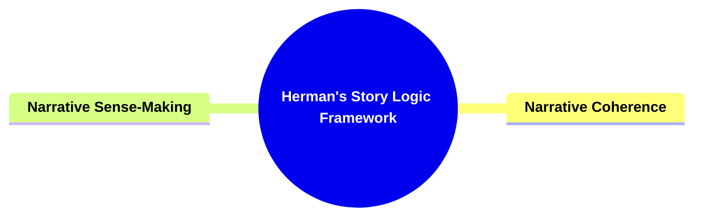

---

### 1. **Herman's Story Logic Framework**

- **Story Logic**:
  - **Definition**: The concept of _story logic_ refers to the underlying principles that govern the organization and coherence of narratives. David Herman examines how stories are structured to create logical connections between events, characters, and settings, facilitating the narrative's intelligibility and impact.

---

### 2. **Key Concepts**

---

#### 2.1. **Narrative Coherence**

- **Definition**:
  - Story logic involves understanding how different elements of a narrative fit together to form a coherent whole. This includes recognizing causal relationships, thematic connections, and the narrative's overall structure.

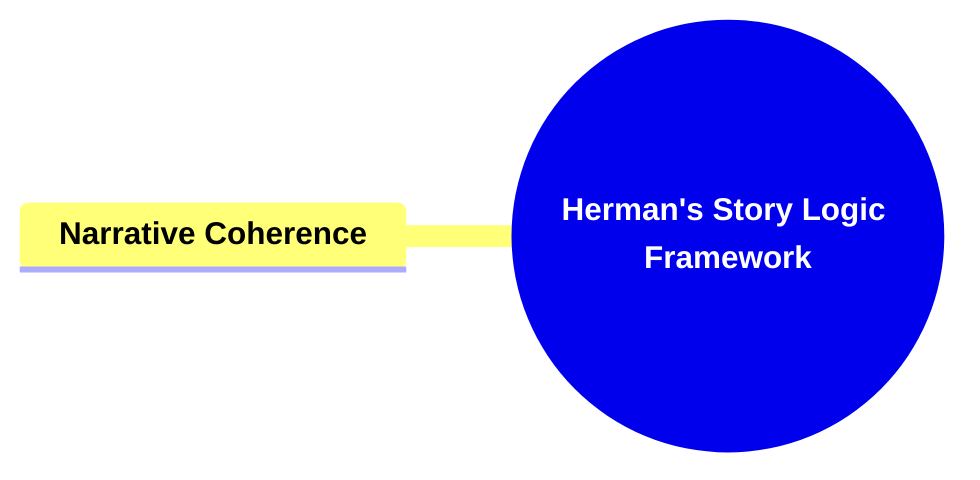

##### 2.1.1. **Components of Narrative Coherence**

###### 2.1.1.1. **Causal Relationships**

- **Definition**:  
  Causal relationships in narratology are the backbone of plot construction, ensuring that events in a story follow a logical cause-and-effect sequence. This coherence allows readers to understand why events happen and how they relate to one another, creating a structured narrative flow that drives the plot forward.

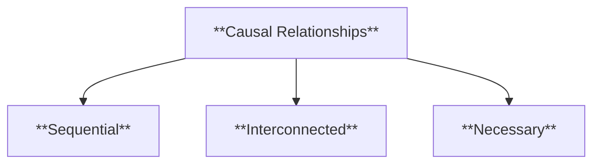

- **Characteristics**:
  - **Sequential**: Events are arranged in an orderly fashion, ensuring each action logically follows the previous one.
  - **Interconnected**: Events influence and are influenced by one another, creating a tightly knit narrative fabric.
  - **Necessary**: Each event serves a purpose in advancing the story, contributing to its coherence and depth.

---

###### 2.1.1.2. **Thematic Connections**

- **Definition**:  
  Thematic connections refer to the recurring ideas, motifs, or messages that unify different parts of a narrative. They provide a deeper layer of meaning, linking plot elements, character arcs, and settings to a central theme.

- **Characteristics**:
  - **Unifying**: Themes act as the connective tissue, bringing coherence to disparate narrative elements.
  - **Recurring**: Ideas or motifs resurface at key moments, reinforcing their importance.
  - **Reinforcing**: Themes amplify the narrative’s core messages, leaving a lasting impression on the audience.

---

###### 2.1.1.3. **Narrative Structure**

- **Definition**:  
  Narrative structure refers to the deliberate organization of events within a story. It encompasses the arrangement of the plot, the pacing, and the overall progression of the narrative, ensuring it is coherent and engaging.

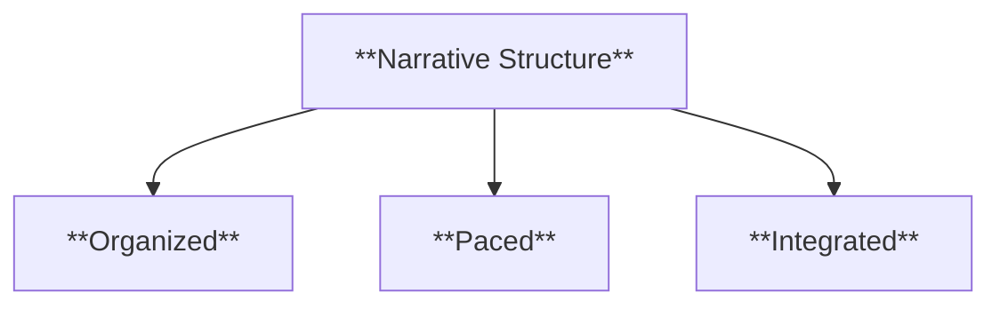

- **Characteristics**:
  - **Organized**: Events are deliberately sequenced to maximize impact and coherence.
  - **Paced**: The rhythm of the narrative is carefully calibrated to sustain interest and tension.
  - **Integrated**: Every element of the structure contributes to the story’s thematic and emotional progression.

---

###### 2.1.1.4. **Character Consistency**

- **Definition**:  
  Character consistency ensures that the actions, decisions, and behaviors of characters align with their established traits, motivations, and roles. It creates believable and relatable characters that resonate with the audience.

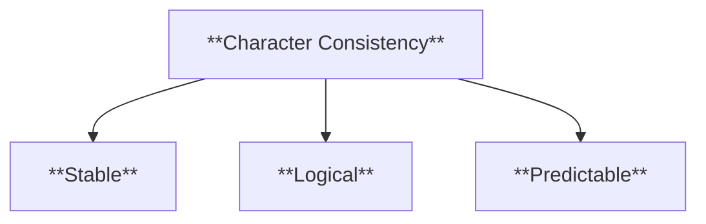

- **Characteristics**:
  - **Stable**: Characters exhibit continuity in their traits and motivations.
  - **Logical**: Actions and decisions are congruent with the character’s established personality and backstory.
  - **Predictable**: While allowing for growth, behaviors align with expectations, aiding comprehension and immersion.

---

###### 2.1.1.5. **Temporal Coherence**

- **Definition**:
  Temporal coherence refers to the clear and logical progression of time within a narrative, ensuring that events occur in a sequence that makes sense within the story’s timeline.

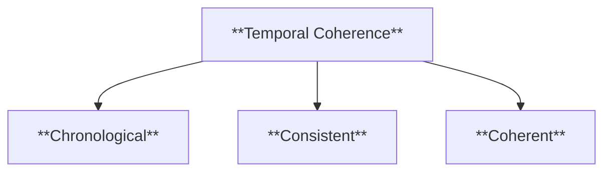

- **Characteristics**:
  - **Chronological**: Events follow a logical temporal order, from cause to effect.
  - **Consistent**: Time shifts are clearly indicated and do not disrupt the narrative’s flow.
  - **Coherent**: Temporal relationships enhance the narrative’s clarity and maintain the audience’s immersion.

---

###### 2.1.1.6. **Spatial Coherence**

- **Definition**:
  Spatial coherence ensures that the narrative’s setting is logically consistent, allowing readers to visualize and understand the story’s spatial relationships. It involves clear descriptions of locations and the logical movement of characters within these spaces.

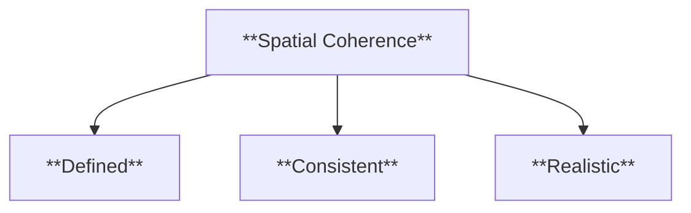

- **Characteristics**:
  - **Defined**: Settings are vividly described and consistently maintained.
  - **Consistent**: Movements and interactions within the space align with logical constraints.
  - **Realistic**: Spatial relationships between characters, objects, and locations make sense within the narrative framework.

---

---

#### 2.2. **Narrative Sense-Making**

- **Definition**:
  - Story logic is not only about the narrative's formal elements but also about how readers use cognitive strategies to make sense of these elements. This involves interpreting the story's coherence, anticipating outcomes, and filling in gaps.

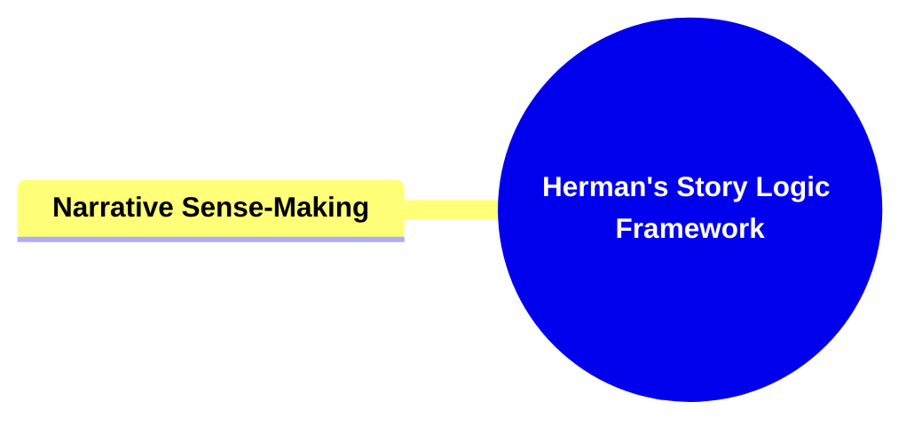

##### 2.2.1. **Components of Narrative Sense-making**

###### 2.2.1.1. **Inference-Making**

- **Definition**:  
  Inference-making involves the reader's active participation in drawing conclusions about the narrative by interpreting implied details, filling in gaps, and connecting events to create a cohesive understanding of the story.

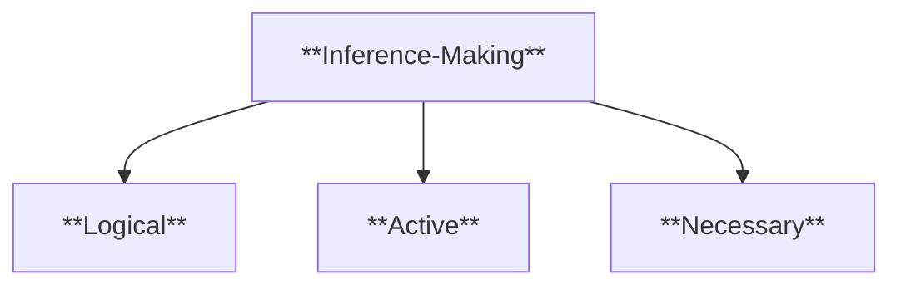

- **Characteristics**:
  - **Logical**: Readers infer connections between events and characters based on textual clues.
  - **Active**: Requires engagement through interpretation and analysis of implicit details.
  - **Necessary**: Encourages inferential thinking to bridge gaps in the narrative.

---

###### 2.2.1.2. **Pattern Recognition**

- **Definition**:  
  Pattern recognition is the process by which readers identify recurring themes, motifs, or narrative structures that contribute to the story's coherence and overall meaning.

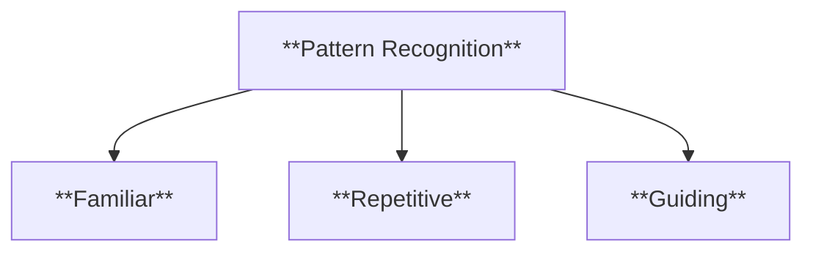

- **Characteristics**:
  - **Familiar**: Patterns aid understanding by creating a sense of predictability and coherence.
  - **Repetitive**: Recurring motifs or structures emphasize key themes and ideas.
  - **Guiding**: Patterns act as a roadmap, helping readers navigate the narrative’s flow.

---

###### 2.2.1.3. **Expectation**

- **Definition**:  
  Expectation refers to the cognitive process where readers form predictions about future narrative developments based on established patterns, foreshadowing, and story logic.

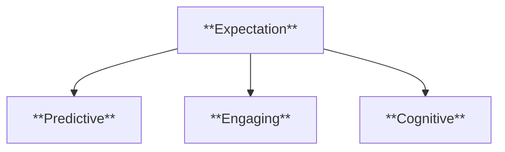

- **Characteristics**:
  - **Predictive**: Readers develop hypotheses about future plot points or character actions.
  - **Engaging**: Keeps readers invested by building anticipation for resolutions.
  - **Cognitive**: Encourages mental preparation for potential narrative developments.

---

###### 2.2.1.4. **Anticipation**

- **Definition**:  
  Anticipation is the emotional and intellectual readiness for upcoming events in the narrative, driven by foreshadowing, thematic cues, or established narrative logic.

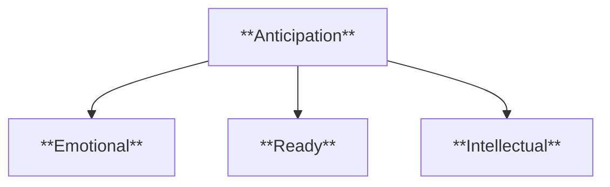

- **Characteristics**:
  - **Emotional**: Readers experience heightened excitement or suspense about upcoming events.
  - **Ready**: Readers mentally prepare for expected developments in the plot.
  - **Intellectual**: Encourages prediction and analysis based on narrative clues.

---

###### 2.2.1.5. **Gap-Filling**

- **Definition**:  
  Gap-filling is the process by which readers use their imagination, prior knowledge, and contextual clues to bridge missing information in the narrative, ensuring coherence and continuity.

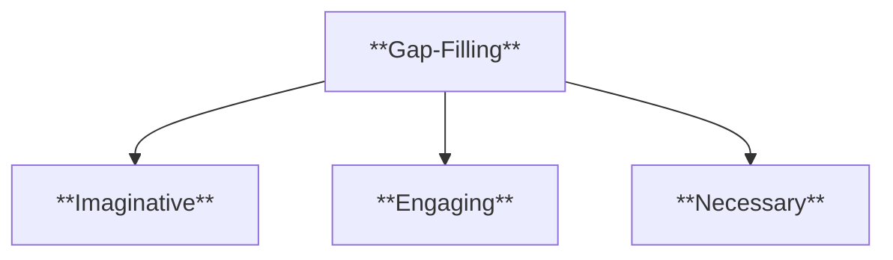

- **Characteristics**:
  - **Imaginative**: Readers rely on context and creativity to complete the story.
  - **Engaging**: Missing details prompt active involvement and interpretation.
  - **Necessary**: Ensures narrative flow by bridging gaps in the text.

---

###### 2.2.1.6. **Narrative Framing**

- **Definition**:  
  Narrative framing refers to the mental schemas readers use to organize and interpret story elements, influenced by cultural, social, and personal contexts.

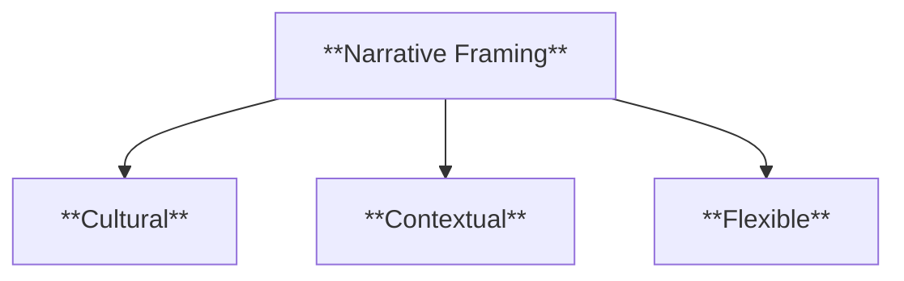

- **Characteristics**:
  - **Cultural**: Relies on readers’ cultural and social knowledge to interpret story elements.
  - **Contextual**: Frames help readers navigate and understand characters and themes.
  - **Flexible**: Readers adapt their framing based on evolving narrative developments.

---

### 3. **Conclusion**

- **Herman’s Contribution to Narrative Theory**:
  - David Herman's _story logic_ framework offers a comprehensive approach to understanding how narratives achieve coherence and how readers cognitively engage with them. His work bridges narrative theory with cognitive science, making it a valuable tool for analyzing storytelling across genres and media.

---

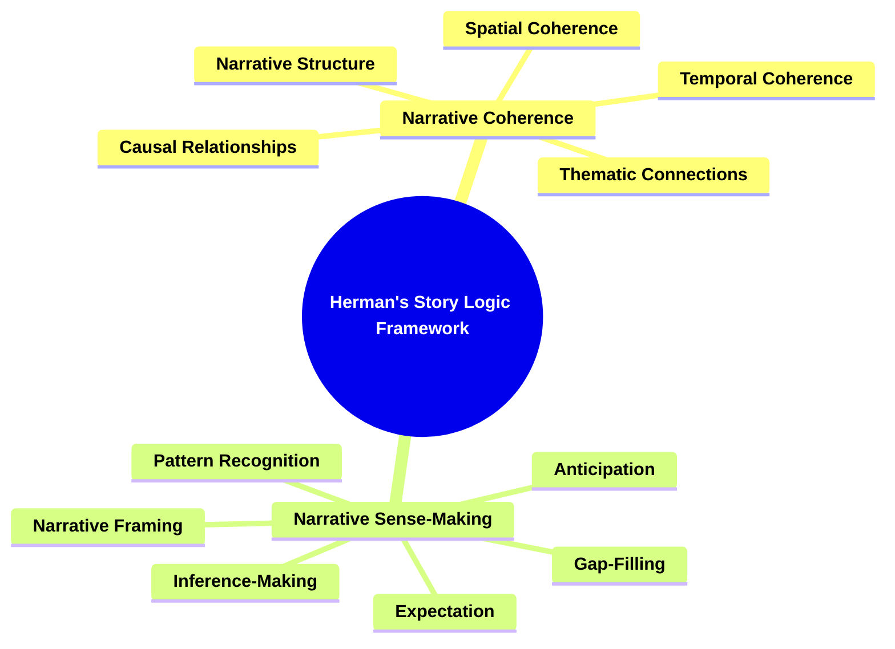
