- [1. **Todorov's Dynamic Genre Theory**](#1-todorovs-dynamic-genre-theory)
- [2. **Theory: Genre Evolution and Adaptation.**](#2-theory-genre-evolution-and-adaptation)
  - [2.1. **Dynamic Nature of Genres**](#21-dynamic-nature-of-genres)
    - [2.1.1. **Components of Dynamic Nature of Genres**:](#211-components-of-dynamic-nature-of-genres)
      - [2.1.1.1. **Flexible**](#2111-flexible)
      - [2.1.1.2. **Responsive**](#2112-responsive)
      - [2.1.1.3. **Adaptive**](#2113-adaptive)
  - [2.2. **Evolution of Genres**](#22-evolution-of-genres)
    - [2.2.1. **Components of Evolution of Genres**:](#221-components-of-evolution-of-genres)
      - [2.2.1.1. **Gradual**](#2211-gradual)
      - [2.2.1.2. **Reflective**](#2212-reflective)
      - [2.2.1.3. **Expansive**](#2213-expansive)
  - [2.3. **Adaptation of Genres**](#23-adaptation-of-genres)
    - [2.3.1. **Components of Adaptation of Genres**:](#231-components-of-adaptation-of-genres)
      - [2.3.1.1. **Transformative**](#2311-transformative)
      - [2.3.1.2. **Innovative**](#2312-innovative)
      - [2.3.1.3. **Subversive**](#2313-subversive)
- [3. **Mechanisms: Factors Shaping and Transforming Genres**](#3-mechanisms-factors-shaping-and-transforming-genres)
  - [3.1. **Inter-Genre Influence**](#31-inter-genre-influence)
    - [3.1.1. **Components of Inter-Genre Influence**:](#311-components-of-inter-genre-influence)
      - [3.1.1.1. **Blended**](#3111-blended)
      - [3.1.1.2. **Interactive**](#3112-interactive)
      - [3.1.1.3. **Hybrid**](#3113-hybrid)
  - [3.2. **Cultural Context**](#32-cultural-context)
    - [3.2.1. **Components of Cultural Context**:](#321-components-of-cultural-context)
      - [3.2.1.1. **Contextual**](#3211-contextual)
      - [3.2.1.2. **Relevant**](#3212-relevant)
      - [3.2.1.3. **Shaping**](#3213-shaping)
  - [3.3. **Historical Context**](#33-historical-context)
    - [3.3.1. **Components of Historical Context**:](#331-components-of-historical-context)
      - [3.3.1.1. **Timely**](#3311-timely)
      - [3.3.1.2. **Situational**](#3312-situational)
      - [3.3.1.3. **Influential**](#3313-influential)
- [4. **Application: Practical Aspects of Genre Operation**](#4-application-practical-aspects-of-genre-operation)
  - [4.1. **Genre-Specific Narrative Forms**](#41-genre-specific-narrative-forms)
    - [4.1.1. **Components of Genre-Specific Narrative Forms**:](#411-components-of-genre-specific-narrative-forms)
      - [4.1.1.1. **Conventional Structure**](#4111-conventional-structure)
      - [4.1.1.2. **Recognizable Themes**](#4112-recognizable-themes)
      - [4.1.1.3. **Reader Expectations**](#4113-reader-expectations)
      - [4.1.1.4. **Viewer Expectations**](#4114-viewer-expectations)
  - [4.2. **Common Plot Structures**](#42-common-plot-structures)
    - [4.2.1. **Components of Common Plot Structures**:](#421-components-of-common-plot-structures)
      - [4.2.1.1. **Predictable**](#4211-predictable)
      - [4.2.1.2. **Familiar**](#4212-familiar)
      - [4.2.1.3. **Satisfying**](#4213-satisfying)
  - [4.3. **Character Archetypes**](#43-character-archetypes)
    - [4.3.1. **Components of Character Archetypes**:](#431-components-of-character-archetypes)
      - [4.3.1.1. **Representative**](#4311-representative)
      - [4.3.1.2. **Recurring**](#4312-recurring)
      - [4.3.1.3. **Iconic**](#4313-iconic)
  - [4.4. **Thematic Elements**](#44-thematic-elements)
    - [4.4.1. **Components of Thematic Elements**:](#441-components-of-thematic-elements)
      - [4.4.1.1. **Central**](#4411-central)
      - [4.4.1.2. **Resonant**](#4412-resonant)
      - [4.4.1.3. **Expansive**](#4413-expansive)
- [5. **Theoretical Significance in Narratology**](#5-theoretical-significance-in-narratology)
- [6. **Conclusion**](#6-conclusion)


### 1. **Todorov's Dynamic Genre Theory**

 **Genres as a System**
- **Definition**: Tzvetan Todorov’s structuralist approach views genres as dynamic systems that evolve over time rather than fixed categories. This concept emphasizes that genres are not static; they adapt and respond to changing literary, cultural, and social environments. Genres should be analyzed based on how they change over time and how their forms influence readers' interpretations of texts.

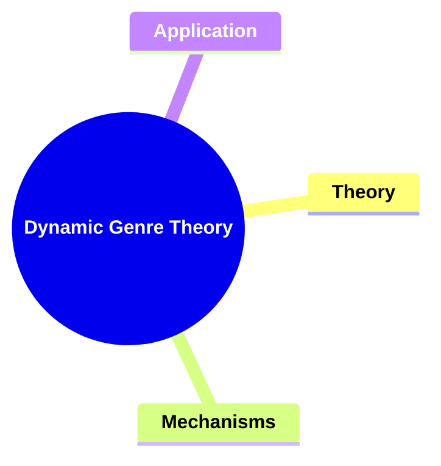


---

### 2. **Theory: Genre Evolution and Adaptation.**


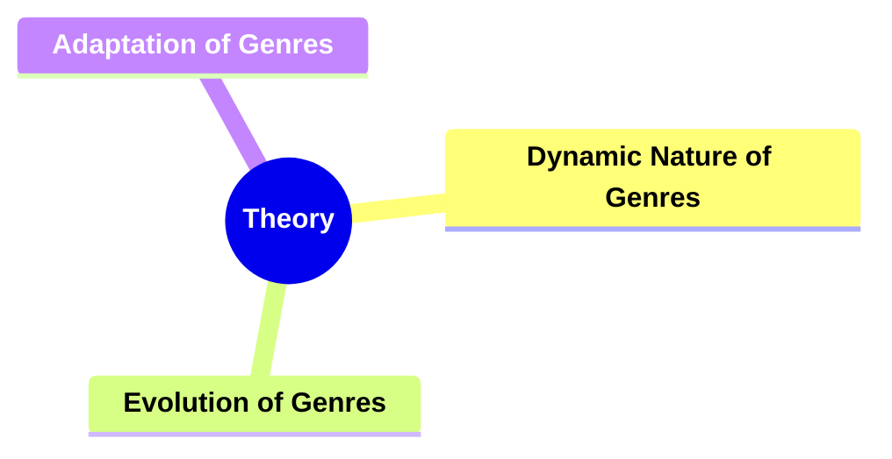


#### 2.1. **Dynamic Nature of Genres**
- **Definition**: Genres continuously evolve in response to shifts in culture, history, and reader expectations.

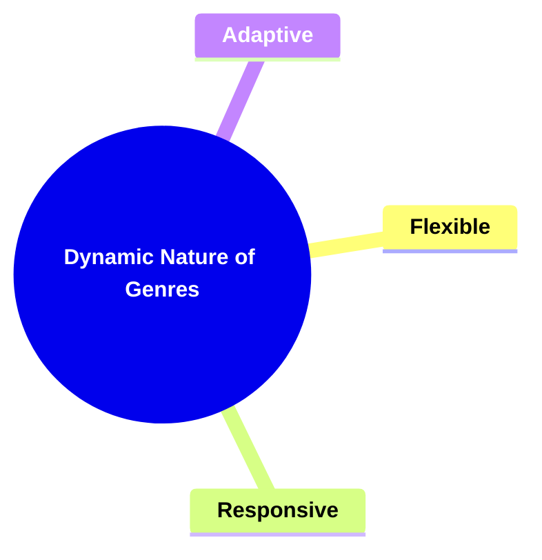


##### 2.1.1. **Components of Dynamic Nature of Genres**:
###### 2.1.1.1. **Flexible**
  - **Definition**: Genres shift to incorporate new storytelling methods, demonstrating their ability to evolve and accommodate different narrative techniques and forms.

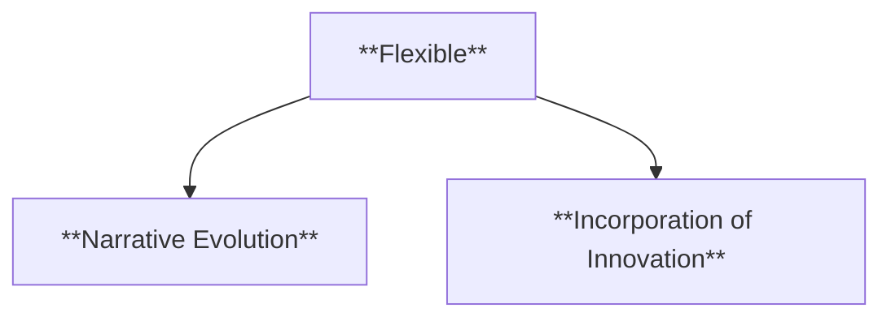

  - **Characteristics**:
    - **Narrative Evolution**: The genre adjusts to include new styles, formats, and techniques, ensuring that it remains fresh and relevant.
    - **Incorporation of Innovation**: Flexibility allows genres to absorb experimental storytelling methods, such as non-linear plots, mixed media, or interactive elements, while still retaining their core identity.

###### 2.1.1.2. **Responsive**
  - **Definition**: Genres reflect changes in societal values and trends, evolving to address contemporary issues, concerns, and cultural shifts.

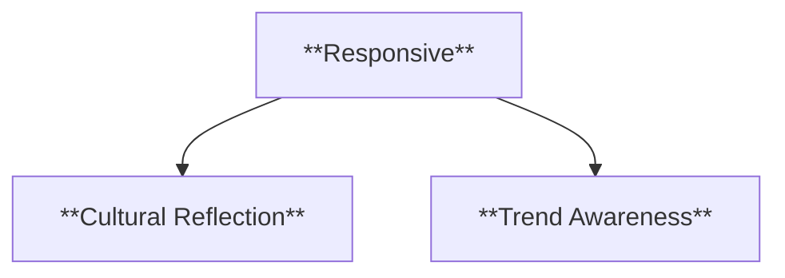

  - **Characteristics**:
    - **Cultural Reflection**: Genres respond to shifts in societal norms, adapting their themes and messages to resonate with modern audiences and contemporary debates.
    - **Trend Awareness**: Genres incorporate emerging trends, such as new technologies, political movements, or social changes, making the stories more relevant to their time.

###### 2.1.1.3. **Adaptive**
  - **Definition**: Genres morph to remain pertinent and engaging, ensuring they continue to captivate audiences by transforming alongside cultural and artistic developments.

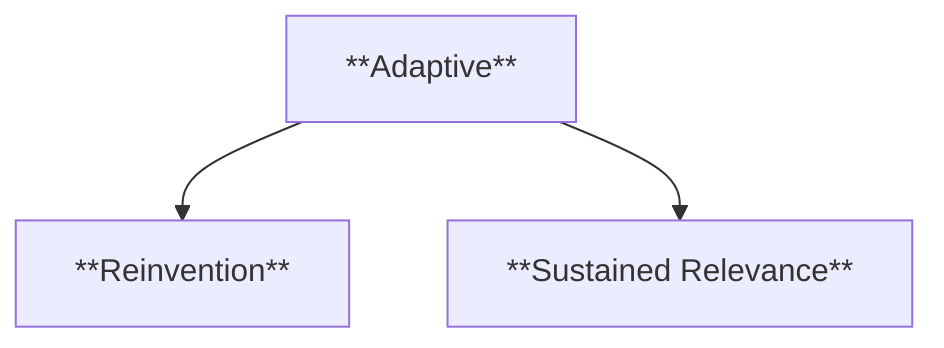

  - **Characteristics**:
    - **Reinvention**: Through adaptation, genres find new ways to stay engaging, often reinventing themselves to meet the needs of current audiences and to reflect the zeitgeist.
    - **Sustained Relevance**: By adapting, genres maintain their cultural significance, blending tradition with modernity to keep their narratives fresh and appealing over time.

---
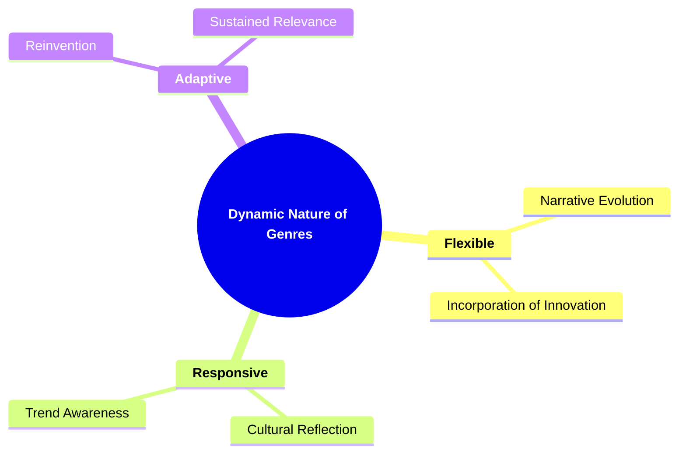
---


#### 2.2. **Evolution of Genres**
- **Definition**: The gradual transformation of genres over time as they adapt to new cultural, historical, and technological developments.

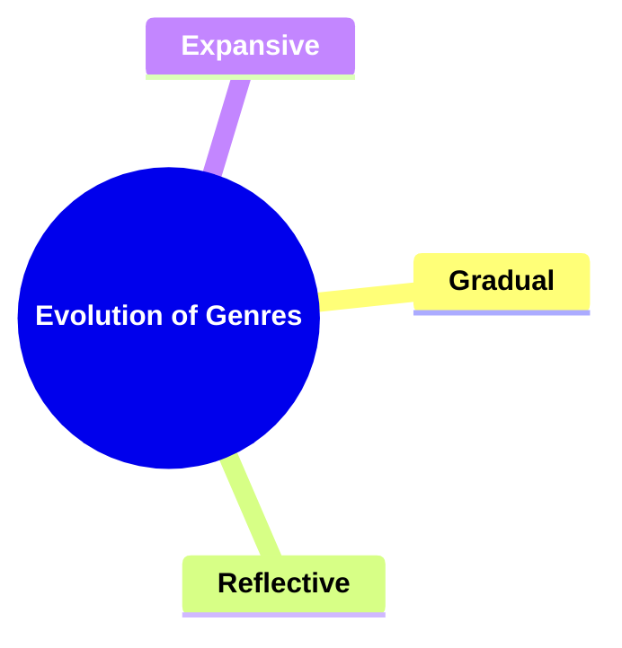

##### 2.2.1. **Components of Evolution of Genres**:
###### 2.2.1.1. **Gradual**
  - **Definition**: Genres transform steadily over time, incorporating new elements slowly as they evolve to meet the changing demands of audiences and storytelling techniques.

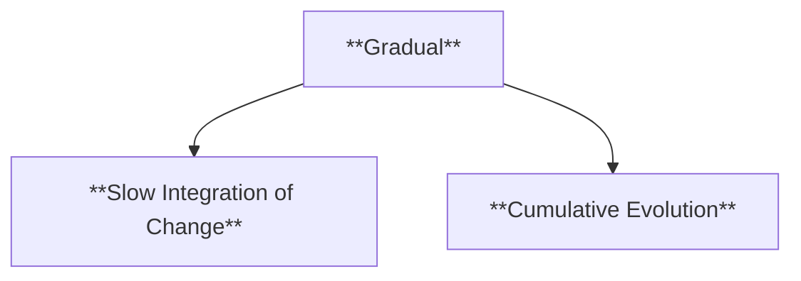


  - **Characteristics**:
    - **Slow Integration of Change**: Genres evolve by gradually adopting new conventions, techniques, or themes without sudden shifts, allowing for a smooth progression.
    - **Cumulative Evolution**: As genres grow, they build upon existing conventions, adding layers of complexity and innovation at a measured pace.

###### 2.2.1.2. **Reflective**
  - **Definition**: Genres mirror changes in culture and society, adapting to reflect the evolving values, concerns, and experiences of the time in which they are created.

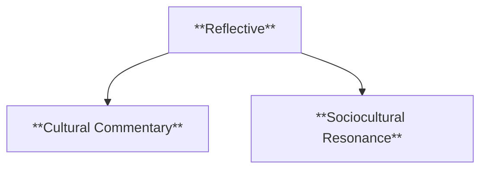

  - **Characteristics**:
    - **Cultural Commentary**: As society shifts, genres adjust to reflect those changes, offering commentary on current events, societal norms, or collective concerns.
    - **Sociocultural Resonance**: Genres act as a reflection of the societal moment, engaging with the political, social, or cultural issues relevant to their era.

###### 2.2.1.3. **Expansive**
  - **Definition**: Genres broaden over time to explore new themes, narratives, and areas of storytelling, pushing beyond their traditional boundaries.

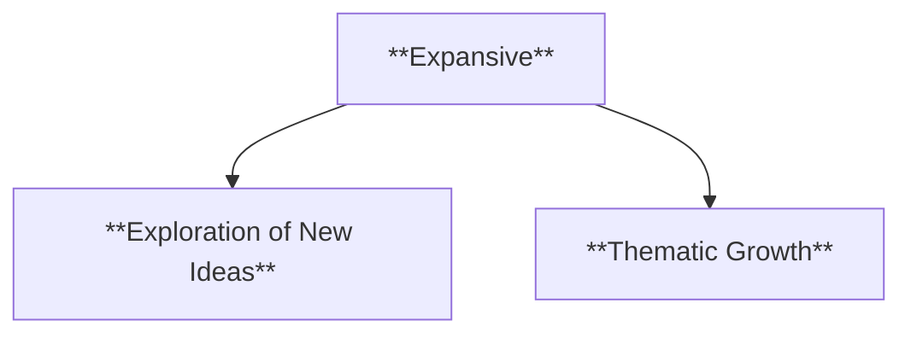

  - **Characteristics**:
    - **Exploration of New Ideas**: Genres expand by introducing new themes, character types, or plot structures, which allows for more diverse storytelling.
    - **Thematic Growth**: As genres evolve, they explore more complex or previously untouched topics, broadening their narrative scope and appeal.

---
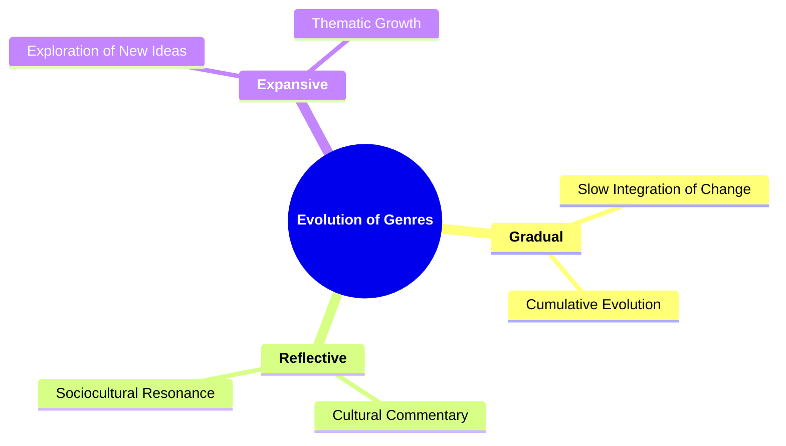
---

#### 2.3. **Adaptation of Genres**
- **Definition**: The way genres transform in response to external forces like technological advancements, audience preferences, or cross-genre influences.


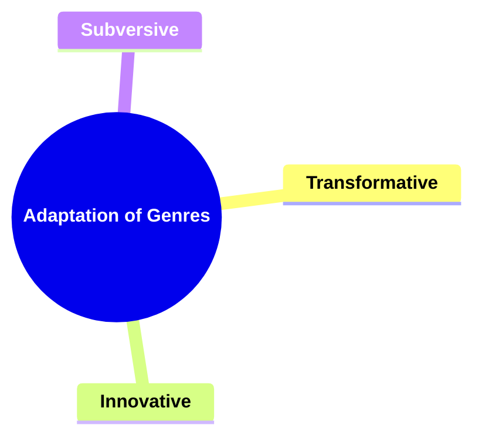

##### 2.3.1. **Components of Adaptation of Genres**:
###### 2.3.1.1. **Transformative**
  - **Definition**: Genres incorporate new elements and ideas, allowing them to evolve and reflect contemporary concerns, techniques, or innovations in storytelling.

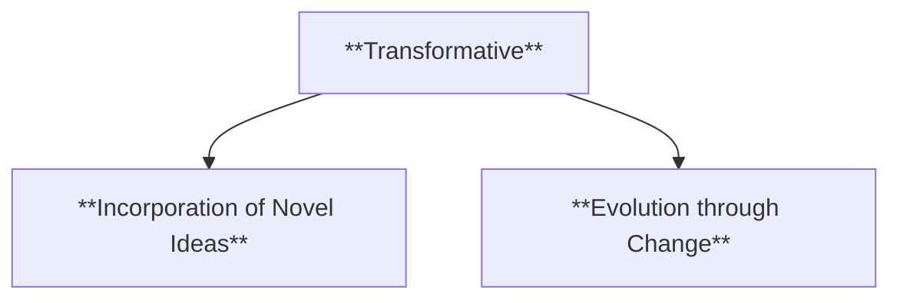

  - **Characteristics**:
    - **Incorporation of Novel Ideas**: Genres take on new themes, narrative techniques, or stylistic innovations, transforming them to remain relevant in modern contexts.
    - **Evolution through Change**: The genre is not static but evolves by integrating new cultural or artistic developments, adapting to new forms of expression and audience expectations.

###### 2.3.1.2. **Innovative**
  - **Definition**: Genres merge with other genres or reinterpret traditional conventions, resulting in fresh, hybrid forms of storytelling that challenge the expected norms.

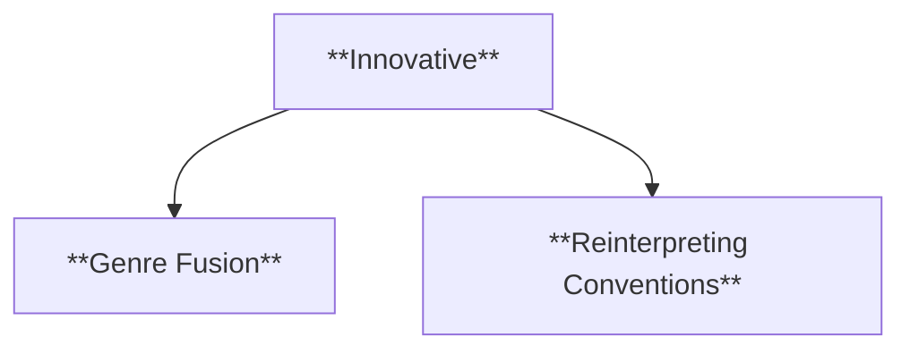

  - **Characteristics**:
    - **Genre Fusion**: By blending elements from different genres, new narrative forms emerge, offering audiences something novel while still retaining elements of each original genre.
    - **Reinterpreting Conventions**: Established genre conventions are reworked or inverted to create new narrative dynamics, pushing the boundaries of what a genre can encompass.

###### 2.3.1.3. **Subversive**
  - **Definition**: Genres may challenge or reinterpret traditional boundaries, often questioning or undermining the norms and expectations associated with conventional genre forms.

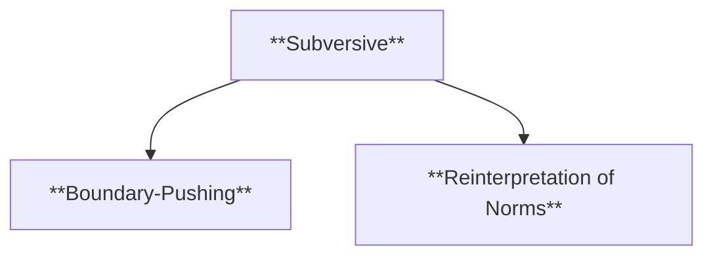

  - **Characteristics**:
    - **Boundary-Pushing**: Subversive genres deliberately push against established limits, creating works that defy traditional genre classifications or norms.
    - **Reinterpretation of Norms**: By subverting expectations, these genres offer fresh perspectives on familiar tropes, often critiquing or deconstructing established genre conventions.


---
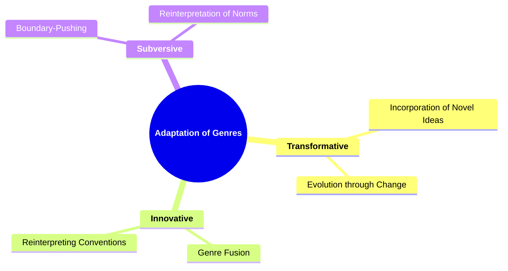
---


### 3. **Mechanisms: Factors Shaping and Transforming Genres**

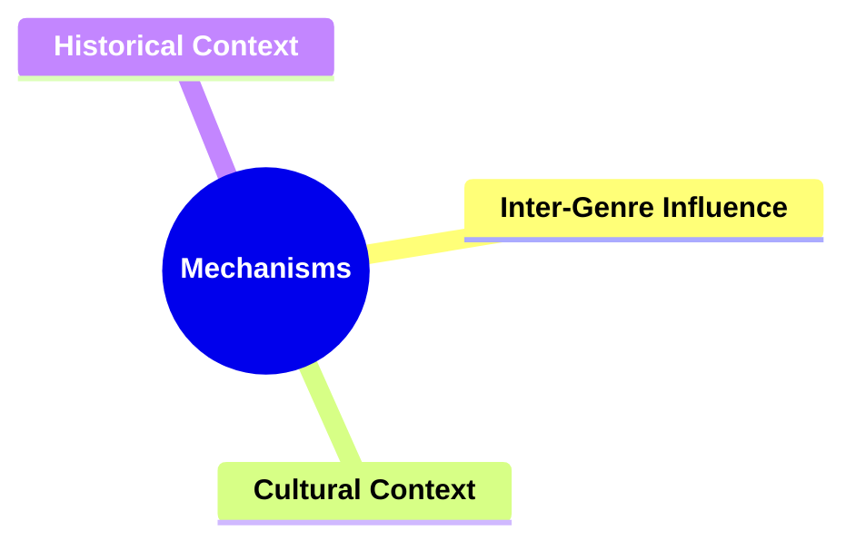


#### 3.1. **Inter-Genre Influence**
- **Definition**: Genres borrow elements from one another, leading to blending and the creation of hybrid genres.

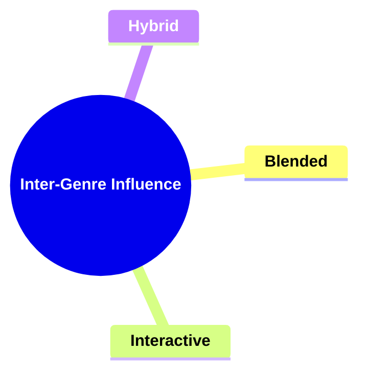
---
##### 3.1.1. **Components of Inter-Genre Influence**:
###### 3.1.1.1. **Blended**
  - **Definition**: Elements from different genres are combined, creating a narrative that draws from multiple traditions, styles, or conventions to form a unique storytelling experience.

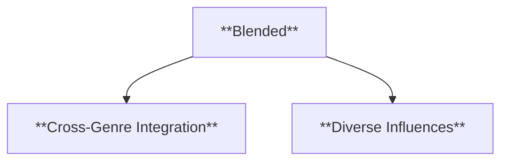

  - **Characteristics**:
    - **Cross-Genre Integration**: Blended genres seamlessly mix conventions from different genres, such as merging romance with science fiction or horror with comedy.
    - **Diverse Influences**: The narrative incorporates stylistic and thematic elements from various genres, resulting in a richer and more varied story structure.


###### 3.1.1.2. **Interactive**
  - **Definition**: Genres influence each other’s development, with conventions and techniques from one genre impacting and shaping the evolution of another.

```mermaid
flowchart TD;
    D[**Interactive**] --> E[**Cross-Influence**];
    D --> F[**Collaborative Development**];
```

  - **Characteristics**:
    - **Cross-Influence**: As genres evolve, they borrow techniques, themes, or styles from each other, leading to a dynamic exchange of ideas and forms.
    - **Collaborative Development**: Genres grow and change by interacting with each other, incorporating new elements that expand the possibilities of storytelling across multiple genres.


###### 3.1.1.3. **Hybrid**
  - **Definition**: New sub-genres emerge from the interaction of multiple genres, creating hybrid forms that offer fresh, innovative narrative possibilities.

```mermaid
flowchart TD;
    G[**Hybrid**] --> H[**Creation of Sub-Genres**];
    G --> I[**Innovation through Combination**];
```

  - **Characteristics**:
    - **Creation of Sub-Genres**: The blending of genres leads to the creation of entirely new categories, such as the fusion of fantasy and detective fiction into urban fantasy, or action and horror into zombie thrillers.
    - **Innovation through Combination**: Hybrid genres push the boundaries of storytelling by combining the best elements of different genres, offering new experiences and appealing to a broader audience.

---
```mermaid
mindmap
  root((**Inter-Genre Influence**))
    **Blended**
      Cross-Genre Integration
      Diverse Influences
    **Interactive**
      Cross-Influence
      Collaborative Development
    **Hybrid**
      Creation of Sub-Genres
      Innovation through Combination
```
---

#### 3.2. **Cultural Context**
- **Definition**: Genres reflect and respond to the societal norms, values, and beliefs of their cultural context.


```mermaid
mindmap
  root((**Cultural Context**))
    **Contextual**
    **Relevant**
    **Shaping**
```
---


##### 3.2.1. **Components of Cultural Context**:
###### 3.2.1.1. **Contextual**
  - **Definition**: Reflects the society in which it is produced, with its themes, characters, and conflicts shaped by the social, political, and cultural environment of the time.

```mermaid
flowchart TD;
    A[**Contextual**] --> B[**Cultural Reflection**];
    A --> C[**Historically Grounded**];
```

  - **Characteristics**:
    - **Cultural Reflection**: The narrative mirrors the values, struggles, and ideologies of the society that created it, acting as a snapshot of its time.
    - **Historically Grounded**: The story often incorporates the historical context, weaving in real-world events, issues, or social norms, grounding the genre in the society’s current reality.

###### 3.2.1.2. **Relevant**
  - **Definition**: Addresses contemporary cultural concerns, engaging with the issues and ideas that are important to the audience during the time of its creation.

```mermaid
flowchart TD;
    D[**Relevant**] --> E[**Culturally Timely**];
    D --> F[**Resonance with Current Issues**];
```

  - **Characteristics**:
    - **Culturally Timely**: The narrative taps into the anxieties, debates, or popular interests of its era, making it feel immediate and important to its audience.
    - **Resonance with Current Issues**: By engaging with ongoing cultural or political conversations, the story connects directly with the audience’s concerns, making it both impactful and relevant.


###### 3.2.1.3. **Shaping**
  - **Definition**: Influences the narrative’s themes and character archetypes, as the societal context plays a role in defining the nature of the story’s characters and central ideas.

```mermaid
flowchart TD;
    G[**Shaping**] --> H[**Thematic Influence**];
    G --> I[**Character Archetype Formation**];
```

  - **Characteristics**:
    - **Thematic Influence**: The social and cultural environment shapes the themes explored in the story, determining what moral or ethical questions are central to the narrative.
    - **Character Archetype Formation**: Society’s ideals, fears, or aspirations influence the development of character archetypes, shaping heroes, villains, and supporting roles in ways that align with cultural norms or critiques.

---
```mermaid
mindmap
  root((**Cultural Context**))
    **Contextual**
      Cultural Reflection
      Historically Grounded
    **Relevant**
      Culturally Timely
      Resonance with Current Issues
    **Shaping**
      Thematic Influence
      Character Archetype Formation
```
---


#### 3.3. **Historical Context**
- **Definition**: The influence of the specific time period in which a genre or narrative is produced, shaping its themes and structures.

```mermaid
mindmap
  root((**Historical Context**))
    **Timely**
    **Situational**
    **Influential**
```
---

##### 3.3.1. **Components of Historical Context**:
###### 3.3.1.1. **Timely**
  - **Definition**: Genres respond to historical events and movements, evolving to address the cultural, social, or political changes occurring during their time.

```mermaid
flowchart TD;
    A[**Timely**] --> B[**Reaction to History**];
    A --> C[**Engagement with Movements**];
```

  - **Characteristics**:
    - **Reaction to History**: The narrative structure or themes of a genre adapt to reflect significant historical events or shifts, such as wars, revolutions, or technological advancements.
    - **Engagement with Movements**: Genres incorporate the ideas and influences of social or political movements, creating stories that resonate with the historical moment and reflect societal transformations.


###### 3.3.1.2. **Situational**
  - **Definition**: Reflects the specific challenges or values of the period, allowing the genre to explore themes that are directly tied to the social or cultural issues of its time.

```mermaid
flowchart TD;
    D[**Situational**] --> E[**Period-Specific Themes**];
    D --> F[**Cultural Values**];
```

  - **Characteristics**:
    - **Period-Specific Themes**: The narrative addresses challenges unique to the era, such as industrialization, civil rights movements, or changes in gender roles, making the story relevant to the period in which it was produced.
    - **Cultural Values**: The genre expresses the dominant values or moral concerns of its time, reflecting what society deems important, whether through conformity to or critique of these values.

###### 3.3.1.3. **Influential**
  - **Definition**: Determines the direction and thematic content of genres, as historical events and societal movements help shape the evolution of genre conventions and trends.

```mermaid
flowchart TD;
    G[**Influential**] --> H[**Shaping Genre Evolution**];
    G --> I[**Long-Term Impact**];
```

  - **Characteristics**:
    - **Shaping Genre Evolution**: Historical circumstances often dictate the themes that dominate certain genres, influencing their development, such as post-war literature focusing on trauma or dystopian narratives reacting to political oppression.
    - **Long-Term Impact**: The influence of historical events or social movements on a genre can leave a lasting impact, determining the genre’s themes, character types, and story arcs for future works.

---
```mermaid
mindmap
  root((**Historical Context**))
    **Timely**
      Reaction to History
      Engagement with Movements
    **Situational**
      Period-Specific Themes
      Cultural Values
    **Influential**
      Shaping Genre Evolution
      Long-Term Impact
```


---


### 4. **Application: Practical Aspects of Genre Operation**

```mermaid
mindmap
  root((**Application**))
    **Genre-Specific Narrative Forms**
    **Common Plot Structures**
    **Character Archetypes**
    **Thematic Elements**
```
---

#### 4.1. **Genre-Specific Narrative Forms**
- **Definition**: Genres are defined by specific narrative forms that guide the structure, characters, and themes expected by readers or viewers.

```mermaid
mindmap
  root((**Genre-Specific Narrative Forms**))
    **Conventional Structure**
    **Recognizable Themes**
    **Reader Expectations**
    **Viewer Expectations**
```

---

##### 4.1.1. **Components of Genre-Specific Narrative Forms**:
###### 4.1.1.1. **Conventional Structure**
  - **Definition**: Each genre follows a specific narrative framework or set of storytelling conventions, such as the three-act structure in drama or the hero's journey in fantasy, providing a familiar blueprint for the story’s progression.

```mermaid
flowchart TD;
    A[**Conventional Structure**] --> B[**Fixed Narrative Framework**];
    A --> C[**Predictable Plot Patterns**];
```


  - **Characteristics**:
    - **Fixed Narrative Framework**: Genres often adhere to established structures, like the rising action, climax, and resolution in a three-act structure, offering a clear narrative arc.
    - **Predictable Plot Patterns**: The structure of the story typically follows a familiar trajectory, allowing audiences to anticipate certain developments based on the genre’s established patterns.

###### 4.1.1.2. **Recognizable Themes**
  - **Definition**: Genres revolve around recurring themes that are central to the narrative, such as love in romance, justice in crime fiction, or the battle between good and evil in fantasy.

```mermaid
flowchart TD;
    D[**Recognizable Themes**] --> E[**Theme Consistency**];
    D --> F[**Genre-Specific Motifs**];
```

  - **Characteristics**:
    - **Theme Consistency**: Each genre typically emphasizes specific themes that resonate with the audience, providing coherence and emotional depth to the narrative.
    - **Genre-Specific Motifs**: Recurring motifs and symbols often reinforce the central themes, such as crime and morality in detective fiction or bravery and honor in adventure stories.

###### 4.1.1.3. **Reader Expectations**
  - **Definition**: Readers expect certain plot developments, character arcs, and themes to unfold based on the conventions of the genre, creating a sense of anticipation and fulfillment.

```mermaid
flowchart TD;
    G[**Reader Expectations**] --> H[**Predictable Story Beats**];
    G --> I[**Character Archetypes**];
```

  - **Characteristics**:
    - **Predictable Story Beats**: In genres like romance, readers expect a central love story, conflicts that challenge the relationship, and often a happy resolution.
    - **Character Archetypes**: Specific genres rely on certain character archetypes—such as the hero in fantasy or the detective in crime fiction—that align with audience expectations.

###### 4.1.1.4. **Viewer Expectations**
  - **Definition**: Viewers expect specific visual or action-based resolutions from genres, such as a climactic battle in action films or a mystery's final reveal in detective stories.

```mermaid
flowchart TD;
    J[**Viewer Expectations**] --> K[**Anticipation of Key Moments**];
    J --> L[**Genre-Specific Visuals**];
```

  - **Characteristics**:
    - **Anticipation of Key Moments**: Viewers look forward to certain genre-defining moments, such as the final showdown in a superhero movie or the big reveal in a mystery film.
    - **Genre-Specific Visuals**: Action genres might feature explosive battles or high-speed chases, while horror focuses on atmospheric tension and shocking reveals, aligning with the visual expectations of the audience.

---

```mermaid
mindmap
  root((**Genre-Specific Narrative Forms**))
    **Conventional Structure**
      Fixed Narrative Framework
      Predictable Plot Patterns
    **Recognizable Themes**
      Theme Consistency
      Genre-Specific Motifs
    **Reader Expectations**
      Predictable Story Beats
      Character Archetypes
    **Viewer Expectations**
      Anticipation of Key Moments
      Genre-Specific Visuals
```

---

#### 4.2. **Common Plot Structures**

```mermaid
mindmap
  root((**Commmon Plot Structures**))
    **Predictable**
    **Familiar**
    **Satisfying**
```

- **Definition**: Recurring plot structures that shape narrative expectations within specific genres.


##### 4.2.1. **Components of Common Plot Structures**:
###### 4.2.1.1. **Predictable**
  - **Definition**: Follows established narrative patterns, ensuring that the story unfolds in ways that are familiar to the audience, aligning with the genre's conventions and structure.

```mermaid
flowchart TD;
    A[**Predictable**] --> B[**Established Formula**];
    A --> C[**Anticipated Outcomes**];
```

  - **Characteristics**:
    - **Established Formula**: The narrative adheres to a known formula or framework, such as the hero's journey in adventure stories or the procedural investigation in crime fiction.
    - **Anticipated Outcomes**: Readers can often foresee the major plot developments and resolutions, providing a sense of comfort and reliability within the genre.

---


###### 4.2.1.2. **Familiar**
  - **Definition**: Readers recognize recurring plot elements, character types, and themes that are typical of the genre, providing a sense of continuity and predictability.

```mermaid
flowchart TD;
    D[**Familiar**] --> E[**Recurring Tropes**];
    D --> F[**Comfort in Recognition**];
```

  - **Characteristics**:
    - **Recurring Tropes**: Familiar genre tropes, such as the "damsel in distress" in romance or the "reluctant hero" in fantasy, make the story easily recognizable and accessible to readers.
    - **Comfort in Recognition**: The repetition of familiar plot structures or character arcs allows readers to quickly understand and connect with the narrative, reinforcing their genre-based expectations.

###### 4.2.1.3. **Satisfying**
  - **Definition**: Delivers the narrative arcs and resolutions expected from the genre, fulfilling the audience's desire for closure and adherence to genre-specific conventions.

```mermaid
flowchart TD;
    G[**Satisfying**] --> H[**Expected Resolution**];
    G --> I[**Fulfillment of Expectations**];
```


  - **Characteristics**:
    - **Expected Resolution**: The story typically concludes in a way that aligns with the genre’s norms, such as the hero triumphing in adventure or a romantic couple finding happiness in romance.
    - **Fulfillment of Expectations**: By delivering on established conventions, the narrative provides a satisfying experience, ensuring that the reader feels rewarded by the familiar yet engaging resolution.

---
```mermaid
mindmap
  root((**Common Plot Structures**))
    **Predictable**
      Established Formula
      Anticipated Outcomes
    **Familiar**
      Recurring Tropes
      Comfort in Recognition
    **Satisfying**
      Expected Resolution
      Fulfillment of Expectations
```
---


#### 4.3. **Character Archetypes**
- **Definition**: Genres often feature recognizable character roles or archetypes, like the hard-boiled detective in noir fiction or the tragic hero in classical tragedy.

```mermaid
mindmap
  root((**Character Archetypes**))
    **Representative**
    **Recurring**
    **Iconic**
```


##### 4.3.1. **Components of Character Archetypes**:
###### 4.3.1.1. **Representative**
  - **Definition**: Embodies core traits of the genre, acting as a quintessential example of the themes, structure, and character types that define the genre’s identity.

```mermaid
flowchart TD;
    A[**Representative**] --> B[**Genre-Defining Elements**];
    A --> C[**Exemplifies Genre Norms**];
```

  - **Characteristics**:
    - **Genre-Defining Elements**: The narrative or character strongly reflects the essential elements that are characteristic of the genre, such as a hard-boiled detective in crime fiction or a heroic quest in fantasy.
    - **Exemplifies Genre Norms**: Representative stories or characters follow the conventions that make the genre recognizable, aligning with audience expectations of how the genre operates.

###### 4.3.1.2. **Recurring**
  - **Definition**: Appears consistently across multiple works, showing up in various narratives within the genre, becoming a common and expected presence.

```mermaid
flowchart TD;
    D[**Recurring**] --> E[**Repetitive Themes or Archetypes**];
    D --> F[**Genre Familiarity**];
```

  - **Characteristics**:
    - **Repetitive Themes or Archetypes**: Certain themes, character types, or plot devices frequently recur in genre stories, such as the "chosen one" trope in fantasy or the "investigation and resolution" framework in detective fiction.
    - **Genre Familiarity**: The repetition of certain elements across different works helps solidify the genre’s identity, making these recurring features a key part of what defines the genre.

###### 4.3.1.3. **Iconic**
  - **Definition**: Defined by specific attributes or roles that make it easily recognizable and memorable, becoming a symbol or representation of the genre itself.

```mermaid
flowchart TD;
    G[**Iconic**] --> H[**Distinguishable Traits**];
    G --> I[**Cultural Symbol**];
```

  - **Characteristics**:
    - **Distinguishable Traits**: Iconic characters or narratives have distinct features—such as a superhero’s costume or a noir detective’s cynical demeanor—that make them stand out as emblematic of their genre.
    - **Cultural Symbol**: These characters or tropes often become iconic beyond the genre, influencing pop culture and being easily recognized by audiences, even those unfamiliar with the genre’s details.

---

```mermaid
mindmap
  root((**Character Archetypes**))
    **Representative**
      Genre-Defining Elements
      Exemplifies Genre Norms
    **Recurring**
      Repetitive Themes or Archetypes
      Genre Familiarity
    **Iconic**
      Distinguishable Traits
      Cultural Symbol
```

---


#### 4.4. **Thematic Elements**
- **Definition**: Each genre engages with specific thematic concerns that resonate with its audience, such as morality in Westerns or societal critique in dystopian fiction.

```mermaid
mindmap
  root((**Thematic Elements**))
    **Central**
    **Resonant**
    **Expansive**
```


##### 4.4.1. **Components of Thematic Elements**:
###### 4.4.1.1. **Central**
  - **Definition**: Focuses on core themes relevant to the genre, centering the narrative around the primary ideas, emotions, or conflicts that are integral to the genre’s identity.

```mermaid
flowchart TD;
    A[**Central**] --> B[**Core Themes**];
    A --> C[**Foundational to the Genre**];
```


  - **Characteristics**:
    - **Core Themes**: The narrative revolves around essential themes of the genre, such as justice and morality in crime fiction or love and personal growth in romance.
    - **Foundational to the Genre**: These themes are not peripheral but are at the heart of the story, driving the plot and character development in ways that define the genre.


###### 4.4.1.2. **Resonant**
  - **Definition**: Connects with the audience’s values or concerns, reflecting cultural, social, or personal issues that make the narrative more impactful and relatable.

```mermaid
flowchart TD;
    D[**Resonant**] --> E[**Emotional Connection**];
    D --> F[**Cultural Relevance**];
```

  - **Characteristics**:
    - **Emotional Connection**: The story speaks to the audience’s emotions, values, or current concerns, resonating with their personal experiences or societal issues.
    - **Cultural Relevance**: By addressing contemporary problems or universal truths, the narrative ensures that its themes or characters are relevant and meaningful to the audience.


###### 4.4.1.3. **Expansive**
  - **Definition**: Allows for the exploration of complex ideas, giving the genre the flexibility to delve into broader philosophical, social, or emotional themes.

```mermaid
flowchart TD;
    G[**Expansive**] --> H[**Depth and Complexity**];
    G --> I[**Broad Thematic Range**];
```


  - **Characteristics**:
    - **Depth and Complexity**: The narrative provides the space to explore intricate ideas, moral dilemmas, or multi-layered characters, pushing beyond the genre’s surface-level conventions.
    - **Broad Thematic Range**: Expansive genres allow for a wide range of topics and themes to be examined, making it possible to explore everything from personal relationships to societal structures or existential questions.

---

```mermaid
mindmap
  root((**Dynamic Genre Theory**))
    **Theory**
      Dynamic Nature of Genres
        Flexible
        Responsive
        Adaptive
      Evolution of Genres
        Gradual
        Reflective
        Expansive
      Adaptation of Genres
        Transformative
        Innovative
        Subversive
    **Mechanisms**
      Inter-Genre Influence
        Blended
        Interactive
        Hybrid
      Cultural Context
        Contextual
        Relevant
        Shaping
      Historical Context
        Timely
        Situational
        Influential
    **Application**
      Genre-Specific Narrative Forms
        Conventional Structure
        Recognizable Themes
        Reader Expectations
        Viewer Expectations
      Common Plot Structures
        Predictable
        Familiar
        Satisfying
      Character Archetypes
        Representative
        Recurring
        Iconic
      Thematic Elements
        Central
        Resonant
        Expansive
```
---

### 5. **Theoretical Significance in Narratology**

Todorov's dynamic genre theory offers significant contributions to narratology, particularly in its emphasis on genre as an evolving system rather than a fixed category. By focusing on how genres adapt to cultural, historical, and social changes, Todorov provides a framework for understanding how genres both shape and are shaped by societal forces. This theory underscores the importance of viewing genres as fluid, dynamic constructs that reflect broader shifts in human storytelling and interaction with the world. Todorov’s insight into genre evolution offers narratologists tools to explore the relationship between form and context, how audience expectations shape narratives, and how genres incorporate new elements over time.

The adaptability and responsiveness of genres outlined in Todorov’s framework highlight the complex interplay between narrative structure, reader reception, and cultural context. The framework's flexible nature makes it applicable across various media forms—film, literature, television, and even digital storytelling—allowing for a more comprehensive analysis of genre evolution across different platforms. By situating genres within a cultural and historical framework, Todorov’s theory adds depth to our understanding of how stories resonate within specific time periods and how genre conventions evolve to stay relevant.

### 6. **Conclusion**

Tzvetan Todorov’s dynamic genre theory expands the study of genres by presenting them as ever-changing systems that respond to and reflect cultural, historical, and technological shifts. This approach moves beyond static definitions of genre, advocating for an understanding of genres as flexible and adaptive constructs that continuously incorporate new ideas and storytelling techniques. Todorov’s work emphasizes that genres not only shape narratives but also mirror the values and concerns of the society in which they are produced.

His theory provides valuable insight into how genres evolve, adapt, and influence both creators and audiences. This adaptability ensures that genres remain relevant and engaging, bridging the gap between tradition and innovation. Todorov’s contributions remain pivotal to the ongoing study of genres in narratology, offering a robust framework for analyzing how stories, themes, and conventions develop over time and across different cultural landscapes.
