- [1. Title: **Brooks's Narrative as a Rhetorical Structure Framework**](#1-title-brookss-narrative-as-a-rhetorical-structure-framework)
- [2. **Key Concepts**](#2-key-concepts)
  - [2.1. **Repetition**](#21-repetition)
    - [2.1.1. **Components of Repetition**](#211-components-of-repetition)
      - [2.1.1.1. **Thematic Emphasis**](#2111-thematic-emphasis)
      - [2.1.1.2. **Symbolic Significance**](#2112-symbolic-significance)
      - [2.1.1.3. **Memory Retention**](#2113-memory-retention)
  - [2.2. **Foreshadowing**](#22-foreshadowing)
    - [2.2.1. **Components of Foreshadowing**](#221-components-of-foreshadowing)
      - [2.2.1.1. **Subtle Clues**](#2211-subtle-clues)
      - [2.2.1.2. **Suspense Creation**](#2212-suspense-creation)
      - [2.2.1.3. **Expectation Management**](#2213-expectation-management)
  - [2.3. **Framing**](#23-framing)
    - [2.3.1. **Components of Framing**](#231-components-of-framing)
      - [2.3.1.1. **Narrative Perspective**](#2311-narrative-perspective)
      - [2.3.1.2. **Structural Framing**](#2312-structural-framing)
      - [2.3.1.3. **Contextual Framing**](#2313-contextual-framing)
- [3. **Theoretical Significance**](#3-theoretical-significance)

---

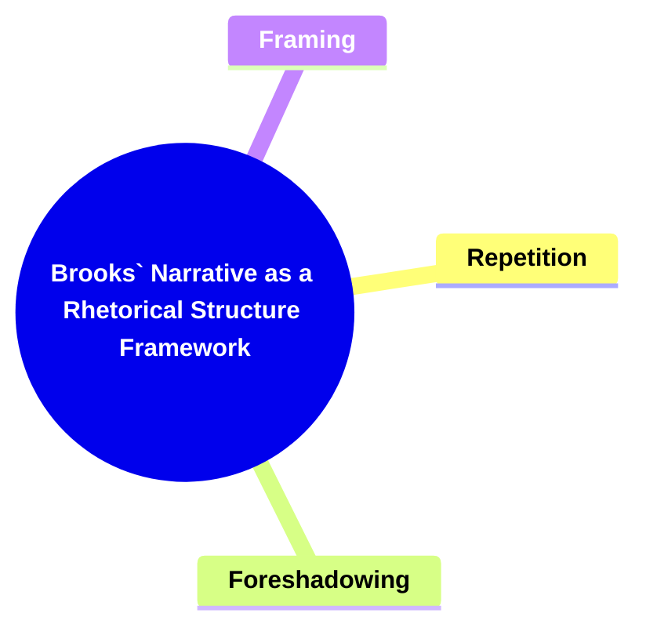

---

### 1. Title: **Brooks's Narrative as a Rhetorical Structure Framework**

**Narrative as a Rhetorical Structure**:
**Definition**: Peter Brooks’s framework posits that narrative is inherently rhetorical, meaning that it is constructed to achieve specific effects on the reader. Brooks argues that narratives are not just stories told for entertainment or information but are carefully crafted to guide the reader’s interpretation, emotions, and responses. By analyzing narrative as a rhetorical structure, Brooks emphasizes how various narrative techniques are employed to shape the reader's experience, making the narrative more persuasive, engaging, and impactful.

---

### 2. **Key Concepts**

#### 2.1. **Repetition**

**Definition**:
Repetition in narrative refers to the deliberate recurrence of certain themes, symbols, or phrases, which serves to reinforce key ideas and ensure that they resonate with the reader.

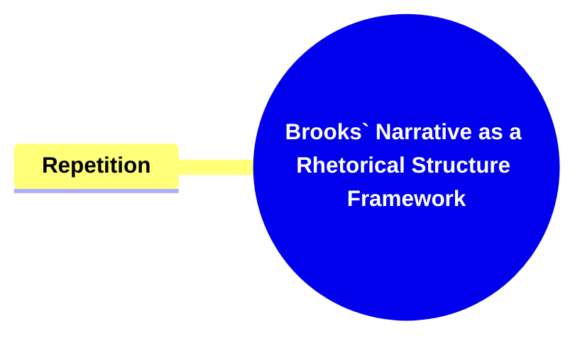

##### 2.1.1. **Components of Repetition**

###### 2.1.1.1. **Thematic Emphasis**

- **Definition**: Highlights key themes or ideas by repeating them, making them more prominent in the reader's mind.

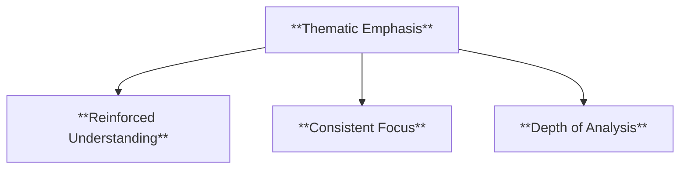

- **Characteristics**
  - **Reinforced Understanding**: Repetition ensures readers grasp and reflect on the narrative’s primary themes.
  - **Consistent Focus**: Keeps the reader’s attention on central ideas throughout the story.
  - **Depth of Analysis**: Encourages readers to consider the recurring theme’s implications and connections within the narrative.

###### 2.1.1.2. **Symbolic Significance**

- **Definition**: Reinforces the importance of symbols or motifs that contribute to the narrative’s deeper meanings.

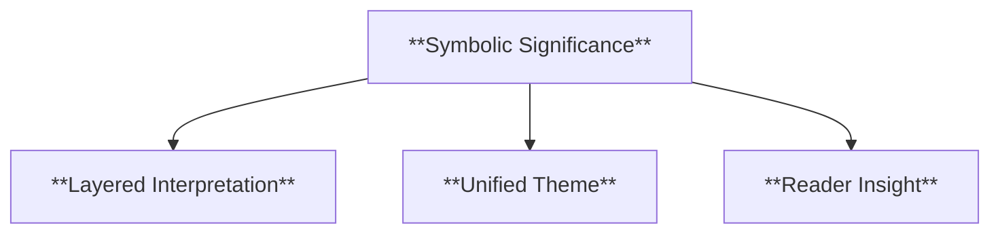

- **Characteristics**
  - **Layered Interpretation**: Enhances the narrative’s complexity by giving weight to recurring symbols or motifs.
  - **Unified Theme**: Ties various parts of the story together through consistent symbolic representation.
  - **Reader Insight**: Prompts readers to look for hidden meanings and understand the narrative’s subtleties.

###### 2.1.1.3. **Memory Retention**

- **Definition**: Helps readers remember important aspects of the story, ensuring that key concepts are not forgotten.

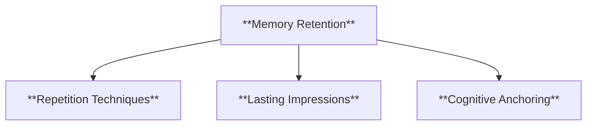

- **Characteristics**
  - **Repetition Techniques**: Uses reiteration to reinforce major plot points or character traits.
  - **Lasting Impressions**: Ensures important details stay with the reader, aiding comprehension and recall.
  - **Cognitive Anchoring**: Makes use of familiar concepts to help embed significant elements in the reader’s memory.

#### 2.2. **Foreshadowing**

**Definition**:
Foreshadowing is a technique where hints or clues about future events are embedded within the narrative, creating anticipation and guiding the reader's expectations.

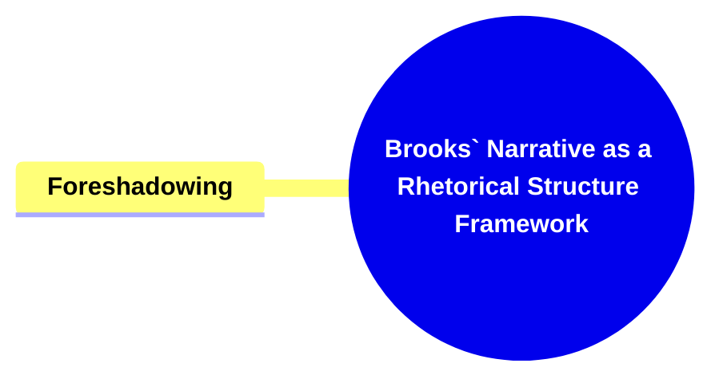

##### 2.2.1. **Components of Foreshadowing**

###### 2.2.1.1. **Subtle Clues**

- **Definition**: Integrates hints that may not be immediately obvious but become significant as the story progresses.

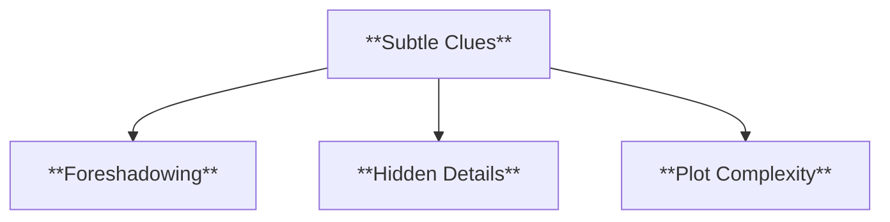

- **Characteristics**
  - **Foreshadowing**: Plants early hints that contribute to the payoff later in the story.
  - **Hidden Details**: Encourages attentive reading to pick up on nuances that foreshadow later developments.
  - **Plot Complexity**: Adds layers to the narrative, enriching the reader’s experience upon discovery.

###### 2.2.1.2. **Suspense Creation**

- **Definition**: Builds tension and keeps readers engaged by making them anticipate future developments.

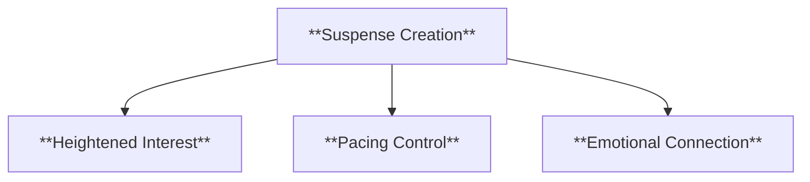

- **Characteristics**
  - **Heightened Interest**: Maintains reader engagement by introducing elements of uncertainty.
  - **Pacing Control**: Manipulates the speed of the story to increase anticipation.
  - **Emotional Connection**: Draws readers closer to the narrative as they become invested in potential outcomes.

###### 2.2.1.3. **Expectation Management**

- **Definition**: Prepares readers for upcoming events that can either align with or defy their predictions, enhancing the impact of the narrative.

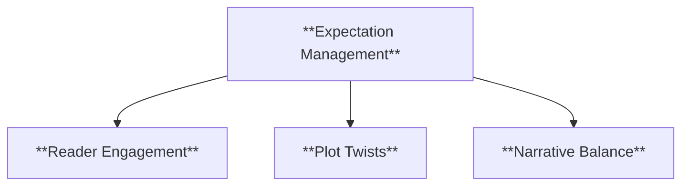

- **Characteristics**
  - **Reader Engagement**: Keeps readers on their toes by hinting at possible events.
  - **Plot Twists**: Can defy established expectations, creating surprise and excitement.
  - **Narrative Balance**: Ensures that the story flows logically while still being able to surprise the audience.

#### 2.3. **Framing**

**Definition**:
Framing refers to how the story is presented, including the narrative perspective, structure, and context. Framing determines how the reader perceives and interprets the story, influencing their emotional and intellectual responses.

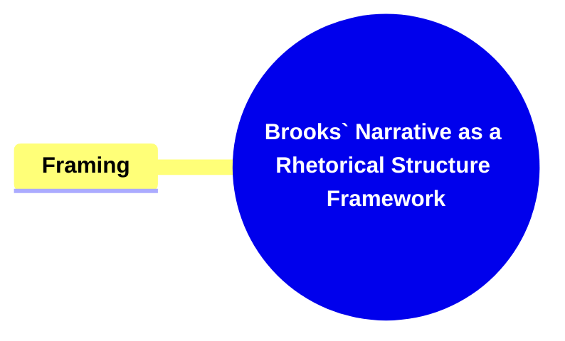

##### 2.3.1. **Components of Framing**

###### 2.3.1.1. **Narrative Perspective**

- **Definition**: The point of view from which the story is told (first-person, third-person, etc.) shapes how the reader understands the events and characters.

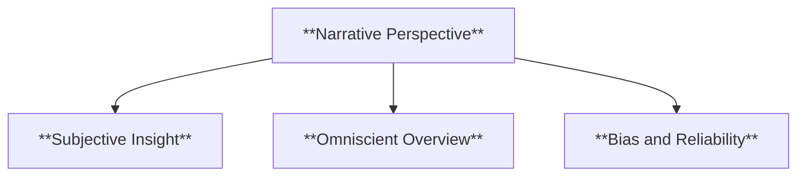

- **Characteristics**
  - **Subjective Insight**: Offers an intimate look at characters’ thoughts and emotions in first-person narration.
  - **Omniscient Overview**: Provides a broad understanding of the story and characters with third-person omniscient narration.
  - **Bias and Reliability**: Influences the reader’s perception depending on how trustworthy or limited the narrator is.

###### 2.3.1.2. **Structural Framing**

- **Definition**: The way the story is organized (e.g., starting in medias res, using flashbacks) influences the reader’s experience of the plot.

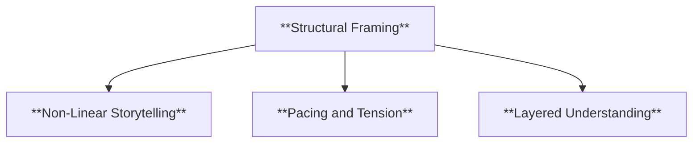

- **Characteristics**
  - **Non-Linear Storytelling**: Uses techniques like flashbacks or shifting timelines to create intrigue.
  - **Pacing and Tension**: Adjusts the narrative flow to emphasize critical moments.
  - **Layered Understanding**: Reveals information gradually, allowing readers to piece together the story over time.

###### 2.3.1.3. **Contextual Framing**

- **Definition**: The broader historical, cultural, or social context frames the reader’s interpretation of the narrative’s themes and messages.

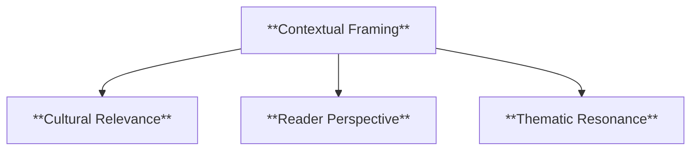

- **Characteristics**
  - **Cultural Relevance**: Adds depth by relating the narrative to a particular social or historical backdrop.
  - **Reader Perspective**: Shapes interpretation based on knowledge of the time or setting in which the story takes place.
  - **Thematic Resonance**: Highlights themes that resonate within specific cultural or social contexts, deepening the narrative’s impact.

---

### 3. **Theoretical Significance**

- **Impact on Narrative Theory**: Brooks’s framework has significantly influenced narrative theory by highlighting the rhetorical construction of narratives and how specific techniques guide the reader’s interpretation. By viewing narrative as a rhetorical act, Brooks emphasizes the intentionality behind narrative techniques and their effects on reader engagement and understanding.
- **Application Across Media**: Brooks’s concepts extend beyond literature to film, television, and digital media. Repetition, foreshadowing, and framing are essential narrative tools across these mediums, influencing pacing, tension, and viewer interpretation.
- **Supporting Information**:
  - **Interdisciplinary Influence**: Brooks’s framework has influenced film studies, psychology, and cognitive science, showing how narrative structure affects perception, memory, and emotional response.

---

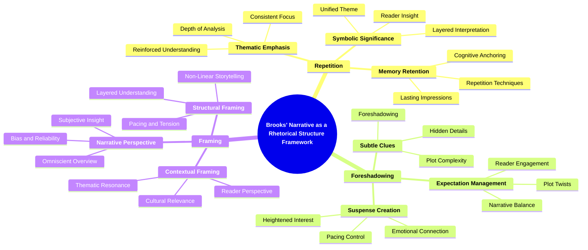
