- [1. Title: **Herman's Eventfulness and Tellability Framework**](#1-title-hermans-eventfulness-and-tellability-framework)
- [2. **Key Concepts**](#2-key-concepts)
  - [2.1. **Eventfulness**](#21-eventfulness)
    - [2.1.1. **Components of Eventfulness**](#211-components-of-eventfulness)
      - [2.1.1.1. **Plot Development**](#2111-plot-development)
      - [2.1.1.2. **Character Transformation**](#2112-character-transformation)
      - [2.1.1.3. **Cultural Specificity**](#2113-cultural-specificity)
  - [2.2. **Tellability**](#22-tellability)
    - [2.2.1. **Components of Tellability**](#221-components-of-tellability)
      - [2.2.1.1. **Audience Engagement**](#2211-audience-engagement)
      - [2.2.1.2. **Social Relevance**](#2212-social-relevance)
      - [2.2.1.3. **Narrative Innovation**](#2213-narrative-innovation)
      - [2.2.1.4. **Cultural Influence**](#2214-cultural-influence)
      - [2.2.1.5. **Contextual Influence**](#2215-contextual-influence)
      - [2.2.1.6. **Societal Values**](#2216-societal-values)
      - [2.2.1.7. **Historical Context**](#2217-historical-context)
      - [2.2.1.8. **Cultural Narratives**](#2218-cultural-narratives)
- [3. **Conclusion**](#3-conclusion)

---

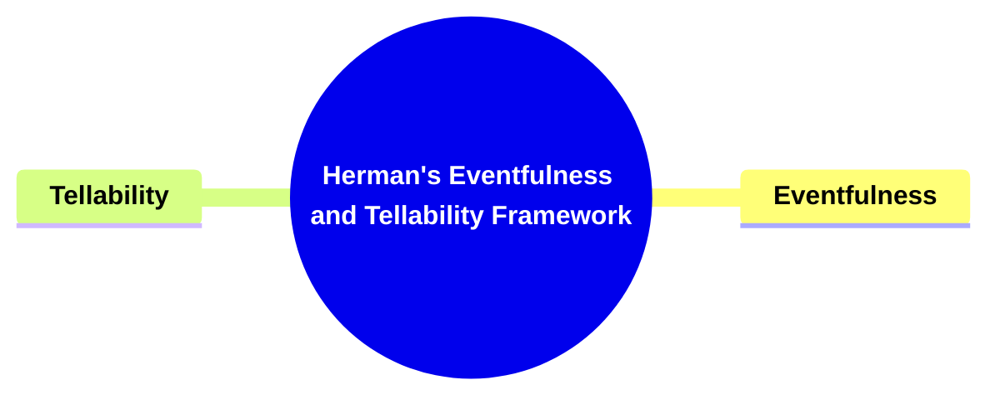

---

### 1. Title: **Herman's Eventfulness and Tellability Framework**

- **Eventfulness and Tellability**:
  - **Definition**: In _"Story Logic,"_ David Herman introduces the concepts of _eventfulness_ and _tellability,_ central to understanding why certain narratives capture an audience's interest. _Eventfulness_ refers to the significance and impact of events within a story—those moments that alter the narrative's course. _Tellability_ concerns the qualities that make a story engaging, thought-provoking, or worth sharing with others.

---

### 2. **Key Concepts**

#### 2.1. **Eventfulness**

- **Definition**:
  - Eventfulness measures the pivotal significance of events within a narrative. An event is eventful if it alters the narrative’s trajectory, deeply impacts characters, or shapes the plot in memorable ways.

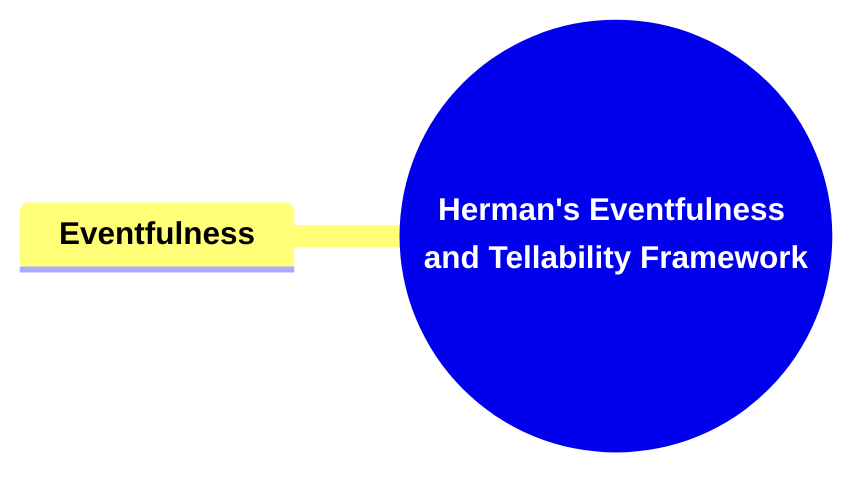

##### 2.1.1. **Components of Eventfulness**

###### 2.1.1.1. **Plot Development**

- **Definition**: Highly eventful moments are those that propel the story forward, altering its direction or leading to a major turning point.

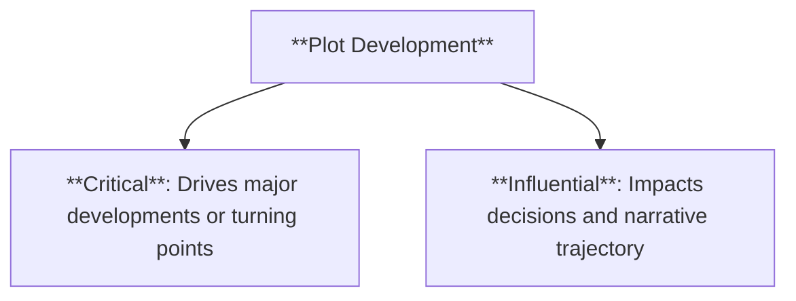

- **Characteristics**:
  - **Critical**: Drives the narrative toward major developments or turning points.
  - **Influential**: Impacts characters' decisions and the story’s trajectory.

###### 2.1.1.2. **Character Transformation**

- **Definition**: Eventful moments often result in character development or transformation, leading to shifts in their motivations, relationships, or personal growth.

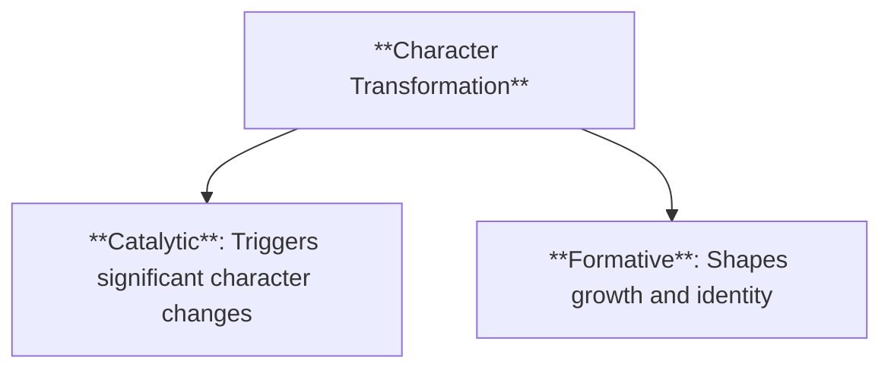

- **Characteristics**:
  - **Catalytic**: Serves as a trigger for major changes in character behavior or personality.
  - **Formative**: Shapes the character's growth, identity, or evolution throughout the narrative.

###### 2.1.1.3. **Cultural Specificity**

- **Definition**: The eventfulness of certain moments can vary across cultural contexts, as different societies assign varying levels of significance to different themes.

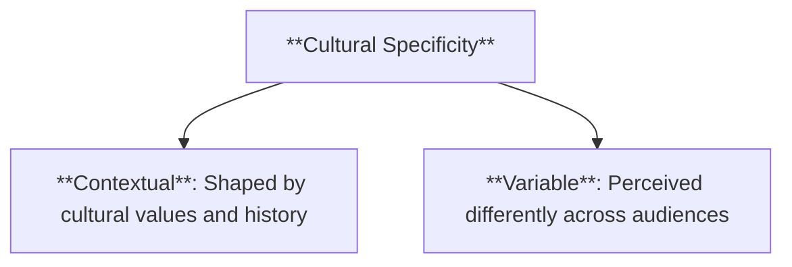

- **Characteristics**:
  - **Contextual**: The significance of events is shaped by cultural values and historical background.
  - **Variable**: Eventfulness may be perceived differently depending on the audience's cultural context.

---

#### 2.2. **Tellability**

- **Definition**:
  - Tellability refers to the qualities that make a story engaging and worth narrating. It measures how a narrative captures the audience’s interest through its structure, themes, emotional resonance, or uniqueness.

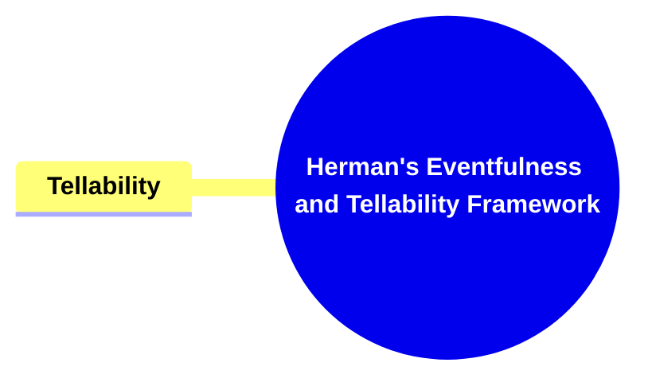

##### 2.2.1. **Components of Tellability**

###### 2.2.1.1. **Audience Engagement**

- **Definition**: Stories that captivate the audience through dynamic plots, compelling characters, or suspenseful moments are considered highly tellable.

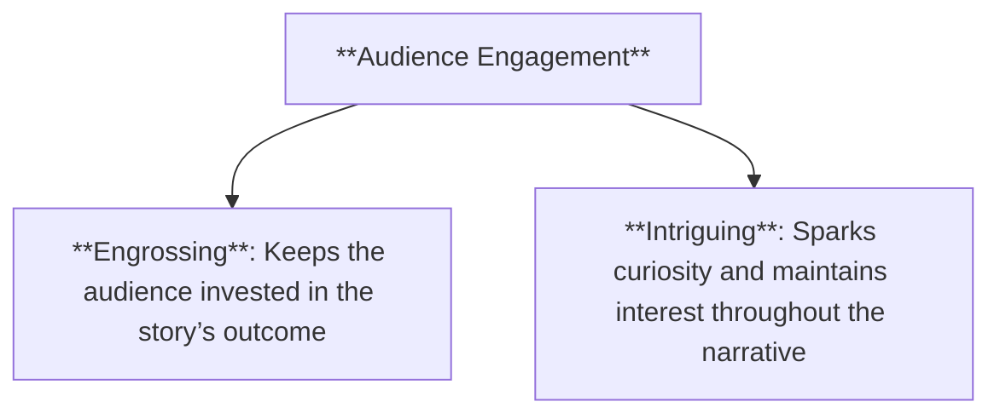

- **Characteristics**:
  - **Engrossing**: Keeps the audience invested in the story’s outcome.
  - **Intriguing**: Sparks curiosity and maintains interest throughout the narrative.

###### 2.2.1.2. **Social Relevance**

- **Definition**: A story’s relevance to contemporary issues or themes increases its tellability, particularly if it resonates with the audience’s experiences or societal concerns.

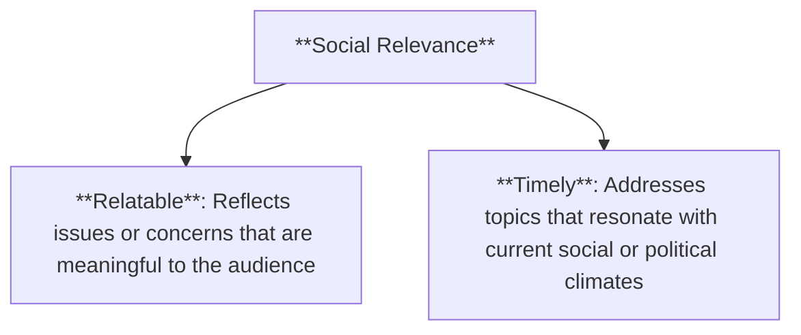

- **Characteristics**:
  - **Relatable**: Reflects issues or concerns that are meaningful to the audience.
  - **Timely**: Addresses topics that resonate with current social or political climates.

###### 2.2.1.3. **Narrative Innovation**

- **Definition**: Stories that employ unique or unconventional narrative techniques, such as non-linear timelines or experimental structures, can enhance tellability by offering a fresh experience.

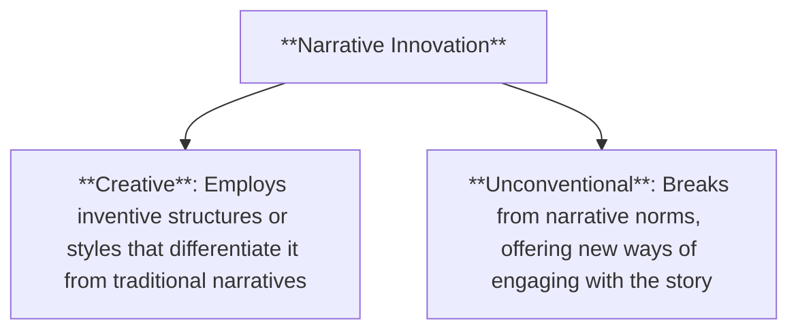

- **Characteristics**:
  - **Creative**: Employs inventive structures or styles that differentiate it from traditional narratives.
  - **Unconventional**: Breaks from narrative norms, offering new ways of engaging with the story.

###### 2.2.1.4. **Cultural Influence**

- **Definition**:
  - Cultural influence refers to the ways societal norms, values, and traditions shape what is considered eventful and tellable within a particular cultural setting.

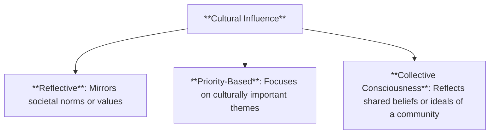

- **Characteristics**:
  - **Reflective**: Mirrors the societal norms or values of the culture in which it is told.
  - **Priority-Based**: Focuses on themes that a culture deems important, such as freedom or family loyalty.
  - **Collective Consciousness**: Reflects the shared beliefs or ideals of a community, influencing the types of stories that resonate.

###### 2.2.1.5. **Contextual Influence**

- **Definition**:
  - Contextual influence refers to the role historical circumstances or specific events play in shaping the relevance and tellability of a narrative.

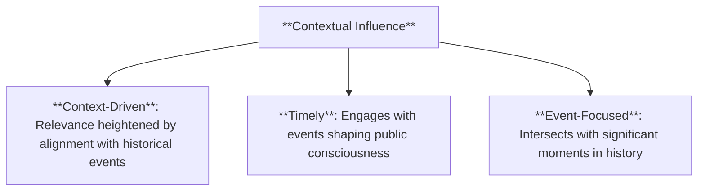

- **Characteristics**:
  - **Context-Driven**: The narrative’s relevance is heightened by its alignment with historical events or movements.
  - **Timely**: Engages with contemporary or past events that shape public consciousness.
  - **Event-Focused**: Stories that intersect with significant moments in history often become more relevant due to their engagement with these events.

###### 2.2.1.6. **Societal Values**

- **Definition**:
  - Societal values influence the tellability of a story by reflecting the dominant cultural priorities, with narratives that align with these values more likely to engage an audience.

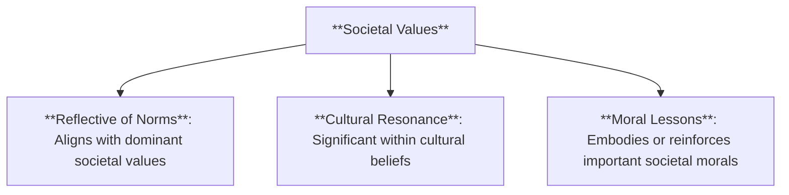

- **Characteristics**:
  - **Reflective of Norms**: Aligns with the dominant values and priorities of a society.
  - **Cultural Resonance**: Holds significance within the context of widely held cultural beliefs or practices.
  - **Moral Lessons**: Often embodies or reinforces moral lessons deemed important by society.

###### 2.2.1.7. **Historical Context**

- **Definition**:
  - Historical context amplifies the eventfulness and tellability of a narrative, particularly when the story directly engages with significant historical events or movements.

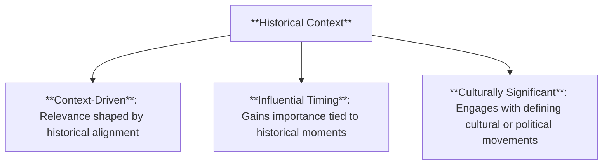

- **Characteristics**:
  - **Context-Driven**: The narrative’s relevance is shaped by its alignment with major historical events.
  - **Influential Timing**: Stories tied to significant historical moments often gain additional importance and resonance.
  - **Culturally Significant**: Engages with historical or political movements that define or challenge cultural identity.

###### 2.2.1.8. **Cultural Narratives**

- **Definition**:
  - Cultural narratives reflect a society’s collective histories, values, or moral lessons, often passed down through storytelling traditions.

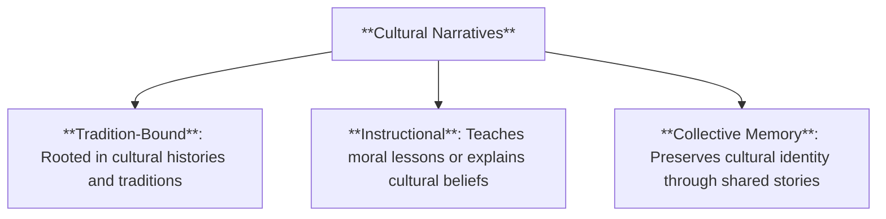

- **Characteristics**:
  - **Tradition-Bound**: Rooted in the cultural narratives and histories passed down through generations.
  - **Instructional**: Often serves a purpose beyond entertainment, such as teaching moral lessons or explaining cultural beliefs.
  - **Collective Memory**: Represents the shared memory of a culture, preserving its identity through storytelling.

---

### 3. **Conclusion**

- **David Herman’s Contribution**:
  - Herman’s _Eventfulness and Tellability Framework_ provides essential insights into why certain stories captivate audiences. By distinguishing between the narrative significance of events (eventfulness) and the qualities that make a story engaging (tellability), Herman offers a structured way to understand the dynamics of storytelling.
  - **Cultural Resonance**: The framework highlights the influence of cultural and historical contexts on what is considered eventful or tellable, emphasizing the importance of understanding a narrative’s audience and environment.
  - **Application in Analysis**: This framework can be applied across various media to analyze how stories resonate with different audiences, contributing to a deeper understanding of narrative impact in both literary and cultural contexts.

---

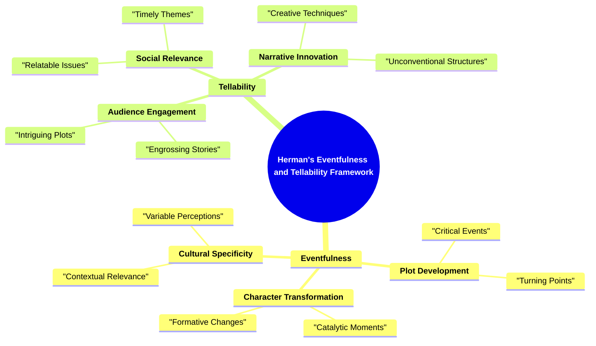
