- [1. Title: **Bakhtin's Novel as a Dynamic Genre Model**](#1-title-bakhtins-novel-as-a-dynamic-genre-model)
- [2. **Key Concepts**](#2-key-concepts)
  - [2.1. **Flexibility**](#21-flexibility)
    - [2.1.1. **Components of Flexiblity**](#211-components-of-flexiblity)
      - [2.1.1.1. **Adaptive**](#2111-adaptive)
      - [2.1.1.2. **Evolving**](#2112-evolving)
      - [2.1.1.3. **Dialogism**](#2113-dialogism)
  - [2.2. **Openness**](#22-openness)
    - [2.2.1. **Components of Openness**](#221-components-of-openness)
      - [2.2.1.1. **Inclusive**](#2211-inclusive)
      - [2.2.1.2. **Engaged**](#2212-engaged)
      - [2.2.1.3. **Chronotope**](#2213-chronotope)
  - [2.3. **Dialogism**](#23-dialogism)
    - [2.3.1. **Components of Dialogism**](#231-components-of-dialogism)
      - [2.3.1.1. **Multi-voiced**](#2311-multi-voiced)
      - [2.3.1.2. **Interactive**](#2312-interactive)
      - [2.3.1.3. **Narrative Complexity**](#2313-narrative-complexity)
  - [2.4. **Chronotope**](#24-chronotope)
    - [2.4.1. **Components of Chronotope**](#241-components-of-chronotope)
      - [2.4.1.1. **Time-Space Interaction**](#2411-time-space-interaction)
      - [2.4.1.2. **Flexible Setting**](#2412-flexible-setting)
      - [2.4.1.3. **Realistic Representation**](#2413-realistic-representation)
  - [2.5. **Engagement with Contemporary Life**](#25-engagement-with-contemporary-life)
    - [2.5.1. **Components of Engagement with Contemporary Life**](#251-components-of-engagement-with-contemporary-life)
      - [2.5.1.1. **Reflective**](#2511-reflective)
      - [2.5.1.2. **Relevant**](#2512-relevant)
      - [2.5.1.3. **Social Critique**](#2513-social-critique)
- [3. **Examples of the Dynamic Novel**](#3-examples-of-the-dynamic-novel)


---

### 1. Title: **Bakhtin's Novel as a Dynamic Genre Model**

- **The Novel as a Dynamic Genre**:
  - **Definition**: In his essay *"Epic and Novel,"* Mikhail Bakhtin characterizes the novel as a dynamic, evolving genre, distinct from the epic. The novel is open to change, embraces multiple perspectives, and engages with contemporary life, while the epic is fixed, rooted in a distant past, and reflects an idealized history.

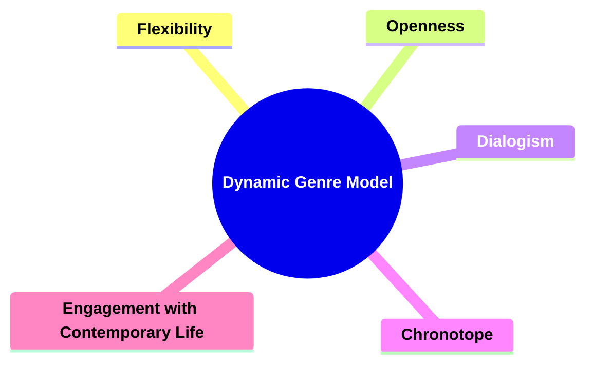


---

### 2. **Key Concepts**

#### 2.1. **Flexibility**

- **Definition**: 
  - Bakhtin highlights the novel’s ability to adapt and evolve, reflecting diverse voices, ideas, and experiences. Unlike the rigid structure of the epic, the novel is open to new forms, allowing it to stay relevant.

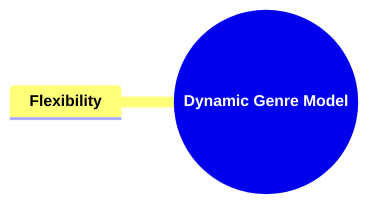


##### 2.1.1. **Components of Flexiblity**
###### 2.1.1.1. **Adaptive**
  - **Definition**: The novel incorporates various styles and voices, adjusting to different contexts, allowing it to respond to changing literary trends, cultural movements, and societal norms.

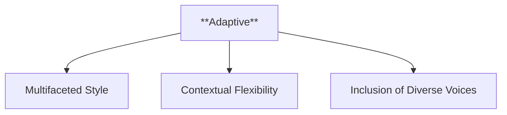

  - **Characteristics**:
    - **Multifaceted Style**: Novels can seamlessly blend different genres, tones, and narrative techniques, making them versatile and adaptable to various themes or settings.
    - **Contextual Flexibility**: The narrative adjusts to different cultural, historical, or social contexts, reflecting the specific concerns of its time while remaining relevant across different eras.
    - **Inclusion of Diverse Voices**: By incorporating multiple voices or perspectives, the novel creates a rich, dynamic form that can adapt to various viewpoints or narrative styles.

---

###### 2.1.1.2. **Evolving**
  - **Definition**: Continuously changes to reflect modern life and cultural shifts, with the novel evolving in form, style, and content as society and human experiences transform.

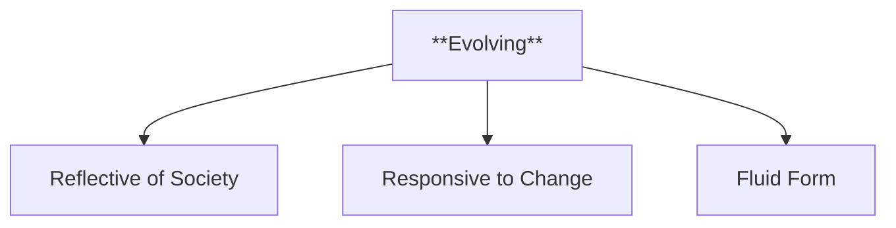

  - **Characteristics**:
    - **Reflective of Society**: As cultural and societal norms shift, novels evolve to incorporate new themes, issues, and storytelling techniques that resonate with contemporary audiences.
    - **Responsive to Change**: Novels adapt to literary movements and innovations, such as modernism, postmodernism, or digital narratives, reflecting the evolving nature of storytelling.
    - **Fluid Form**: The novel's inherent flexibility allows it to evolve without losing its core identity, making it an ever-changing medium that grows with its readers and the world around it.

---

###### 2.1.1.3. **Dialogism**
  - **Definition**: The novel fosters *dialogism,* the interaction between multiple voices and perspectives, contrasting the singular voice of the epic, creating a polyphonic narrative where various ideas, beliefs, and viewpoints coexist and engage with one another.

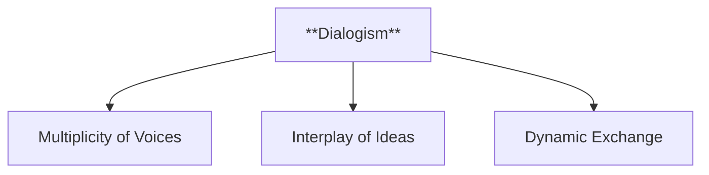

  - **Characteristics**:
    - **Multiplicity of Voices**: Unlike the epic, which often centers on a singular, authoritative voice, the novel encourages the presence of multiple perspectives that interact and sometimes conflict with one another.
    - **Interplay of Ideas**: Dialogism creates a space for different ideologies, social perspectives, or individual experiences to be expressed, debated, and contrasted within the narrative.
    - **Dynamic Exchange**: The novel becomes a platform for a continuous dialogue between characters, narrators, and even the reader, leading to a richer, more nuanced exploration of themes and ideas.

---
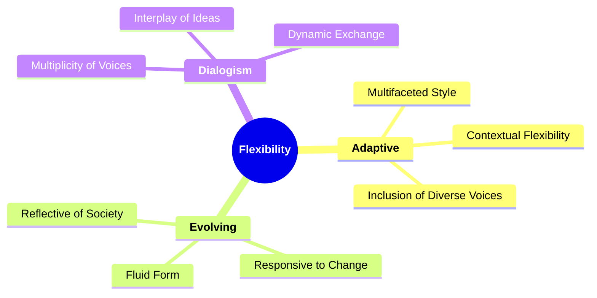
---


#### 2.2. **Openness**

- **Definition**: 
  - The novel’s openness refers to its capacity to incorporate diverse elements and engage with contemporary issues, making it a genre that is constantly interacting with the present rather than glorifying the past.


##### 2.2.1. **Components of Openness**
###### 2.2.1.1. **Inclusive**
  - **Definition**: Embraces a wide range of voices, genres, and styles within a single narrative, allowing for a rich, multifaceted story that reflects diverse perspectives and experiences.

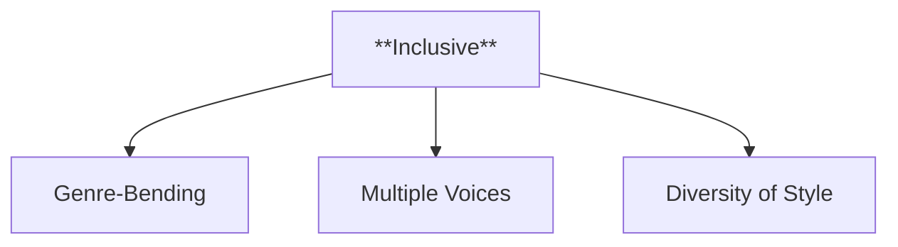

  - **Characteristics**:
    - **Genre-Bending**: The narrative seamlessly incorporates elements from different genres—such as romance, satire, and adventure—creating a complex, layered story.
    - **Multiple Voices**: The inclusion of various narrative voices and viewpoints enhances the depth of the story, providing readers with different angles and experiences within the same narrative.
    - **Diversity of Style**: The novel can shift between different narrative styles, such as stream of consciousness, direct dialogue, or epistolary forms, enhancing its adaptability and richness.

---

###### 2.2.1.2. **Engaged**
  - **Definition**: Addresses contemporary societal, political, and cultural issues, making the novel an active participant in ongoing conversations about the world.

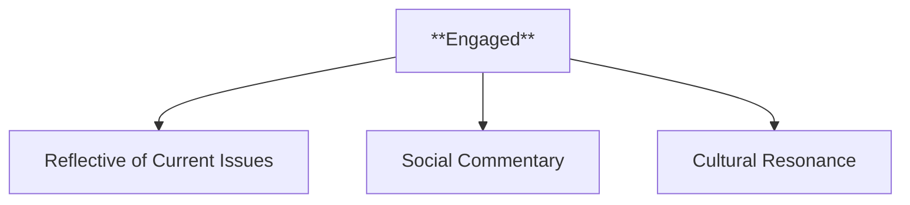

  - **Characteristics**:
    - **Reflective of Current Issues**: The novel often tackles contemporary themes such as class struggle, gender roles, or political conflict, grounding the narrative in the present-day concerns of its audience.
    - **Social Commentary**: Through its characters, plot, and dialogue, the novel critiques societal norms, offering insights or challenges to the status quo.
    - **Cultural Resonance**: The narrative engages with the cultural dynamics of its time, reflecting on the values, challenges, and transformations of the society in which it was produced.

---

###### 2.2.1.3. **Chronotope**
  - **Definition**: Bakhtin introduces the *chronotope*, which refers to the interconnection of time and space in the narrative. The novel’s openness allows it to explore various time periods and locations, creating a more complex representation of life.

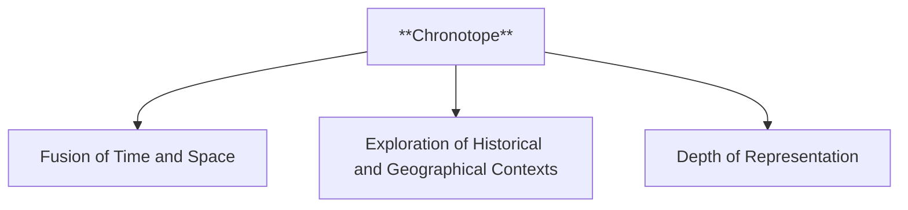

  - **Characteristics**:
    - **Fusion of Time and Space**: The *chronotope* integrates temporal and spatial dimensions, showing how specific time periods and places shape characters, events, and experiences.
    - **Exploration of Historical and Geographical Contexts**: The novel can shift between different eras or locations, offering readers a comprehensive view of how the setting and timeframe influence the narrative.
    - **Depth of Representation**: By exploring time and space together, the novel offers a richer, more nuanced portrayal of life, where historical events, personal experiences, and societal changes intersect and shape the characters’ journeys.

---
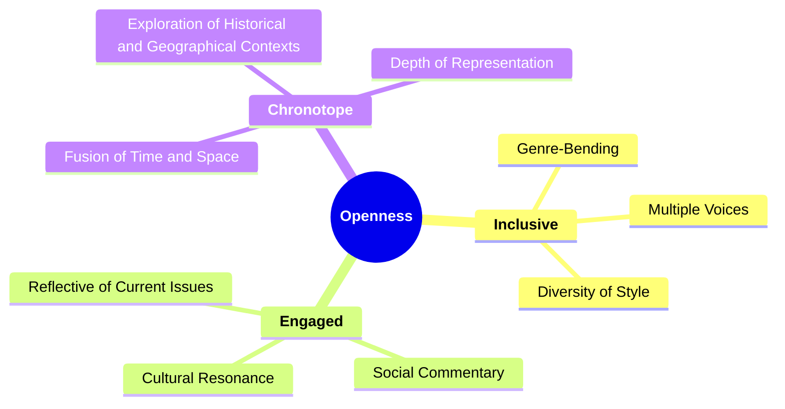

---


#### 2.3. **Dialogism**

- **Definition**: 
  - *Dialogism* is a key feature of the novel, according to Bakhtin. It refers to the interplay of different voices, ideas, and perspectives within the narrative, allowing for a multiplicity of viewpoints rather than a single, authoritative voice.

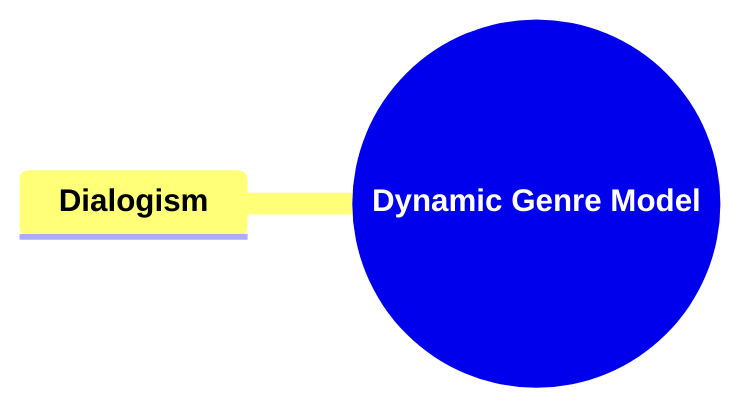


##### 2.3.1. **Components of Dialogism**
###### 2.3.1.1. **Multi-voiced**
  - **Definition**: Involves a variety of perspectives and voices, creating a dynamic narrative where multiple characters or ideologies express their distinct viewpoints, contributing to a richer, more layered story.

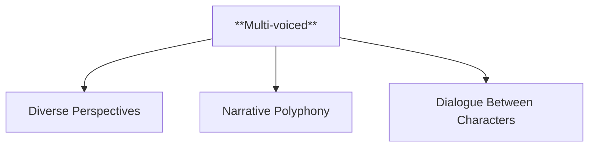

  - **Characteristics**:
    - **Diverse Perspectives**: The novel includes multiple voices or characters that represent different social, cultural, or ideological positions, allowing for a broad exploration of ideas and conflicts.
    - **Narrative Polyphony**: Each voice or perspective is given equal weight, resulting in a "polyphonic" structure where no single voice dominates, enhancing the complexity of the narrative.
    - **Dialogue Between Characters**: The inclusion of various voices promotes dialogue and debate within the text, making the narrative more dynamic and reflective of real-world social discourse.

###### 2.3.1.2. **Interactive**
  - **Definition**: Promotes dialogue between characters, ideas, and the reader, encouraging engagement with multiple viewpoints and inviting readers to actively participate in interpreting the meaning of the text.

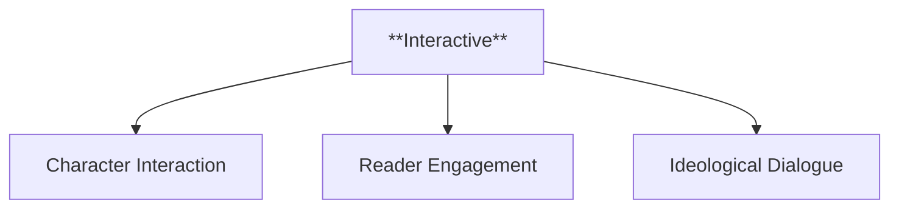

  - **Characteristics**:
    - **Character Interaction**: Characters engage in conversations or debates that reflect contrasting ideologies or moral dilemmas, inviting readers to consider the validity of each perspective.
    - **Reader Engagement**: The narrative encourages the reader to interact with the text by offering multiple interpretations or unresolved tensions, fostering a deeper intellectual and emotional engagement.
    - **Ideological Dialogue**: The novel serves as a platform for the interaction of conflicting ideas, values, or worldviews, where characters' discussions mirror larger societal debates or philosophical inquiries.

###### 2.3.1.3. **Narrative Complexity**
  - **Definition**: Dialogism allows for the coexistence of different truths, characters, and social voices, making the novel an arena for social and ideological discourse, where conflicting perspectives are explored without necessarily resolving them.

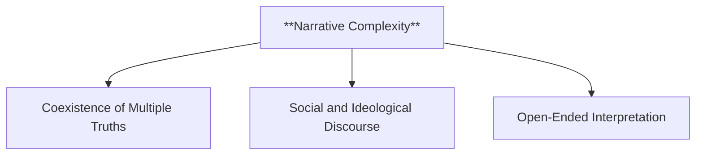

  - **Characteristics**:
    - **Coexistence of Multiple Truths**: The narrative does not present a single, authoritative truth but instead allows for multiple, often contradictory, viewpoints to exist simultaneously, reflecting the complexity of real life.
    - **Social and Ideological Discourse**: The novel becomes a site for exploring various social, political, or philosophical issues, with different characters embodying distinct ideologies or moral stances.
    - **Open-Ended Interpretation**: Dialogism embraces ambiguity and complexity, often leaving key questions or conflicts unresolved, encouraging readers to engage with the ongoing dialogue rather than seeking definitive answers.

---
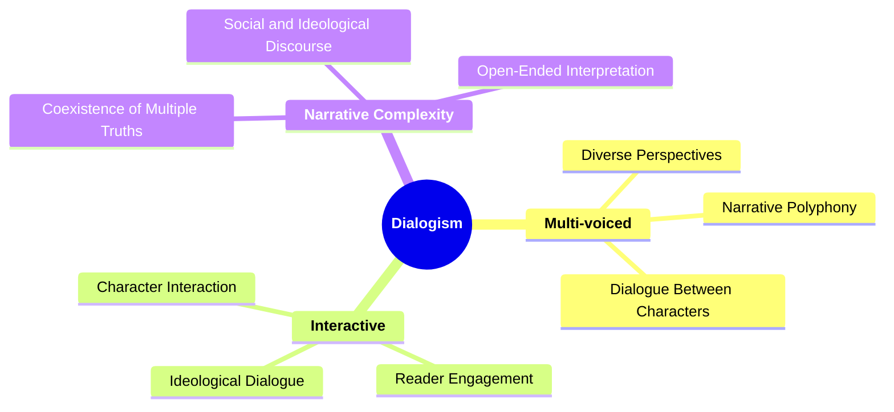

---

#### 2.4. **Chronotope**

- **Definition**: 
  - Bakhtin’s concept of the *chronotope* refers to the intrinsic connection between time and space in the novel. The novel's chronotope allows for a more varied and realistic representation of life, where characters and events can be situated across different temporal and spatial contexts.


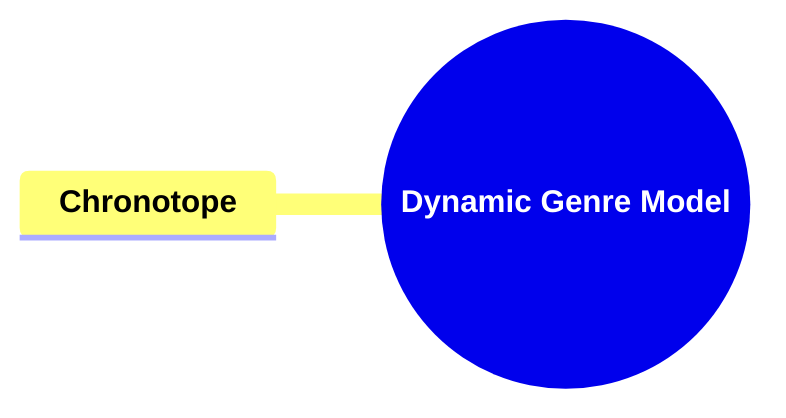


##### 2.4.1. **Components of Chronotope**

###### 2.4.1.1. **Time-Space Interaction**
  - **Definition**: Events are influenced by the time and space in which they occur, emphasizing how the specific temporal and spatial contexts shape the characters’ actions, experiences, and the narrative's progression.

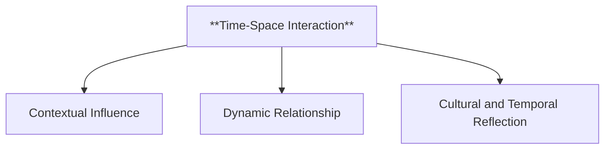

  - **Characteristics**:
    - **Contextual Influence**: The narrative shows how the historical moment or geographical setting directly impacts the unfolding events, decisions, and character development.
    - **Dynamic Relationship**: Time and space are not static; they interact dynamically, affecting how events are perceived and how characters navigate their world.
    - **Cultural and Temporal Reflection**: The interplay between time and space reflects broader cultural, social, and historical trends, grounding the story within a specific context that shapes its meaning.


###### 2.4.1.2. **Flexible Setting**
  - **Definition**: The novel’s setting can shift, accommodating different eras, locations, and societal changes, allowing the narrative to explore various time periods and places without being confined to one static backdrop.

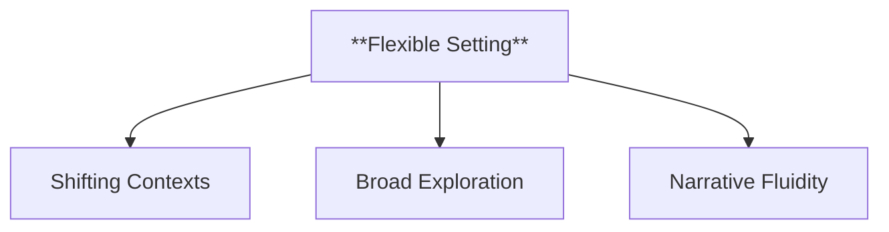

  - **Characteristics**:
    - **Shifting Contexts**: The story may move between different historical periods or locations, reflecting changes in society, technology, or cultural values as the narrative unfolds.
    - **Broad Exploration**: A flexible setting allows the novel to cover a wide range of themes and ideas, offering insights into different eras and locations, which enhance the story's complexity.
    - **Narrative Fluidity**: The ability to shift settings supports a more fluid narrative structure, where time and place adjust to the demands of the story, providing a richer and more varied experience for the reader.


###### 2.4.1.3. **Realistic Representation**
  - **Definition**: The chronotope reflects the movement of time and the changing social landscapes, adding depth to the narrative by showing how historical, cultural, and spatial shifts influence the characters and events.

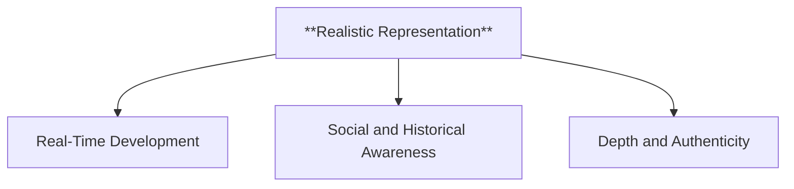

  - **Characteristics**:
    - **Real-Time Development**: The passage of time and evolution of social conditions are portrayed realistically, with the characters and plot being shaped by the specific temporal and spatial contexts they inhabit.
    - **Social and Historical Awareness**: The narrative reflects the changing social landscapes, acknowledging how different time periods bring shifts in values, power structures, and individual experiences.
    - **Depth and Authenticity**: By accurately representing the movement of time and societal changes, the chronotope lends the story a sense of realism and depth, grounding even fantastical elements in a believable framework.

```mermaid
mindmap
  root((**Chronotope**))
    **Time-Space Interaction**
      Contextual Influence
      Dynamic Relationship
      Cultural and Temporal Reflection
    **Flexible Setting**
      Shifting Contexts
      Broad Exploration
      Narrative Fluidity
    **Realistic Representation**
      Real-Time Development
      Social and Historical Awareness
      Depth and Authenticity
```

---

#### 2.5. **Engagement with Contemporary Life**

- **Definition**: 
  - Bakhtin emphasizes that the novel engages directly with the realities of contemporary life, incorporating current social, political, and cultural concerns into its narrative structure.

```mermaid
mindmap
  root((**Dynamic Genre Model**))
    **Engagement with Contemporary Life**
```

---
```mermaid
mindmap
  root((**Dynamic Genre Model**))
    **Flexibility**
      Adaptive
        Multifaceted Style
        Contextual Flexibility
        Inclusion of Diverse Voices
      Evolving
        Reflective of Society
        Responsive to Change
        Fluid Form
      Dialogism
        Multi-voiced
        Interactive
        Narrative Complexity
    **Openness**
      Inclusive
        Genre-Bending
        Multiple Voices
        Diversity of Style
      Engaged
        Reflective of Current Issues
        Social Commentary
        Cultural Resonance
      Chronotope
        Time-Space Interaction
        Flexible Setting
        Realistic Representation
    **Dialogism**
      Multi-voiced
        Diverse Perspectives
        Narrative Polyphony
        Dialogue Between Characters
      Interactive
        Character Interaction
        Reader Engagement
        Ideological Dialogue
      Narrative Complexity
        Coexistence of Multiple Truths
        Social and Ideological Discourse
        Open-Ended Interpretation
    **Chronotope**
      Time-Space Interaction
        Contextual Influence
        Dynamic Relationship
        Cultural and Temporal Reflection
      Flexible Setting
        Shifting Contexts
        Broad Exploration
        Narrative Fluidity
      Realistic Representation
        Real-Time Development
        Social and Historical Awareness
        Depth and Authenticity
    **Engagement with Contemporary Life**
      Inclusive
        Addressing Modern Themes
        Resonance with Present-Day Audiences
      Interactive
        Reader and Author Engagement
        Social Relevance
```

---

##### 2.5.1. **Components of Engagement with Contemporary Life**

###### 2.5.1.1. **Reflective**
  - **Definition**: The novel mirrors current societal changes and issues, providing a narrative that engages with and reflects on the cultural, political, and social shifts happening within the society at the time of its writing.
  - **Characteristics**:
    - **Cultural Mirror**: The novel captures the essence of its era, portraying the struggles, advancements, and conflicts within society, thus reflecting the ongoing societal transformations.
    - **Engagement with Social Change**: The narrative often tackles themes such as technological progress, political movements, or shifts in social norms, demonstrating how individuals and communities are affected by broader societal trends.
    - **Timely Commentary**: The novel remains connected to the present moment by exploring contemporary issues, ensuring that its themes and concerns resonate with readers.


###### 2.5.1.2. **Relevant**
  - **Definition**: Directly addresses contemporary problems and cultural shifts, ensuring that the novel remains pertinent to its readers by engaging with issues that are relevant to their daily lives and societal concerns.
  - **Characteristics**:
    - **Contemporary Engagement**: The novel highlights issues that are significant in the present day, such as political upheaval, environmental crises, or social justice movements.
    - **Immediate Relevance**: The themes and conflicts within the novel resonate with current events, making the story feel timely and aligned with ongoing cultural conversations.
    - **Connection to Modern Readers**: By focusing on contemporary problems, the narrative creates a stronger connection with readers, who see their own experiences and struggles reflected in the story.


###### 2.5.1.3. **Social Critique**
  - **Definition**: Many novels use their flexibility and openness to critique contemporary social structures and norms, offering a critical perspective on the inequalities, injustices, or flaws within societal systems.
  - **Characteristics**:
    - **Examination of Power Dynamics**: The novel often critiques societal power structures, such as class hierarchies, gender roles, or political systems, questioning the status quo and highlighting areas in need of reform.
    - **Challenging Norms**: Through its characters, plot, and setting, the novel challenges established social norms, encouraging readers to question the assumptions and ideologies that govern their society.
    - **Reflective of Social Injustices**: Many novels focus on marginalized voices or highlight societal inequalities, using their narratives to expose injustices and advocate for change.


---

### 3. **Examples of the Dynamic Novel**

- **Definition**: 
  - The novel’s flexibility and openness have allowed it to evolve continuously, exemplified in works that incorporate multiple genres, voices, and experimental forms, pushing the boundaries of traditional storytelling.

- **Supporting Information**:
  - **Don Quixote**: A pioneering example of the novel’s dialogic nature, *Don Quixote* plays with narrative form, combining elements of satire, romance, and realism, while commenting on contemporary Spanish society.
  - **Ulysses**: James Joyce’s *Ulysses* embodies the novel’s dynamic qualities, experimenting with narrative techniques, stream of consciousness, and multiple perspectives to capture the complexity of modern life.
