- [1. **Title: Herman's Temporal Logic in Narrative Framework**](#1-title-hermans-temporal-logic-in-narrative-framework)
- [2. **Key Concepts**](#2-key-concepts)
  - [2.1. **Temporal Manipulation**](#21-temporal-manipulation)
    - [2.1.1. **Components of Temporal Manipulation**](#211-components-of-temporal-manipulation)
      - [2.1.1.1. **Anachrony**](#2111-anachrony)
      - [2.1.1.2. **Foreshadowing**](#2112-foreshadowing)
      - [2.1.1.3. **Flashbacks (Analepsis)**](#2113-flashbacks-analepsis)
      - [2.1.1.4. **Non-linear Narratives**](#2114-non-linear-narratives)
  - [2.2. **Cognitive Dimensions of Temporal Logic**](#22-cognitive-dimensions-of-temporal-logic)
    - [2.2.1. **Components of Cognitive Dimensions of Temporal Logic**](#221-components-of-cognitive-dimensions-of-temporal-logic)
      - [2.2.1.1. **Mental Reconstruction of Timelines**](#2211-mental-reconstruction-of-timelines)
      - [2.2.1.2. **Inference of Event Relationships**](#2212-inference-of-event-relationships)
      - [2.2.1.3. **Sequential Processing**](#2213-sequential-processing)
      - [2.2.1.4. **Temporal Anchors**](#2214-temporal-anchors)
      - [2.2.1.5. **Causal Links**](#2215-causal-links)
      - [2.2.1.6. **Temporal Overlaps**](#2216-temporal-overlaps)
- [3. **Theoretical Significance**:](#3-theoretical-significance)


---
### 1. **Title: Herman's Temporal Logic in Narrative Framework**

**Temporal Logic in Narrative**:
   **Definition**: David Herman’s framework explores how narratives manipulate time to shape meaning and influence the reader’s experience. Through techniques like anachrony, foreshadowing, and flashbacks, narratives enhance thematic and emotional impact. Herman's approach connects narrative structures with cognitive processes, examining how readers understand and interpret time in storytelling.

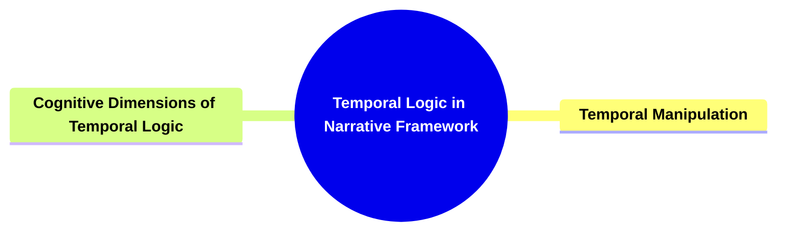

---

### 2. **Key Concepts**

#### 2.1. **Temporal Manipulation**

**Definition**:
   Temporal manipulation involves altering the sequence, duration, or frequency of events in a narrative to shape how the story unfolds and is experienced by the reader.

```mermaid
mindmap
  root((**Temporal Manipulation**))
    **Anachrony**
    **Foreshadowing**
    **Flashbacks (Analepsis)**
    **Non-linear Narratives**
```

##### 2.1.1. **Components of Temporal Manipulation**

###### 2.1.1.1. **Anachrony**
  - **Definition**: The reordering of events in a non-linear sequence through flashbacks (*analepsis*) or flashforwards (*prolepsis*).

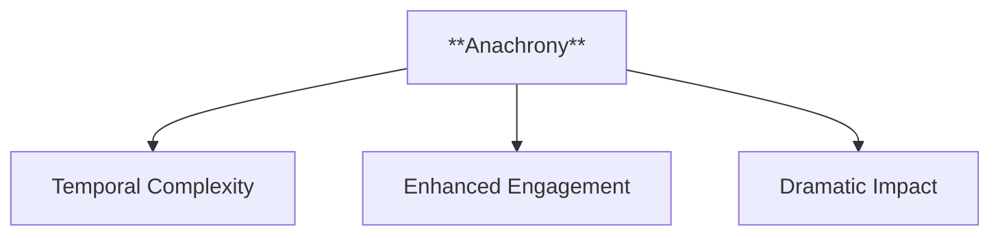

  - **Characteristics**
    - **Temporal Complexity**: Creates a layered narrative structure that deepens the plot by revealing events out of sequence.
    - **Enhanced Engagement**: Encourages readers to piece together the timeline, promoting active reading and interpretation.
    - **Dramatic Impact**: Heightens suspense and emotional effect by revealing pivotal moments in a non-linear fashion.

---

###### 2.1.1.2. **Foreshadowing**
  - **Definition**: Hints or clues about future events, creating suspense and anticipation.

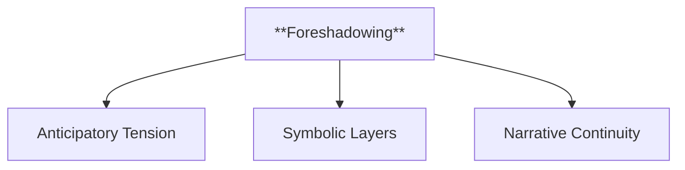

  - **Characteristics**
    - **Anticipatory Tension**: Builds suspense by hinting at significant future developments, keeping readers intrigued.
    - **Symbolic Layers**: Incorporates symbols or subtle details that take on greater meaning as the story progresses.
    - **Narrative Continuity**: Connects different parts of the story cohesively, ensuring events unfold with a sense of purpose and inevitability.

---

###### 2.1.1.3. **Flashbacks (Analepsis)**
  - **Definition**: Revisiting past events to provide essential background or context.

```mermaid
flowchart TD
    I[**Flashbacks (Analepsis)**] --> J[Character Revelation]
    I --> K[Narrative Enrichment]
    I --> L[Emotional Weight]
```

  - **Characteristics**
    - **Character Revelation**: Offers insight into characters' pasts, explaining motivations and shaping present actions.
    - **Narrative Enrichment**: Adds depth by blending past and present, allowing for multi-dimensional storytelling.
    - **Emotional Weight**: Strengthens the narrative by invoking past events that resonate emotionally with current scenes.

---

###### 2.1.1.4. **Non-linear Narratives**
  - **Definition**: Disjointed timelines that challenge readers to reconstruct the chronological order.

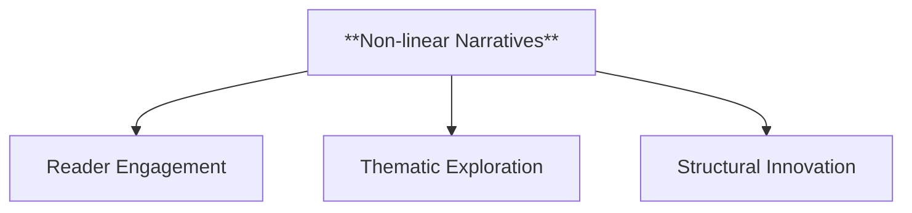

  - **Characteristics**
    - **Reader Engagement**: Promotes an active reading experience by requiring readers to organize and interpret events themselves.
    - **Thematic Exploration**: Emphasizes recurring themes or motifs by contrasting different time periods and their impacts on the narrative.
    - **Structural Innovation**: Breaks from conventional storytelling to present a more dynamic, complex plot, often enhancing mystery and suspense.

---
### 2.2. **Cognitive Dimensions of Temporal Logic**

**Definition**:
   Herman also examines the cognitive aspects of how readers process and understand narrative time, focusing on how readers mentally reconstruct timelines and infer relationships between events.

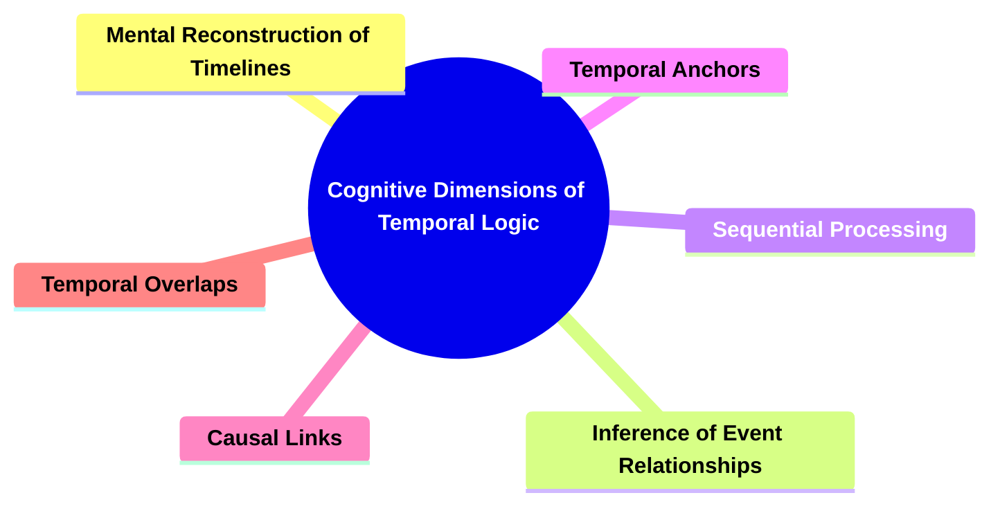

##### 2.2.1. **Components of Cognitive Dimensions of Temporal Logic**

###### 2.2.1.1. **Mental Reconstruction of Timelines**
  - **Definition**: The process by which readers piece together chronological sequences in a story to form a coherent timeline.

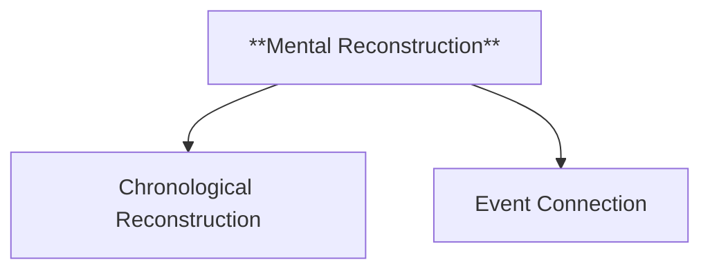

  - **Characteristics**
    - **Chronological Reconstruction**: The act of arranging events in order to form a clear timeline, enhancing the reader's understanding of the narrative flow.
    - **Event Connection**: The ability to link different moments in the story, creating a continuous narrative that informs the reader's perception.

---

###### 2.2.1.2. **Inference of Event Relationships**
   - **Definition**: The cognitive ability of readers to deduce and understand how different events in the narrative are connected or interrelated.

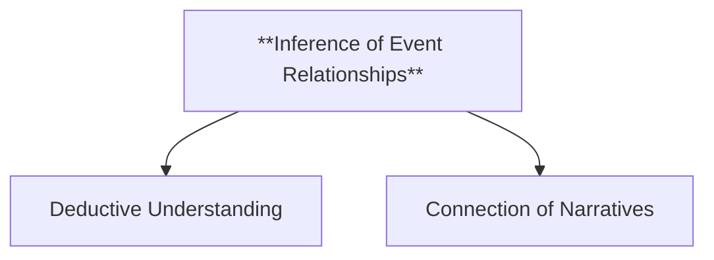

  - **Characteristics**
    - **Deductive Understanding**: Involves drawing logical conclusions about the relationships between events, fostering deeper comprehension.
    - **Connection of Narratives**: Recognizes and links separate parts of the story to create a unified interpretation of how events relate.

---

###### 2.2.1.3. **Sequential Processing** 
   - **Definition**: A method used by readers to interpret and maintain the chronological flow of events, ensuring coherence in the understanding of time.

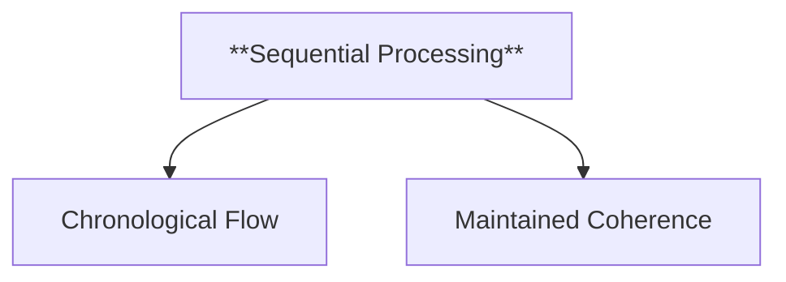

  - **Characteristics**
    - **Chronological Flow**: Ensures that the sequence of events follows a logical progression, aiding in narrative clarity.
    - **Maintained Coherence**: Supports a consistent narrative structure, allowing readers to easily follow the timeline.

---

###### 2.2.1.4. **Temporal Anchors** 
   - **Definition**: Specific references or moments within the narrative that help ground the reader's comprehension of when events take place.

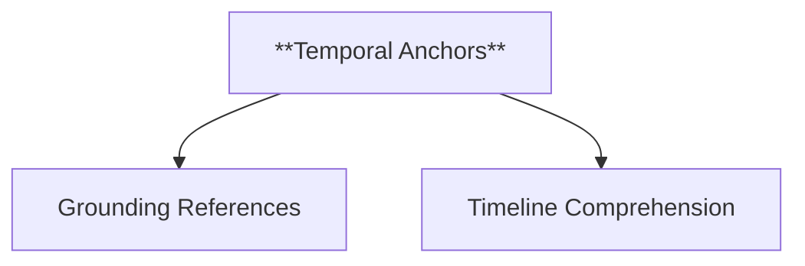

  - **Characteristics**
    - **Grounding References**: Provides specific time markers that anchor the narrative, ensuring readers are aware of when events occur.
    - **Timeline Comprehension**: Enhances the understanding of the sequence and placement of events in the story.

---

###### 2.2.1.5. **Causal Links**
   - **Definition**: The connections where one event leads to or causes another, creating a logical progression within the narrative.

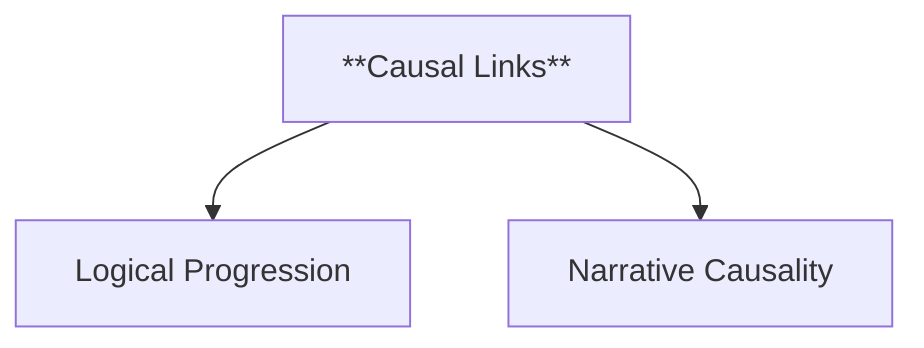

  - **Characteristics**
    - **Logical Progression**: Demonstrates how one event directly leads to another, creating a chain of causality that supports the narrative's flow.
    - **Narrative Causality**: Establishes clear cause-and-effect relationships between events, contributing to a cohesive story structure.

---

###### 2.2.1.6. **Temporal Overlaps** 
   - **Definition**: Situations where events share the same timeframe, requiring readers to understand simultaneous occurrences within the story.

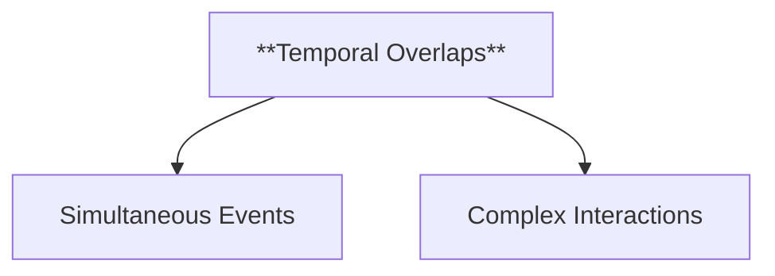

  - **Characteristics**
    - **Simultaneous Events**: The occurrence of multiple events at the same time, which adds depth to the narrative and challenges readers to follow parallel actions.
    - **Complex Interactions**: Highlights the interplay between events that occur concurrently, enhancing the intricacy of the plot.

---

### 3. **Theoretical Significance**:
   - **Impact on Narrative Theory**: Herman’s Temporal Logic in Narrative Framework has significantly influenced narrative theory, particularly in understanding how the manipulation of time shapes the structure and meaning of a story. By integrating cognitive perspectives, Herman’s framework offers a comprehensive approach to analyzing narrative time, highlighting the interplay between narrative techniques and the reader’s mental processes. His work provides valuable tools for exploring how narratives create complex temporal structures that engage readers and convey deeper thematic content.
   - **Application Across Media**: Herman’s concepts are applicable across various narrative forms, including literature, film, theater, and interactive media such as video games. The manipulation of time is a fundamental aspect of storytelling in these media, and Herman’s framework offers insights into how these temporal structures influence the audience’s engagement and interpretation across different formats.
    - **Supporting Information**:
      - **Interdisciplinary Influence**: Herman’s exploration of temporal logic in narrative has influenced not only literary and narrative theory but also fields such as cognitive science and psychology, where the understanding of how humans perceive and process time is of significant interest. His work bridges the gap between narrative studies and cognitive approaches, offering a richer understanding of how time functions in storytelling.
      - **Critiques and Further Development**: While Herman’s framework is highly influential, some critics argue that it may prioritize the technical aspects of temporal manipulation over other narrative elements, such as character development or emotional resonance. However, his work continues to be developed and integrated with other narrative theories, providing a holistic understanding of how time functions in storytelling and its impact on the reader’s experience.

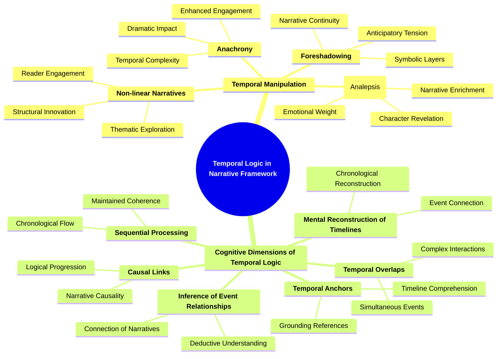

--- 