- [1. Title: **Herman's Narrative Worlds Framework**](#1-title-hermans-narrative-worlds-framework)
- [2. **Key Concepts**](#2-key-concepts)
  - [2.1. **Possible Worlds Theory**](#21-possible-worlds-theory)
    - [2.1.1. **Components of Possible Worlds Theory**](#211-components-of-possible-worlds-theory)
      - [2.1.1.1. **Characters**](#2111-characters)
      - [2.1.1.2. **Agency**](#2112-agency)
      - [2.1.1.3. **Alternate Realities**](#2113-alternate-realities)
  - [2.2. **World-Building**](#22-world-building)
    - [2.2.1. **Components of World-Building**](#221-components-of-world-building)
      - [2.2.1.1. **Cultural Frameworks**](#2211-cultural-frameworks)
      - [2.2.1.2. **Geographical Environment**](#2212-geographical-environment)
      - [2.2.1.3. **Physical Environment**](#2213-physical-environment)
      - [2.2.1.4. **Historical Background**](#2214-historical-background)
  - [2.3. **Immersive Storytelling**:](#23-immersive-storytelling)
    - [2.3.1. **Components of Immersive Storytelling**](#231-components-of-immersive-storytelling)
      - [2.3.1.1. **Descriptive Language**](#2311-descriptive-language)
      - [2.3.1.2. **Character Development**](#2312-character-development)
      - [2.3.1.3. **Consistent Narrative Logic**](#2313-consistent-narrative-logic)

---

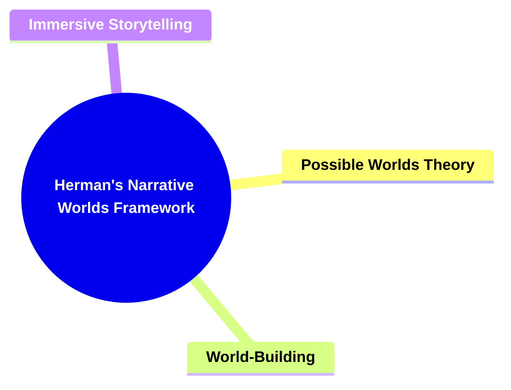

---

### 1. Title: **Herman's Narrative Worlds Framework**

- **Narrative Worlds**:
  - **Definition**: Herman introduces the concept of _narrative worlds,_ which are the imagined environments that narratives create, housing characters and events. These worlds are constructed through language and function as spaces for exploring hypothetical scenarios, ethical dilemmas, and alternative realities.

---

### 2. **Key Concepts**

#### 2.1. **Possible Worlds Theory**

- **Definition**:
  - Herman’s concept of narrative worlds is closely aligned with possible worlds theory, a framework in philosophy and literary theory that explores the idea of multiple, alternate realities. In this context, narrative worlds are seen as self-contained, imagined environments that exist parallel to the real world. These worlds are crafted through the narrative and provide a space where characters interact, events unfold, and themes are explored.

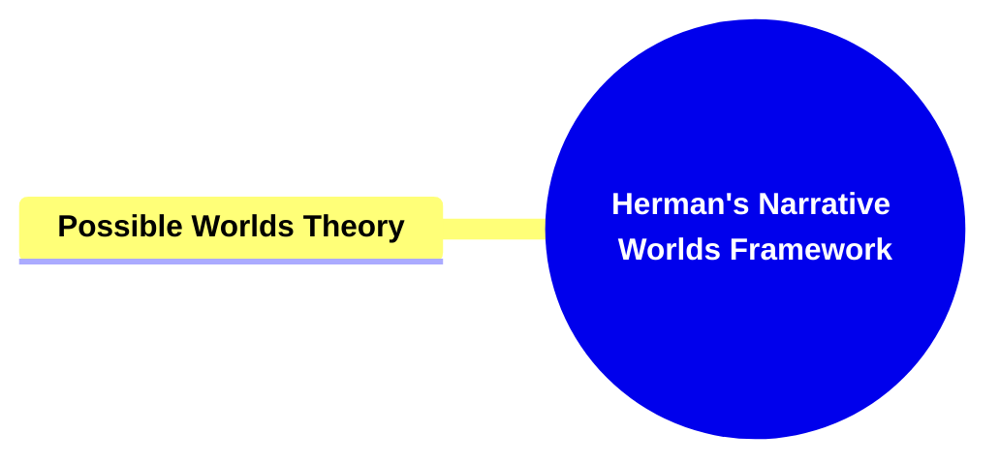

##### 2.1.1. **Components of Possible Worlds Theory**

###### 2.1.1.1. **Characters**

- **Definition**: Characters in possible worlds serve as the agents who experience, influence, and navigate different realities within the narrative, shaped by the unique contexts of their respective worlds.

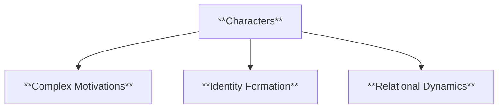

- **Characteristics**
  - **Complex Motivations**: The motivations of characters are often shaped by the unique conditions of their world, influencing how they act and respond across alternate realities.
  - **Identity Formation**: Characters’ identities are crafted in relation to the specific rules, cultural norms, and environments of their world, creating a diverse cast across possible worlds.
  - **Relational Dynamics**: The relationships between characters are influenced by the structure of their reality, impacting alliances, conflicts, and emotional connections in unique ways.

###### 2.1.1.2. **Agency**

- **Definition**: Agency in possible worlds refers to the capacity of characters to make decisions and take actions that impact the course of events, both within their own world and across multiple realities.

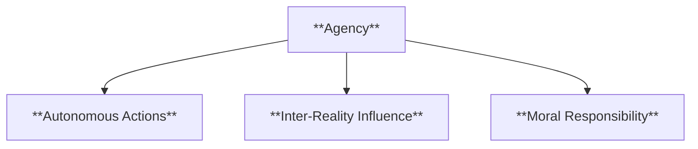

- **Characteristics**
  - **Autonomous Actions**: Characters exercise agency by making choices that shift the trajectory of events, often setting off ripple effects that influence other worlds.
  - **Inter-Reality Influence**: Some characters have the ability to traverse or impact multiple worlds, amplifying the reach and consequences of their decisions.
  - **Moral Responsibility**: Characters with agency face moral and ethical decisions, as their actions can have significant impacts on their own reality and potentially on others.

###### 2.1.1.3. **Alternate Realities**

- **Definition**: In Possible Worlds Theory, alternate realities refer to the different versions of reality created within a narrative, each with its own unique set of rules, characters, and outcomes.

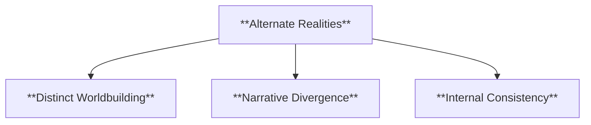

- **Characteristics**
  - **Distinct Worldbuilding**: Each alternate reality is meticulously constructed with unique settings, histories, and societal norms that differentiate it from the primary world.
  - **Narrative Divergence**: Events within alternate realities may follow paths that diverge significantly from the main story, allowing exploration of “what-if” scenarios.
  - **Internal Consistency**: Although distinct, these realities maintain their own logic and coherence, ensuring that they are believable within the context of the narrative.

#### 2.2. **World-Building**

- **Definition**: The process of constructing a detailed and coherent narrative world, complete with its own rules, cultures, and histories.

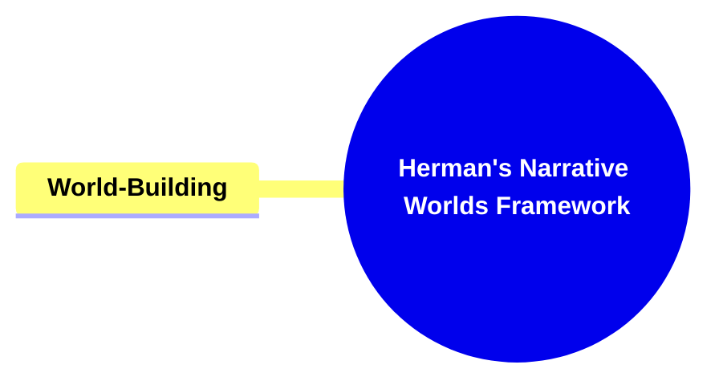

##### 2.2.1. **Components of World-Building**

###### 2.2.1.1. **Cultural Frameworks**

- **Definition**: The inclusion of social norms, traditions, languages, and belief systems that define how characters interact and how societies function within the narrative world.

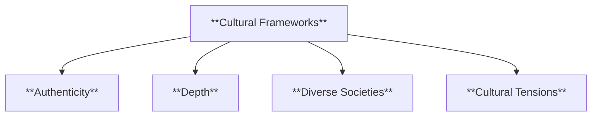

- **Characteristics**
  - **Authenticity**: Detailed cultural elements lend believability, making the environment feel genuine and true to life.
  - **Depth**: Rich cultural details add layers to the setting, creating an immersive and complex world that feels lived-in.
  - **Diverse Societies**: Multiple cultures or groups within the world provide complexity and a range of perspectives.
  - **Cultural Tensions**: Conflicts and interactions between different cultures can drive plotlines and enrich character development.

###### 2.2.1.2. **Geographical Environment**

- **Definition**: The depiction of landscapes, regions, and natural features within a narrative that create a sense of place and shape the interactions of characters and events.

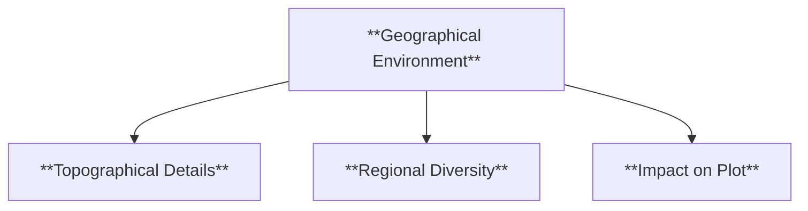

- **Characteristics**
  - **Topographical Details**: Incorporates mountains, rivers, forests, and other landforms to create a realistic and immersive setting.
  - **Regional Diversity**: Includes varied geographical areas that influence cultures, travel, and conflicts within the story.
  - **Impact on Plot**: The geographical layout can drive the story's direction by influencing character movement and strategic decisions.

###### 2.2.1.3. **Physical Environment**

- **Definition**: The immediate physical surroundings, including climate, architecture, and constructed spaces that characters inhabit and navigate within the narrative.

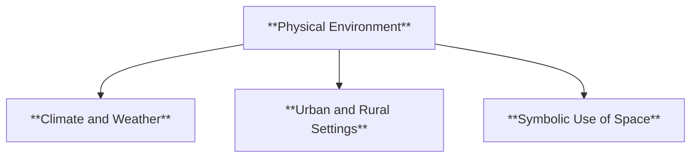

- **Characteristics**
  - **Climate and Weather**: Descriptions of weather conditions and climate add atmosphere and can symbolize thematic elements.
  - **Urban and Rural Settings**: Differentiates between cityscapes, villages, and wilderness, affecting character interactions and plot development.
  - **Symbolic Use of Space**: Physical locations, such as grand halls or desolate wastelands, can represent broader themes or character states.

###### 2.2.1.4. **Historical Background**

- **Definition**: The backstory and timeline of events that have shaped the current state of the narrative world, including significant moments, influential figures, and societal shifts.

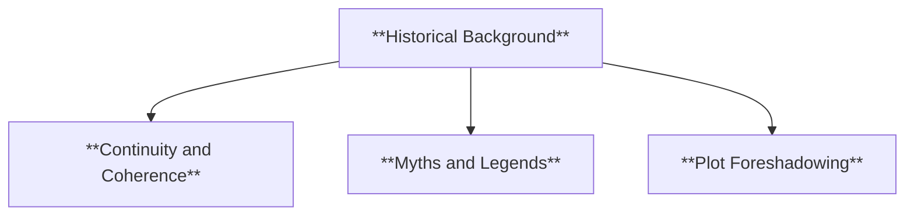

- **Characteristics**
  - **Continuity and Coherence**: A well-crafted history ensures that the world’s present state makes sense and adds depth to the narrative.
  - **Myths and Legends**: Inclusion of stories or myths within the world’s history can enrich its culture and influence character beliefs and actions.
  - **Plot Foreshadowing**: Historical events may provide context for current conflicts or foreshadow future plot developments.

#### 2.3. **Immersive Storytelling**:

- **Definition**: The use of descriptive language, character development, and narrative structure to draw readers into the narrative world, making them feel as though they are part of the story.

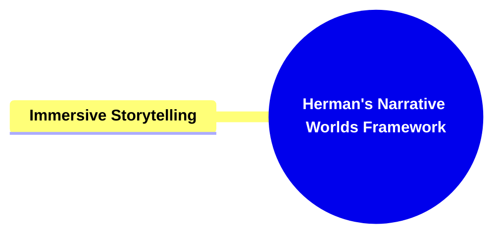

##### 2.3.1. **Components of Immersive Storytelling**

###### 2.3.1.1. **Descriptive Language**

- **Definition**: The use of detailed and vivid descriptions that appeal to the senses to create a rich narrative environment.

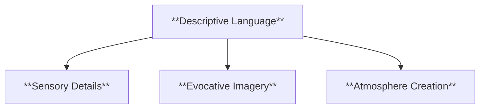

- **Characteristics**
  - **Sensory Details**: Incorporates sight, sound, smell, taste, and touch to make scenes come alive and feel tangible.
  - **Evocative Imagery**: Utilizes metaphor and simile to paint pictures in the reader’s mind, enhancing the narrative's depth and engagement.
  - **Atmosphere Creation**: Sets the tone and mood, allowing readers to emotionally connect with the setting and events.

###### 2.3.1.2. **Character Development**

- **Definition**: The process of creating complex, relatable characters whose motivations, backstories, and evolution draw readers deeper into the story.

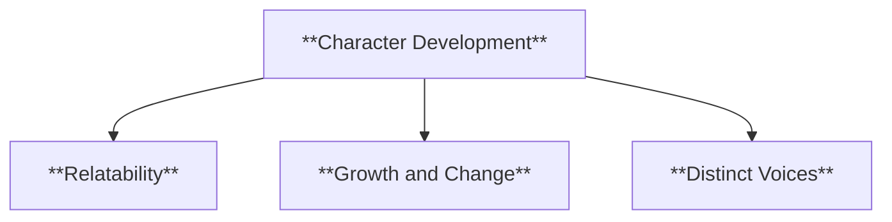

- **Characteristics**
  - **Relatability**: Characters have flaws, desires, and emotions that resonate with readers, making them feel authentic.
  - **Growth and Change**: Characters evolve throughout the story, showing development that keeps readers invested.
  - **Distinct Voices**: Each character has a unique way of speaking and behaving, adding realism and making them memorable.

###### 2.3.1.3. **Consistent Narrative Logic**

- **Definition**: A coherent and believable narrative structure that follows its own rules and internal logic, enabling readers to become fully immersed without being distracted by inconsistencies.

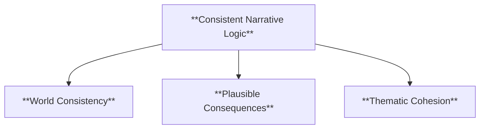

- **Characteristics**
  - **World Consistency**: Ensures that the rules of the narrative world remain constant, helping maintain suspension of disbelief.
  - **Plausible Consequences**: Events in the story logically follow from character actions and world conditions, creating believable outcomes.
  - **Thematic Cohesion**: Aligns the narrative’s events and character arcs with overarching themes, reinforcing the immersive experience.

---

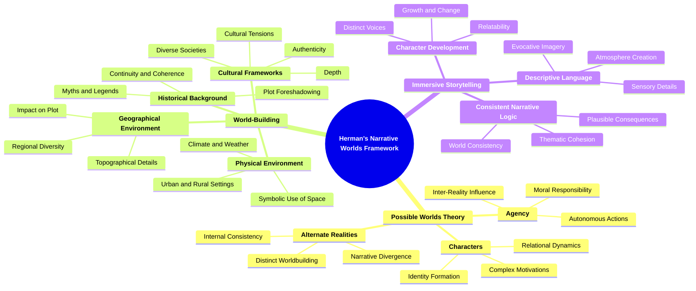
