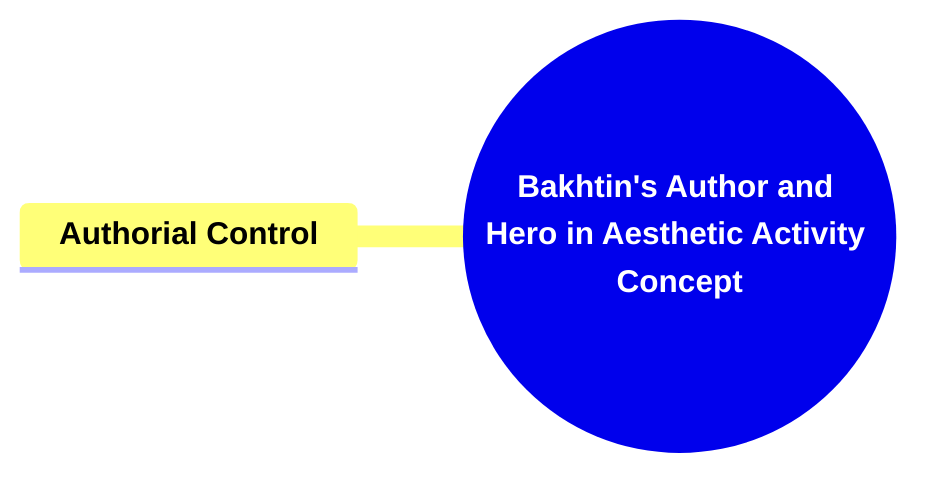

- [1. Title: **Bakhtin's Author and Hero in Aesthetic Activity Concept**](#1-title-bakhtins-author-and-hero-in-aesthetic-activity-concept)
- [2. **Key Concepts**:](#2-key-concepts)
  - [2.1. **Authorial Control**:](#21-authorial-control)
    - [2.1.1. **Components of Authorial Control**](#211-components-of-authorial-control)
      - [2.1.1.1. **Ethical Responsibility**](#2111-ethical-responsibility)
      - [2.1.1.2. **Power**](#2112-power)
      - [2.1.1.3. **Agency**](#2113-agency)
      - [2.1.1.4. **Aesthetic Considerations**](#2114-aesthetic-considerations)

---

---

### 1. Title: **Bakhtin's Author and Hero in Aesthetic Activity Concept**

- **Author and Hero in Aesthetic Activity**:
  - **Definition**: In his early work, Mikhail Bakhtin explores the intricate relationship between the author and the hero (or protagonist) in literary works. He delves into how the author constructs the hero’s world, considering not only the creative process but also the ethical implications involved in shaping the character's narrative and actions. This exploration serves as a precursor to Bakhtin's later, more developed theories on dialogism, polyphony, and the ethical dimensions of narrative.

### 2. **Key Concepts**:

#### 2.1. **Authorial Control**:

- **Definition**: Authorial control refers to the power and responsibility the author holds in determining the course of the narrative and the actions of the protagonist. Bakhtin views this control as an ethical act, where the author’s decisions in shaping the hero’s fate are not just artistic choices but also moral ones. The way an author constructs a character’s world, choices, and destiny reflects broader concerns about agency, power, and moral values within the narrative.

##### 2.1.1. **Components of Authorial Control**

###### 2.1.1.1. **Ethical Responsibility**

- **Definition**: The author’s creative decisions shape the moral universe of the narrative, reflecting their stance on ethical issues and influencing how readers perceive concepts such as justice, autonomy, and morality.
- **Characteristics**
  - **Moral Framework**: The narrative presents a clear moral structure that guides the hero’s journey and challenges, embodying the author’s ethical beliefs.
  - **Portrayal of Good and Evil**: The depiction of conflicts and resolutions communicates underlying moral values, highlighting what is considered just or unjust.
  - **Impact on Readers**: The ethical dimensions of the story invite readers to reflect on their own beliefs and question moral and ethical dilemmas presented in the narrative.

###### 2.1.1.2. **Power**

- **Definition**: The author’s influence in shaping the narrative reflects themes of power, highlighting who or what controls the progression of events and the hero’s journey.
- **Characteristics**
  - **Authorial Control**: Demonstrates the extent of the author’s impact on the story’s direction and outcomes, showing how power is wielded within the narrative.
  - **External Forces**: Highlights the presence of external powers or systems that influence characters and shape the narrative, emphasizing the role of fate, destiny, or social constructs.
  - **Symbolic Representation**: Power dynamics within the story often serve as metaphors for real-world issues, portraying conflicts between individuals, groups, or ideologies.

###### 2.1.1.3. **Agency**

- **Definition**: Refers to the capacity of characters, particularly the hero, to make choices and take actions that affect the course of the narrative and demonstrate their autonomy.
- **Characteristics**
  - **Character Autonomy**: The degree to which characters are free to make their own decisions, showing their influence over the plot.
  - **Decision-Making**: Portrays the hero’s ability to navigate challenges through their own choices, highlighting themes of independence and self-determination.
  - **Interaction with Constraints**: Agency is often depicted in contrast to external limitations, such as societal rules or powerful antagonists, emphasizing the struggle for control and freedom.

###### 2.1.1.4. **Aesthetic Considerations**

- **Definition**: The author’s creative choices are not only ethical but also aesthetic, balancing moral implications with artistic expression to create a narrative that resonates on multiple levels.
- **Characteristics**
  - **Artistic Integrity**: Ensures that the narrative maintains a balance between ethical storytelling and artistic freedom.
  - **Stylistic Choices**: The use of language, structure, and literary devices adds depth and beauty to the story, enhancing its appeal.
  - **Reader Experience**: A well-crafted balance between aesthetics and ethics results in a narrative that engages readers both emotionally and intellectually.
