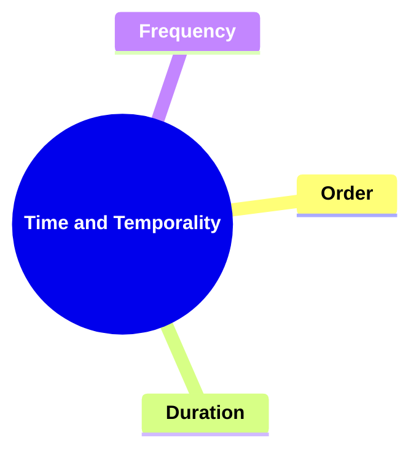
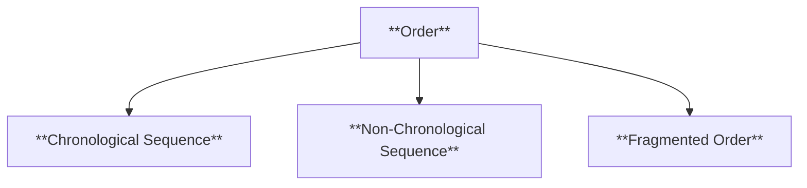
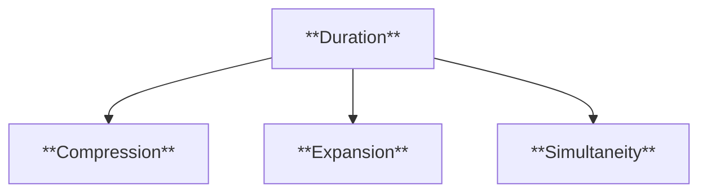
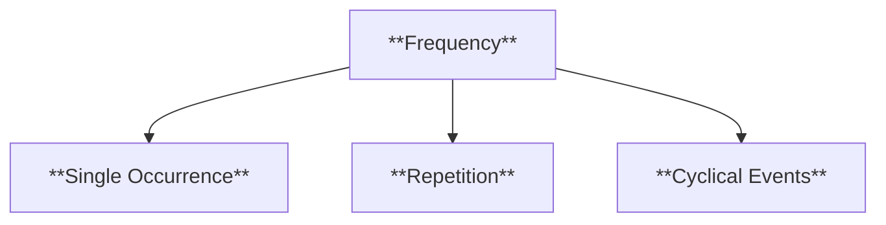
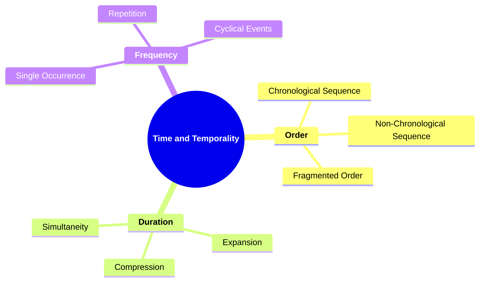

# 08 TT-3404 TIME AND TEMPORALITY

### **Time and Temporality**

- **Examining how time is manipulated in the narrative.**
  - **Elements**:
    - **Order**: Sequence of events (chronological or non-chronological).
    - **Duration**: Relationship between story time and discourse time.
    - **Frequency**: How often events occur in the narrative.
  - **Importance**: Builds on plot analysis; introduces complexity in time manipulation.

---

### **Key Concepts**

---

#### **Time and Temporality**

- **Definition**:
  - In narratology, time and temporality refer to the ways in which time is structured, represented, and manipulated within a narrative. This encompasses the sequence of events, the pacing of the story, and the relationship between the narrative timeline and the reader's perception of time.

##### **Components of Time and Temporality**

###### **Order**

- **Definition**:
  - The arrangement of events in the narrative, determining whether they follow a chronological sequence or are presented out of order to achieve specific effects.

- **Characteristics**:
  - **Chronological Sequence**: Events are presented in the order they occur in time, providing a straightforward and linear progression of the story.
  - **Non-Chronological Sequence**: Events are arranged out of their natural temporal order, utilizing techniques like flashbacks, flash-forwards, or parallel timelines to create suspense or reveal information gradually.
  - **Fragmented Order**: The narrative is broken into disjointed segments that may not follow a clear timeline, often used to mirror a character’s psychological state or to create a sense of mystery.

###### **Duration**

- **Definition**:
  - The relationship between the time span covered by the story (story time) and the time taken to tell the story (discourse time). It explores how much time passes within the narrative compared to the actual time it takes to narrate the events.

- **Characteristics**:
  - **Compression**: A long period of story time is narrated in a short span of discourse time, allowing for rapid progression through events.
  - **Expansion**: A brief moment in story time is elaborated upon in detail, slowing down the narrative to focus on specific events or emotions.
  - **Simultaneity**: Multiple events occur at the same time within the story but are narrated separately, highlighting different perspectives or actions happening concurrently.

###### **Frequency**

- **Definition**:
  - The number of times events occur within the narrative, which can affect the pacing and emphasis of the story. It examines whether events are unique, repeated, or cyclical.

- **Characteristics**:
  - **Single Occurrence**: Events happen only once, often making them significant and memorable within the narrative.
  - **Repetition**: Events recur throughout the story, reinforcing themes, motifs, or character traits.
  - **Cyclical Events**: Events follow a repeating cycle, creating a pattern that can symbolize inevitability, fate, or the passage of time.

---

### **Theoretical Significance**

- **Importance of Time and Temporality**:

  - In narratology, analyzing time and temporality is crucial for understanding how narratives structure their stories and engage readers. Manipulating time can enhance themes, develop characters, and control the narrative’s pacing and suspense.

- **Application in Narratological Analysis**:

  - Scholars examine how different temporal structures affect the storytelling process, influence the reader’s perception, and contribute to the narrative’s overall impact. This includes studying the use of flashbacks, pacing techniques, and the interplay between story time and discourse time.

- **Enhancing Narrative Complexity**:
  - Effective manipulation of time adds layers of complexity to a narrative, allowing for more sophisticated storytelling techniques. It enables authors to explore characters' backstories, create dramatic irony, and build intricate plot developments that engage readers on multiple levels.

---

