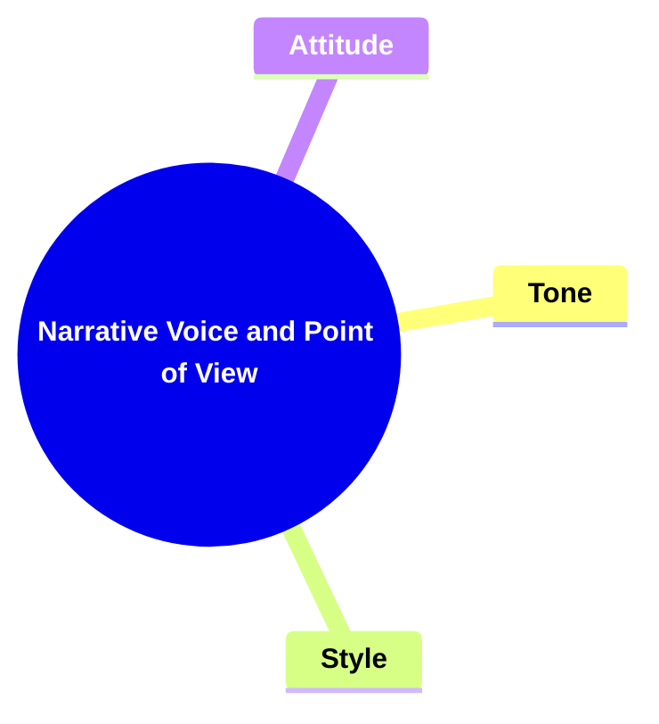
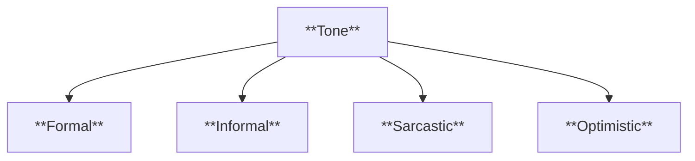
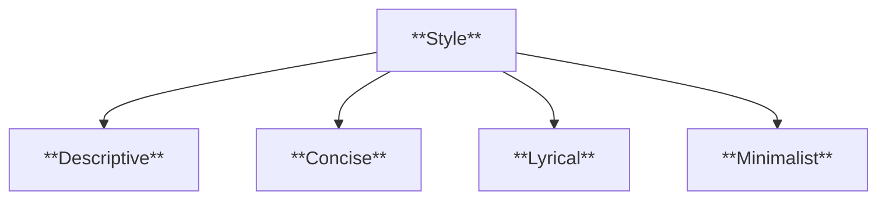
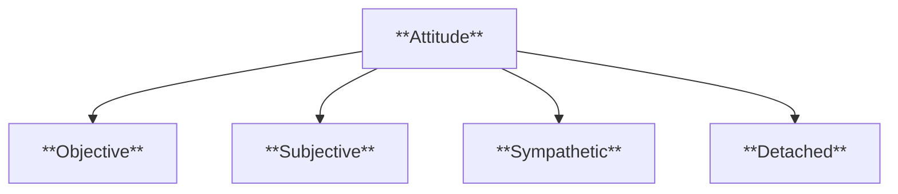
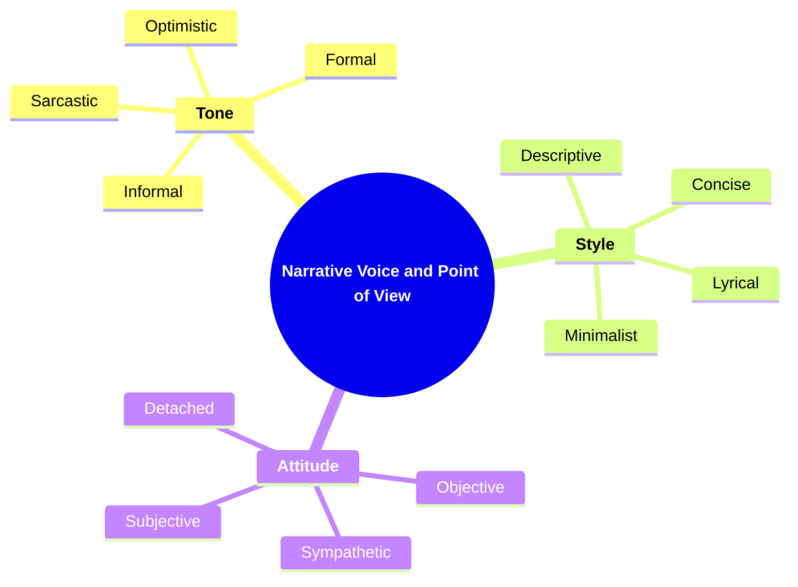

# 09 NV-3405 NARRATIVE VOICE AND POINT OF VIEW

### **Narrative Voice and Point of View**

- **Analyzing the linguistic and stylistic features that define the narrator's voice.**
  - **Considerations**:
    - **Tone**
    - **Style**
    - **Attitude**
  - **Importance**: Expands on narrator analysis; involves stylistic considerations.

---

### **Key Concepts**

---

#### **Narrative Voice and Point of View**

- **Definition**:
  - In narratology, narrative voice and point of view encompass the linguistic and stylistic choices that define how a story is told. This includes the narrator's tone, stylistic approach, and attitude, as well as the perspective from which the story is perceived and conveyed to the reader.

##### **Components of Narrative Voice and Point of View**

###### **Tone**

- **Definition**:
  - Tone refers to the narrator's attitude toward the subject matter and the audience. It is conveyed through word choice, sentence structure, and overall language use, shaping the emotional atmosphere of the narrative.

- **Characteristics**:
  - **Formal**: Uses sophisticated language and structured sentences to convey seriousness or professionalism.
  - **Informal**: Employs casual language and conversational phrasing to create a relaxed or intimate atmosphere.
  - **Sarcastic**: Utilizes irony and sharp remarks to express contempt or ridicule.
  - **Optimistic**: Conveys a positive and hopeful outlook, enhancing the uplifting aspects of the narrative.

###### **Style**

- **Definition**:
  - Style encompasses the unique way in which the narrator expresses the story, including syntax, diction, figurative language, and narrative techniques. It defines the voice's distinctiveness and contributes to the story's overall aesthetic.

- **Characteristics**:
  - **Descriptive**: Rich, detailed language that paints vivid images and creates immersive settings.
  - **Concise**: Economy of words, focusing on clarity and brevity to convey information efficiently.
  - **Lyrical**: Poetic and rhythmic language that enhances the emotional and aesthetic quality of the narrative.
  - **Minimalist**: Simple, understated language that emphasizes subtlety and leaves room for reader interpretation.

###### **Attitude**

- **Definition**:
  - Attitude reflects the narrator's perspective and stance towards the events, characters, and themes within the story. It influences how information is presented and perceived by the reader.

- **Characteristics**:
  - **Objective**: Presents events and characters without personal bias, maintaining impartiality.
  - **Subjective**: Infuses personal opinions and emotions, influencing the reader's perception.
  - **Sympathetic**: Shows understanding and compassion towards characters, fostering emotional connections.
  - **Detached**: Maintains emotional distance, focusing on factual recounting without emotional involvement.

---

### **Theoretical Significance**

- **Expanding Narrator Analysis**:

  - Analyzing narrative voice and point of view deepens the understanding of how stories are conveyed. It highlights the narrator's role in shaping the reader's experience and perception of the narrative.

- **Influence on Reader Perception**:

  - The tone, style, and attitude of the narrator significantly affect how readers interpret events and characters. A consistent and well-crafted narrative voice can guide readers' emotional responses and engagement with the story.

- **Stylistic Considerations in Storytelling**:

  - Understanding the interplay between tone, style, and attitude allows for a more nuanced analysis of narrative techniques. It enables scholars to dissect how linguistic choices contribute to the storytelling process and the delivery of themes.

- **Enhancing Critical Analysis**:
  - By focusing on narrative voice and point of view, critics can explore the effectiveness of different narrative strategies. This analysis aids in evaluating how the narrator's voice enhances or detracts from the narrative's overall impact and coherence.

---

