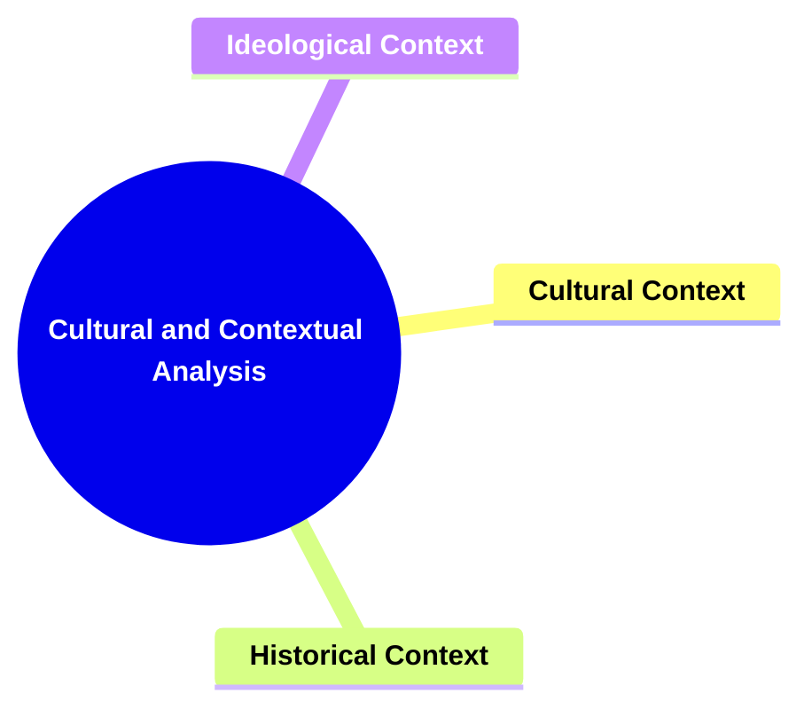
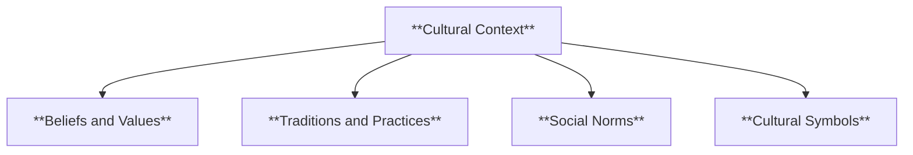
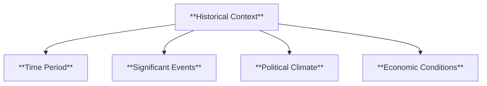
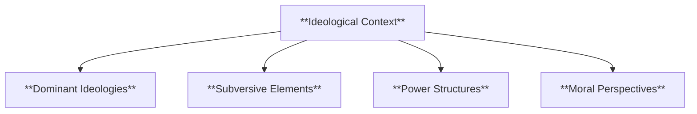
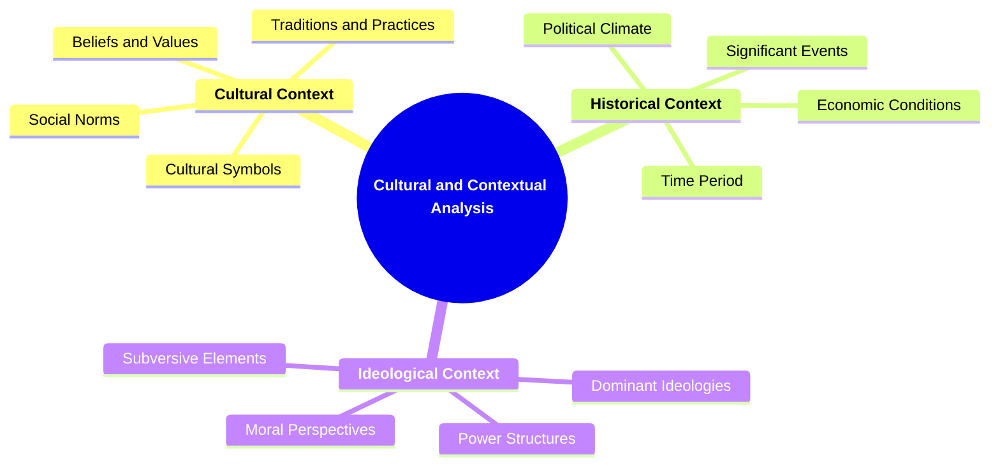

# 26 CC-3704 CULTURAL AND CONTEXTUAL ANALYSIS

### **Cultural and Contextual Analysis**

- **Incorporating cultural, historical, and ideological contexts.**
  - **Application**:
    - **Examining Narratives within Specific Contexts**
    - **Understanding Cultural Significance**
  - **Outcome**: Provides deeper insight into narratives' societal roles.

---

### **Key Concepts**

---

#### **Cultural and Contextual Analysis**

- **Definition**:
  - In narratology, **cultural and contextual analysis** involves examining narratives through the lens of their cultural, historical, and ideological backgrounds. This approach seeks to understand how these contexts influence the creation, interpretation, and impact of stories. By situating narratives within their broader societal frameworks, scholars can uncover the underlying messages, values, and power dynamics that shape and are shaped by the narrative.

##### **Components of Cultural and Contextual Analysis**

###### **Cultural Context**

- **Definition**:
  - **Cultural context** refers to the beliefs, values, traditions, and social norms prevalent within the society where the narrative is produced and consumed. It encompasses the cultural backdrop that influences characters, settings, and plot developments.

- **Characteristics**:
  - **Beliefs and Values**: Core principles that guide characters' actions and the narrative's moral framework.
  - **Traditions and Practices**: Rituals and customary behaviors that shape the story's setting and character interactions.
  - **Social Norms**: Accepted standards of behavior that influence character decisions and societal roles.
  - **Cultural Symbols**: Objects, gestures, or elements that hold significant meaning within the cultural framework.

###### **Historical Context**

- **Definition**:
  - **Historical context** involves the specific time period and events surrounding the creation and setting of the narrative. It includes the political, economic, and social conditions that impact the story's development and themes.

- **Characteristics**:
  - **Time Period**: The era in which the narrative is set or was written, influencing its language, technology, and societal structures.
  - **Significant Events**: Historical happenings that shape the narrative's plot and character motivations.
  - **Political Climate**: The prevailing political environment that affects themes of power, conflict, and governance.
  - **Economic Conditions**: The state of the economy, influencing characters' livelihoods and societal hierarchies.

###### **Ideological Context**

- **Definition**:
  - **Ideological context** pertains to the set of ideas, beliefs, and values that underpin the narrative's themes and messages. It involves analyzing how narratives convey, challenge, or reinforce specific ideologies and worldviews.

- **Characteristics**:
  - **Dominant Ideologies**: The prevailing belief systems that the narrative supports or critiques.
  - **Subversive Elements**: Narrative components that challenge or undermine established ideologies.
  - **Power Structures**: Depictions of authority, governance, and social hierarchies within the narrative.
  - **Moral Perspectives**: The ethical viewpoints presented through characters' actions and the narrative's resolution.

---

### **Theoretical Significance**

- **Deepening Understanding of Societal Influence**:

  - Cultural and contextual analysis allows scholars to comprehend how societal factors shape narratives. It reveals the interplay between stories and the cultural, historical, and ideological environments in which they exist, highlighting how narratives reflect and influence societal values and beliefs.

- **Uncovering Hidden Meanings and Messages**:

  - By situating narratives within their specific contexts, analysts can uncover underlying messages and themes that may not be immediately apparent. This approach illuminates how stories convey complex ideas about identity, power, morality, and social change.

- **Enhancing Critical Interpretation**:

  - Incorporating cultural and contextual elements fosters a more critical and nuanced interpretation of narratives. It encourages readers to consider the broader implications of stories and how they engage with real-world issues and cultural discourses.

- **Facilitating Comparative Studies**:

  - This analysis framework enables comparisons between narratives from different cultures, time periods, or ideological backgrounds. Such comparative studies highlight universal storytelling elements and unique cultural expressions, enriching the field of narratology.

- **Supporting Interdisciplinary Research**:

  - Cultural and contextual analysis bridges narratology with other disciplines such as anthropology, history, and cultural studies. This interdisciplinary approach broadens the scope of narrative analysis, allowing for a more comprehensive exploration of stories and their impacts.

- **Influencing Narrative Creation**:
  - Understanding the cultural and contextual dimensions of narratives informs authors and creators in developing stories that resonate with specific audiences and address relevant societal themes. It guides the integration of authentic cultural elements and the thoughtful portrayal of historical and ideological contexts.

---

