- [1. **Chatman's Story vs. Discourse Framework**](#1-chatmans-story-vs-discourse-framework)
- [2. **Story vs. Discourse**](#2-story-vs-discourse)
- [3. **Key Concepts**](#3-key-concepts)
  - [3.1. **Story**](#31-story)
    - [3.1.1. **Components of Story**:](#311-components-of-story)
      - [3.1.1.1. **Events**](#3111-events)
      - [3.1.1.2. **Characters**](#3112-characters)
      - [3.1.1.3. **Settings**](#3113-settings)
      - [3.1.1.4. **Actions**](#3114-actions)
  - [3.2. **Discourse**](#32-discourse)
    - [3.2.1. **Components of Discourse**:](#321-components-of-discourse)
      - [3.2.1.1. **Focalization**](#3211-focalization)
      - [3.2.1.2. **Order of Events**](#3212-order-of-events)
      - [3.2.1.3. **Narrative Voice**](#3213-narrative-voice)
      - [3.2.1.4. **Style**](#3214-style)
      - [3.2.1.5. **Medium**](#3215-medium)
- [4. **Importance of the Distinction**](#4-importance-of-the-distinction)
- [5. **Conclusion**](#5-conclusion)

---

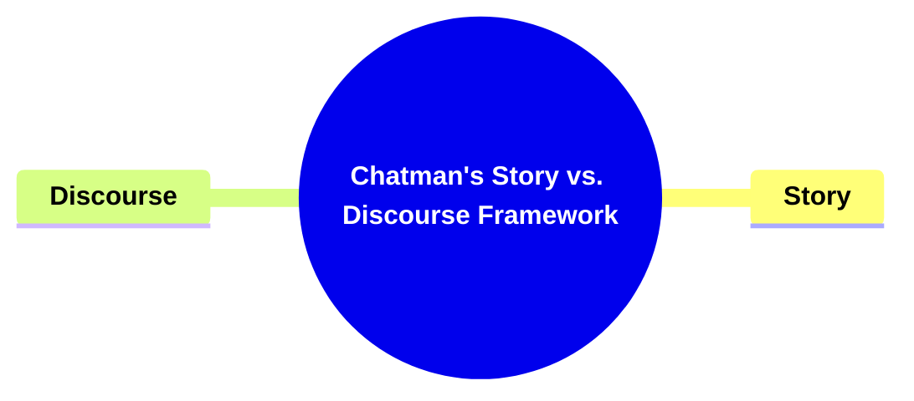

--

### 1. **Chatman's Story vs. Discourse Framework**

- **Author**: Seymour Chatman
- **Title**: Chatman's Story vs. Discourse Framework

### 2. **Story vs. Discourse**

- **Definition**:
  - Seymour Chatman, a prominent narratologist, introduces a critical distinction between _story_ and _discourse_ in his analysis of narrative. This distinction is foundational for understanding how narratives function across different media, particularly in literature and film.

---

### 3. **Key Concepts**

#### 3.1. **Story**

- **Definition**:
  - The _story_ refers to the content or the _what_ of the narrative. It includes the events, characters, settings, and actions that form the basic structure of the narrative. The story is the raw material, existing independently of how it is presented to the audience.

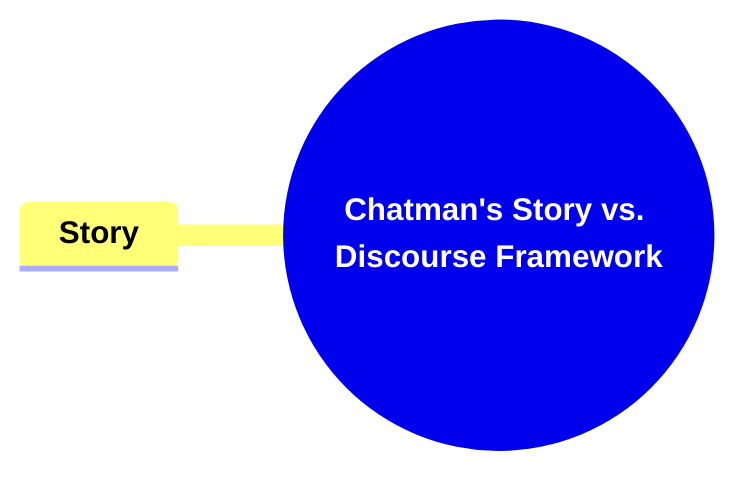

##### 3.1.1. **Components of Story**:

###### 3.1.1.1. **Events**

- **Definition**: Incidents or occurrences that form the foundation of the narrative, driving the plot forward by introducing challenges, resolutions, and key turning points.

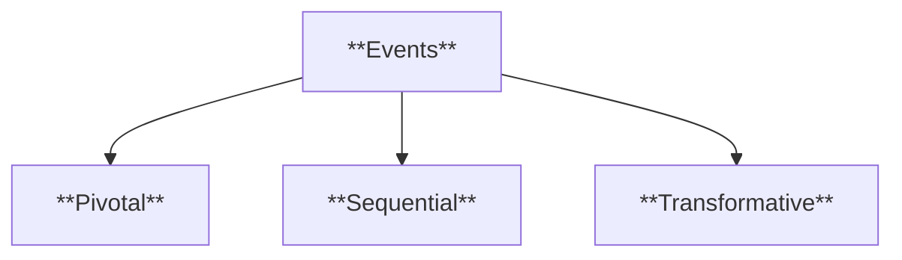

- **Characteristics**:
  - **Pivotal**: Serve as crucial moments that significantly influence the narrative’s progression and outcome.
  - **Sequential**: Occur in a logical or thematic order, ensuring coherence and flow within the story.
  - **Transformative**: Often result in changes to characters, settings, or conflicts, shaping the overall narrative arc.

###### 3.1.1.2. **Characters**

- **Definition**: The individuals, entities, or forces that interact within the narrative, bringing it to life through their actions, emotions, and development.

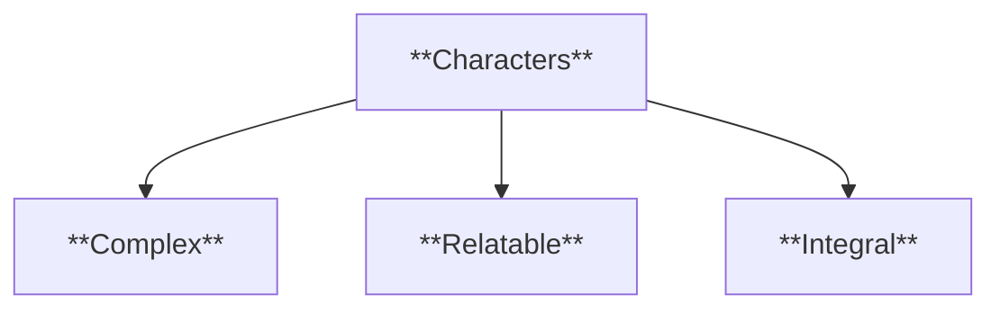

- **Characteristics**:
  - **Complex**: Possess depth, exhibiting growth, change, or contradictions that make them feel real and multidimensional.
  - **Relatable**: Designed to resonate emotionally with the audience, fostering empathy, identification, or understanding.
  - **Integral**: Play essential roles in driving the narrative, influencing events, and interacting with other elements like settings and themes.

###### 3.1.1.3. **Settings**

- **Definition**: The physical, temporal, and social environment in which the narrative takes place, providing context and grounding the story.

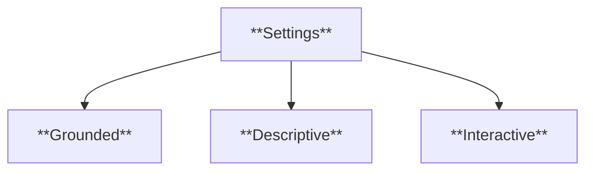

- **Characteristics**:
  - **Grounded**: Creates a believable and immersive context, anchoring the events and characters within a tangible world.
  - **Descriptive**: Incorporates vivid and rich details to enhance the story’s atmosphere and world-building.
  - **Interactive**: Interacts with characters and events, influencing their actions and the story’s direction, such as through weather, societal norms, or historical periods.

###### 3.1.1.4. **Actions**

- **Definition**: The behaviors, decisions, or deeds performed by characters that propel the narrative and influence its outcomes.

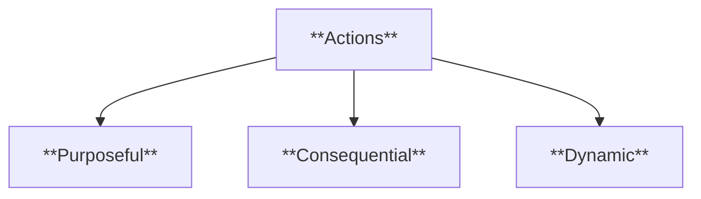

- **Characteristics**:

  - **Purposeful**: Serve as intentional acts that align with characters’ goals or respond to challenges, driving the plot forward.
  - **Consequential**: Lead to significant developments, shifting relationships, resolving conflicts, or creating new tensions.
  - **Dynamic**: Reflect the characters’ emotions, motivations, and decisions, adding depth and momentum to the narrative.

- **Contextualization**:
  - The _story_ forms the foundation of any narrative. It provides the building blocks of the plot, character arcs, and thematic developments, regardless of the medium through which it is presented. For instance, the story of _Cinderella_ remains consistent across different adaptations, such as books, films, and plays, though the _discourse_ or the presentation can vary.

---

#### 3.2. **Discourse**

- **Definition**:
  - _Discourse_ refers to the _how_ of the narrative, encompassing the methods and techniques used to present the story. It includes narrative structure, voice, perspective, style, and the medium through which the narrative is conveyed.

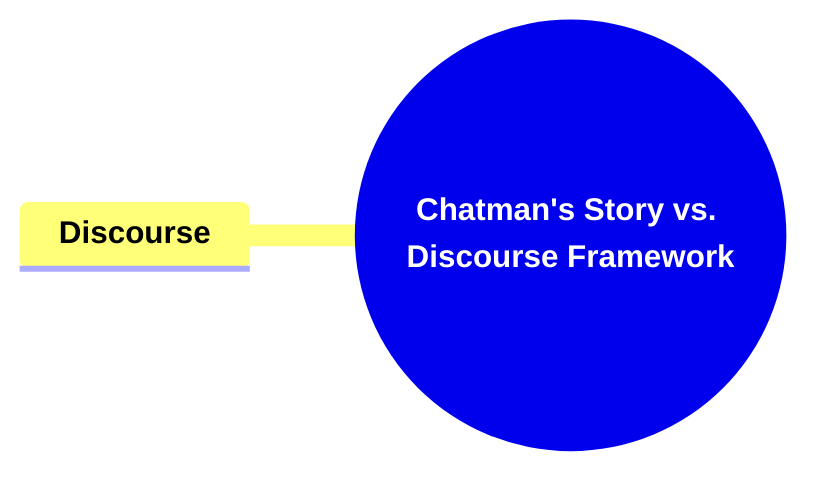

##### 3.2.1. **Components of Discourse**:

###### 3.2.1.1. **Focalization**

- **Definition**: The perspective or point of view from which the narrative is told, controlling what the audience sees, hears, and knows within the story.

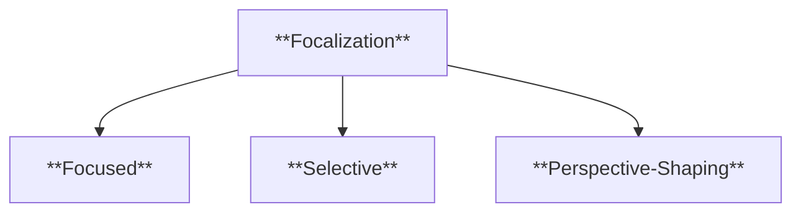

- **Characteristics**:
  - **Focused**: Offers insight into the subjective experiences of characters, exploring their thoughts, emotions, and motivations.
  - **Selective**: Determines which details or events are emphasized, shaping the audience’s interpretation of the narrative.
  - **Perspective-Shaping**: Controls the flow of information by presenting events from specific vantage points, influencing perception and engagement.

###### 3.2.1.2. **Order of Events**

- **Definition**: The sequence in which the story’s events are presented to the audience, whether chronologically, non-linearly, or through techniques like flashbacks.

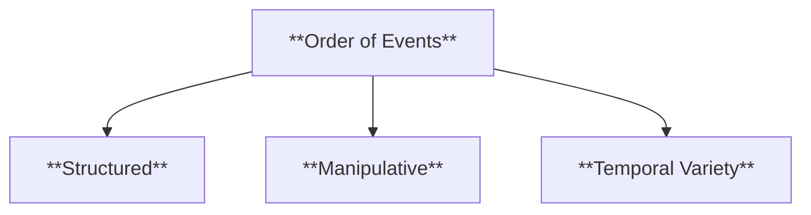

- **Characteristics**:
  - **Structured**: Follows a deliberate pattern to control the flow and coherence of the story.
  - **Manipulative**: Alters the natural sequence of events to create suspense, highlight contrasts, or strategically reveal key details.
  - **Temporal Variety**: Incorporates techniques like anachrony, flashbacks, or parallel timelines to enhance complexity and depth.

###### 3.2.1.3. **Narrative Voice**

- **Definition**: The entity or narrator that communicates the story, shaping how the audience perceives the events, characters, and themes.

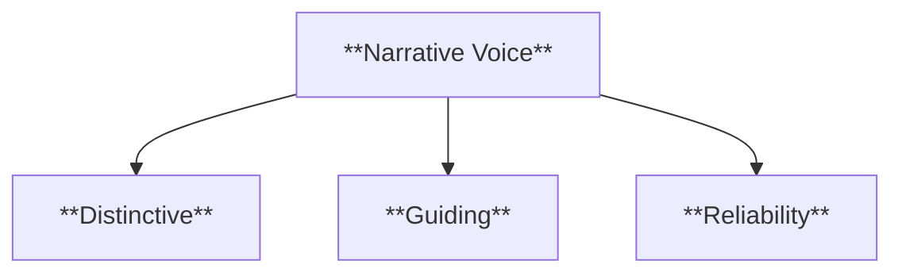

- **Characteristics**:
  - **Distinctive**: Reflects a unique tone, style, or attitude that differentiates the story’s voice from others.
  - **Guiding**: Directs the audience’s understanding and emotional response to the narrative through commentary or framing.
  - **Reliability**: Varies in trustworthiness, with narrators being omniscient, limited, or unreliable, which impacts audience interpretation.

###### 3.2.1.4. **Style**

- **Definition**: The author’s deliberate use of language, tone, and literary devices to create a unique and evocative narrative voice.

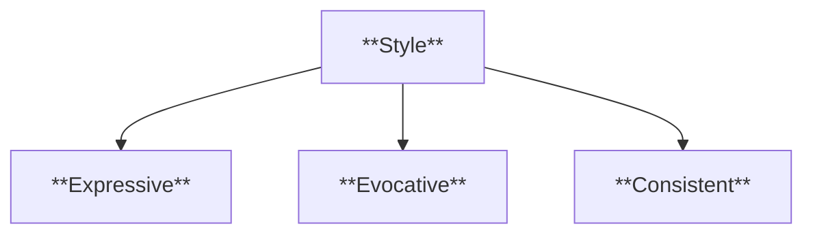

- **Characteristics**:
  - **Expressive**: Uses language creatively to evoke emotions, moods, and imagery.
  - **Evocative**: Employs literary techniques like metaphor, symbolism, and irony to deepen thematic resonance and meaning.
  - **Consistent**: Maintains a cohesive linguistic and tonal approach throughout the narrative to reinforce its identity.

###### 3.2.1.5. **Medium**

- **Definition**: The form or platform through which the narrative is delivered, such as text, film, visual art, or digital media.

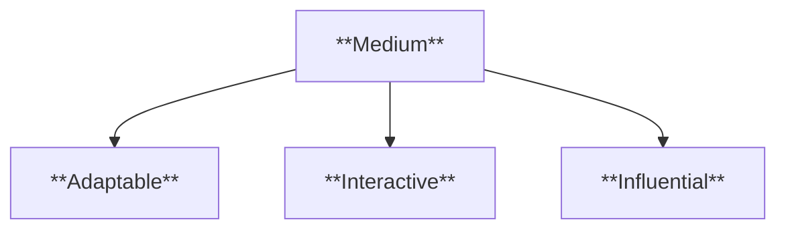

- **Characteristics**:

  - **Adaptable**: Adjusts narrative techniques to suit the specific medium’s strengths and limitations.
  - **Interactive**: Engages the audience through visual, auditory, or textual elements that enhance immersion and participation.
  - **Influential**: Shapes the story’s pacing, structure, and accessibility based on the medium’s inherent characteristics.

- **Contextualization**:
  - Discourse influences how the audience interacts with the story, guiding their emotional response and intellectual interpretation. It shapes the delivery of the narrative through techniques like non-linear timelines, shifting perspectives, or the use of symbolism and metaphor. By manipulating discourse, storytellers can create tension, surprise, or multiple layers of meaning.

---

### 4. **Importance of the Distinction**

- **Narrative Analysis**:
  - **Definition**: The separation of story and discourse is essential for narrative analysis, as it allows critics to dissect how content (story) is shaped by presentation (discourse).
  - **Characteristics**:
    - **Insightful**: Enables deeper understanding of storytelling methods.
    - **Detailed**: Focuses on how specific choices in discourse affect the audience's perception.
- **Media Adaptation**:
  - **Definition**: When adapting a narrative from one medium to another (e.g., from novel to film), the story may remain unchanged while the discourse undergoes significant transformation.
  - **Characteristics**:
    - **Transformative**: Alters the experience by introducing new narrative techniques.
    - **Evolving**: Adapts narrative style to fit the strengths of each medium.
- **Broader Implications**:
  - **Definition**: The story vs. discourse distinction has broad applicability across multiple narrative forms, from traditional literature to modern media such as video games and digital storytelling.
  - **Characteristics**:
    - **Versatile**: Applies to any narrative medium, from written to visual storytelling.
    - **Universal**: Reveals the common underlying structures of diverse narratives.

---

### 5. **Conclusion**

- **Seymour Chatman’s Framework**:
  - The distinction between _story_ and _discourse_ is essential for understanding the mechanics of narrative across different forms and media. By recognizing the _what_ (story) and the _how_ (discourse), Chatman’s framework provides a foundation for analyzing how narratives are constructed and experienced.
  - **Characteristics**:
    - **Illuminating**: Highlights the artistry involved in narrative construction.
    - **Analytical**: Encourages critical thinking about narrative choices and their effects.
  - This framework highlights the complexity of storytelling, demonstrating how the same story can take on new meanings and emotional resonances through different discursive strategies.
  - **Characteristics**:
    - **Comprehensive**: Encompasses all aspects of narrative theory.
    - **Applicable**: Can be used across various types of narrative media, from literature to film and beyond.

---

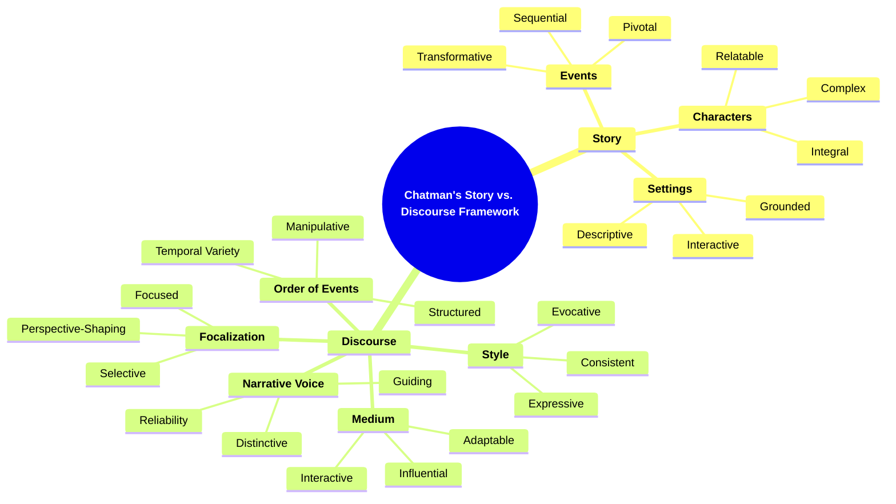
