- [1. **Title: Propp's Spheres of Action Framework**](#1-title-propps-spheres-of-action-framework)
- [2. **Key Concepts**](#2-key-concepts)
  - [2.1. **The Villain**](#21-the-villain)
    - [2.1.1. **Components of The Villain**](#211-components-of-the-villain)
      - [2.1.1.1. **Deceiver**](#2111-deceiver)
      - [2.1.1.2. **Malevolent Figure**](#2112-malevolent-figure)
      - [2.1.1.3. **Supernatural Villain**](#2113-supernatural-villain)
  - [2.2. **The Donor**](#22-the-donor)
    - [2.2.1. **Components of The Donor**](#221-components-of-the-donor)
      - [2.2.1.1. **Magical Giver**](#2211-magical-giver)
      - [2.2.1.2. **Wise Mentor**](#2212-wise-mentor)
  - [2.3. **The Helper**](#23-the-helper)
    - [2.3.1. **Components of The Helper**](#231-components-of-the-helper)
      - [2.3.1.1. **Faithful Companion**](#2311-faithful-companion)
      - [2.3.1.2. **Magical Assistant**](#2312-magical-assistant)
  - [2.4. **The Princess (and her father)**](#24-the-princess-and-her-father)
    - [2.4.1. **Components of The Princess (and her father)**](#241-components-of-the-princess-and-her-father)
      - [2.4.1.1. **Damsel in Distress**](#2411-damsel-in-distress)
      - [2.4.1.2. **Reward Figure**](#2412-reward-figure)
      - [2.4.1.3. **Challenge Setter**](#2413-challenge-setter)
  - [2.5. **The Dispatcher**](#25-the-dispatcher)
    - [2.5.1. **Components of The Dispatcher**](#251-components-of-the-dispatcher)
      - [2.5.1.1. **Quest Initiator**](#2511-quest-initiator)
      - [2.5.1.2. **Mission Giver**](#2512-mission-giver)
  - [2.6. **The Hero**](#26-the-hero)
    - [2.6.1. **Components of The Hero**](#261-components-of-the-hero)
      - [2.6.1.1. **Questing Hero**](#2611-questing-hero)
      - [2.6.1.2. **Transformational Hero**](#2612-transformational-hero)
  - [2.7. **The False Hero**](#27-the-false-hero)
    - [2.7.1. **Components of The False Hero**](#271-components-of-the-false-hero)
      - [2.7.1.1. **Usurper**](#2711-usurper)
      - [2.7.1.2. **Deceiver**](#2712-deceiver)
- [3. Implications of Propp's Spheres of Action Framework](#3-implications-of-propps-spheres-of-action-framework)

---

### 1. **Title: Propp's Spheres of Action Framework**

**Spheres of Action**:
**Definition**: Vladimir Propp, in _Morphology of the Folktale_ (1928), categorizes characters into seven archetypal roles or "Spheres of Action" based on their narrative functions in folktales. These roles reveal universal patterns in storytelling and provide a structured way to analyze character interactions and their contributions to the plot. Propp’s framework highlights the essential roles characters play in driving the narrative forward and fulfilling thematic goals.

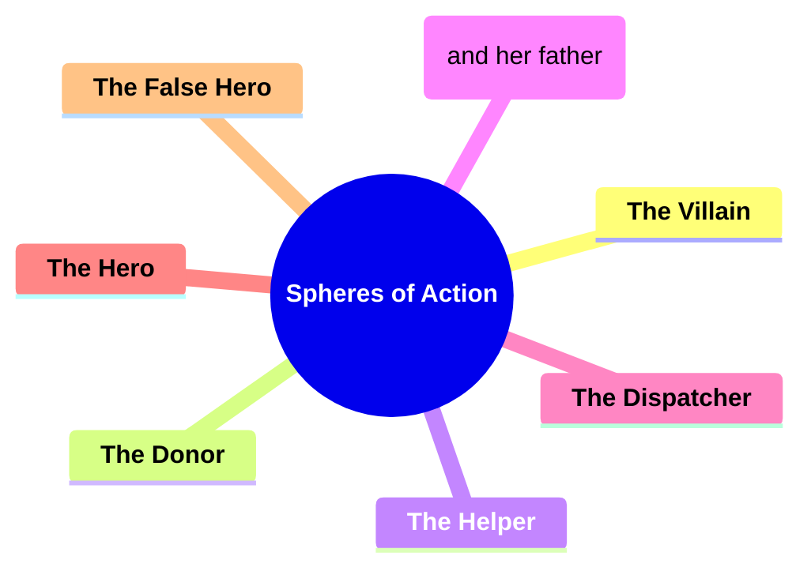

---

### 2. **Key Concepts**

#### 2.1. **The Villain**

**Definition**:
The villain serves as the primary antagonist, creating obstacles or challenges for the hero.

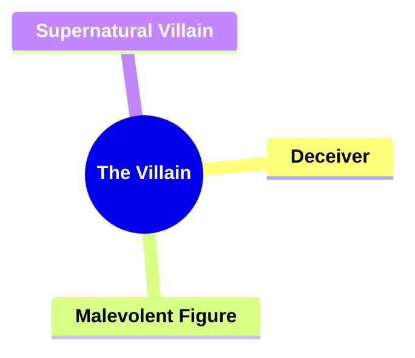

##### 2.1.1. **Components of The Villain**

###### 2.1.1.1. **Deceiver**

- **Definition**: Villains who use deception to harm others.

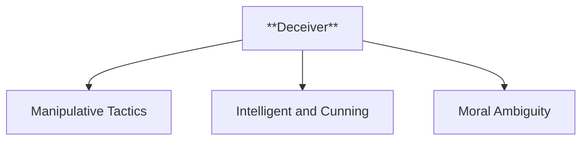

- **Characteristics**
  - **Manipulative Tactics**: Employ lies, trickery, or disguise to achieve their objectives, often leading to betrayal and plot twists.
  - **Intelligent and Cunning**: Rely on their wits and strategic thinking to outmaneuver others, making them formidable opponents.
  - **Moral Ambiguity**: May blur the lines between good and evil, creating complexity and intrigue within the narrative.

---

###### 2.1.1.2. **Malevolent Figure**

- **Definition**: Characters defined by their evil intentions or actions.

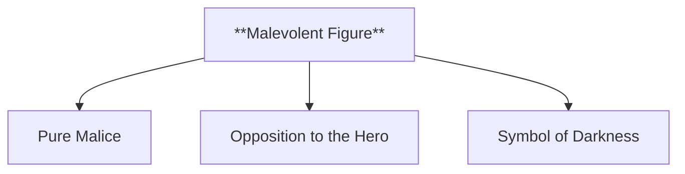

- **Characteristics**
  - **Pure Malice**: Act with unrelenting cruelty or selfishness, often driven by hatred, revenge, or power.
  - **Opposition to the Hero**: Serve as a direct counterpoint to the protagonist, amplifying the stakes and heightening the narrative conflict.
  - **Symbol of Darkness**: Embody broader themes of evil or corruption, reinforcing the story’s exploration of good versus evil.

---

###### 2.1.1.3. **Supernatural Villain**

- **Definition**: A character with magical or otherworldly powers that intensify the hero’s challenges.

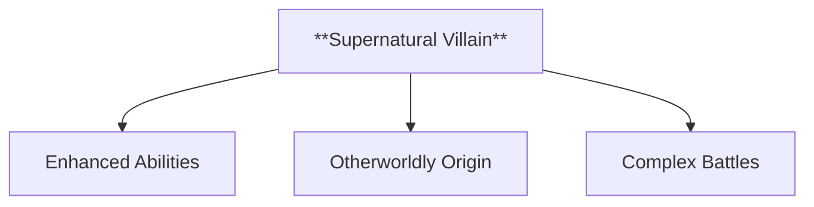

- **Characteristics**
  - **Enhanced Abilities**: Possess powers beyond human capability, such as sorcery, immortality, or other supernatural traits, raising the stakes.
  - **Otherworldly Origin**: Often come from mystical, mythical, or paranormal realms, adding an element of the unknown to their menace.
  - **Complex Battles**: Present unique challenges for the hero, requiring unconventional or equally powerful methods to confront and defeat them.

---

#### 2.2. **The Donor**

**Definition**:
The donor prepares the hero by providing a magical object or aid, essential for the hero’s success.

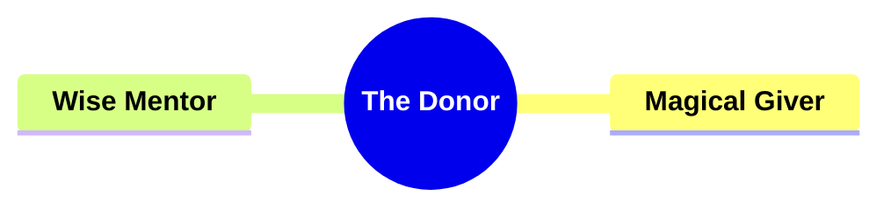

##### 2.2.1. **Components of The Donor**

###### 2.2.1.1. **Magical Giver**

- **Definition**: Provides enchanted objects that help the hero.

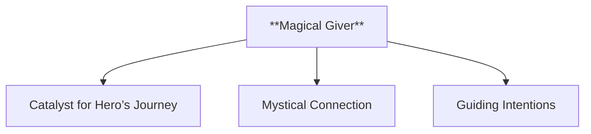

- **Characteristics**
  - **Catalyst for Hero’s Journey**: Bestows objects that initiate or aid significant parts of the hero’s quest, often representing hope or power.
  - **Mystical Connection**: Often associated with otherworldly or supernatural realms, lending an aura of mystery and magic to the narrative.
  - **Guiding Intentions**: Typically acts with the hero’s best interest in mind, subtly steering them toward their destiny or greater success.

---

###### 2.2.1.2. **Wise Mentor**

- **Definition**: Imparts crucial knowledge or advice to the hero.

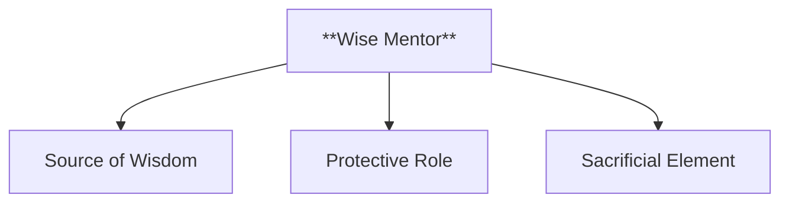

- **Characteristics**
  - **Source of Wisdom**: Offers valuable insights and lessons that prepare the hero for challenges, serving as a moral or intellectual compass.
  - **Protective Role**: Often acts as a guardian or supporter, ensuring the hero has the tools needed to succeed while fostering their growth.
  - **Sacrificial Element**: May face personal loss or sacrifice to empower the hero, reinforcing their importance in the hero’s development and story arc.

---

#### 2.3. **The Helper**

**Definition**:
The helper supports the hero, offering assistance at crucial points in the narrative.

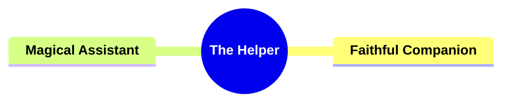

##### 2.3.1. **Components of The Helper**

###### 2.3.1.1. **Faithful Companion**

- **Definition**: A loyal figure who aids the hero throughout the quest.

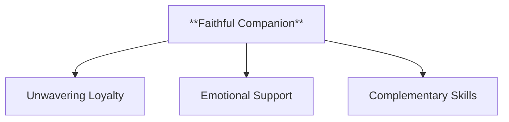

- **Characteristics**
  - **Unwavering Loyalty**: Stays by the hero’s side regardless of the challenges or dangers, symbolizing trust and dedication.
  - **Emotional Support**: Provides comfort and encouragement during difficult times, enhancing the hero’s resilience and morale.
  - **Complementary Skills**: Often possesses abilities or traits that balance or supplement the hero’s strengths, contributing to the success of the journey.

---

###### 2.3.1.2. **Magical Assistant**

- **Definition**: A supernatural being who helps the hero in moments of need.

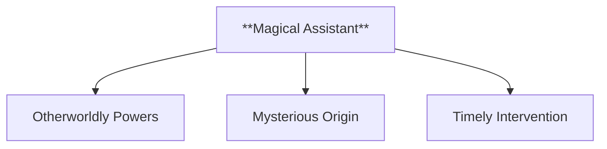

- **Characteristics**
  - **Otherworldly Powers**: Uses magical or supernatural abilities to assist the hero, offering solutions that defy natural limitations.
  - **Mysterious Origin**: Often has a mystical or enigmatic background, adding intrigue to their involvement in the hero’s quest.
  - **Timely Intervention**: Appears at critical points in the story, ensuring the hero overcomes significant obstacles or achieves pivotal victories.

---

#### 2.4. **The Princess (and her father)**

**Definition**:
The princess represents the hero’s ultimate reward, often serving as the object of the hero’s quest. Her father may set tasks or offer rewards related to the hero’s success.

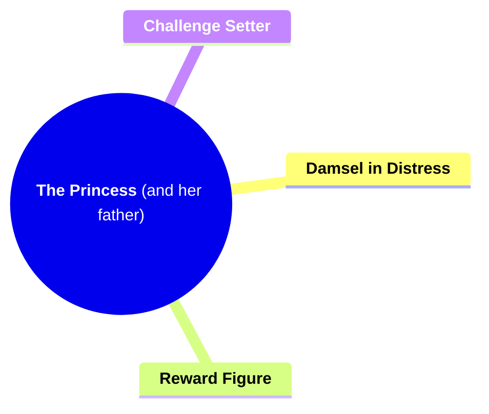

##### 2.4.1. **Components of The Princess (and her father)**

###### 2.4.1.1. **Damsel in Distress**

- **Definition**: The princess often needs rescue or liberation.

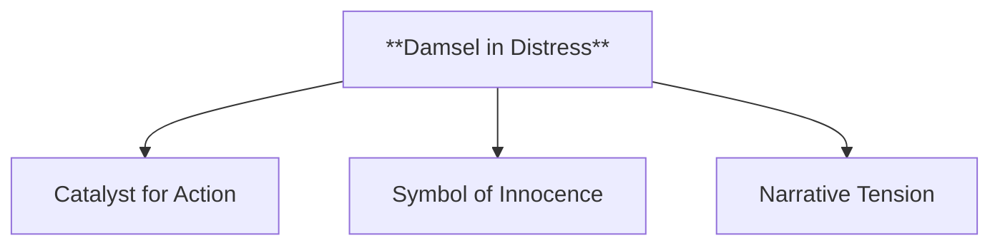

- **Characteristics**
  - **Catalyst for Action**: Serves as the reason for the hero’s quest, motivating them to confront challenges and villains.
  - **Symbol of Innocence**: Represents purity and vulnerability, reinforcing themes of good versus evil.
  - **Narrative Tension**: Adds urgency and stakes to the story, emphasizing the hero’s bravery and the importance of their mission.

---

###### 2.4.1.2. **Reward Figure**

- **Definition**: The hero seeks the princess’s hand in marriage as a symbol of victory.

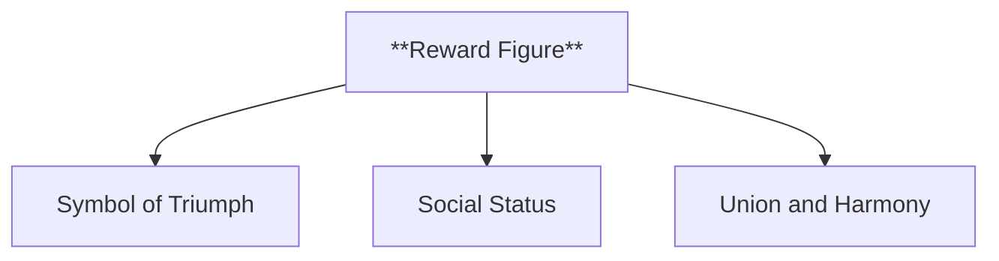

- **Characteristics**
  - **Symbol of Triumph**: Represents the hero’s successful completion of their quest and the achievement of their ultimate goal.
  - **Social Status**: Often signifies the hero’s rise in status or acceptance into a higher social or royal order.
  - **Union and Harmony**: Marks the resolution of conflict and the promise of a peaceful

future, reinforcing a happy ending.

---

###### 2.4.1.3. **Challenge Setter**

- **Definition**: The father may set conditions or challenges for the hero to win the princess.

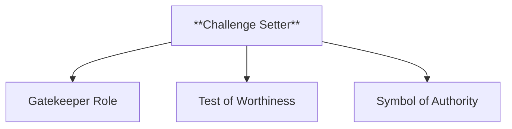

- **Characteristics**
  - **Gatekeeper Role**: Acts as the final obstacle the hero must overcome, adding a layer of complexity to the quest.
  - **Test of Worthiness**: Imposes trials that prove the hero’s valor, strength, or intelligence, ensuring they are fit for the reward.
  - **Symbol of Authority**: Embodies the societal or familial power structure that the hero must navigate or overcome to achieve their goal.

---

#### 2.5. **The Dispatcher**

**Definition**:
The dispatcher sends the hero on their quest, recognizing a problem or lack that must be addressed.

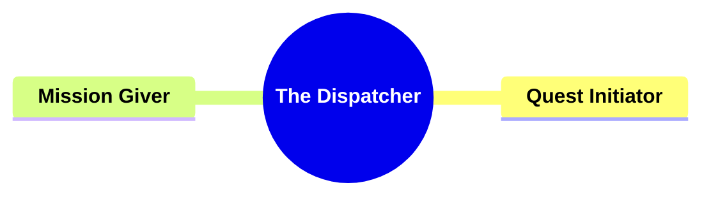

##### 2.5.1. **Components of The Dispatcher**

###### 2.5.1.1. **Quest Initiator**

- **Definition**: Identifies a problem and motivates the hero to resolve it.

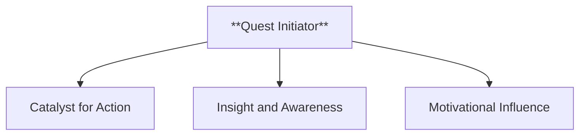

- **Characteristics**
  - **Catalyst for Action**: Sparks the hero’s journey by presenting the challenge or issue that sets the story in motion.
  - **Insight and Awareness**: Recognizes the threat or opportunity that others may overlook, positioning themselves as an essential figure in the narrative.
  - **Motivational Influence**: Inspires or compels the hero to take action, often using emotional or logical appeals to convince them of the quest’s importance.

---

###### 2.5.1.2. **Mission Giver**

- **Definition**: Provides the hero with their goal or task.

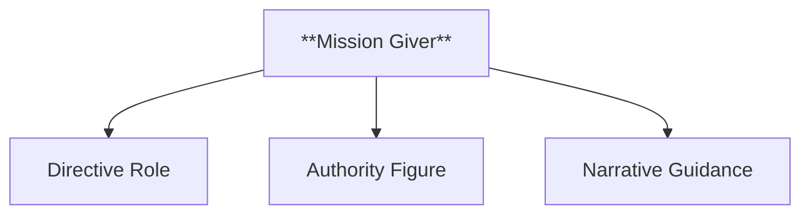

- **Characteristics**
  - **Directive Role**: Clearly outlines the hero’s objective, giving them a defined path or purpose in the story.
  - **Authority Figure**: Often holds a position of power or knowledge, which lends credibility to the task they assign and underscores its significance.
  - **Narrative Guidance**: Acts as a guiding force that aligns the hero’s actions with the story’s main plot, ensuring that the hero’s journey is purposeful and goal-oriented.

---

#### 2.6. **The Hero**

**Definition**:
The hero is the protagonist who embarks on a quest to restore balance or achieve something valuable.

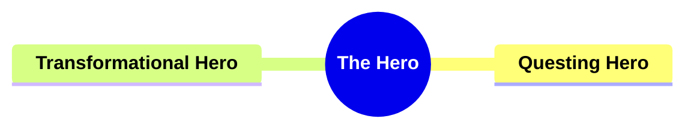

##### 2.6.1. **Components of The Hero**

###### 2.6.1.1. **Questing Hero**

- **Definition**: Embarks on a journey to achieve a goal or defeat the villain.

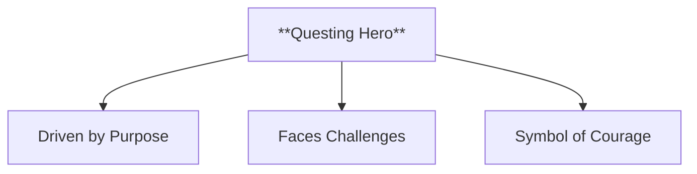

- **Characteristics**
  - **Driven by Purpose**: Has a clear mission or objective that propels them forward, providing focus and direction to the narrative.
  - **Faces Challenges**: Encounters various obstacles and adversaries that test their strength, intelligence, and resolve throughout the journey.
  - **Symbol of Courage**: Embodies bravery and determination, often serving as an inspiration to others within the story and to readers.

---

###### 2.6.1.2. **Transformational Hero**

- **Definition**: Grows and changes as a result of the quest.

```mermaid
flowchart TD
    BA[**Transformational Hero**] --> BB[Personal Evolution]
    BA --> BC[Emotional Depth]
    BA --> BD[Reflective Arc]
```

- **Characteristics**
  - **Personal Evolution**: Undergoes significant internal change, such as gaining wisdom, maturity, or new perspectives, by the end of their journey.
  - **Emotional Depth**: Experiences and confronts inner conflicts, making them relatable and realistic as they evolve over time.
  - **Reflective Arc**: The transformation often aligns with key story themes, demonstrating how their journey impacts both their external successes and internal growth.

---

#### 2.7. **The False Hero**

**Definition**:
The false hero pretends to be a hero but is ultimately revealed to be unworthy or deceptive.

```mermaid
mindmap
  root((**The False Hero**))
    **Usurper**
    **Deceiver**
```

##### 2.7.1. **Components of The False Hero**

###### 2.7.1.1. **Usurper**

- **Definition**: Attempts to take credit for the hero’s accomplishments.

```mermaid
flowchart TD
    BE[**Usurper**] --> BF[Manipulative Behavior]
    BE --> BG[Jealousy or Ambition]
    BE --> BH[Narrative Antagonist]
```

- **Characteristics**
  - **Manipulative Behavior**: Uses cunning tactics and deceit to claim the hero’s achievements as their own, undermining the true hero.
  - **Jealousy or Ambition**: Driven by envy or a desire for power, seeking recognition and status that does not rightfully belong to them.
  - **Narrative Antagonist**: Acts as an obstacle or rival to the hero, adding tension and conflict to the story as they try to outshine or replace the protagonist.

---

###### 2.7.1.2. **Deceiver**

- **Definition**: Pretends to be the hero but is exposed as a fraud.

```mermaid
flowchart TD
    BI[**Deceiver**] --> BJ[False Identity]
    BI --> BK[Revealed Truth]
    BI --> BL[Antagonistic Role]
```

- **Characteristics**
  - **False Identity**: Adopts the guise or role of the hero, attempting to deceive others into believing in their false heroism.
  - **Revealed Truth**: Eventually exposed for their deceit, often leading to their downfall and reinforcing the theme of justice or truth prevailing.
  - **Antagonistic Role**: Creates conflict within the story by misleading other characters and complicating the hero’s quest, heightening suspense until their fraud is uncovered.

---

---

### 3. Implications of Propp's Spheres of Action Framework

**Impact on Narrative Theory**:
Propp’s framework has been foundational in understanding character roles in folktales, offering a clear structure for analyzing how these archetypal roles contribute to narrative coherence and thematic depth.

**Collaborative or Future-Oriented Insight**:
The Spheres of Action framework remains relevant in modern storytelling, applicable across various media, including literature, film, and video games. It continues to inform character analysis and narrative structure in both traditional and contemporary narratives.

---
