- [1. **Greimas's Narrative Grammar Framework**](#1-greimass-narrative-grammar-framework)
- [2. **Key Concepts**](#2-key-concepts)
  - [2.1. **Transformations**](#21-transformations)
    - [2.1.1. **Components of Transformations**](#211-components-of-transformations)
      - [2.1.1.1. **Sequential**](#2111-sequential)
      - [2.1.1.2. **Dynamic**](#2112-dynamic)
      - [2.1.1.3. **Character Evolution**](#2113-character-evolution)
      - [2.1.1.4. **Plot Resolution**](#2114-plot-resolution)
  - [2.2. **Transitions**](#22-transitions)
    - [2.2.1. **Components of Transitions**](#221-components-of-transitions)
      - [2.2.1.1. **Temporal Shift**](#2211-temporal-shift)
      - [2.2.1.2. **Spatial Shift**](#2212-spatial-shift)
      - [2.2.1.3. **Connecting**](#2213-connecting)
      - [2.2.1.4. **Pivotal**](#2214-pivotal)
  - [2.3. **Narrative States**](#23-narrative-states)
    - [2.3.1. **Components of Narrative States**](#231-components-of-narrative-states)
      - [2.3.1.1. **Defined**](#2311-defined)
      - [2.3.1.2. **Stable**](#2312-stable)
      - [2.3.1.3. **Self-contained**](#2313-self-contained)
      - [2.3.1.4. **Character Alignment**](#2314-character-alignment)
      - [2.3.1.5. **Plot Alignment**](#2315-plot-alignment)
- [3. **Theoretical Significance**](#3-theoretical-significance)
- [4. **Impact on Narrative Theory**](#4-impact-on-narrative-theory)
  - [4.1. **Components of Theoretical Impact**](#41-components-of-theoretical-impact)
    - [4.1.1. **Structural Analysis**](#411-structural-analysis)
    - [4.1.2. **Broad Application**](#412-broad-application)
    - [4.1.3. **Interdisciplinary Insights**](#413-interdisciplinary-insights)
    - [4.1.1. **Structural Analysis**](#411-structural-analysis-1)
    - [4.1.2. **Broad Application**](#412-broad-application-1)
    - [4.1.3. **Interdisciplinary Insights**](#413-interdisciplinary-insights-1)
- [5. **Conclusion**](#5-conclusion)

---

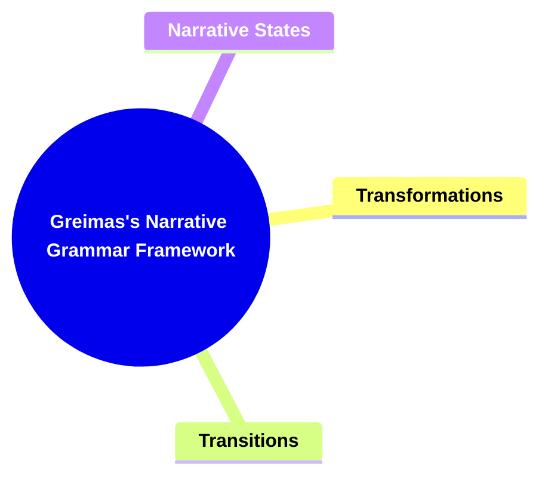

---

### 1. **Greimas's Narrative Grammar Framework**

- **Narrative Grammar**:
  - **Definition**: Algirdas Julien Greimas extends structural semantics to include the concept of _narrative grammar_. He proposes that narratives, like sentences, possess an underlying grammatical structure that dictates how stories are constructed and understood. This structure serves as the foundation for the organization and progression of narratives, governed by rules similar to the grammatical rules of language. Greimas’s framework seeks to uncover the fundamental components and rules that drive a story’s flow, offering a systematic approach to narrative analysis.

---

### 2. **Key Concepts**

#### 2.1. **Transformations**

- **Definition**:
  - Transformations refer to the process by which a narrative moves from one state or situation to another. These changes often involve shifts in character roles, plot direction, or the resolution of conflicts.

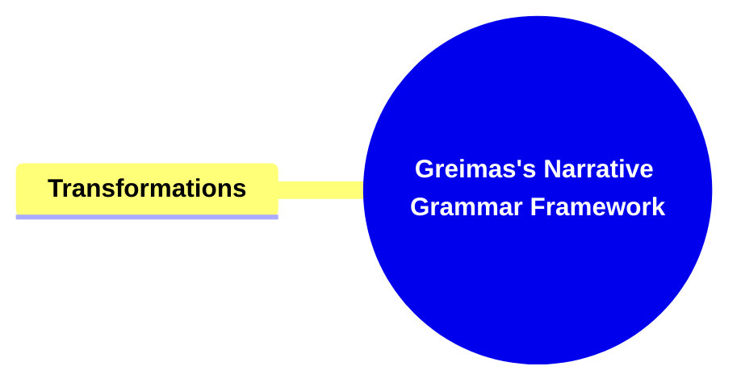

##### 2.1.1. **Components of Transformations**

###### 2.1.1.1. **Sequential**

- **Definition**: Follows a logical and chronological progression, ensuring that events unfold in an orderly manner, guiding the reader through the narrative’s stages step by step.

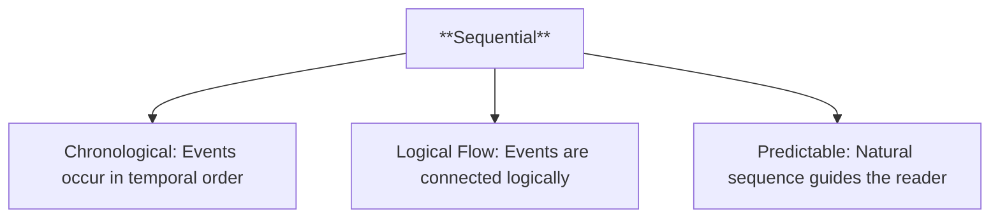

- **Characteristics**:

  - **Chronological**: The events occur in the order they happen in time, without jumping back or forward.
  - **Logical Flow**: Each event is connected logically to the next, creating a coherent progression.
  - **Predictable**: The story follows an expected trajectory, guiding the reader through a natural sequence of events.

###### 2.1.1.2. **Dynamic**

- **Definition**: Involves significant changes, developments, or shifts in the story, creating a sense of movement and evolution as the narrative progresses.

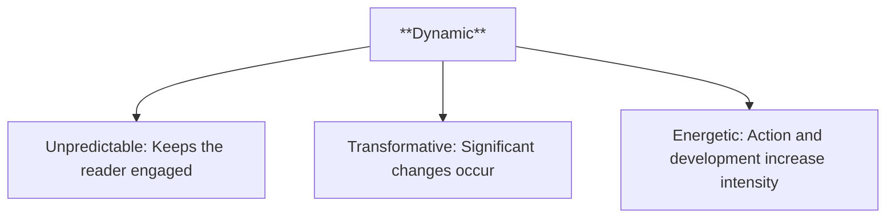

- **Characteristics**:
  - **Unpredictable**: The narrative can shift in unexpected ways, keeping the reader engaged and uncertain about the outcome.
  - **Transformative**: Key elements of the story, such as characters, settings, or themes, undergo significant changes over time.
  - **Energetic**: A dynamic story is full of action, movement, and development, often with increasing intensity.

###### 2.1.1.3. **Character Evolution**

- **Definition**: A process in which a character undergoes profound changes in their identity, motivations, beliefs, or values as they face challenges and grow throughout the narrative.

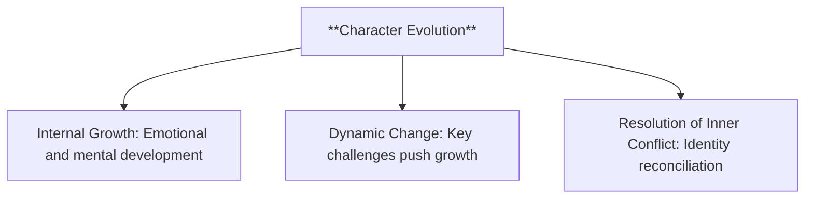

- **Characteristics**:
  - **Internal Growth**: The character develops emotionally, mentally, or spiritually as the story progresses.
  - **Dynamic Change**: Character evolution is often the result of key challenges or turning points that push the character to grow.
  - **Resolution of Inner Conflict**: By the end of the story, the character may reconcile opposing elements of their identity or beliefs.

###### 2.1.1.4. **Plot Resolution**

- **Definition**: The process of resolving or complicating the central conflicts of the narrative, bringing the story to a satisfying or thought-provoking conclusion.o

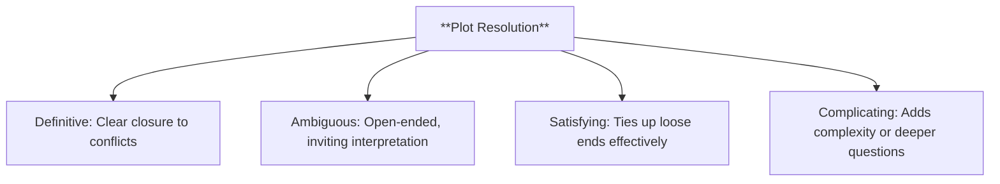

- **Characteristics**:
  - **Definitive**: Provides clear closure to the primary conflict or story arc.
  - **Ambiguous**: Some narratives leave the resolution open-ended, inviting interpretation from the audience.
  - **Satisfying**: The resolution ties up loose ends, providing closure to the narrative and answering the central questions or conflicts in a way that satisfies the reader.
  - **Complicating**: The resolution introduces new questions or adds complexity, complicating the narrative’s conclusion and leaving the reader with deeper reflections or open-ended possibilities.

---

#### 2.2. **Transitions**

- **Definition**:
  - Transitions refer to the linkages between narrative states that facilitate movement from one phase of the story to the next, often marked by key events or turning points.

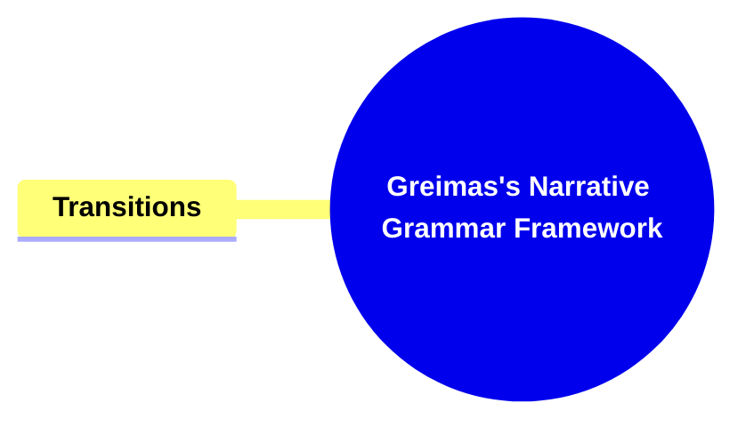

##### 2.2.1. **Components of Transitions**

###### 2.2.1.1. **Temporal Shift**

- **Definition**: A change in time that moves the narrative forward or backward, providing insight into different time periods or character stages.

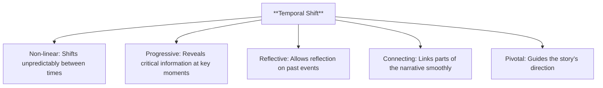

- **Characteristics**:
  - **Non-linear**: The plot may shift unpredictably between time periods.
  - **Progressive**: Can advance the plot by revealing critical information at the right moment.
  - **Reflective**: Provides characters and readers a chance to reflect on past events and their impact on the present.
  - **Connecting**: Links different parts of the narrative, ensuring smooth progression.
  - **Pivotal**: Often involves crucial events that guide the story’s direction.

---

###### 2.2.1.2. **Spatial Shift**

- **Definition**: A change in the setting or location that often signifies a shift in mood, conflict, or narrative stage.

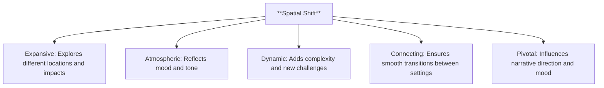

- **Characteristics**:
  - **Expansive**: Allows the narrative to explore different locations and their impact on characters and plot.
  - **Atmospheric**: The setting often reflects the mood and tone of the narrative, shaping the reader’s experience.
  - **Dynamic**: Spatial shifts can increase narrative complexity, providing new challenges and opportunities for characters.
  - **Connecting**: Links different locations and scenes, ensuring smooth narrative progression.
  - **Pivotal**: Often involves crucial events or settings that guide the story’s direction and mood.

---

###### 2.2.1.3. **Connecting**

- **Definition**: The function of linking different parts of the narrative, ensuring a coherent and smooth progression from one scene, chapter, or event to the next.

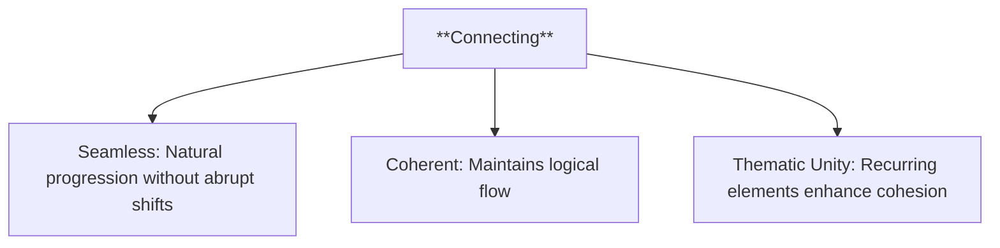

- **Characteristics**:
  - **Seamless**: Ensures the story moves naturally without abrupt shifts or breaks in continuity.
  - **Coherent**: Maintains logical progression, connecting events in a way that feels consistent and understandable.
  - **Thematic Unity**: Links different narrative elements, such as themes or motifs, that recur throughout the story.

---

###### 2.2.1.4. **Pivotal**

- **Definition**: Critical moments or events in the narrative that play a decisive role in determining the direction or outcome of the story.

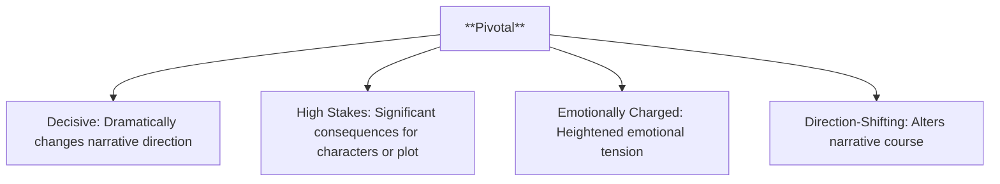

- **Characteristics**:
  - **Decisive**: These events or moments dramatically change the course of the narrative.
  - **High Stakes**: The outcomes of pivotal moments often have significant consequences for the characters or the plot.
  - **Emotionally Charged**: Pivotal events frequently involve heightened emotional tension, making them impactful for both the characters and the audience.
  - **Direction-Shifting**: Alters the narrative's course, steering it toward resolution or deeper complexity.

---

#### 2.3. **Narrative States**

- **Definition**:
  - Narrative states are the distinct conditions or moments within the story that are connected by transformations and transitions. Each state represents a specific phase in the story’s development.

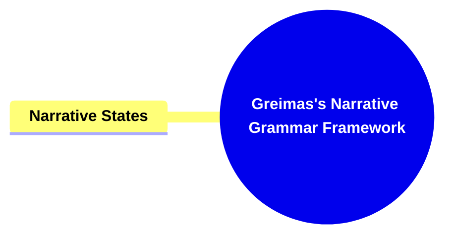

##### 2.3.1. **Components of Narrative States**

###### 2.3.1.1. **Defined**

- **Definition**: Represents a distinct and clear stage in the progression of the narrative, marking key phases where the story takes a specific direction.

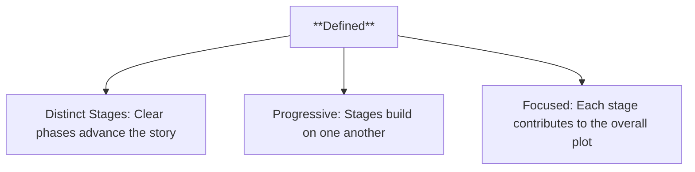

- **Characteristics**:
  - **Distinct Stages**: The narrative is broken into clear phases or points, each with its own role in advancing the story.
  - **Progressive**: As the story moves forward, these defined stages build upon each other, creating a structured progression.
  - **Focused**: Each defined stage has a specific purpose within the overall plot, contributing to character development or thematic exploration.

###### 2.3.1.2. **Stable**

- **Definition**: Represents a state of internal consistency within the narrative, where characters, settings, and conflicts remain constant until disrupted by a transformative event or action.

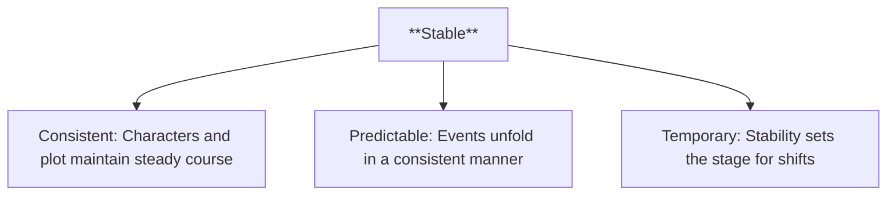

- **Characteristics**:
  - **Consistent**: The characters and plot maintain a steady course, with few deviations until the narrative requires a shift.
  - **Predictable**: Events unfold in a way that maintains internal consistency and predictability until disrupted.
  - **Temporary**: Stability is often a temporary condition, preparing the stage for a significant shift or transformation.

###### 2.3.1.3. **Self-contained**

- **Definition**: Each state or phase of the narrative operates as a mini-resolution or steady point within the broader story, offering temporary closure before the next phase begins.

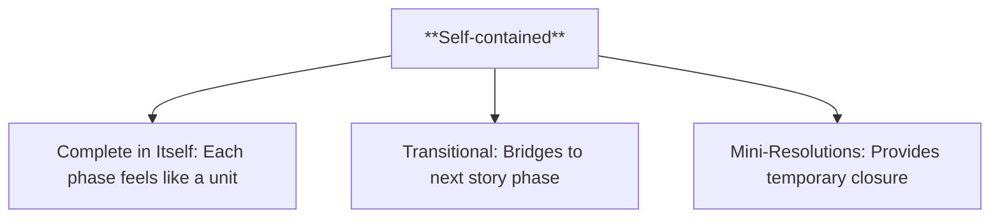

- **Characteristics**:
  - **Complete in Itself**: Each phase or section feels like a complete unit within the larger narrative.
  - **Transitional**: These self-contained sections act as stepping stones to the next part of the story, preparing the reader for further developments.
  - **Mini-Resolutions**: Even if the larger narrative is unresolved, self-contained sections often provide a sense of temporary closure or pause.

###### 2.3.1.4. **Character Alignment**

- **Definition**: A phase in the narrative where the characters’ personal goals and motivations are clearly defined and align with their development, often propelling their actions forward in a logical direction.

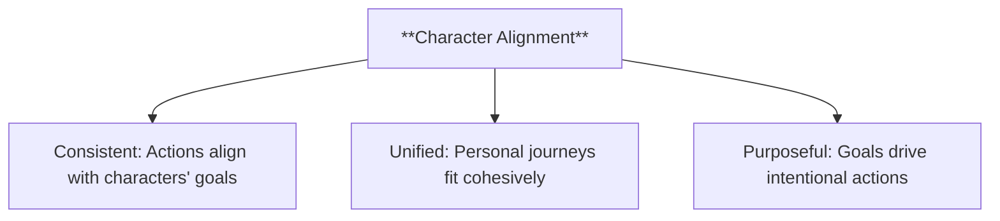

- **Characteristics**:
  - **Consistent**: Character actions are consistent with their internal goals and desires.
  - **Unified**: The character’s personal journey and actions fit cohesively within their development, avoiding contradictions.
  - **Purposeful**: The character’s goals give direction to their decisions, creating a sense of intentionality in their growth.

###### 2.3.1.5. **Plot Alignment**

- **Definition**: A phase in the narrative where the overall state of the plot and its developments align with the goals of the characters, advancing the story in a coherent and focused manner.

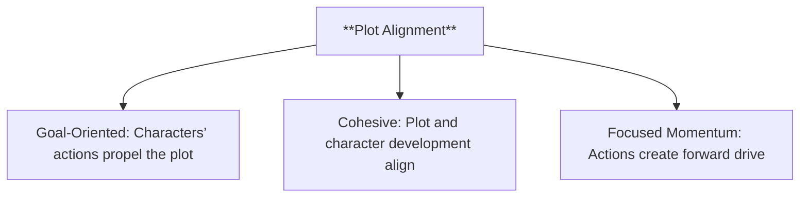

- **Characteristics**:
  - **Goal-Oriented**: The plot moves forward efficiently when characters’ actions align with the overall story, reducing unnecessary detours.
  - **Cohesive**: The plot remains focused, with characters’ actions and developments driving it in a unified direction.
  - **Focused Momentum**: The alignment between characters and plot creates momentum, propelling the narrative forward with clear intent.

---

### 3. **Theoretical Significance**

- **Greimas’s Lasting Influence**:
  - Greimas’s Narrative Grammar Framework provides a robust tool for analyzing the structure of narratives, likening their deep structure to grammatical rules that guide the flow and progression of stories.
  - **Impact on Storytelling and Theory**: Greimas’s framework has expanded the scope of narrative analysis, influencing how stories are understood, constructed, and analyzed across multiple disciplines.
  - **Broader Implications**: Beyond its immediate application in literary theory, Greimas’s framework has relevance in fields like semiotics, linguistics, and even artificial intelligence, showcasing its versatility and enduring influence.

### 4. **Impact on Narrative Theory**

- **Definition**:
  Greimas’s Narrative Grammar Framework offers a structured approach to dissecting and analyzing stories, revealing the deep rules that govern their construction. It provides insights into how narratives function across different media and cultural contexts.

#### 4.1. **Components of Theoretical Impact**

##### 4.1.1. **Structural Analysis**

- **Definition**:
  Greimas’s framework enables the decomposition of stories into their fundamental components, highlighting how events, characters, and themes adhere to an underlying structure.

- **Characteristics**:
  - **Systematic**: Provides a methodical way of identifying narrative elements.
  - **Analytical**: Allows for the clear understanding of how each narrative piece contributes to the whole.

##### 4.1.2. **Broad Application**

- **Definition**:
  Greimas’s framework transcends literature, applying to fields such as film studies, game design, and artificial intelligence, particularly in the development of interactive and generative storytelling.
- **Characteristics**:
  - **Versatile**: Adaptable to various media and narrative formats.
  - **Practical**: Facilitates both the analysis of existing stories and the creation of new ones.

##### 4.1.3. **Interdisciplinary Insights**

- **Definition**:
  The framework bridges literary theory with disciplines like semiotics, cognitive science, and cultural studies, expanding the understanding of narrative as a universal human activity.
- **Characteristics**:
  - **Integrative**: Links narrative analysis with broader theoretical disciplines.
  - **Explorative**: Opens pathways for new interpretations and applications of storytelling.

##### 4.1.1. **Structural Analysis**

- **Definition**:
  Greimas’s framework enables the decomposition of stories into their fundamental components, highlighting how events, characters, and themes adhere to an underlying structure.

- **Characteristics**:
  - **Systematic**: Provides a methodical way of identifying narrative elements.
  - **Analytical**: Allows for the clear understanding of how each narrative piece contributes to the whole.

##### 4.1.2. **Broad Application**

- **Definition**:
  Greimas’s framework transcends literature, applying to fields such as film studies, game design, and artificial intelligence, particularly in the development of interactive and generative storytelling.
- **Characteristics**:
  - **Versatile**: Adaptable to various media and narrative formats.
  - **Practical**: Facilitates both the analysis of existing stories and the creation of new ones.

##### 4.1.3. **Interdisciplinary Insights**

- **Definition**:
  The framework bridges literary theory with disciplines like semiotics, cognitive science, and cultural studies, expanding the understanding of narrative as a universal human activity.
- **Characteristics**:
  - **Integrative**: Links narrative analysis with broader theoretical disciplines.
  - **Explorative**: Opens pathways for new interpretations and applications of storytelling.

---

### 5. **Conclusion**

- **Greimas’s Lasting Influence**:
  Algirdas Julien Greimas’s Narrative Grammar Framework revolutionized the way narratives are understood and analyzed. By likening story structure to grammatical rules, he provided a methodical and systematic approach to uncovering the deep mechanics of storytelling.
- **Key Contributions**:
  - **Foundation for Structuralism**: The framework serves as a cornerstone of structuralist narrative theory, influe

---

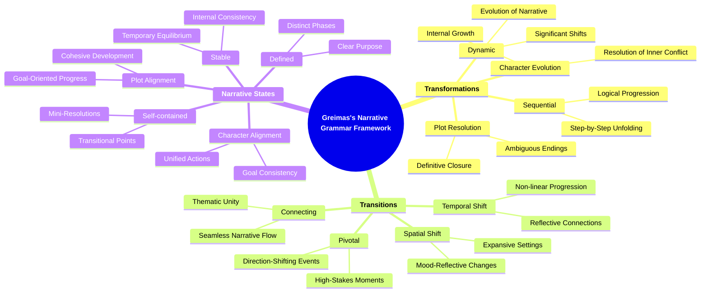
