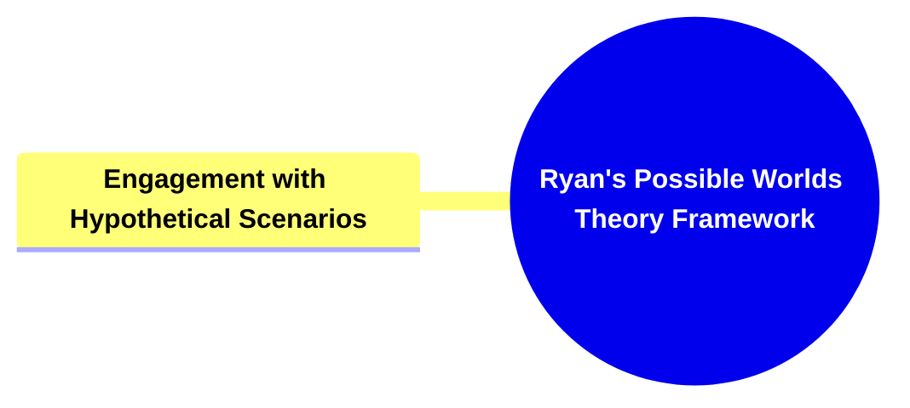

- [1. Title: **Ryan's Possible Worlds Theory Framework**](#1-title-ryans-possible-worlds-theory-framework)
- [2. **Key Concepts**:](#2-key-concepts)
  - [2.1. **Components of Engagement with Hypothetical Scnarios**](#21-components-of-engagement-with-hypothetical-scnarios)
    - [2.1.0.1. **Counterfactual Histories**](#2101-counterfactual-histories)
    - [2.1.0.2. **Fictional Universes**](#2102-fictional-universes)
    - [2.1.0.3. **Cognitive Exploration**](#2103-cognitive-exploration)

---

---

### 1. Title: **Ryan's Possible Worlds Theory Framework**

- **Possible Worlds Theory**:
  - **Definition**: Marie-Laure Ryan’s _Possible Worlds Theory_ is a framework within narrative theory that explores how narratives construct and explore alternative realities, known as "possible worlds." This theory draws from the philosophical concept of possible worlds, which are hypothetical, alternative realities that differ from the actual world in various ways. In narrative contexts, these worlds are created through the imagination of the author and the interpretive engagement of the reader, allowing for a vast exploration of what could be, rather than what is.

### 2. **Key Concepts**:

- **Engagement with Hypothetical Scenarios**:
  - **Definition**: Ryan’s work investigates how narratives function as cognitive tools that enable readers to engage with hypothetical scenarios and counterfactual histories. These narratives invite readers to imagine situations that deviate from reality, thereby expanding their understanding of possible outcomes, events, or worlds that differ from the actual one.

#### 2.1. **Components of Engagement with Hypothetical Scnarios**

###### 2.1.0.1. **Counterfactual Histories**

- **Definition**: Narratives that explore "what if" scenarios, depicting alternate historical events or outcomes that deviate from known history.
- **Characteristics**
  - **Historical Divergence**: Introduces pivotal moments where the course of history changes, leading to a different world or reality.
  - **Speculative Consequences**: Examines the potential outcomes and societal changes that arise from these alternate events.
  - **Reflective Analysis**: Encourages readers to think about the real implications of history and the factors that shape it by comparing the alternate scenario to actual events.

###### 2.1.0.2. **Fictional Universes**

- **Definition**: The creation of entirely original settings with rules and realities distinct from our own, often used in fantasy, science fiction, and speculative fiction.
- **Characteristics**
  - **Unique Worldbuilding**: Includes new physical laws, cultures, and societies that differ significantly from the real world.
  - **Creative Freedom**: Offers a canvas for authors to invent completely new ideas, structures, and environments without constraints.
  - **Escapism and Engagement**: Provides readers with an immersive escape into an unfamiliar world, sparking the imagination and deepening engagement.

###### 2.1.0.3. **Cognitive Exploration**

- **Definition**: Engaging with hypothetical scenarios that allow readers to explore complex concepts, ethical questions, and imaginative possibilities beyond real-world limitations.
- **Characteristics**

  - **Ethical Dilemmas**: Presents moral and philosophical questions that challenge readers to think critically about right and wrong.
  - **Abstract Thinking**: Stimulates cognitive processes by asking readers to visualize and mentally navigate alternate realities or outcomes.
  - **Imaginative Potential**: Encourages exploration of ideas that push the boundaries of conventional thought, fostering creative thinking and open-mindedness.

- **Theoretical Significance**:
  - **Narrative Creativity and Imagination**: Ryan’s _Possible Worlds Theory_ significantly contributes to our understanding of narrative creativity and imagination. It emphasizes how narratives are not merely reflections of reality but are also tools for constructing and exploring worlds that are entirely or partially fictional. This theory underscores the power of narrative fiction to challenge the boundaries of what is known and to offer new ways of thinking about reality, possibility, and imagination.
  - **Impact on Narrative Theory and Philosophy**: This framework bridges narrative theory and philosophical discussions of possible worlds, enriching both fields by providing a nuanced understanding of how stories can function as explorations of potential realities. Ryan’s work has been influential in both literary studies and philosophy, particularly in discussions about the nature of fiction, the structure of narrative, and the cognitive functions of storytelling.
  - **Supporting Information**:
    - **Cross-Disciplinary Applications**: Ryan’s _Possible Worlds Theory_ has applications beyond narrative theory, influencing areas such as game studies, where the creation and exploration of possible worlds are central to the gaming experience. It is also relevant in virtual reality studies, where the boundaries between real and possible worlds become increasingly blurred.
    - **Criticism and Further Development**: While Ryan’s framework is widely praised for its insights into the imaginative and cognitive functions of narratives, some critics argue that it may overemphasize the speculative aspects of fiction at the expense of its connection to reality. However, subsequent scholars have expanded on Ryan’s work to integrate the interplay between possible worlds and real-world concerns, ensuring a more balanced approach to narrative analysis.
