- [1. Title: **Abbott's Narrative Gaps and Reader Involvement Framework**](#1-title-abbotts-narrative-gaps-and-reader-involvement-framework)
- [2. Key Concepts](#2-key-concepts)
  - [2.1. Narrative Gaps](#21-narrative-gaps)
    - [2.1.1. **Components of Narrative Gaps**](#211-components-of-narrative-gaps)
      - [2.1.1.1. **Omission of Details**](#2111-omission-of-details)
      - [2.1.1.2. **Ambiguity**](#2112-ambiguity)
      - [2.1.1.3. **Uncertainty**](#2113-uncertainty)
      - [2.1.1.4. **Unresolved Plot Points**](#2114-unresolved-plot-points)
      - [2.1.1.5. **Inconsistent Narration**](#2115-inconsistent-narration)
      - [2.1.1.6. **Fragmented Narration**](#2116-fragmented-narration)
  - [2.2. Reader Involvement](#22-reader-involvement)
    - [2.2.1. **Components of Reader Involvement**](#221-components-of-reader-involvement)
      - [2.2.1.1. **Interpretive Engagement**](#2211-interpretive-engagement)
      - [2.2.1.2. **Imaginative Participation**](#2212-imaginative-participation)
      - [2.2.1.3. **Emotional Investment**](#2213-emotional-investment)
      - [2.2.1.4. **Cognitive Challenge**](#2214-cognitive-challenge)
      - [2.2.1.5. **Personal Interpretation**](#2215-personal-interpretation)
- [3. Implications of Narrative Gaps and Reader Involvement](#3-implications-of-narrative-gaps-and-reader-involvement)

---

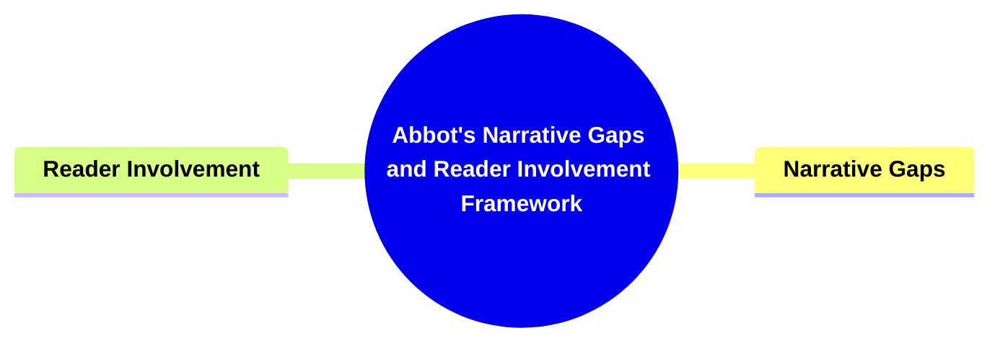

---

### 1. Title: **Abbott's Narrative Gaps and Reader Involvement Framework**

**Narrative Gaps and Reader Involvement**:
**Definition**: H. Porter Abbott explores how _gaps_ in narratives—moments where information is left out or ambiguous—invite the reader to actively engage with the story. This framework emphasizes the reader’s role in constructing meaning, transforming reading into an interactive and participatory experience.

---

### 2. Key Concepts

#### 2.1. Narrative Gaps

**Definition**:
Narrative gaps are intentional omissions or ambiguities within a story that compel the reader to fill in missing details, interpret ambiguities, or resolve unanswered questions, turning them into active participants in the storytelling process.

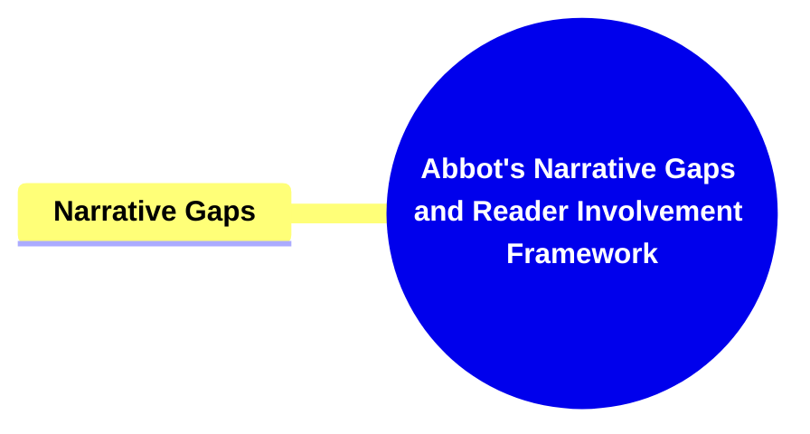

##### 2.1.1. **Components of Narrative Gaps**

###### 2.1.1.1. **Omission of Details**

- **Definition**: When specific details, such as character backgrounds or motivations, are deliberately left out, encouraging readers to speculate or infer.

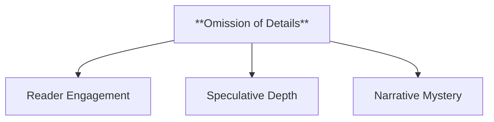

- **Characteristics**
  - **Reader Engagement**: Prompts readers to actively think about what is missing and form their own interpretations.
  - **Speculative Depth**: Invites multiple interpretations, adding layers of meaning to the narrative.
  - **Narrative Mystery**: Maintains an air of mystery and intrigue, keeping readers invested in discovering more.

###### 2.1.1.2. **Ambiguity**

- **Definition**: The use of vague or unclear elements in the narrative that can be interpreted in various ways.

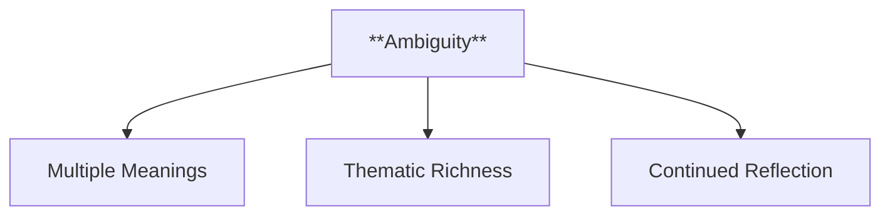

- **Characteristics**
  - **Multiple Meanings**: Encourages diverse interpretations, as ambiguity allows for different conclusions.
  - **Thematic Richness**: Enhances the story’s complexity by introducing elements that can be read in contrasting ways.
  - **Continued Reflection**: Keeps readers contemplating the story long after they finish, as they ponder possible meanings.

###### 2.1.1.3. **Uncertainty**

- **Definition**: Creates a sense of doubt or lack of clarity in the narrative, leaving readers unsure of certain facts or outcomes.

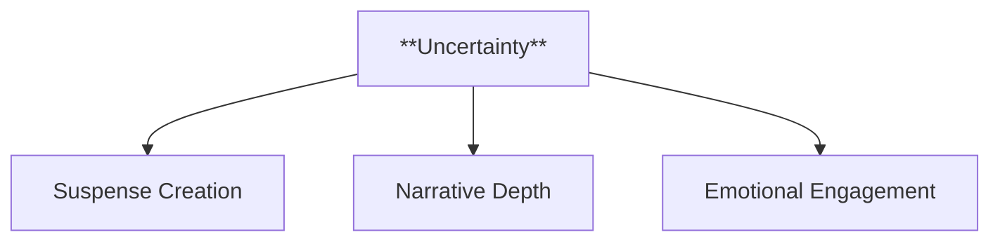

- **Characteristics**
  - **Suspense Creation**: Builds tension by keeping readers in the dark about key information.
  - **Narrative Depth**: Adds a level of unpredictability that keeps readers guessing.
  - **Emotional Engagement**: Heightens emotional involvement as readers anticipate resolution or clarity.

###### 2.1.1.4. **Unresolved Plot Points**

- **Definition**: Deliberate leaving of plot points open-ended, inviting readers to ponder possible outcomes or implications.

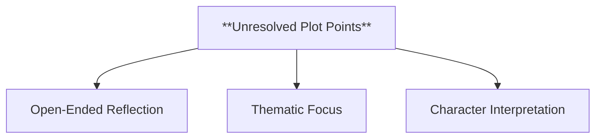

- **Characteristics**
  - **Open-Ended Reflection**: Engages readers by leaving them to imagine different scenarios for unresolved plot elements.
  - **Thematic Focus**: Often highlights broader themes by not providing clear resolutions, prompting readers to think critically.
  - **Character Interpretation**: Allows readers to question and explore character motivations and potential future actions.

###### 2.1.1.5. **Inconsistent Narration**

- **Definition**: When narration is incomplete or unreliable, requiring readers to piece together the narrative themselves.

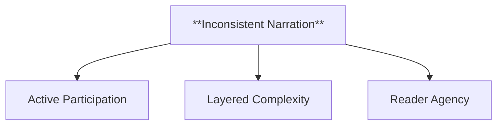

- **Characteristics**
  - **Active Participation**: Challenges readers to discern the true nature of the story through gaps and inconsistencies.
  - **Layered Complexity**: Adds depth by incorporating conflicting accounts or partial truths.
  - **Reader Agency**: Empowers readers to become co-creators of the narrative as they reconstruct missing elements.

###### 2.1.1.6. **Fragmented Narration**

- **Definition**: A storytelling technique where the narrative is broken up or non-linear, leaving readers to connect the pieces.

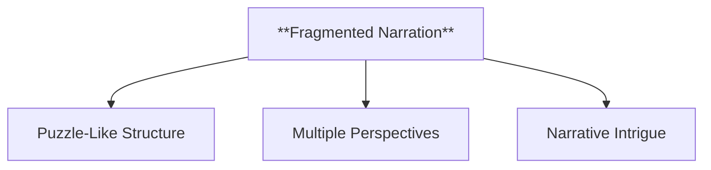

- **Characteristics**
  - **Puzzle-Like Structure**: Engages readers in assembling the story, enhancing cognitive involvement.
  - **Multiple Perspectives**: May present various character viewpoints that are incomplete, requiring synthesis by the reader.
  - **Narrative Intrigue**: Creates a sense of mystery that encourages readers to seek connections and form interpretations.

---

#### 2.2. Reader Involvement

**Definition**:
Reader involvement refers to the active role readers play in interpreting and completing the narrative. The gaps in a story invite readers to use their imagination and inference, making them co-creators of the narrative’s meaning.

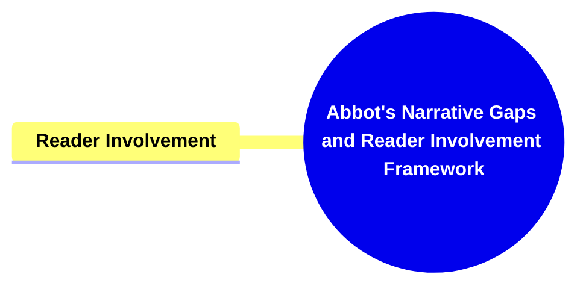

##### 2.2.1. **Components of Reader Involvement**

###### 2.2.1.1. **Interpretive Engagement**

- **Definition**: Readers analyze and interpret gaps in the narrative, making connections and drawing conclusions.

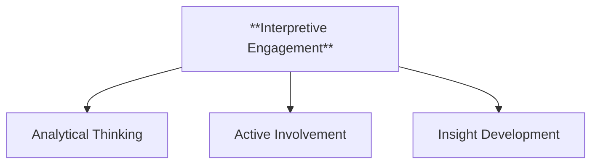

- **Characteristics**
  - **Analytical Thinking**: Encourages readers to deeply engage with the text to find meaning and connections.
  - **Active Involvement**: Readers participate in the storytelling by drawing logical inferences.
  - **Insight Development**: Leads to a richer understanding of themes and character motivations.

###### 2.2.1.2. **Imaginative Participation**

- **Definition**: Readers fill in missing details with their imagination, creating their own interpretations of events or character motivations.

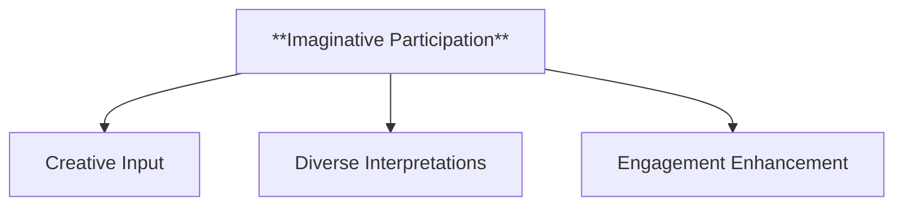

- **Characteristics**
  - **Creative Input**: Invites readers to contribute their own ideas to complete the narrative.
  - **Diverse Interpretations**: Results in varied reader experiences, as imagination leads to different conclusions.
  - **Engagement Enhancement**: Makes the reading experience more interactive and personalized.

###### 2.2.1.3. **Emotional Investment**

- **Definition**: Active interpretation of gaps often deepens readers' emotional involvement in the narrative.

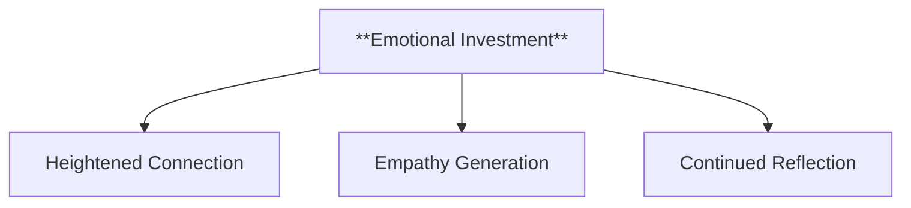

- **Characteristics**
  - **Heightened Connection**: Builds a stronger emotional bond with characters and the story.
  - **Empathy Generation**: Encourages readers to emotionally relate to and care about characters’ outcomes.
  - **Continued Reflection**: Keeps readers thinking about the narrative, even after finishing it.

###### 2.2.1.4. **Cognitive Challenge**

- **Definition**: Readers are challenged to think critically, solve narrative puzzles, and make inferences.

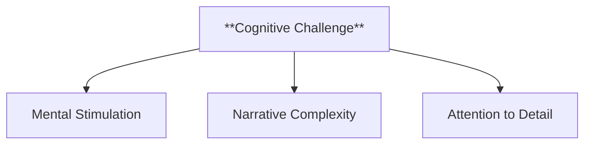

- **Characteristics**
  - **Mental Stimulation**: Engages readers in problem-solving and analytical thought processes.
  - **Narrative Complexity**: Adds depth by incorporating elements that require active decoding.
  - **Attention to Detail**: Prompts readers to notice subtle hints and clues in the text.

###### 2.2.1.5. **Personal Interpretation**

- **Definition**: Each reader’s unique background shapes how they fill in narrative gaps, leading to individualized interpretations.

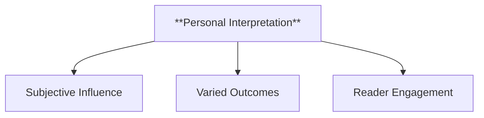

- **Characteristics**
  - **Subjective Influence**: The reader's own experiences and perspectives shape their understanding.
  - **Varied Outcomes**: Ensures that different readers may have unique takeaways from the same story.
  - **Reader Engagement**: Strengthens the bond between the reader and the narrative by making the experience personally meaningful.

---

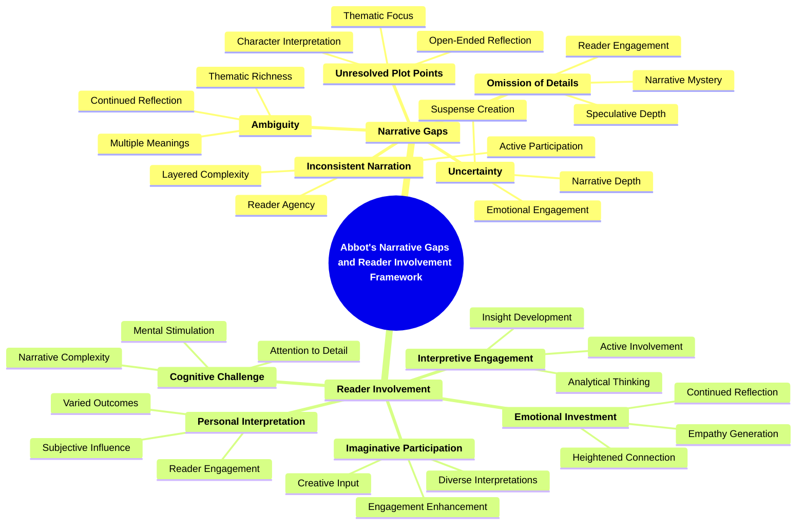

---

### 3. Implications of Narrative Gaps and Reader Involvement

**Key Insight**:
Abbott’s framework highlights the importance of narrative gaps in engaging the reader and transforming them from passive consumers into active participants in the storytelling process. By involving the reader in meaning-making, narratives become more dynamic and personalized.

**Collaborative or Future-Oriented Insight**:
As interactive storytelling and digital media continue to evolve, Abbott’s framework offers valuable insights into the role of audience involvement in narrative construction. Future narratives, particularly in emerging media, will likely continue to explore and expand upon this participatory model of storytelling.

---
