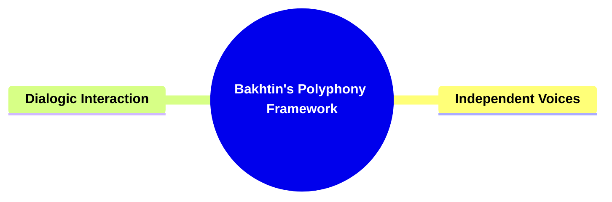
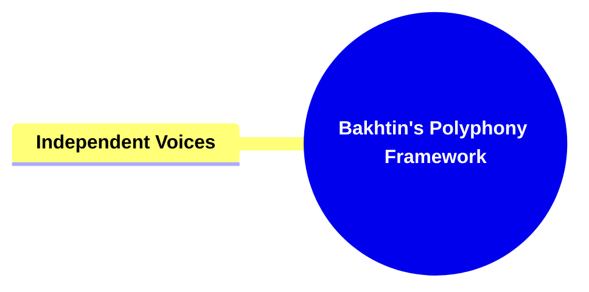
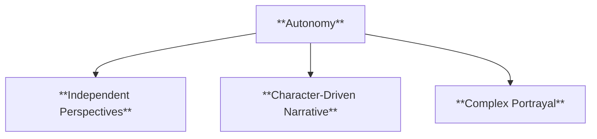
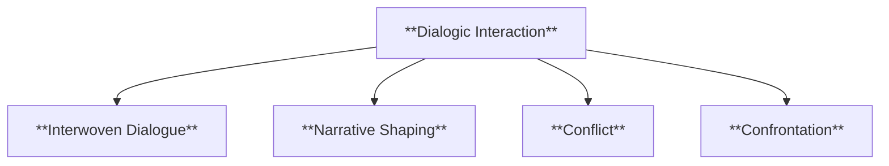
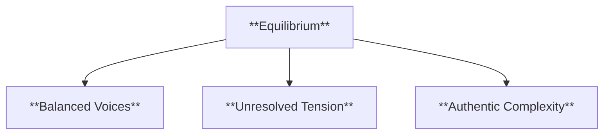
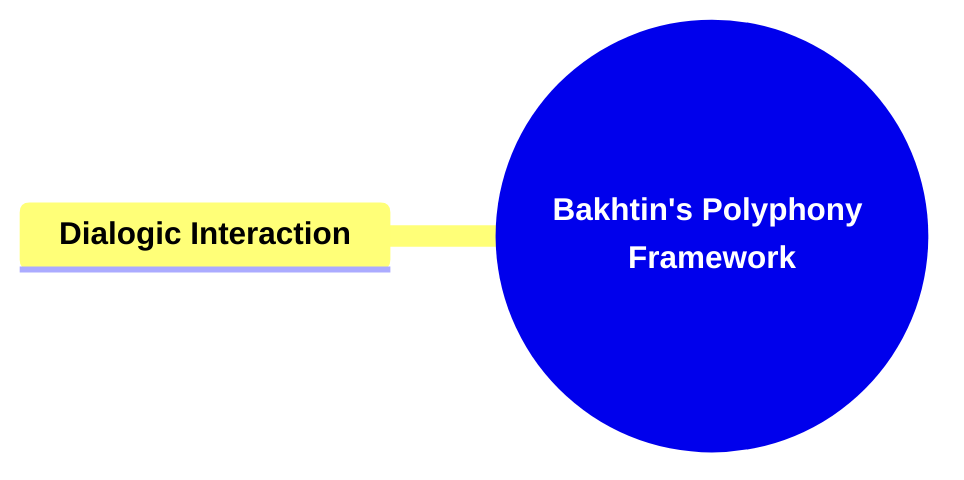
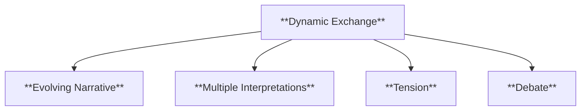
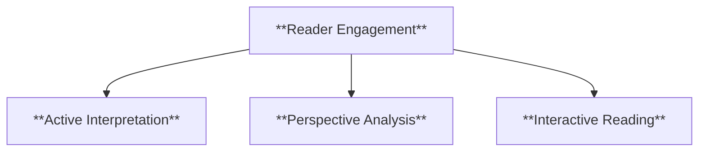
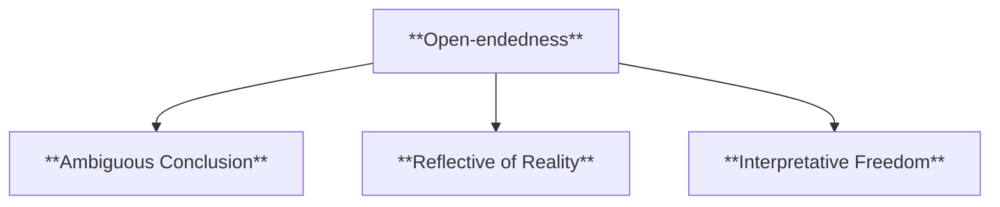
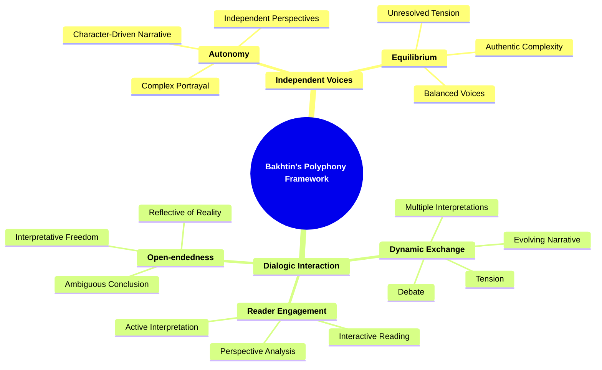

- [1. Title: **Bakhtin's Polyphony Framework**](#1-title-bakhtins-polyphony-framework)
- [2. **Key Concepts**:](#2-key-concepts)
  - [2.1. **Independent Voices**:](#21-independent-voices)
    - [2.1.1. **Components of Independent Voices**](#211-components-of-independent-voices)
      - [2.1.1.1. **Autonomy**](#2111-autonomy)
      - [2.1.1.2. **Dialogic Interaction**](#2112-dialogic-interaction)
      - [2.1.1.3. **Equilibrium**](#2113-equilibrium)
  - [2.2. **Dialogic Interaction**:](#22-dialogic-interaction)
    - [2.2.1. **Components of Dialogic Interaction**](#221-components-of-dialogic-interaction)
      - [2.2.1.1. **Dynamic Exchange**](#2211-dynamic-exchange)
      - [2.2.1.2. **Reader Engagement**](#2212-reader-engagement)
      - [2.2.1.3. **Open-endedness**](#2213-open-endedness)
- [3. **Theoretical Significance**:](#3-theoretical-significance)

---

---

### 1. Title: **Bakhtin's Polyphony Framework**

- **Polyphony**:
  - **Definition**: Polyphony, a term derived from the musical concept of multiple independent melodies played simultaneously, is a central idea in Mikhail Bakhtin’s literary theory. In the context of narrative, polyphony refers to the presence of multiple, autonomous voices within a text, each representing distinct perspectives, ideologies, or worldviews. In a polyphonic novel, the characters’ voices are not merely extensions of the author’s viewpoint; instead, they exist as independent entities, each with its own authority and validity. This concept challenges traditional narrative structures where the authorial voice dominates and guides the reader’s interpretation of the text.

### 2. **Key Concepts**:

#### 2.1. **Independent Voices**:

- **Definition**: Independent voices within a polyphonic narrative are characters whose perspectives are fully developed and autonomous from the author’s own voice. These voices express different, often conflicting viewpoints, creating a dialogue between characters that reflects the complexity and diversity of human experience. Rather than being subordinated to a singular narrative perspective, these voices maintain their individuality, contributing to a multi-layered and dynamic narrative structure.

##### 2.1.1. **Components of Independent Voices**

###### 2.1.1.1. **Autonomy**

- **Definition**: Each character’s voice is presented as a fully realized perspective, independent of the others. This autonomy allows characters to express their own thoughts, beliefs, and ideologies without being overshadowed by the author’s voice.

- **Characteristics**
  - **Independent Perspectives**: Ensures that each character’s voice is distinct and fully developed, adding depth to the narrative.
  - **Character-Driven Narrative**: Shifts the focus from a single, dominant voice to multiple, equally significant perspectives.
  - **Complex Portrayal**: Showcases the diversity of ideologies and beliefs, providing a richer understanding of the story’s themes.

###### 2.1.1.2. **Dialogic Interaction**

- **Definition**: The voices in a polyphonic novel interact with one another in a dialogue that reflects the complexities of social and ideological interactions. This dialogic nature of polyphony means that the narrative is shaped by the interactions and confrontations between different voices, rather than by a single, unifying perspective.

- **Characteristics**
  - **Interwoven Dialogue**: The voices engage in meaningful discussions, reflecting real-life ideological and social interactions.
  - **Narrative Shaping**: The story’s direction is influenced by the interplay between characters’ voices rather than a central narrative force.
  - **Conflict**: Represents opposing forces or ideas that drive tension within the narrative, shaping character motivations and plot progression.
  - **Confrontation**: The active engagement or clash between characters or ideas, bringing conflict to the forefront and adding drama to the narrative.

###### 2.1.1.3. **Equilibrium**

- **Definition**: In a truly polyphonic narrative, no single voice dominates or resolves the narrative’s conflicts. Instead, the narrative remains open-ended, allowing the coexistence of multiple perspectives without forcing them into a harmonious

- resolution.
- **Characteristics**
  - **Balanced Voices**: No single perspective takes precedence, maintaining an equilibrium that mirrors the complexities of real-world discourse.
  - **Unresolved Tension**: Leaves conflicts open, allowing for multiple interpretations and discussions.
  - **Authentic Complexity**: Provides a realistic portrayal of human interactions where not all conflicts reach resolution.

#### 2.2. **Dialogic Interaction**:

- **Definition**: Dialogic interaction in a polyphonic narrative refers to the ongoing conversation between the independent voices within the text. This interaction is not simply a dialogue between characters but also includes the reader, who engages with the various perspectives presented in the narrative. The dialogic nature of polyphony emphasizes that meaning is not fixed or singular but emerges from the interaction of multiple, often conflicting voices.

##### 2.2.1. **Components of Dialogic Interaction**

###### 2.2.1.1. **Dynamic Exchange**

- **Definition**: The interaction between different voices in a polyphonic narrative is dynamic, meaning that the narrative’s meaning evolves as the characters’ voices engage with each other. This exchange can take the form of debate, conflict, or even silent opposition, reflecting the complexities of human communication.

- **Characteristics**
  - **Evolving Narrative**: The story’s meaning shifts as characters’ voices interact, reflecting the fluidity of human dialogue.
  - **Multiple Interpretations**: Characters’ engagements create a narrative that can be interpreted in various ways, depending on their interactions.
  - **Tension**: The underlying sense of suspense or unease created by conflicting viewpoints, adding depth and complexity to the narrative.
  - **Debate**: The active exchange of opposing ideas, highlighting the conflict and diversity of perspectives within the narrative.

###### 2.2.1.2. **Reader Engagement**

- **Definition**: Polyphonic narratives require active participation from the reader, who must navigate the different voices and perspectives to construct their own understanding of the narrative. The reader becomes a participant in the dialogue, interpreting and sometimes even questioning the validity of the voices presented.

- **Characteristics**
  - **Active Interpretation**: Readers must engage with each voice to piece together the overall meaning, fostering deeper involvement.
  - **Perspective Analysis**: Encourages readers to evaluate the reliability and validity of each voice, leading to a richer reading experience.
  - **Interactive Reading**: Positions the reader as part of the dialogue, influencing their understanding of the narrative.

###### 2.2.1.3. **Open-endedness**

- **Definition**: The dialogic interaction in a polyphonic narrative often leads to an open-ended structure, where the narrative does not conclude with a clear resolution. Instead, the coexistence of multiple voices leaves the narrative’s meaning open to interpretation, reflecting the unresolved nature of real-world conflicts and discussions.

- **Characteristics**
  - **Ambiguous Conclusion**: The story may end without clear resolution, allowing for diverse interpretations.
  - **Reflective of Reality**: Mirrors the ongoing nature of societal and ideological debates, presenting a more realistic approach to narrative closure.
  - **Interpretative Freedom**: Invites readers to draw their own conclusions based on the interactions and outcomes presented by the multiple voices.

### 3. **Theoretical Significance**:

- **Impact on Literary Theory**: Bakhtin’s Polyphony Framework has had a profound impact on literary theory, particularly in the analysis of narrative voice and structure. By introducing the concept of polyphony, Bakhtin challenged traditional views of narrative as a monologic structure dominated by a single, authoritative voice. Instead, he proposed that narratives could be multi-voiced, with each voice contributing to the construction of meaning in a way that reflects the complexities of human experience. This approach has been particularly influential in the study of modernist and postmodernist literature, where the fragmentation of narrative voice and the rejection of singular truths are central themes.
  - **Application Across Genres and Media**: While Bakhtin’s concept of polyphony was developed in the context of literary analysis, it is applicable across various narrative forms, including film, theater, and even interactive media. In film, for example, the use of multiple narrative perspectives or non-linear storytelling can create a polyphonic structure, allowing different voices to coexist and interact. In theater, polyphony can be achieved through the use of ensemble casts or overlapping dialogues that present multiple perspectives simultaneously. In interactive media, such as video games or digital storytelling, polyphony can be explored through branching narratives or multiple playable characters, each with their own distinct voice and perspective.
  - **Supporting Information**:
    - **Interdisciplinary Influence**: Bakhtin’s Polyphony Framework has influenced not only literary studies but also fields such as philosophy, linguistics, and cultural studies. In philosophy, Bakhtin’s ideas about polyphony and dialogism have informed debates about the nature of truth, subjectivity, and the social construction of meaning. In linguistics, his work has contributed to the study of discourse analysis and the interaction of different voices within language. In cultural studies, Bakhtin’s concepts have been used to explore how multiple cultural or ideological perspectives coexist and interact within texts, media, and social practices.
    - **Critiques and Further Development**: While Bakhtin’s Polyphony Framework is highly influential, some critics argue that it may idealize the coexistence of voices without fully accounting for the power dynamics that can exist between them. In practice, not all voices within a polyphonic narrative may be equally heard or valued, and some voices may dominate or marginalize others. Despite these critiques, Bakhtin’s framework continues to be a key concept in the study of narrative and discourse, offering a valuable tool for understanding the complexities of multi-voiced texts and the social and ideological interactions they reflect.

---

# YAML

- UID: 1AbbottNPF
  Framework: Narrative Perspective Framework
  CORE: NV-3405 Narrative Voice and Point of View
  TIER: Tier 2
  REASON: This framework examines the perspectives from which a narrative is presented, focusing on the narrator's voice and the point of view, aligning with the "Narrative Voice and Point of View" category.

- UID: 1BakhtinDF
  Framework: Dialogism Framework
  CORE: NV-3405 Narrative Voice and Point of View
  TIER: Tier 2
  REASON: This framework examines the perspectives from which a narrative is presented, focusing on the narrator's voice and the point of view, aligning with the "Narrative Voice and Point of View" category.

- UID: 1BalNAF
  Framework: Bal's Narrative Agents Framework
  CORE: CH-3302 Characterization
  TIER: Tier 1
  REASON: Bal's Narrative Agents Framework focuses on the development and portrayal of characters as narrative agents, fitting within the "Characterization" category.

- UID: 1BarthesNCF
  Framework: Barthes's Narrative Codes Framework
  CORE: SN-3504 Semiotics of Narrative
  TIER: Tier 3
  REASON: This framework explores the codes and signs within narratives, aligning with the study of semiotics in narratives.

- UID: 1BoothIAM
  Framework: Booth's Implied Author Model
  CORE: NA-3402 Narration and Narrator Analysis
  TIER: Tier 2
  REASON: Booth's model examines the role of the implied author in shaping the narrative, which falls under narration and narrator analysis.

- UID: 1BrooksRDNF
  Framework: The Role of Desire in Narrative
  CORE: NE-3509 Narrative Ethics and Ideology
  TIER: Tier 3
  REASON: This framework explores the ethical and ideological dimensions of desire within narratives, fitting into "Narrative Ethics and Ideology".

- UID: 1ChatmanSDF
  Framework: Chatman's Story vs. Discourse Framework
  CORE: SD-3401 Story vs. Discourse (Fabula vs. Sjuzhet)
  TIER: Tier 2
  REASON: Differentiates between the raw events of a story and how they are presented, directly aligning with the "Story vs. Discourse" category.

- UID: 1ForsterFRCM
  Framework: Forster's Flat and Round Characters Model
  CORE: CH-3302 Characterization
  TIER: Tier 1
  REASON: Forster's model classifies characters based on their depth and complexity, fitting within "Characterization".

- UID: 1GreimasSNSF
  Framework: Greimas's Semio-Narrative Structure Framework
  CORE: SN-3504 Semiotics of Narrative
  TIER: Tier 3
  REASON: Focuses on the semiotic structures within narratives, aligning with the study of semiotics.

- UID: 1HermanCNF
  Framework: Herman's Cognitive Narratology Framework
  CORE: HN-3701 Holistic Narrative Analysis
  TIER: Tier 5
  REASON: Combines various narrative elements from a cognitive perspective, fitting into a holistic analysis.

- UID: 1propp7
  Framework: Propp's Spheres of Action Framework
  CORE: FM-3506 Function and Motif Analysis
  TIER: Tier 3
  REASON: Analyzes specific narrative functions that drive the plot, aligning with function and motif analysis.

- UID: 1propp31
  Framework: Propp's 31 Narrative Functions Framework
  CORE: FM-3506 Function and Motif Analysis
  TIER: Tier 3
  REASON: Outlines specific narrative functions that advance the plot, fitting within function and motif analysis.

- UID: 1RimmonKenanFF
  Framework: Rimmon-Kenan's Focalization Framework
  CORE: FO-3403 Focalization
  TIER: Tier 2
  REASON: Focuses on the narrative perspective and focalization, aligning with the "Focalization" category.

- UID: 1RyanIF
  Framework: Ryan's Immersion Framework
  CORE: NV-3405 Narrative Voice and Point of View
  TIER: Tier 2
  REASON: Examines how narratives immerse the reader through voice and perspective, fitting within "Narrative Voice and Point of View".

- UID: 1SternbergEMF
  Framework: Sternberg's Expositional Modes Framework
  CORE: NS-3301 Narrative Structure
  TIER: Tier 1
  REASON: Analyzes the modes of exposition in narrative structure, fitting within "Narrative Structure".

- UID: 1TodorovNSM
  Framework: Todorov's Narrative Syntax Model
  CORE: NS-3301 Narrative Structure
  TIER: Tier 1
  REASON: Explores the syntactic organization of narratives, aligning with "Narrative Structure".

- UID: 1TomashevskyTMF
  Framework: Tomashevsky's Theme and Motif Framework
  CORE: FM-3506 Function and Motif Analysis
  TIER: Tier 3
  REASON: Focuses on themes and motifs, aligning with function and motif analysis.

- UID: 2AbbottNGRI
  Framework: Abbott's Narrative Gaps and Reader Involvement Framework
  CORE: NR-3507 Narratee and Implied Reader
  TIER: Tier 3
  REASON: Examines narrative gaps and how they engage the reader, fitting within "Narratee and Implied Reader".

- UID: 2BakhtinHM
  Framework: Bakhtin's Heteroglossia Model
  CORE: NA-3402 Narration and Narrator Analysis
  TIER: Tier 2
  REASON: Heteroglossia involves multiple voices and social languages, aligning with narration and narrator analysis.

- UID: 2BalTSF
  Framework: Bal's Temporal Structures Framework
  CORE: TT-3404 Time and Temporality
  TIER: Tier 2
  REASON: Focuses on the structuring of time within narratives, fitting into "Time and Temporality".

- UID: 2BarthesPTF
  Framework: Barthes's Pleasure of the Text Framework
  CORE: SN-3504 Semiotics of Narrative
  TIER: Tier 3
  REASON: Analyzes the interplay of signifiers in creating pleasure in narratives, aligning with semiotics.

- UID: 2BoothNNVF
  Framework: Booth's Narrator and Narrative Voice Framework
  CORE: NV-3405 Narrative Voice and Point of View
  TIER: Tier 2
  REASON: Directly examines the narrator's voice and narrative perspective, fitting within "Narrative Voice and Point of View".

- UID: 2BrooksNTF
  Framework: Brooks's Narrative Temporality Framework
  CORE: TT-3404 Time and Temporality
  TIER: Tier 2
  REASON: Studies how temporality is structured in narratives, aligning with "Time and Temporality".

- UID: 2ChatmanNCM
  Framework: Chatman's Narrative Communication Model
  CORE: NA-3402 Narration and Narrator Analysis
  TIER: Tier 2
  REASON: Focuses on the communication aspects of narration, fitting within "Narration and Narrator Analysis".

- UID: 2ForsterPRF
  Framework: Forster's Pattern and Rhythm Framework
  CORE: NS-3301 Narrative Structure
  TIER: Tier 1
  REASON: Analyzes narrative patterns and rhythms, fitting within "Narrative Structure".

- UID: 2Genette3NIF
  Framework: Genette's Narrative Instances Framework
  CORE: NLE-3501 Narrative Levels and Embedding
  TIER: Tier 3
  REASON: Examines narrative instances and their levels within stories, aligning with narrative levels and embedding.

- UID: 2Genette5Key
  Framework: Genette's Five Key Narrative Categories Framework
  CORE: NLE-3501 Narrative Levels and Embedding
  TIER: Tier 3
  REASON: Categorizes key narrative elements, fitting within narrative levels and embedding.

- UID: 2GreimasSSM
  Framework: Greimas's Semiotic Square Mode
  CORE: SN-3504 Semiotics of Narrative
  TIER: Tier 3
  REASON: Utilizes semiotic squares to analyze narrative structures, aligning with semiotics.

- UID: 2HermanSLF
  Framework: Herman's Story Logic Framework
  CORE: DM-3503 Diegesis and Mimesis
  TIER: Tier 3
  REASON: Explores the logic of storytelling, fitting within diegesis and mimesis.

- UID: 2RimmonKenanNLF
  Framework: Rimmon-Kenan's Narrative Levels Framework
  CORE: NLE-3501 Narrative Levels and Embedding
  TIER: Tier 3
  REASON: Studies different narrative levels within stories, aligning with narrative levels and embedding.

- UID: 2RyanNCCF
  Framework: Ryan's Narrative as a Cognitive Construct Framework
  CORE: HN-3701 Holistic Narrative Analysis
  TIER: Tier 5
  REASON: Approaches narrative from a cognitive perspective, combining various elements for holistic analysis.

- UID: 2SternbergTOF
  Framework: Sternberg's Temporal Ordering Framework
  CORE: TT-3404 Time and Temporality
  TIER: Tier 2
  REASON: Focuses on the ordering of temporal events within narratives, fitting into "Time and Temporality".

- UID: 2TodorovSANF
  Framework: Todorov's Deep Structures Framework
  CORE: DM-3503 Diegesis and Mimesis
  TIER: Tier 3
  REASON: Explores deep narrative structures, aligning with diegesis and mimesis.

- UID: 2TomashevskyPSF
  Framework: Tomashevsky's Plot vs. Story Framework
  CORE: SD-3401 Story vs. Discourse (Fabula vs. Sjuzhet)
  TIER: Tier 2
  REASON: Differentiates between plot and story elements, fitting into "Story vs. Discourse".

- UID: 3BakhtinCF
  Framework: Bakhtin's Chronotope Framework
  CORE: TT-3404 Time and Temporality
  TIER: Tier 2
  REASON: Chronotope integrates time and space in narratives, aligning with "Time and Temporality".

- UID: 3BalFF
  Framework: Bal's Focalization Framework
  CORE: FO-3403 Focalization
  TIER: Tier 2
  REASON: Focuses on the narrative perspective and focalization, aligning with the "Focalization" category.

- UID: 3BarthesCLF
  Framework: Barthes's Camera Lucida Framework
  CORE: SN-3504 Semiotics of Narrative
  TIER: Tier 3
  REASON: Analyzes the use of the camera and imagery in narrative structures, aligning with semiotics.

- UID: 3BoothSVF
  Framework: Booth's Showing vs. Telling Framework
  CORE: DM-3503 Diegesis and Mimesis
  TIER: Tier 3
  REASON: Differentiates between showing and telling in narratives, aligning with diegesis and mimesis.

- UID: 3BrooksMSMF
  Framework: Brooks's Middle as a Site of Meaning Framework
  CORE: NS-3301 Narrative Structure
  TIER: Tier 1
  REASON: Analyzes the central part of narratives as a meaningful structure, fitting within "Narrative Structure".

- UID: 3ChatmanCEF
  Framework: Chatman's Character and Event Framework
  CORE: PA-3303 Plot and Event Analysis
  TIER: Tier 1
  REASON: Examines character and events within the plot, aligning with plot and event analysis.

- UID: 3ForsterPC
  Framework: Forster's Prophecy Concept
  CORE: PA-3303 Plot and Event Analysis
  TIER: Tier 1
  REASON: Focuses on the plot and prophecy elements within narratives, fitting into plot and event analysis.

- UID: 3Genette3Focalization
  Framework: Genette's Focalization Framework
  CORE: FO-3403 Focalization
  TIER: Tier 2
  REASON: Analyzes the perspective through which the narrative is presented, aligning with "Focalization".

- UID: 3GreimasAM
  Framework: Greimas's Actantial Model
  CORE: FM-3506 Function and Motif Analysis
  TIER: Tier 3
  REASON: Analyzes narrative roles and functions, fitting within function and motif analysis.

- UID: 3HermanNCAF
  Framework: Herman's Narrative as a Cognitive Artifact Framework
  CORE: HN-3701 Holistic Narrative Analysis
  TIER: Tier 5
  REASON: Integrates cognitive aspects into narrative analysis, fitting into holistic analysis.

- UID: 3RimmonKenanCF
  Framework: Rimmon-Kenan's Characterization Framework
  CORE: CH-3302 Characterization
  TIER: Tier 1
  REASON: Focuses on character development and portrayal, aligning with "Characterization".

- UID: 3RyanMSF
  Framework: Ryan's Medium Specificity Framework
  CORE: AS-3601 Advanced Semiotics and Symbolic Interpretation
  TIER: Tier 4
  REASON: Examines how the medium influences narrative interpretation, fitting into advanced semiotics.

- UID: 3SternbergSCSM
  Framework: Sternberg's Suspense, Curiosity, and Surprise Model
  CORE: FM-3506 Function and Motif Analysis
  TIER: Tier 3
  REASON: Analyzes elements that drive audience engagement and plot, fitting within function and motif analysis.

- UID: 3TodorovGenre
  Framework: Todorov's Dynamic Genre Theory
  CORE: GT-3505 Genre and Narrative Typology
  TIER: Tier 3
  REASON: Classifies narratives based on genre conventions and typologies, aligning with genre and narrative typology.

- UID: 3TomashevskyNFF
  Framework: Tomashevsky's Narrative Functions Framework
  CORE: FM-3506 Function and Motif Analysis
  TIER: Tier 3
  REASON: Focuses on narrative functions that advance the plot, aligning with function and motif analysis.

- UID: 4BakhtinCC
  Framework: Bakhtin's Carnivalesque Concept
  CORE: SN-3504 Semiotics of Narrative
  TIER: Tier 3
  REASON: Examines the carnivalesque as a narrative technique, aligning with semiotics.

- UID: 4BoothRFWM
  Framework: Booth's Rhetoric of Fictional Worlds Model
  CORE: NA-3402 Narration and Narrator Analysis
  TIER: Tier 2
  REASON: Analyzes the rhetoric used in constructing fictional worlds, fitting into narration and narrator analysis.

- UID: 4BrooksNRSF
  Framework: Brooks's Narrative as a Rhetorical Structure Framework
  CORE: CL-3406 Narrative Coherence and Logic
  TIER: Tier 2
  REASON: Studies narrative coherence and logical structures, aligning with narrative coherence and logic.

- UID: 4ChatmanTSNF
  Framework: Chatman's Time and Space in Narrative Framework
  CORE: TT-3404 Time and Temporality
  TIER: Tier 2
  REASON: Focuses on how time and space are managed within narratives, aligning with "Time and Temporality".

- UID: 4ForsterFVRF
  Framework: Forster's Fantasy vs. Realism Framework
  CORE: GT-3505 Genre and Narrative Typology
  TIER: Tier 3
  REASON: Differentiates between fantasy and realism, aligning with genre and narrative typology.

- UID: 4GenetteMetalepsis
  Framework: Genette's Metalepsis Model
  CORE: MT-3508 Metalepsis and Narrative Transgression
  TIER: Tier 3
  REASON: Analyzes narrative shifts and transgressions, fitting into metalepsis and narrative transgression.

- UID: 4GreimasNGF
  Framework: Greimas's Narrative Grammar Framework
  CORE: SN-3504 Semiotics of Narrative
  TIER: Tier 3
  REASON: Examines the grammatical structures of narratives, aligning with semiotics.

- UID: 4HermanETF
  Framework: Herman's Eventfulness and Tellability Framework
  CORE: DM-3503 Diegesis and Mimesis
  TIER: Tier 3
  REASON: Focuses on event representation in narratives, aligning with diegesis and mimesis.

- UID: 4RimmonKenanTIAF
  Framework: Rimmon-Kenan's Textual and Intertextual Analysis Framework
  CORE: INT-3502 Intertextuality
  TIER: Tier 3
  REASON: Studies textual and intertextual relationships within narratives, aligning with intertextuality.

- UID: 4RyanPWTF
  Framework: Ryan's Possible Worlds Theory Framework
  CORE: AS-3601 Advanced Semiotics and Symbolic Interpretation
  TIER: Tier 4
  REASON: Examines narrative possibilities and their symbolic meanings, aligning with advanced semiotics.

- UID: 4TodorovFMF
  Framework: Todorov's Fantastic Mode Framework
  CORE: GT-3505 Genre and Narrative Typology
  TIER: Tier 3
  REASON: Analyzes the fantastic genre, aligning with genre and narrative typology.

- UID: 4TomashevskyRIM
  Framework: Tomashevsky's Reader Interaction Model
  CORE: NR-3507 Narratee and Implied Reader
  TIER: Tier 3
  REASON: Focuses on reader interaction and engagement, aligning with narratee and implied reader.

- UID: 5BakhtinNDGM
  Framework: Bakhtin's Novel as a Dynamic Genre Model
  CORE: GT-3505 Genre and Narrative Typology
  TIER: Tier 3
  REASON: Classifies novels as dynamic genres, aligning with genre and narrative typology.

- UID: 5BoothRRF
  Framework: Booth's Reader's Role Framework
  CORE: NR-3507 Narratee and Implied Reader
  TIER: Tier 3
  REASON: Analyzes the role of the reader within narratives, fitting within "Narratee and Implied Reader".

- UID: 5BrooksTEEM
  Framework: Brooks's Textual Energy and Entropy Model
  CORE: CL-3406 Narrative Coherence and Logic
  TIER: Tier 2
  REASON: Examines narrative coherence through the lens of energy and entropy, aligning with narrative coherence and logic.

- UID: 5ForsterRRF
  Framework: Forster's Reader's Role Framework
  CORE: NR-3507 Narratee and Implied Reader
  TIER: Tier 3
  REASON: Explores the role of the reader in constructing narrative meaning, aligning with "Narratee and Implied Reader".

- UID: 5GenetteArchitext
  Framework: Genette's Architextual Model
  CORE: INT-3502 Intertextuality
  TIER: Tier 3
  REASON: Studies architextual relations between texts, aligning with intertextuality.

- UID: 5GreimasIF
  Framework: Greimas's Isotopy Framework
  CORE: SN-3504 Semiotics of Narrative
  TIER: Tier 3
  REASON: Uses isotopy to analyze narrative meanings, aligning with semiotics.

- UID: 5HermanTLNF
  Framework: Herman's Temporal Logic in Narrative Framework
  CORE: TT-3404 Time and Temporality
  TIER: Tier 2
  REASON: Analyzes how temporal logic structures narratives, aligning with "Time and Temporality".

- UID: 5RimmonkenanNSF
  Framework: Rimmon-Kenan's Narrative Discourse Strategies Framework
  CORE: SD-3401 Story vs. Discourse (Fabula vs. Sjuzhet)
  TIER: Tier 2
  REASON: Focuses on discourse strategies within the narrative, aligning with "Story vs. Discourse".

- UID: 5RyanNDIM
  Framework: Ryan's Narrative in Digital and Interactive Media Framework
  CORE: TN-3602 Transmedia Narratology
  TIER: Tier 5
  REASON: Studies narrative across digital and interactive media platforms, aligning with transmedia narratology.

- UID: 5TodorovNTF
  Framework: Todorov's Narrative Transformation Framework
  CORE: DM-3503 Diegesis and Mimesis
  TIER: Tier 3
  REASON: Explores how narratives transform through diegesis and mimesis.

- UID: 5TomashevskyTPF
  Framework: Tomashevsky's Thematics and Poetics Framework
  CORE: FM-3506 Function and Motif Analysis
  TIER: Tier 3
  REASON: Analyzes thematic and poetic elements in narratives, aligning with function and motif analysis.

- UID: 6BakhtinPF
  Framework: Bakhtin's Polyphony Framework
  CORE: NA-3402 Narration and Narrator Analysis
  TIER: Tier 2
  REASON: Polyphony emphasizes multiple voices and perspectives within a narrative, aligning with narration and narrator analysis.

- UID: 6BoothRIF
  Framework: Booth's Rhetoric of Irony Framework
  CORE: SN-3504 Semiotics of Narrative
  TIER: Tier 3
  REASON: Analyzes the use of irony as a rhetorical device in narratives, aligning with semiotics.

- UID: 6BrooksIND
  Framework: Brooks's Intertextuality and Narrative Design Framework
  CORE: INT-3502 Intertextuality
  TIER: Tier 3
  REASON: Studies intertextuality and its role in narrative design, aligning with intertextuality.

- UID: 6GreimasMF
  Framework: Greimas's Modalities Framework
  CORE: SN-3504 Semiotics of Narrative
  TIER: Tier 3
  REASON: Analyzes narrative modalities through semiotic approaches, aligning with semiotics.

- UID: 6HermanCMRF
  Framework: Herman's Characterization and Mind Representation Framework
  CORE: CH-3302 Characterization
  TIER: Tier 1
  REASON: Focuses on character development and psychological representation, aligning with "Characterization".

- UID: 6RyanIAF
  Framework: Ryan's Interdisciplinary Approaches Framework
  CORE: TI-3702 Theoretical Integration
  TIER: Tier 5
  REASON: Integrates multiple narratological theories for comprehensive analysis, aligning with theoretical integration.

- UID: 6TomashevskyDM
  Framework: Tomashevsky's Defamiliarization Model
  CORE: DM-3503 Diegesis and Mimesis
  TIER: Tier 3
  REASON: Explores how narratives make the familiar strange to engage the audience, aligning with diegesis and mimesis.

- UID: 7BakhtinSGF
  Framework: Bakhtin's Speech Genres Framework
  CORE: SN-3504 Semiotics of Narrative
  TIER: Tier 3
  REASON: Analyzes speech genres within narratives, aligning with semiotics.

- UID: 7BoothMDRAF
  Framework: Booth's Modern Dogma and Rhetoric of Assent
  CORE: NA-3402 Narration and Narrator Analysis
  TIER: Tier 2
  REASON: Examines the rhetorical aspects of narration in modern dogma, aligning with narration and narrator analysis.

- UID: 7BrooksMIF
  Framework: Brooks's Melodramatic Imagination Framework
  CORE: FM-3506 Function and Motif Analysis
  TIER: Tier 3
  REASON: Analyzes the function of melodrama in narratives, aligning with function and motif analysis.

- UID: 7GreimasS
  Framework: Greimasian Semiotics
  CORE: SN-3504 Semiotics of Narrative
  TIER: Tier 3
  REASON: Broad study of semiotic principles in narratives, aligning with semiotics.

- UID: 7HermanNWF
  Framework: Herman's Narrative Worlds Framework
  CORE: HN-3701 Holistic Narrative Analysis
  TIER: Tier 5
  REASON: Studies the construction of narrative worlds in a holistic manner, aligning with holistic narrative analysis.

- UID: 7RyanTSF
  Framework: Ryan's Role of Technology in Storytelling Framework
  CORE: TN-3602 Transmedia Narratology
  TIER: Tier 4
  REASON: Analyzes the impact of technology on storytelling across media, aligning with transmedia narratology.

- UID: 7TomashevskyNDF
  Framework: Tomashevsky's Narrative Devices Framework
  CORE: DM-3503 Diegesis and Mimesis
  TIER: Tier 3
  REASON: Explores narrative devices and their role in storytelling, aligning with diegesis and mimesis.

- UID: 8BakhtinAHAA
  Framework: Bakhtin's Author and Hero in Aesthetic Activity Concept
  CORE: NA-3402 Narration and Narrator Analysis
  TIER: Tier 2
  REASON: Examines the roles of author and hero within narrative aesthetics, aligning with narration and narrator analysis.

- UID: 8RyanNIF
  Framework: Tomashevsky's Narrative Devices Framework
  CORE: DM-3503 Diegesis and Mimesis
  TIER: Tier 3
  REASON: Mismatched theorist and framework; already covered under `7TomashevskyNDF`.
