- [1. Title: **Bakhtin's Dialogism Framework**](#1-title-bakhtins-dialogism-framework)
- [2. Key Concepts](#2-key-concepts)
  - [2.1. Interplay of Voices](#21-interplay-of-voices)
    - [2.1.1. **Components of Interplay of Voices**](#211-components-of-interplay-of-voices)
      - [2.1.1.1. **Polyphony**](#2111-polyphony)
      - [2.1.1.2. **Heteroglossia**](#2112-heteroglossia)
      - [2.1.1.3. **Authorial Voice vs. Character Voices**](#2113-authorial-voice-vs-character-voices)
  - [2.2. Dynamic Nature of Meaning](#22-dynamic-nature-of-meaning)
    - [2.2.1. **Components of Dynamic Nature of Meaning**](#221-components-of-dynamic-nature-of-meaning)
      - [2.2.1.1. **Relational Meaning**](#2211-relational-meaning)
      - [2.2.1.2. **Open-endedness**](#2212-open-endedness)
      - [2.2.1.3. **Social Dimensions**](#2213-social-dimensions)
      - [2.2.1.4. **Ideological Dimensions**](#2214-ideological-dimensions)
- [3. Theoretical Significance](#3-theoretical-significance)

---

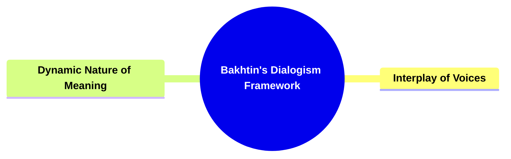

---

### 1. Title: **Bakhtin's Dialogism Framework**

**Dialogism**:
**Definition**: Dialogism is a fundamental concept in Mikhail Bakhtin’s literary theory, emphasizing that all language—and by extension, all narrative—is inherently dialogic. This means that language is not a static, isolated entity but is shaped and defined by the interaction of multiple voices, each representing different perspectives, ideologies, and social positions. Dialogism suggests that meaning in a narrative is not fixed or singular but is constantly evolving through the interplay of these diverse voices. Bakhtin’s concept of dialogism challenges the traditional notion of a single, authoritative voice in literature, proposing instead that every text is a site of interaction between various voices, each contributing to the creation of meaning.

---

### 2. Key Concepts

#### 2.1. Interplay of Voices

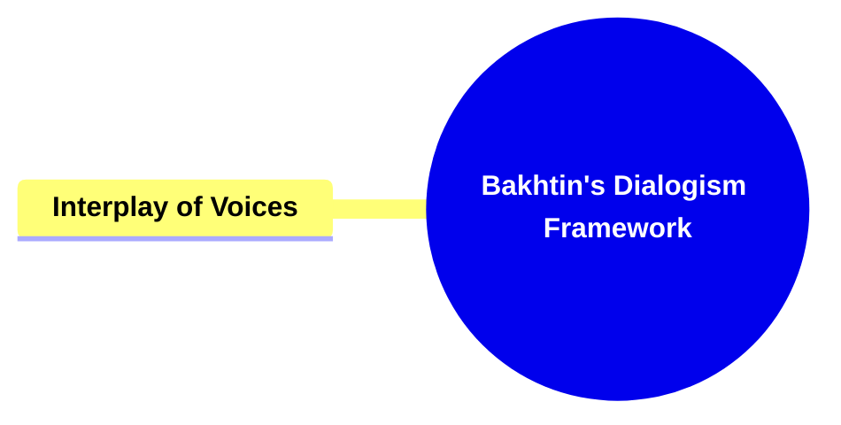

**Definition**:
The interplay of voices in a narrative refers to the interaction and juxtaposition of different characters’ voices, narrative perspectives, and the relationship between the author’s voice and those of the characters. This interplay creates a multi-voiced or polyphonic narrative, where multiple perspectives coexist, often in tension or dialogue with each other.

##### 2.1.1. **Components of Interplay of Voices**

###### 2.1.1.1. **Polyphony**

- **Definition**: A key feature of dialogism, polyphony refers to the presence of multiple, distinct voices within a narrative, each with its own perspective, ideology, and worldview. In a polyphonic narrative, no single voice dominates; instead, meaning emerges from the interaction and conflict between these voices.

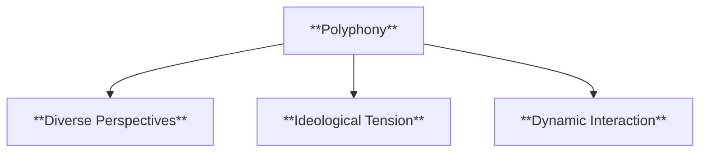

- **Characteristics**
  - **Diverse Perspectives**: Presents varied viewpoints that interact with one another, contributing to a richer, multifaceted narrative.
  - **Ideological Tension**: Highlights conflicts and contrasts between different worldviews, deepening the complexity of the story.
  - **Dynamic Interaction**: Encourages readers to engage with the narrative as an ongoing dialogue where voices respond to and challenge each other.

###### 2.1.1.2. **Heteroglossia**

- **Definition**: Another important aspect of dialogism, heteroglossia refers to the diversity of voices and languages within a text, reflecting the social, cultural, and ideological differences in society. This diversity of voices contributes to the richness and complexity of the narrative.

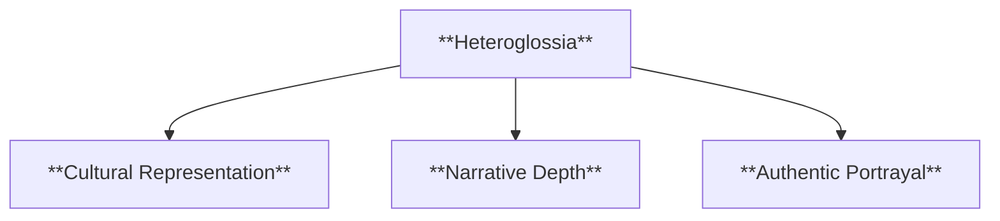

- **Characteristics**
  - **Cultural Representation**: Mirrors the social and cultural fabric by including various speech patterns, dialects, and registers.
  - **Narrative Depth**: Adds layers to the story by showing how language differences shape characters’ identities and social roles.
  - **Authentic Portrayal**: Reflects real-world diversity, making the narrative feel more realistic and relatable.

###### 2.1.1.3. **Authorial Voice vs. Character Voices**

- **Definition**: In dialogic narratives, the author’s voice is not monolithic or authoritative but interacts with the voices of the characters. The author’s voice may be one among many, participating in the dialogue rather than dictating a singular meaning.

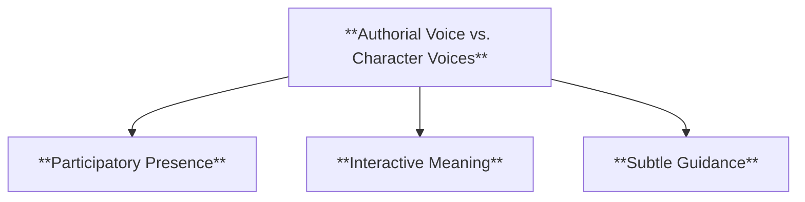

- **Characteristics**
  - **Participatory Presence**: The author’s voice blends with characters’ voices, creating a shared narrative space where no single perspective is dominant.
  - **Interactive Meaning**: Meaning emerges from the interplay between the author’s and characters’ voices, fostering an open narrative environment.
  - **Subtle Guidance**: While the author’s perspective is present, it coexists with other voices, allowing readers to explore different angles without a fixed interpretation.

---

#### 2.2. Dynamic Nature of Meaning

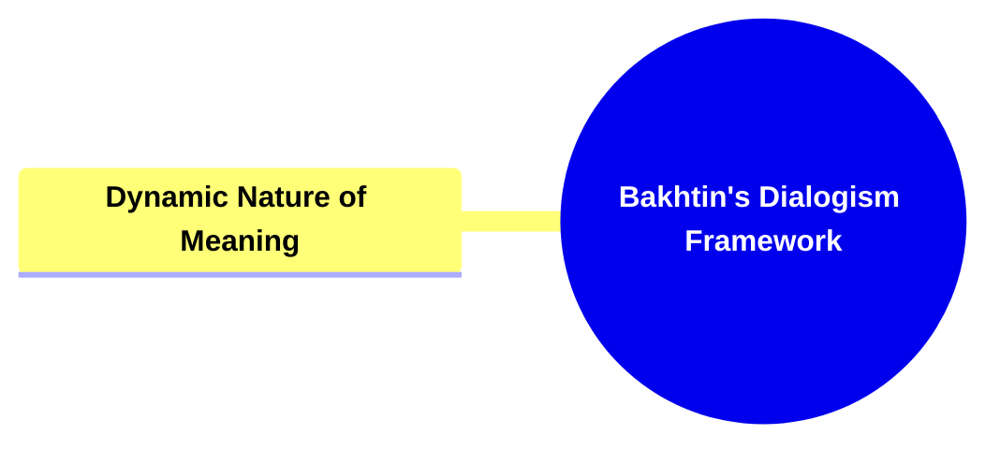

**Definition**:
In Bakhtin’s view, meaning is not a fixed or singular entity within a narrative but is dynamic, emerging from the ongoing dialogue between various voices within the text. This dynamic nature of meaning suggests that understanding a narrative involves recognizing how different voices interact, contest, and influence each other to create a multi-faceted interpretation.

##### 2.2.1. **Components of Dynamic Nature of Meaning**

###### 2.2.1.1. **Relational Meaning**

- **Definition**: Meaning in a dialogic narrative is relational, shaped by the interactions between voices rather than by any single voice. Each voice contributes to the overall meaning by responding to, challenging, or complementing other voices.

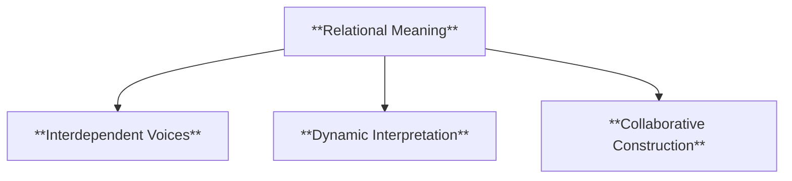

- **Characteristics**
  - **Interdependent Voices**: Each voice builds on or reacts to others, creating a layered understanding of the narrative.
  - **Dynamic Interpretation**: Readers must interpret the story by considering the relationships and tensions between various voices.
  - **Collaborative Construction**: Meaning is co-constructed through dialogue, requiring active engagement from readers.

###### 2.2.1.2. **Open-endedness**

- **Definition**: Because meaning is generated through dialogue, it is inherently open-ended and subject to change. A dialogic narrative resists closure, allowing for multiple interpretations and ongoing reinterpretation by readers.

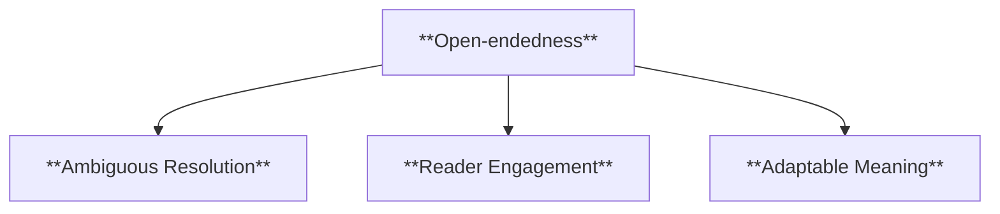

- **Characteristics**
  - **Ambiguous Resolution**: Avoids definitive conclusions, leaving room for continuous discussion and varied interpretations.
  - **Reader Engagement**: Invites readers to contribute their own perspectives and draw unique conclusions.
  - **Adaptable Meaning**: Allows the narrative to evolve over time as different readers and contexts bring new insights.

###### 2.2.1.3. **Social Dimensions**

- **Definition**: Social dimensions in narrative reflect the representation of social hierarchies, interactions, and the dynamics between various social groups, often highlighting issues of class, race, gender, and cultural identity.

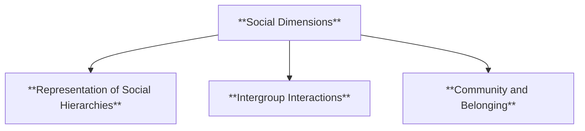

- **Characteristics**
  - **Representation of Social Hierarchies**: Showcases power dynamics and inequalities within society, illustrating social structures and class divisions.
  - **Intergroup Interactions**: Highlights relationships between different social groups, exploring themes of solidarity, conflict, and diversity.
  - **Community and Belonging**: Examines themes of identity and inclusion, reflecting characters’ roles within social networks and communities.

---

###### 2.2.1.4. **Ideological Dimensions**

- **Definition**: Ideological dimensions reveal the beliefs, values, and worldviews presented in the narrative, often emphasizing themes related to politics, religion, and moral perspectives.

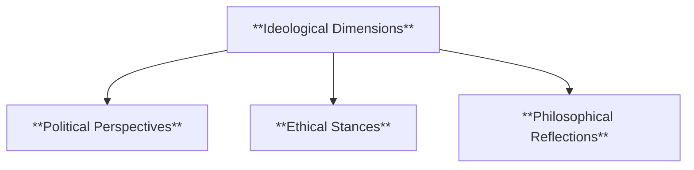

- **Characteristics**
  - **Political Perspectives**: Incorporates political viewpoints, reflecting on power, governance, and social justice within the story.
  - **Ethical Stances**: Engages with moral questions and ethical dilemmas, prompting readers to consider the characters’ values and decisions.
  - **Philosophical Reflections**: Explores fundamental questions about human existence, purpose, and ideology, providing depth and encouraging contemplation.

---

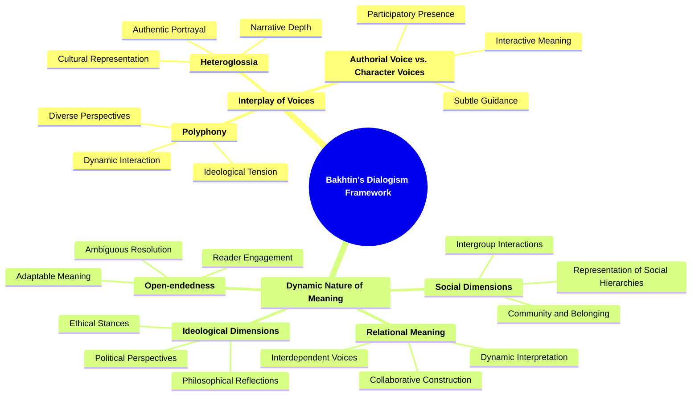

---

### 3. Theoretical Significance

**Impact on Literary Theory**:
Bakhtin’s Dialogism Framework has had a profound impact on literary theory, particularly in the fields of narratology, poststructuralism, and cultural studies. By foregrounding the multiplicity of voices within a narrative, Bakhtin’s theory challenges the notion of a singular, authoritative interpretation of a text and instead promotes a more open, pluralistic approach to reading and understanding literature.

**Application Across Disciplines**:
While originally developed within the context of literary theory, Bakhtin’s concept of dialogism has been widely applied across various disciplines, including philosophy, linguistics, anthropology, and sociology. In these fields, dialogism is used to analyze how meaning is constructed and negotiated in different social, cultural, and communicative contexts.

**Supporting Information**:

- **Interdisciplinary Influence**: Bakhtin’s Dialogism Framework has influenced a range of interdisciplinary studies, including discourse analysis, where it informs the study of how different voices interact in spoken and written communication.
- **Critiques and Further Development**: While Bakhtin’s Dialogism Framework is widely celebrated for its insights into the multiplicity of voices in narrative, some critics argue that it may overlook the power dynamics between voices or the ways in which certain voices may dominate or marginalize others within a text. These critiques have led to further development and refinement of the concept, focusing on issues of power, authority, and voice in narrative and discourse.

---
