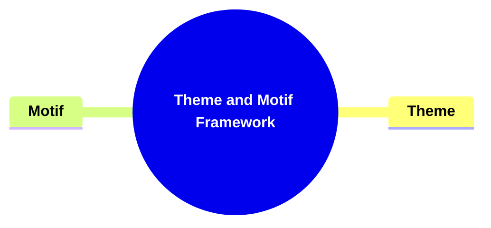
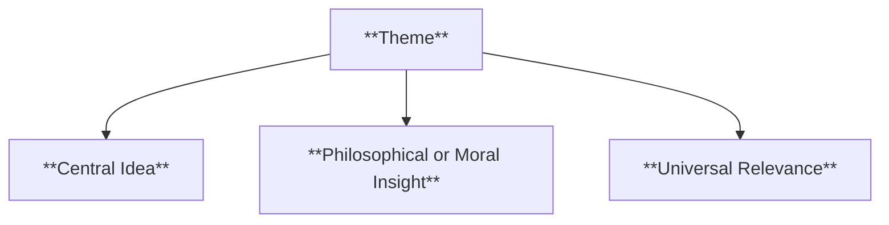
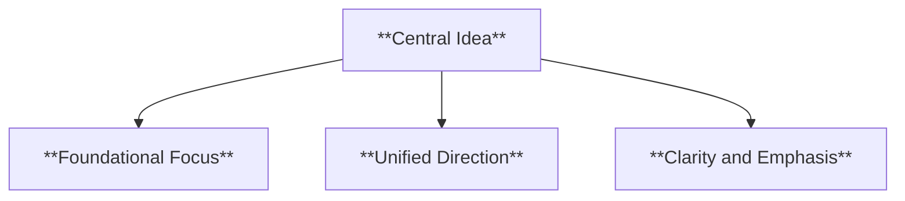
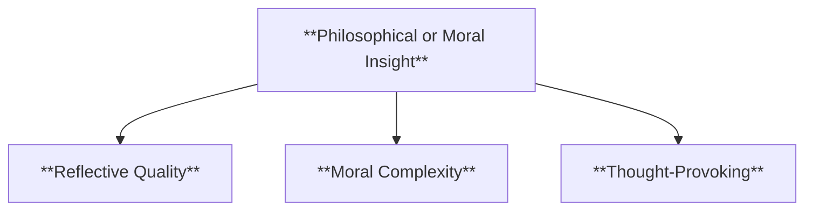
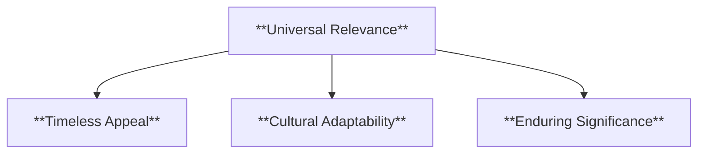
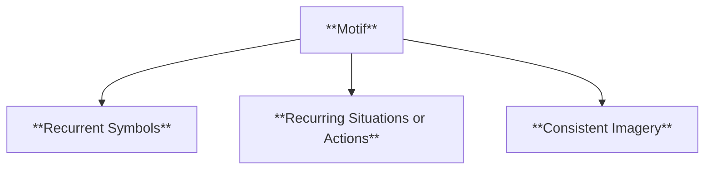
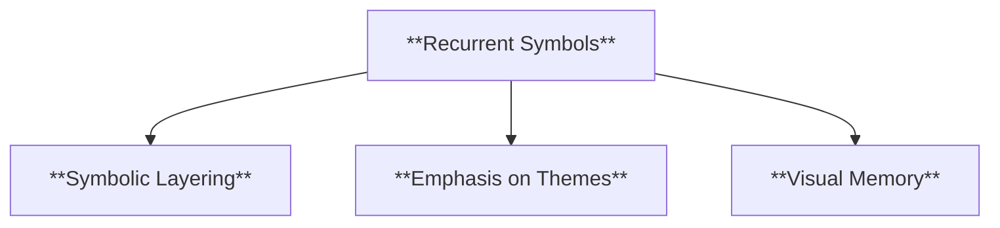
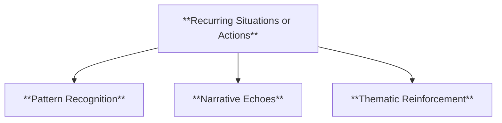
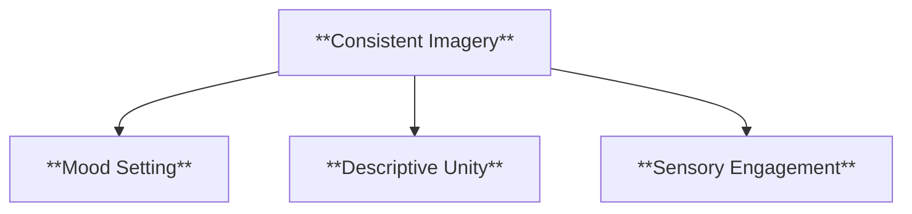
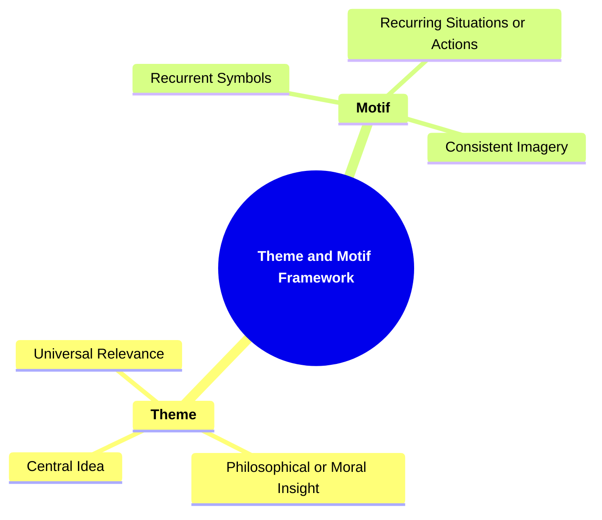

- [1. Title: **Tomashevsky's Theme and Motif Framework**](#1-title-tomashevskys-theme-and-motif-framework)
- [2. Key Concepts](#2-key-concepts)
  - [2.1. Theme](#21-theme)
    - [2.1.1. **Components of Theme**](#211-components-of-theme)
      - [2.1.1.1. **Central Idea**](#2111-central-idea)
      - [2.1.1.2. **Philosophical or Moral Insight**](#2112-philosophical-or-moral-insight)
      - [2.1.1.3. **Universal Relevance**](#2113-universal-relevance)
  - [2.2. Motif](#22-motif)
    - [2.2.1. **Components of Motif**](#221-components-of-motif)
      - [2.2.1.1. **Recurrent Symbols**](#2211-recurrent-symbols)
      - [2.2.1.2. **Recurring Situations or Actions**](#2212-recurring-situations-or-actions)
      - [2.2.1.3. **Consistent Imagery**](#2213-consistent-imagery)
    - [2.2.2. Implications of Tomashevsky's Framework](#222-implications-of-tomashevskys-framework)

---

---

---

### 1. Title: **Tomashevsky's Theme and Motif Framework**

**Theme and Motif**:
**Definition**: Boris Tomashevsky distinguishes between _theme_ and _motif_ as two crucial components of narrative content that work together to convey the meaning and structure of a story. While the theme represents the overarching idea or message of the narrative, motifs are the recurring elements that reinforce and develop this theme throughout the story.

---

### 2. Key Concepts

#### 2.1. Theme

**Definition**:
The theme is the overarching idea, subject matter, or message of the narrative. It represents the fundamental concepts, philosophical insights, or moral lessons that the narrative seeks to convey to its audience. Themes are often abstract, dealing with universal ideas such as love, power, betrayal, or redemption.

##### 2.1.1. **Components of Theme**

###### 2.1.1.1. **Central Idea**

- **Definition**: The core message or concept around which the narrative revolves.

- **Characteristics**
  - **Foundational Focus**: Acts as the guiding principle that shapes the story's characters, plot, and dialogue.
  - **Unified Direction**: Provides cohesion by ensuring that all elements of the narrative contribute to this central message.
  - **Clarity and Emphasis**: Often reiterated through various aspects of the story to make its importance clear to the reader.

###### 2.1.1.2. **Philosophical or Moral Insight**

- **Definition**: The deeper reflections on life, society, or human nature that the theme explores.

- **Characteristics**
  - **Reflective Quality**: Encourages readers to ponder larger questions or truths presented in the story.
  - **Moral Complexity**: Often presents dilemmas or perspectives that challenge readers to think critically about societal norms or personal beliefs.
  - **Thought-Provoking**: Aims to leave readers with lasting impressions or questions that extend beyond the story itself.

###### 2.1.1.3. **Universal Relevance**

- **Definition**: Themes often deal with universal concerns, making them applicable across time and cultures.

- **Characteristics**
  - **Timeless Appeal**: Relates to common human experiences and emotions, ensuring that the theme resonates with a wide audience.
  - **Cultural Adaptability**: Can be understood and interpreted in various cultural contexts while maintaining its core message.
  - **Enduring Significance**: Retains its importance regardless of changing times, making it relatable for different generations.

---

#### 2.2. Motif

**Definition**:
Motifs are recurring elements within a narrative that contribute to the development of the theme. These can include objects, phrases, actions, or symbols that appear repeatedly throughout the story, reinforcing the theme.

##### 2.2.1. **Components of Motif**

###### 2.2.1.1. **Recurrent Symbols**

- **Definition**: Objects or images that appear multiple times, symbolizing key ideas related to the theme.

- **Characteristics**
  - **Symbolic Layering**: Adds depth to the narrative by embedding meaning through repeated symbols.
  - **Emphasis on Themes**: Reinforces key themes by using symbols to draw attention to their significance.
  - **Visual Memory**: Helps readers associate certain images or objects with important thematic concepts.

###### 2.2.1.2. **Recurring Situations or Actions**

- **Definition**: Repeated events or actions that highlight important thematic elements.

- **Characteristics**
  - **Pattern Recognition**: Creates familiarity and reinforces themes by repeating similar events or motifs.
  - **Narrative Echoes**: Connects different parts of the story through recurring actions that reflect the theme.
  - **Thematic Reinforcement**: Ensures that important themes are not forgotten by weaving them consistently throughout the story.

###### 2.2.1.3. **Consistent Imagery**

- **Definition**: Visual or descriptive elements that consistently evoke the theme’s atmosphere or mood.

- **Characteristics**
  - **Mood Setting**: Establishes an atmosphere that aligns with the story’s theme, immersing the reader in the narrative.
  - **Descriptive Unity**: Maintains coherence by using imagery that ties into the theme’s emotional or conceptual tone.
  - **Sensory Engagement**: Draws readers in by appealing to their senses, making the theme more vivid and impactful.

---

---

---

##### 2.2.2. Implications of Tomashevsky's Framework

**Key Insight or Implication**:
Tomashevsky’s distinction between theme and motif provides a powerful analytical tool for understanding how narratives convey complex ideas. Themes serve as the overarching message, while motifs help develop and reinforce this message throughout the story.

**Collaborative or Future-Oriented Insight**:
Tomashevsky’s framework remains relevant in modern literary analysis, providing insights not only in literature but also in visual storytelling like film and video games. As narrative forms evolve, his approach offers a structured way to analyze themes and motifs across mediums.

---
