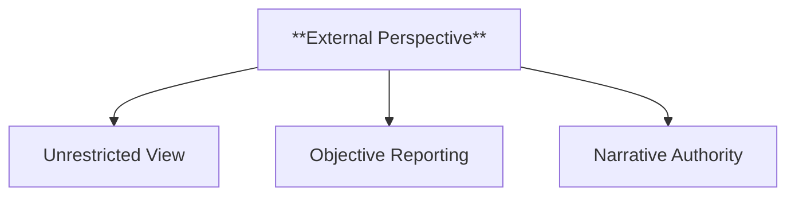
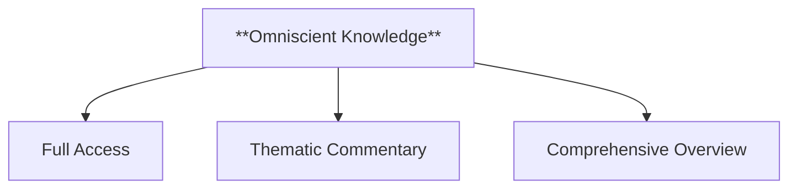
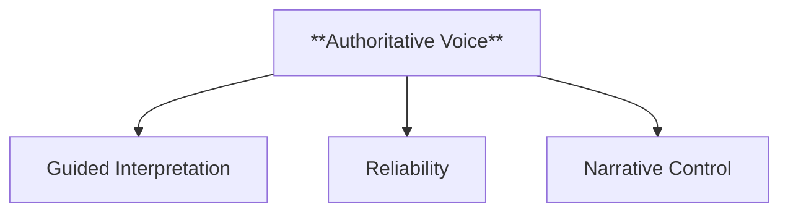
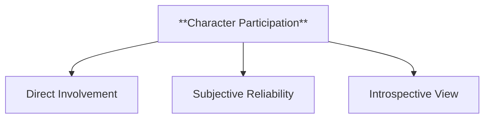
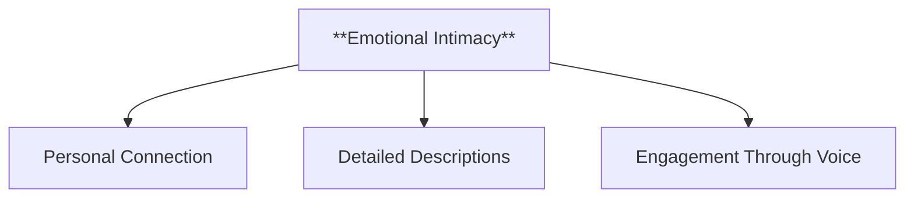
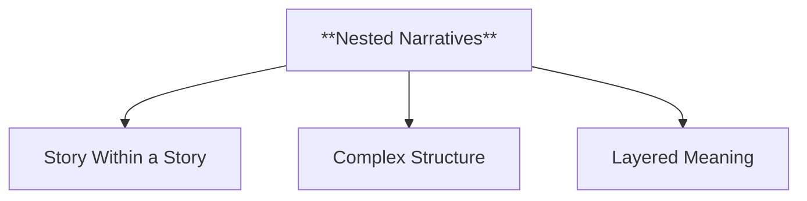
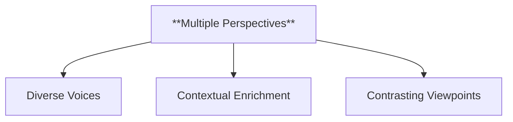
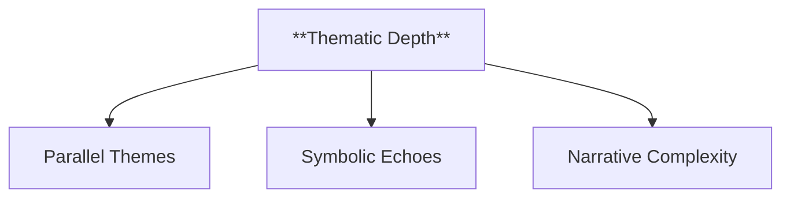
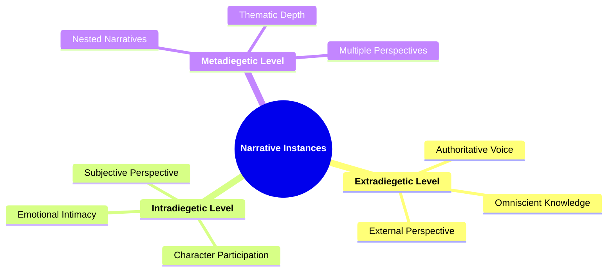

- [1. **Title: Genette's Narrative Instances Framework**](#1-title-genettes-narrative-instances-framework)
- [2. **Key Concepts**](#2-key-concepts)
  - [2.1. **Extradiegetic Level**](#21-extradiegetic-level)
    - [2.1.1. **Components of Extradiegetic Level**](#211-components-of-extradiegetic-level)
      - [2.1.1.1. **External Perspective**](#2111-external-perspective)
      - [2.1.1.2. **Omniscient Knowledge**](#2112-omniscient-knowledge)
      - [2.1.1.3. **Authoritative Voice**](#2113-authoritative-voice)
  - [2.2. **Intradiegetic Level**](#22-intradiegetic-level)
    - [2.2.1. **Components of Intradiegetic Level**](#221-components-of-intradiegetic-level)
      - [2.2.1.1. **Subjective Perspective**](#2211-subjective-perspective)
      - [2.2.1.2. **Character Participation**](#2212-character-participation)
      - [2.2.1.3. **Emotional Intimacy**](#2213-emotional-intimacy)
  - [2.3. **Metadiegetic Level**](#23-metadiegetic-level)
    - [2.3.1. **Components of Metadiegetic Level**](#231-components-of-metadiegetic-level)
      - [2.3.1.1. **Nested Narratives**](#2311-nested-narratives)
      - [2.3.1.2. **Multiple Perspectives**](#2312-multiple-perspectives)
      - [2.3.1.3. **Thematic Depth**](#2313-thematic-depth)
- [3. Implications of **Narrative Instances**](#3-implications-of-narrative-instances)

---

### 1. **Title: Genette's Narrative Instances Framework**

**Narrative Instances**:
**Definition**: Gérard Genette's concept of "narrative instances" offers a detailed examination of the various positions a narrator can occupy relative to the narrative. This concept is essential for understanding the structure of a narrative and the relationship between the narrator and the story being told. Genette’s framework identifies key narrative levels, including the _extradiegetic_, _intradiegetic_, and _metadiegetic_ levels, each offering unique insights into how narratives are constructed.

```mermaid
mindmap
  root((**Narrative Instances**))J
    **Extradiegetic Level**
    **Intradiegetic Level**
    **Metadiegetic Level**
```

---

### 2. **Key Concepts**

#### 2.1. **Extradiegetic Level**

**Definition**:
The _extradiegetic_ level refers to a narrator who exists outside the story world and narrates the events from a position of authority, external to the narrative.

##### 2.1.1. **Components of Extradiegetic Level**

###### 2.1.1.1. **External Perspective**

- **Definition**: Provides a broad, overarching view of the story, not bound by the limitations of any character’s knowledge.



- **Characteristics**
  - **Unrestricted View**: Offers a comprehensive look at events, settings, and character interactions, providing readers with more context than any one character would have.
  - **Objective Reporting**: Can present events in a neutral manner, giving readers a full picture without being limited to subjective interpretations.
  - **Narrative Authority**: Seen as a detached guide that directs how readers should understand the broader aspects of the story.

###### 2.1.1.2. **Omniscient Knowledge**

- **Definition**: Often presents a comprehensive understanding of events, offering commentary and reflections on the narrative's deeper meaning.



- **Characteristics**
  - **Full Access**: Has insight into all characters’ thoughts, emotions, and motivations, providing a deep understanding of the narrative.
  - **Thematic Commentary**: May include observations and reflections that help readers interpret the story’s larger themes.
  - **Comprehensive Overview**: Connects disparate events and characters, showing their significance within the broader context of the story.

###### 2.1.1.3. **Authoritative Voice**

- **Definition**: Generally seen as a reliable and controlling voice that guides the reader's understanding of the narrative.



- **Characteristics**
  - **Guided Interpretation**: Directs readers toward specific interpretations through assertive language and narrative confidence.
  - **Reliability**: Presents events and information in a way that is trusted, leaving little room for ambiguity.
  - **Narrative Control**: Maintains a strong presence that shapes the story’s flow and how it is perceived by readers.

---

#### 2.2. **Intradiegetic Level**

**Definition**:
The _intradiegetic_ level refers to a narrator who exists within the story world as a character involved in the events being narrated.

##### 2.2.1. **Components of Intradiegetic Level**

###### 2.2.1.1. **Subjective Perspective**

- **Definition**: The intradiegetic narrator presents a personal and often limited view of the story, shaped by their own experiences and biases.


- **Characteristics**
  - **Personal Insight**: Provides an emotionally driven account that reveals the narrator’s internal conflicts and interpretations.
  - **Limited Knowledge**: The story is told from the narrator’s point of view, restricting the information to what they know or believe.
  - **Bias and Interpretation**: Reflects the narrator’s perceptions, which can influence the reader’s understanding of events and other characters.

###### 2.2.1.2. **Character Participation**

- **Definition**: As a character in the story, the narrator's involvement influences their account of events, providing insight into their internal world.



- **Characteristics**
  - **Direct Involvement**: Offers firsthand accounts of events that give a sense of immediacy and realism to the narrative.
  - **Subjective Reliability**: The narrator’s participation can lead to biased storytelling, challenging readers to assess the accuracy of their account.
  - **Introspective View**: Gives deeper insight into the narrator’s personality, motivations, and emotional responses, enriching the story’s layers.

###### 2.2.1.3. **Emotional Intimacy**

- **Definition**: Creates a more intimate and engaging connection between the narrator and the reader, as the reader experiences events through the character’s lens.



- **Characteristics**
  - **Personal Connection**: Fosters empathy as readers align themselves with the narrator’s experiences and emotions.
  - **Detailed Descriptions**: Focuses on personal observations and feelings that add depth and nuance to the narrative.
  - **Engagement Through Voice**: The narrative voice can captivate readers with its unique tone and perspective, drawing them into the character’s world.

---

#### 2.3. **Metadiegetic Level**

**Definition**:
The _metadiegetic_ level refers to a narrative embedded within another narrative, often presented as a story within a story.

##### 2.3.1. **Components of Metadiegetic Level**

###### 2.3.1.1. **Nested Narratives**

- **Definition**: Involves a secondary narrative told by an intradiegetic narrator, creating a layered storytelling structure.



- **Characteristics**
  - **Story Within a Story**: Embeds additional narratives that provide context or parallels to the main story.
  - **Complex Structure**: Adds depth by intertwining primary and secondary plots, enhancing the overall narrative richness.
  - **Layered Meaning**: Allows for reflective storytelling where the inner narrative can mirror or contrast the primary plot.

###### 2.3.1.2. **Multiple Perspectives**

- **Definition**: Offers alternative viewpoints or background information that enriches the primary narrative.



- **Characteristics**
  - **Diverse Voices**: Presents different characters’ perspectives, giving readers a multifaceted view of the story.
  - **Contextual Enrichment**: Provides background or new angles that deepen the reader’s understanding of the main events.
  - **Contrasting Viewpoints**: Creates tension or enhances themes by showing differing interpretations or reactions to events.

###### 2.3.1.3. **Thematic Depth**

- **Definition**: The metadiegetic narrative often mirrors or contrasts the themes of the primary story, adding complexity to the narrative.



- **Characteristics**
  - **Parallel Themes**: Reinforces or juxtaposes the main story’s themes, providing additional insight and reflection.
  - **Symbolic Echoes**: Uses the inner narrative to draw out or emphasize symbolic elements related to the primary plot.
  - **Narrative Complexity**: Enhances the overall narrative by introducing thematic nuances that engage readers on a deeper level.

---



---

### 3. Implications of **Narrative Instances**

**Narrative Structure and Interaction**:
Genette’s concept of narrative instances is key to understanding how stories are structured and how different narrative levels interact. By identifying the extradiegetic, intradiegetic, and metadiegetic levels, Genette provides a framework for analyzing the complexities of narrative voice and perspective, offering readers a deeper understanding of how stories are told.

**Influence on Narratology**:
Genette’s _Narrative Instances Framework_ has had a profound influence on narratology, offering a systematic approach to analyzing how narratives operate across different levels. This framework is foundational in narrative theory and remains applicable across literary genres and other media forms.

---
