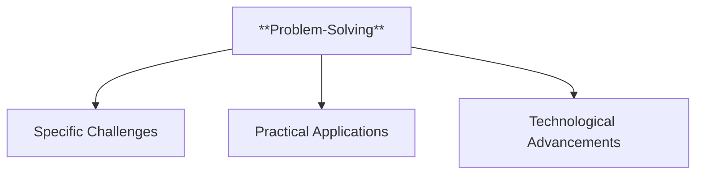
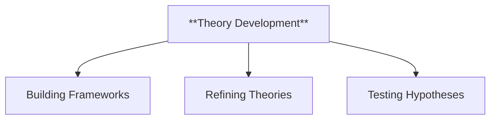
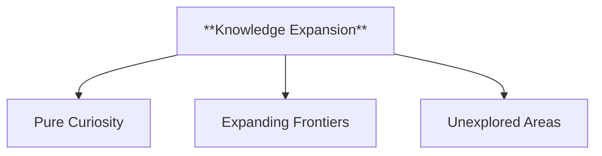
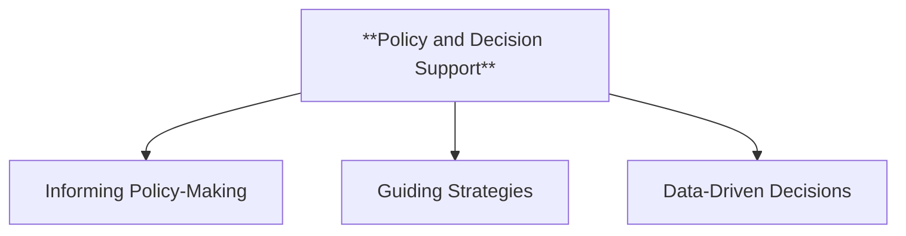
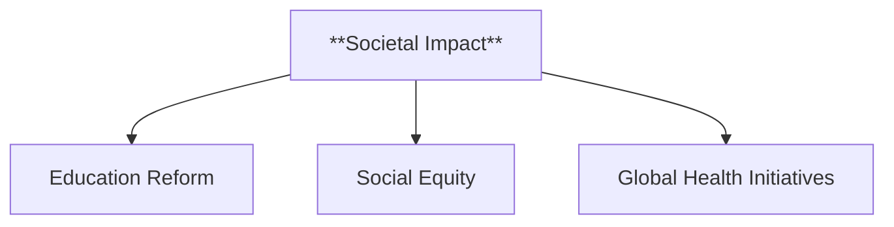

### **Motivations for Research: [Project Name]**

#### **1. Title and Overview**

- **Title**: "Motivations for Research: [Project Name]"
- **Overview**:
  - Clearly outline the goals of the specific research project.
  - Connect the project’s objectives to broader research motivations, emphasizing its unique contributions.

**Example**:

> The [Project Name] research initiative seeks to address [specific challenge or goal]. Rooted in [motivation category, e.g., Problem-Solving], this project leverages [methodology] to achieve [expected outcomes or contributions].

---

#### **2. Key Motivations for Research**

##### **2.1 Problem-Solving**

- **Definition**: Addressing specific challenges or practical issues relevant to the project’s objectives.
- **Project Application**:
  - **Examples**:
    - Identifying solutions to [specific problem].
    - Innovating processes or tools to improve [field/area].



---

##### **2.2 Theory Development**

- **Definition**: Refining or creating theoretical frameworks to deepen understanding in a specific domain.
- **Project Application**:
  - **Examples**:
    - Developing a new theoretical approach to [specific area].
    - Testing hypotheses related to [concept or phenomenon].



---

##### **2.3 Knowledge Expansion**

- **Definition**: Broadening the scope of existing knowledge or exploring uncharted areas of inquiry.
- **Project Application**:
  - **Examples**:
    - Investigating [topic/phenomenon] to uncover new insights.
    - Contributing to the collective understanding of [field/subject].



---

##### **2.4 Policy and Decision Support**

- **Definition**: Informing policy-making or providing actionable insights for decision-makers.
- **Project Application**:
  - **Examples**:
    - Generating data to support [specific policy or decision].
    - Analyzing trends to guide [strategic planning or organizational goals].



---

##### **2.5 Societal Impact**

- **Definition**: Driving meaningful change or creating benefits for society as a whole.
- **Project Application**:
  - **Examples**:
    - Enhancing [community service, education, healthcare, etc.].
    - Reducing barriers in [specific area] through innovation or advocacy.



---

#### **3. Integration with Research Design**

- **Purpose**: Explain how the project’s motivations inform its design.
- **Content**:
  - Highlight the methodologies and approaches chosen to align with the motivations.
  - Show how these motivations drive iterative development and refinement.

**Example**:

> "The [Project Name] research project integrates [motivations] by employing [methodology], ensuring alignment with its overarching goals of [specific outcomes]. This alignment strengthens the project’s focus and ensures actionable results."

---

#### **4. Benefits of Understanding Motivations**

- **Purpose**: Emphasize how motivations influence the project’s success.
- **Project-Specific Benefits**:
  - Ensures that the research remains goal-oriented and impactful.
  - Promotes coherence between the research design and its intended applications.
  - Enhances the relevance of findings for stakeholders.

---

#### **5. Conclusion and Further Reading**

- **Purpose**: Reiterate the project’s motivations and provide additional resources for context or deeper exploration.
- **Content**:
  - Summarize the alignment between the motivations and the project’s expected contributions.
  - Include references or links to related studies, frameworks, or knowledgebase entries.

**Example**:

> The [Project Name] research initiative exemplifies the integration of research motivations into design and execution. By aligning with [specific motivations], this project contributes significantly to [field/area] and provides actionable insights for [target audience].

---

### **Mindmap Summary**

```mermaid
mindmap
  root((**Motivations for Research: [Project Name]**))
    **Problem-Solving**
      Specific Challenges
      Practical Applications
      Technological Advancements
    **Theory Development**
      Building Frameworks
      Refining Theories
      Testing Hypotheses
    **Knowledge Expansion**
      Pure Curiosity
      Expanding Frontiers
      Unexplored Areas
    **Policy and Decision Support**
      Informing Policy-Making
      Guiding Strategies
      Data-Driven Decisions
    **Societal Impact**
      Education Reform
      Social Equity
      Global Health Initiatives
```

This boilerplate template can be customized for various research projects, ensuring consistency and clarity in articulating motivations and their integration into research design.
