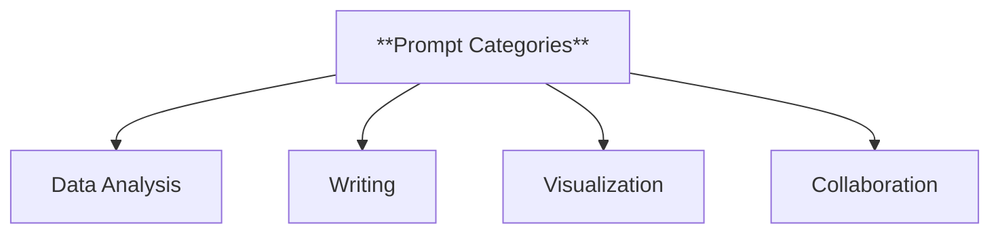
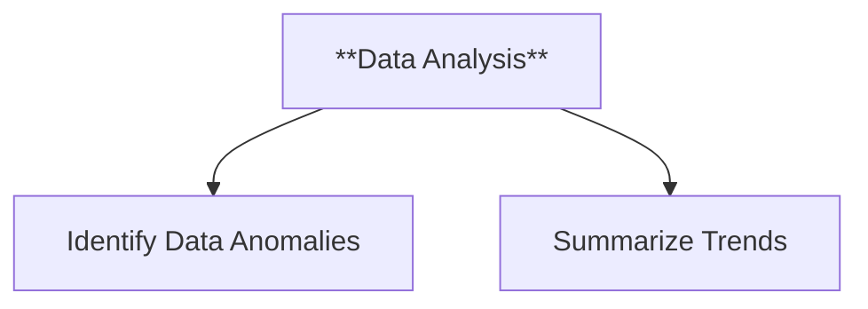
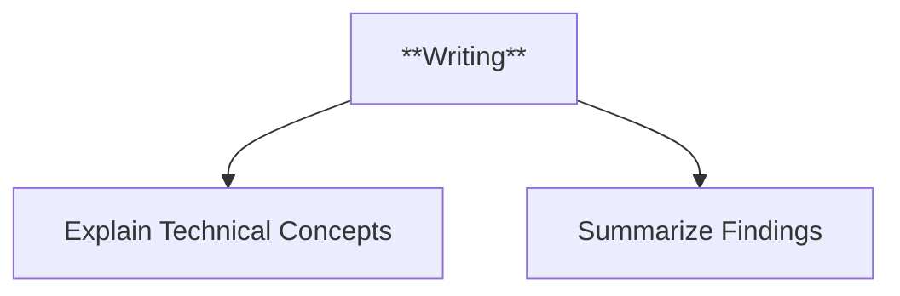
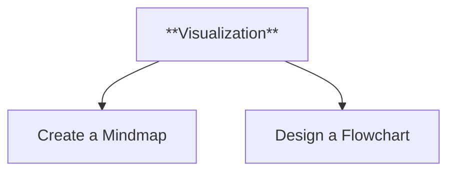
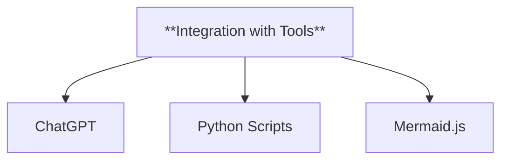
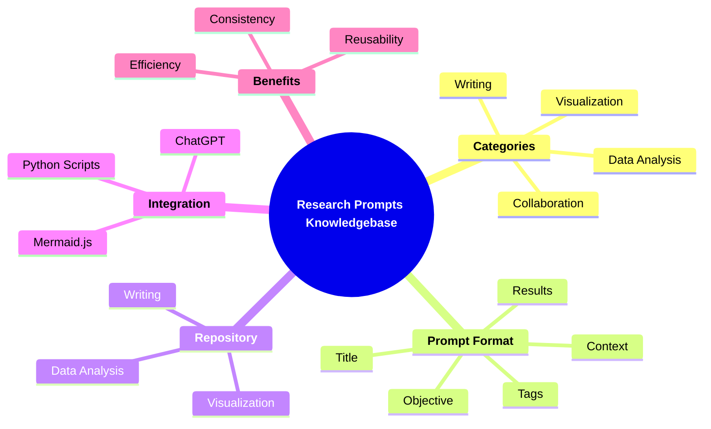

### **Template: Research Prompts Knowledgebase**

This template provides a structured format for documenting and organizing prompts used during the research process. It ensures consistency, traceability, and reusability of prompts while fostering transparency and collaboration.

---

#### **1. Title and Overview**

- **Purpose**: Briefly describe the purpose of the page and the role of prompts in the research process.
- **Content**:
  - A title that summarizes the focus of the page (e.g., "Research Prompts Database").
  - An overview highlighting the importance of prompts in guiding research and generating insights.

**Example**:

> **Title**: "Research Prompts Database"  
> Prompts are essential for structuring research queries, generating content, and solving complex problems. This database documents all prompts used during the research process, categorized for easy reference.

---

#### **2. Categories of Prompts**

- **Purpose**: Organize prompts into meaningful categories based on their use cases.
- **Examples**:
  - **Data Analysis Prompts**: Queries for exploring, cleaning, or interpreting data.
  - **Writing Prompts**: Content generation for summaries, explanations, or documentation.
  - **Visualization Prompts**: Instructions for creating diagrams, charts, or mindmaps.
  - **Collaboration Prompts**: Suggestions for improving workflows, team communication, or task management.

**Flowchart**:

---

#### **3. Prompt Format**

- **Purpose**: Define a standardized format for documenting prompts.
- **Content**:
  - **Title**: Short, descriptive title for the prompt.
  - **Objective**: The specific goal of the prompt.
  - **Prompt Text**: The exact text used.
  - **Context**: The scenario or task where the prompt was applied.
  - **Results/Outputs**: Summary of the outcomes or examples of generated results.
  - **Tags**: Keywords for easy categorization and searchability.

**Example**:

> **Title**: "Summarizing Research Findings"  
> **Objective**: Generate concise summaries of large datasets or articles.  
> **Prompt Text**: "Summarize the key findings of the research paper in under 100 words, focusing on practical applications."  
> **Context**: Used to summarize a dataset of survey results on user behavior.  
> **Results/Outputs**:
>
> - "Users preferred feature X over feature Y by a margin of 65%."
> - "Time efficiency was cited as the primary reason for feature selection."  
>   **Tags**: Summarization, Data Analysis, User Insights

---

#### **4. Prompt Repository**

- **Purpose**: Create a categorized and searchable collection of prompts.
- **Examples**:

##### 4.1. **Data Analysis Prompts**

- **Title**: "Identify Data Anomalies"
  - **Prompt**: "Find anomalies in the dataset and suggest potential causes."
  - **Context**: Applied to a sales dataset with outlier detection tools.

##### 4.2. **Writing Prompts**

- **Title**: "Explain Technical Concepts"
  - **Prompt**: "Write a layman-friendly explanation of [concept]."
  - **Context**: Used to simplify machine learning terms for documentation.

##### 4.3. **Visualization Prompts**

- **Title**: "Create a Mindmap"
  - **Prompt**: "Generate a mindmap of the main concepts in [topic] using Mermaid syntax."
  - **Context**: Applied to structure a research presentation.

---

#### **5. Integration with Tools**

- **Purpose**: Explain how prompts are used with specific software or platforms.
- **Content**:
  - Mention tools such as ChatGPT, Python scripts, or visualization platforms.
  - Highlight examples of tool-specific prompts.

**Flowchart**:

---

#### **6. Benefits of a Prompt Database**

- **Purpose**: Highlight how the database enhances research efficiency and collaboration.
- **Examples**:
  - Streamlines repetitive tasks.
  - Ensures consistency across different stages of research.
  - Encourages prompt sharing and reusability.

---

#### **7. Footer and Links**

- **Purpose**: Provide navigation to related resources.
- **Content**:
  - Links to full documentation or prompt tutorials.
  - Contribution guidelines for adding new prompts.

**Example**:

- [Prompt Contribution Guide](./CONTRIBUTING.md)
- [Full Documentation](https://docs.example.com)
- [Community Forum](https://community.example.com)

---

### **Mindmap Summary**

This template provides a structured, user-friendly format for documenting research prompts, enabling efficient reuse, collaboration, and traceability.
