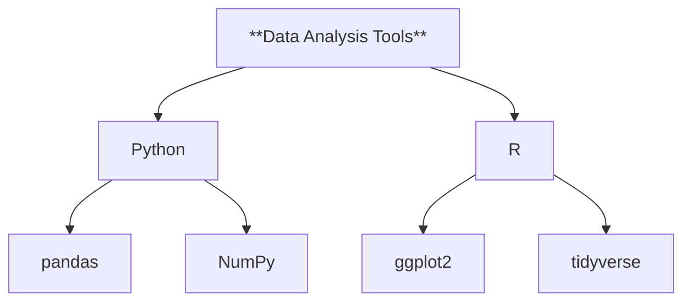
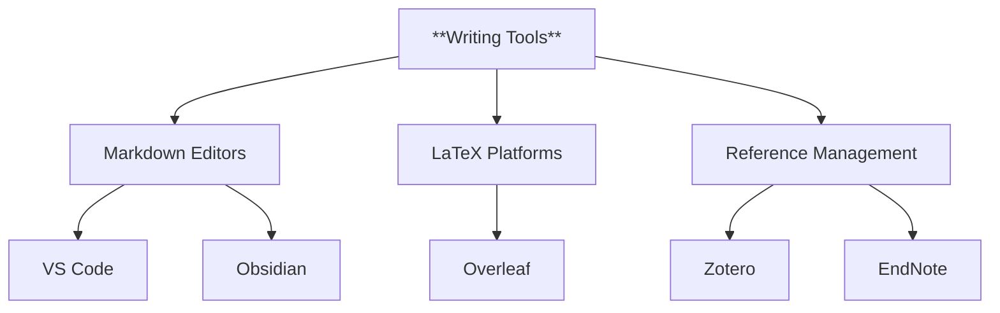
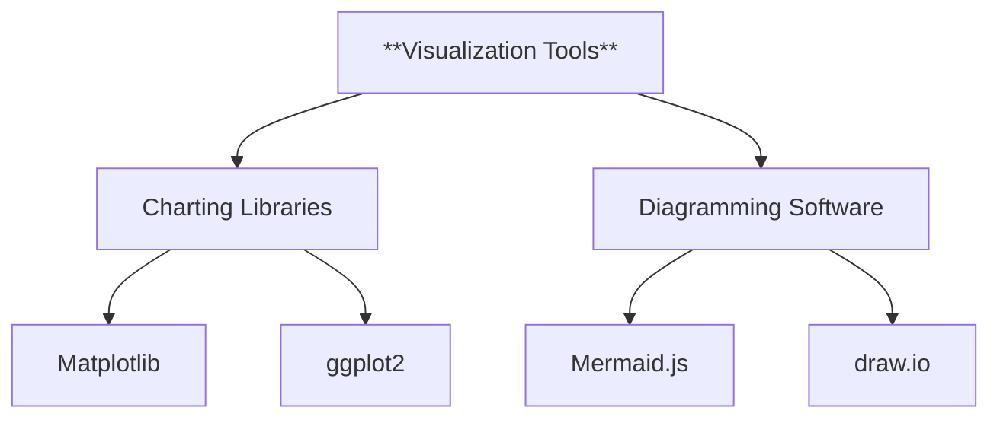
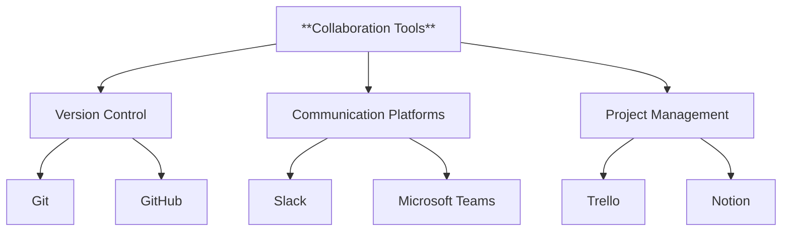
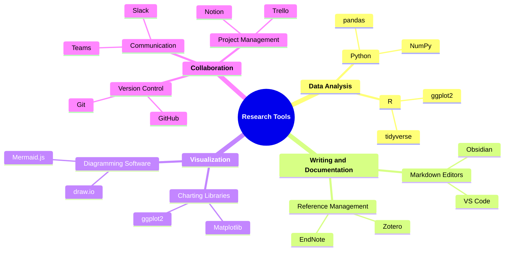

### **Research Tools: Software, Packages, and Extensions**

#### **1. Introduction**

- **Purpose**: Provide a comprehensive overview of the software, tools, and extensions used during the research process.
- **Content**:
  - Summarize the role of research tools in enhancing efficiency, accuracy, and collaboration.
  - Highlight the integration of these tools into various phases of research.

**Example**:

> "This page details the software, packages, and extensions utilized during the research process. These tools streamline data analysis, document management, visualization, and collaboration, ensuring a systematic and efficient workflow."

---

#### **2. Categories of Tools**

##### 2.1 **Data Analysis and Management Tools**

- **Definition**: Tools used to process, analyze, and manage research data.
- **Examples**:
  - **Python**: Used for data manipulation, statistical analysis, and machine learning.
    - Libraries: `pandas`, `NumPy`, `scikit-learn`.
  - **R**: Preferred for statistical modeling and data visualization.
    - Libraries: `ggplot2`, `dplyr`, `tidyverse`.

**Flowchart**:

---

##### 2.2 **Writing and Documentation Tools**

- **Definition**: Tools for drafting, formatting, and managing research documentation.
- **Examples**:
  - **Markdown Editors**: Visual Studio Code, Obsidian.
  - **Document Formatting**: Overleaf for LaTeX, Microsoft Word.
  - **Reference Management**: Zotero, EndNote.

**Flowchart**:

---

##### 2.3 **Visualization and Diagramming Tools**

- **Definition**: Tools to create charts, graphs, and diagrams for data representation.
- **Examples**:
  - **Charting Libraries**: Matplotlib (Python), ggplot2 (R).
  - **Diagramming Software**: Mermaid.js, draw.io.

**Flowchart**:

---

##### 2.4 **Collaboration and Communication Tools**

- **Definition**: Tools to facilitate teamwork, version control, and communication.
- **Examples**:
  - **Version Control**: Git, GitHub.
  - **Communication Platforms**: Slack, Microsoft Teams.
  - **Project Management**: Trello, Notion.

**Flowchart**:

---

#### **3. Integration and Workflow**

- **Purpose**: Explain how these tools fit into the research workflow.
- **Content**:
  - Highlight seamless transitions between tools (e.g., Git for version control and Markdown for writing).
  - Showcase collaborative workflows enabled by communication platforms and project management tools.

**Example**:

> "Our workflow integrates these tools into a cohesive system, from data analysis with Python to version-controlled documentation in Markdown, managed through GitHub. Collaborative efforts are supported via Slack and Notion."

---

#### **4. Benefits of Research Tools**

- **Purpose**: Emphasize the advantages these tools bring to research processes.
- **Examples**:
  - Improved efficiency and accuracy.
  - Enhanced collaboration across teams.
  - Clear and visually appealing data representation.

---

#### **5. Conclusion**

- **Purpose**: Summarize the value of these tools and encourage their adoption.
- **Content**:
  - Reiterate the importance of a systematic approach to research.
  - Provide links to official documentation or tutorials for each tool.

---

### **Mindmap Summary**

This **Research Tools** knowledgebase template ensures all software and tools are documented in an organized, user-friendly format with clear explanations, examples, and visual aids for better comprehension and application.

### **Research Tools: Software, Packages, and Extensions**

#### **1. Introduction**

- **Purpose**: Provide a comprehensive overview of the software, tools, and extensions used during the research process.
- **Content**:
  - Summarize the role of research tools in enhancing efficiency, accuracy, and collaboration.
  - Highlight the integration of these tools into various phases of research.

**Example**:

> "This page details the software, packages, and extensions utilized during the research process. These tools streamline data analysis, document management, visualization, and collaboration, ensuring a systematic and efficient workflow."

---

#### **2. Categories of Tools**

##### 2.1 **Data Analysis and Management Tools**

- **Definition**: Tools used to process, analyze, and manage research data.
- **Examples**:
  - **Python**: Used for data manipulation, statistical analysis, and machine learning.
    - Libraries: `pandas`, `NumPy`, `scikit-learn`.
  - **R**: Preferred for statistical modeling and data visualization.
    - Libraries: `ggplot2`, `dplyr`, `tidyverse`.

**Flowchart**:

---

##### 2.2 **Writing and Documentation Tools**

- **Definition**: Tools for drafting, formatting, and managing research documentation.
- **Examples**:
  - **Markdown Editors**: Visual Studio Code, Obsidian.
  - **Document Formatting**: Overleaf for LaTeX, Microsoft Word.
  - **Reference Management**: Zotero, EndNote.

**Flowchart**:

---

##### 2.3 **Visualization and Diagramming Tools**

- **Definition**: Tools to create charts, graphs, and diagrams for data representation.
- **Examples**:
  - **Charting Libraries**: Matplotlib (Python), ggplot2 (R).
  - **Diagramming Software**: Mermaid.js, draw.io.

**Flowchart**:

---

##### 2.4 **Collaboration and Communication Tools**

- **Definition**: Tools to facilitate teamwork, version control, and communication.
- **Examples**:
  - **Version Control**: Git, GitHub.
  - **Communication Platforms**: Slack, Microsoft Teams.
  - **Project Management**: Trello, Notion.

**Flowchart**:

---

#### **3. Integration and Workflow**

- **Purpose**: Explain how these tools fit into the research workflow.
- **Content**:
  - Highlight seamless transitions between tools (e.g., Git for version control and Markdown for writing).
  - Showcase collaborative workflows enabled by communication platforms and project management tools.

**Example**:

> "Our workflow integrates these tools into a cohesive system, from data analysis with Python to version-controlled documentation in Markdown, managed through GitHub. Collaborative efforts are supported via Slack and Notion."

---

#### **4. Benefits of Research Tools**

- **Purpose**: Emphasize the advantages these tools bring to research processes.
- **Examples**:
  - Improved efficiency and accuracy.
  - Enhanced collaboration across teams.
  - Clear and visually appealing data representation.

---

#### **5. Conclusion**

- **Purpose**: Summarize the value of these tools and encourage their adoption.
- **Content**:
  - Reiterate the importance of a systematic approach to research.
  - Provide links to official documentation or tutorials for each tool.

---

### **Mindmap Summary**

This **Research Tools** knowledgebase template ensures all software and tools are documented in an organized, user-friendly format with clear explanations, examples, and visual aids for better comprehension and application.
