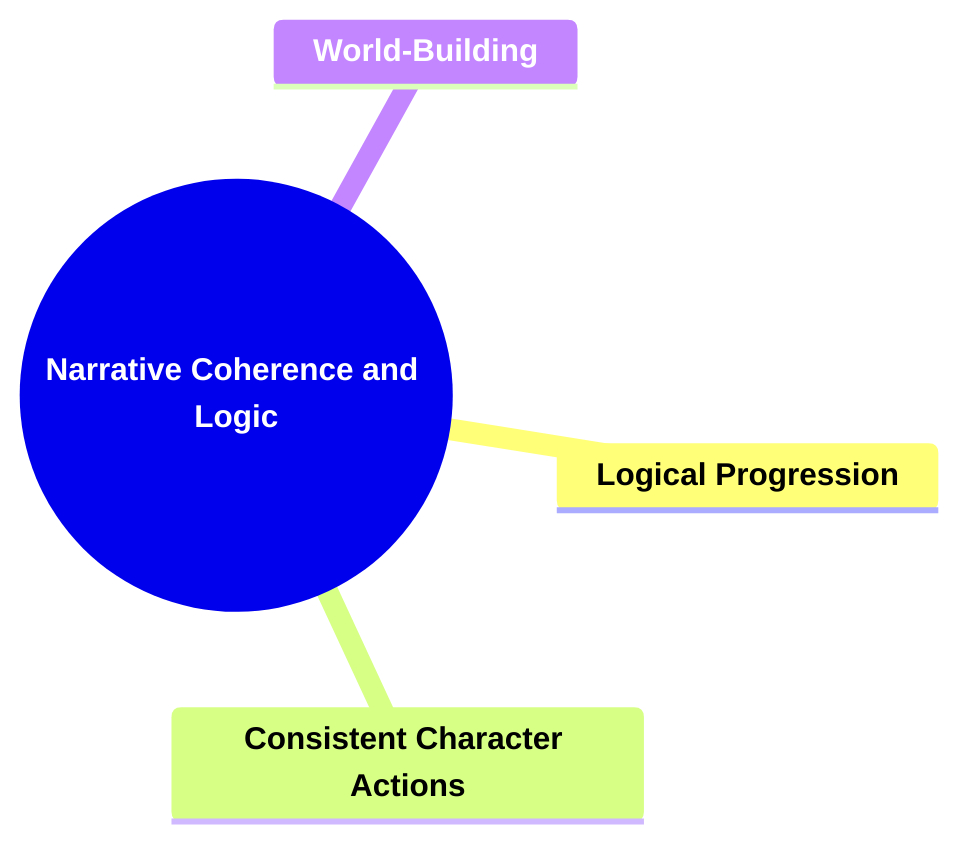
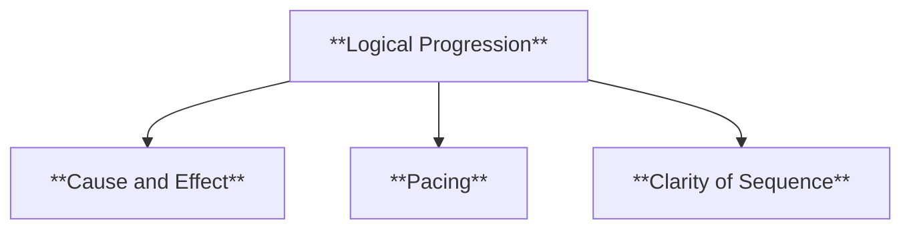
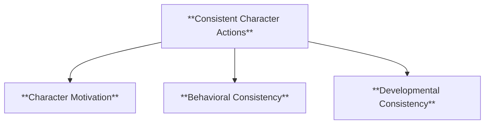
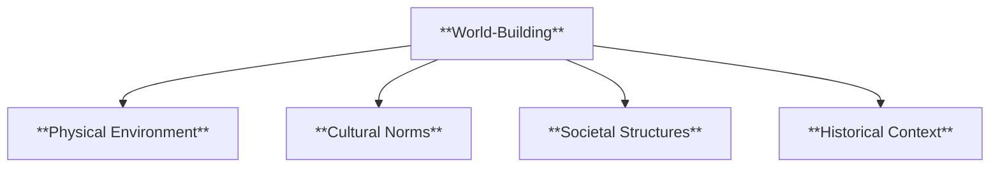
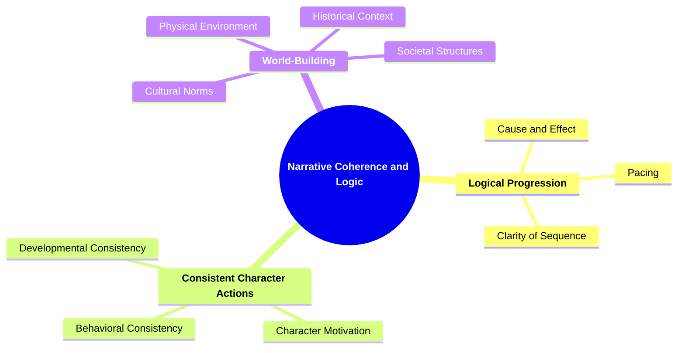

# 10 CL-3406 NARRATIVE COHERENCE AND LOGIC

### **Narrative Coherence and Logic**

- **Evaluating the internal consistency and plausibility of the narrative.**
  - **Focus**:
    - **Logical Progression**
    - **Consistent Character Actions**
    - **World-Building**
  - **Importance**: Ensures events and actions are plausible within the story's context.

---

### **Key Concepts**

---

#### **Narrative Coherence and Logic**

- **Definition**:
  - In narratology, narrative coherence and logic involve assessing how well the story's elements fit together in a believable and consistent manner. It examines the internal consistency of the narrative, ensuring that events follow logically, characters act in accordance with their established traits and motivations, and the story world is well-developed and plausible.

##### **Components of Narrative Coherence and Logic**

###### **Logical Progression**

- **Definition**:
  - The sequential arrangement of events in a narrative that follows a cause-and-effect relationship, ensuring that each event logically leads to the next, creating a smooth and understandable flow of the story.

- **Characteristics**:
  - **Cause and Effect**: Each event is influenced by preceding events, establishing a logical chain of actions.
  - **Pacing**: The speed at which events unfold, maintaining a balance between action and exposition to keep the narrative engaging.
  - **Clarity of Sequence**: Events are presented in a clear and understandable order, avoiding confusion or disjointedness.

###### **Consistent Character Actions**

- **Definition**:
  - Ensuring that characters behave in ways that are consistent with their established personalities, motivations, and backgrounds throughout the narrative. This consistency helps in maintaining believability and allowing readers to connect with the characters.

- **Characteristics**:
  - **Character Motivation**: Actions are driven by clear and understandable desires or goals.
  - **Behavioral Consistency**: Characters act in ways that align with their personality traits and established behavior patterns.
  - **Developmental Consistency**: Character growth or changes are gradual and logically follow from previous events and experiences.

###### **World-Building**

- **Definition**:
  - The creation of a detailed and believable setting for the narrative, including the physical environment, cultural norms, societal structures, and any other elements that define the story's universe. Effective world-building provides context and enhances the narrative's realism.

- **Characteristics**:
  - **Physical Environment**: Detailed descriptions of the setting's geography, climate, architecture, and other physical aspects.
  - **Cultural Norms**: Established customs, traditions, beliefs, and practices that influence characters' behaviors and interactions.
  - **Societal Structures**: The organization of society within the narrative, including government systems, social hierarchies, and economic conditions.
  - **Historical Context**: Background history that shapes the current state of the narrative world, providing depth and plausibility.

---

### **Theoretical Significance**

- **Ensuring Plausibility and Believability**:

  - In narratology, narrative coherence and logic are essential for creating stories that are believable and engaging. A coherent narrative allows readers to immerse themselves in the story without being distracted by inconsistencies or implausible events.

- **Enhancing Narrative Structure**:

  - By focusing on logical progression, consistent character actions, and thorough world-building, narratologists can analyze how these elements contribute to the overall structure and effectiveness of the narrative. It helps in identifying strengths and weaknesses in a story's construction.

- **Facilitating Critical Analysis**:

  - Evaluating narrative coherence and logic provides a framework for critiquing the internal mechanics of a story. It allows scholars to assess how well a narrative holds together, how effectively it develops characters, and how convincingly it constructs its world.

- **Influence on Reader Engagement**:
  - A logically coherent narrative with consistent characters and well-built world enhances reader satisfaction and engagement. It ensures that the story resonates with readers and maintains their interest throughout the narrative.

---

