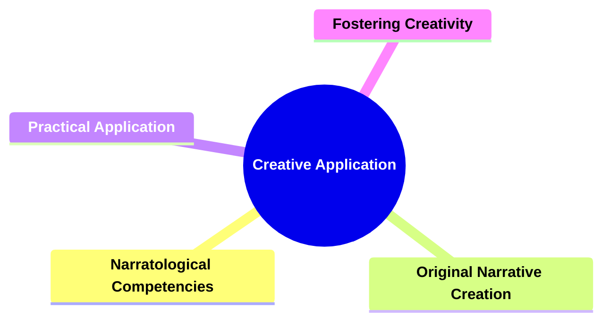
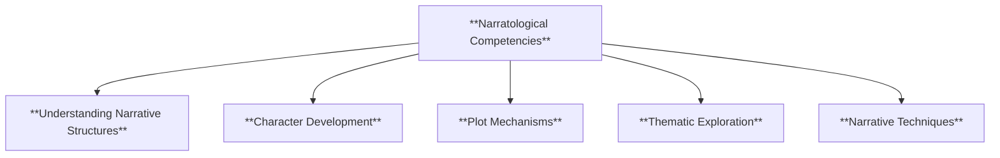
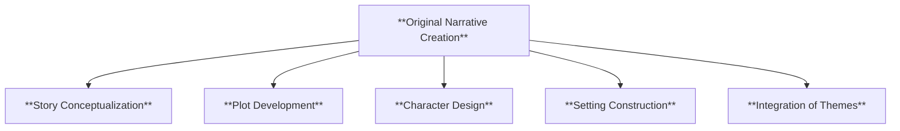
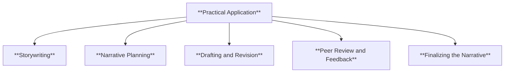
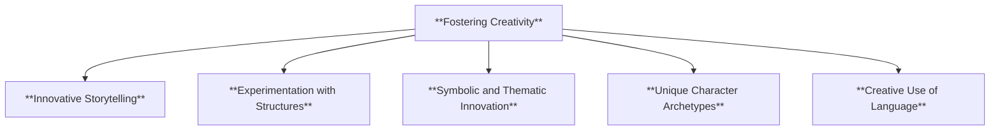
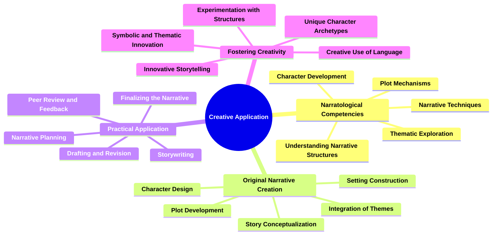

# 27 CA-3704 CREATIVE APPLICATION

### **Creative Application**

- **Using narratological competencies to create original narratives.**
  - **Outcome**: Reinforces understanding through practical application and fosters creativity.

---

### **Key Concepts**

---

#### **Creative Application**

- **Definition**:
  - In narratology, **creative application** involves leveraging narratological theories, frameworks, and techniques to construct original narratives. This process integrates a comprehensive understanding of narrative elements—such as structure, characterization, plot dynamics, setting, focalization, voice, coherence, semiotics, genre conventions, functions, audience engagement, and ethical dimensions—to produce stories that are both theoretically informed and creatively compelling.

##### **Components of Creative Application**

###### **Narratological Competencies**

- **Definition**:
  - The foundational knowledge and skills derived from narratological study, including understanding of narrative structures, character development, plot mechanisms, thematic exploration, and other core narratological elements.

- **Characteristics**:
  - **Understanding Narrative Structures**: Grasping how different narrative forms and structures operate.
  - **Character Development**: Creating complex and believable characters.
  - **Plot Mechanisms**: Designing coherent and engaging plots.
  - **Thematic Exploration**: Integrating meaningful themes into the narrative.
  - **Narrative Techniques**: Utilizing various techniques such as focalization, voice, and symbolism.

###### **Original Narrative Creation**

- **Definition**:
  - The process of developing new and unique stories by applying narratological principles to construct engaging and cohesive narratives.

- **Characteristics**:
  - **Story Conceptualization**: Generating original ideas and concepts for the narrative.
  - **Plot Development**: Structuring the sequence of events logically and compellingly.
  - **Character Design**: Crafting well-rounded and dynamic characters.
  - **Setting Construction**: Creating immersive and coherent environments.
  - **Integration of Themes**: Embedding meaningful themes that resonate with the audience.

###### **Practical Application**

- **Definition**:
  - The hands-on use of narratological knowledge to craft and refine narratives, ensuring theoretical concepts are effectively translated into creative outputs.

- **Characteristics**:
  - **Storywriting**: Actual process of writing the narrative.
  - **Narrative Planning**: Outlining the structure and elements before writing.
  - **Drafting and Revision**: Creating drafts and refining them based on feedback and self-review.
  - **Peer Review and Feedback**: Engaging others to critique and improve the narrative.
  - **Finalizing the Narrative**: Completing the narrative to a polished state.

###### **Fostering Creativity**

- **Definition**:
  - Encouraging innovative thinking and creative expression in the development of narratives by applying narratological principles in imaginative ways.

- **Characteristics**:
  - **Innovative Storytelling**: Developing unique and original storytelling methods.
  - **Experimentation with Structures**: Trying unconventional narrative structures.
  - **Symbolic and Thematic Innovation**: Introducing new symbols and themes.
  - **Unique Character Archetypes**: Creating characters that break traditional molds.
  - **Creative Use of Language**: Employing distinctive language styles and techniques.

---

### **Theoretical Significance**

- **Reinforcing Understanding through Practice**:

  - Creative application allows for the practical reinforcement of narratological concepts, ensuring a deeper and more intuitive grasp of theoretical principles through hands-on narrative construction.

- **Fostering Creativity**:

  - By applying narratological knowledge creatively, scholars and practitioners can explore innovative storytelling techniques, leading to original and engaging narratives that push the boundaries of traditional narratology.

- **Demonstrating Interconnectedness of Narrative Elements**:

  - Holistic narrative creation showcases how various narratological elements—such as structure, character, plot, setting, and thematic elements—interact and influence each other, highlighting their collective impact on the overall narrative.

- **Enhancing Critical Thinking**:

  - The process of creating narratives based on narratological competencies cultivates critical thinking and problem-solving skills, as creators must thoughtfully integrate multiple narrative components to produce coherent and compelling stories.

- **Supporting Scholarly and Creative Endeavors**:
  - Theoretical integration through creative application bridges academic study and creative practice, enabling a symbiotic relationship where scholarly insights inform creative projects and creative endeavors, in turn, inspire further academic inquiry.

---

