- [1. **Brooks's Textual Energy and Entropy Model**](#1-brookss-textual-energy-and-entropy-model)
- [2. **Key Concepts**](#2-key-concepts)
  - [2.1. **Textual Energy**](#21-textual-energy)
    - [2.1.1. **Components of Textual Energy**](#211-components-of-textual-energy)
      - [2.1.1.1. **Narrative Progression**:](#2111-narrative-progression)
      - [2.1.1.2. **Psychoanalytic Drive**:](#2112-psychoanalytic-drive)
      - [2.1.1.3. **Peaks**:](#2113-peaks)
      - [2.1.1.4. **Troughs**:](#2114-troughs)
  - [2.2. **Entropy**](#22-entropy)
    - [2.2.1. **Components of Entropy**](#221-components-of-entropy)
      - [2.2.1.1. **Narrative Resolution**:](#2211-narrative-resolution)
      - [2.2.1.2. **Dissipation of Energy**:](#2212-dissipation-of-energy)
      - [2.2.1.3. **Balance of Forces**:](#2213-balance-of-forces)
- [3. **Brooks’s Perspective on Narrative Dynamics**](#3-brookss-perspective-on-narrative-dynamics)
  - [3.1. **Textual Energy as a Narrative Force**](#31-textual-energy-as-a-narrative-force)
    - [3.1.1. **Components of Textual Energy**](#311-components-of-textual-energy)
      - [3.1.1.1. **Building Momentum**:](#3111-building-momentum)
      - [3.1.1.2. **Drive for Completion**:](#3112-drive-for-completion)
  - [3.2. **Entropy as Necessary Dissipation**](#32-entropy-as-necessary-dissipation)
    - [3.2.1. **Components of Entropy**](#321-components-of-entropy)
      - [3.2.1.1. **Winding Down**:](#3211-winding-down)
      - [3.2.1.2. **Equilibrium**:](#3212-equilibrium)
- [4. **Conclusion**](#4-conclusion)

---

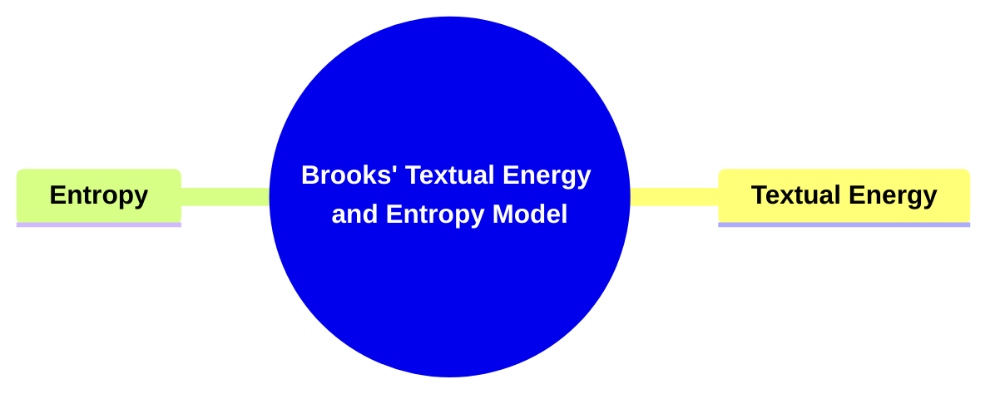

---

### 1. **Brooks's Textual Energy and Entropy Model**

- **Textual Energy and Entropy**:
  - **Definition**: Peter Brooks, in his analysis of narrative dynamics, introduces the concepts of _textual energy_ and _entropy,_ drawing parallels to both psychoanalytic theory and thermodynamics. Textual energy refers to the driving force of a narrative, propelling it forward through tension, conflict, and character development. Entropy, on the other hand, describes the dissipation of that energy as the narrative reaches resolution, allowing the story to come to a natural end.

---

### 2. **Key Concepts**

#### 2.1. **Textual Energy**

- **Definition**:
  - Textual energy is the momentum or force within a narrative that pushes it toward its resolution. It arises from the interaction of plot, character conflict, and thematic development, keeping the narrative in motion.

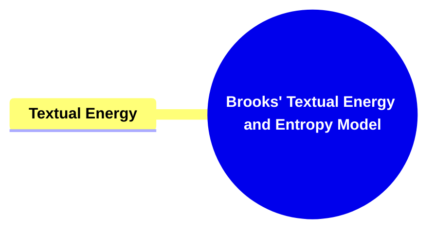

##### 2.1.1. **Components of Textual Energy**

###### 2.1.1.1. **Narrative Progression**:

- **Definition**: The continuous movement of the plot toward its climax and resolution. Textual energy sustains this progression, ensuring that the reader remains engaged.

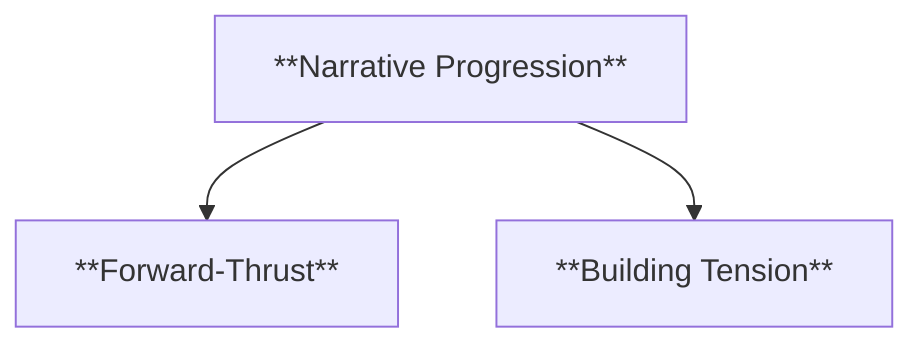

- **Characteristics**:
  - **Forward-Thrust**: The story moves forward, avoiding stagnation.
  - **Building Tension**: Conflicts and stakes increase, propelling the plot.

###### 2.1.1.2. **Psychoanalytic Drive**:

- **Definition**: Textual energy can be linked to the Freudian concept of the pleasure principle, which suggests that narratives strive toward the alleviation of tension and the fulfillment of desires.

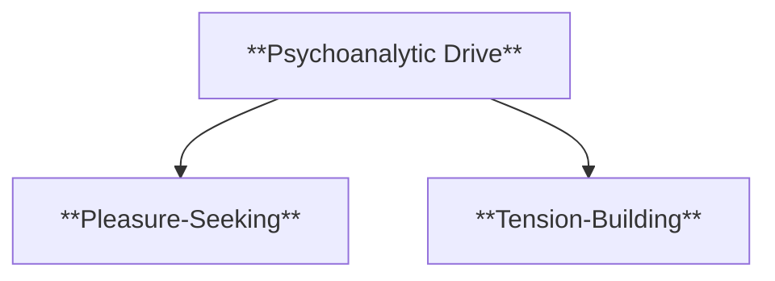

- **Characteristics**:
  - **Pleasure-Seeking**: The narrative pursues resolution to satisfy desires.
  - **Tension-Building**: Conflicts and desires push the plot forward.

###### 2.1.1.3. **Peaks**:

- **Definition**: Peaks represent moments of high tension or intense action within the narrative, often occurring during climactic events.

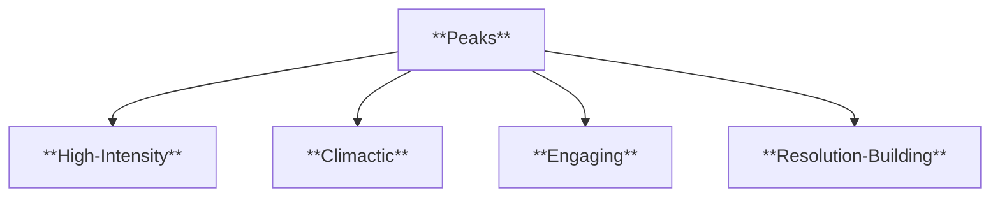

- **Characteristics**:
  - **High-Intensity**: These moments are marked by heightened narrative energy, action, or emotion.
  - **Climactic**: Peaks typically occur at crucial turning points in the story where key events unfold.
  - **Engaging**: Peaks capture the reader’s attention and drive the plot forward.
  - **Resolution-Building**: Often contributes to the build-up or resolution of major conflicts.

###### 2.1.1.4. **Troughs**:

- **Definition**: Troughs represent moments of lower tension, providing a period of calm or reflection between major plot developments.

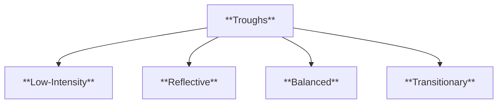

- **Characteristics**:
  - **Low-Intensity**: These moments allow the narrative to slow down, focusing on character development, exposition, or reflection.
  - **Reflective**: Often involves characters processing previous events or preparing for future action.
  - **Balanced**: Troughs balance the intensity of peaks, preventing the narrative from becoming overwhelming.
  - **Transitionary**: Serves as a bridge between climactic events, helping to reset the pace of the story.

---

#### 2.2. **Entropy**

- **Definition**:
  - Entropy refers to the gradual dissipation of narrative energy as conflicts are resolved and tensions are released. This concept describes how the momentum built up throughout the narrative gradually decreases as the story approaches its conclusion.

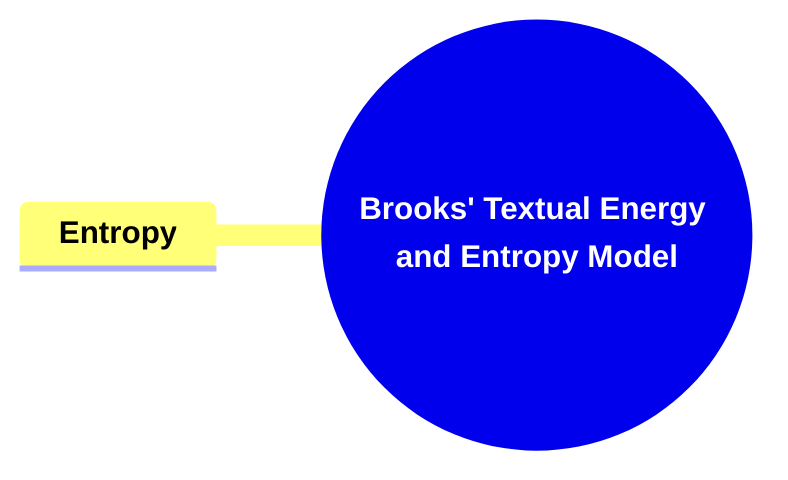

##### 2.2.1. **Components of Entropy**

###### 2.2.1.1. **Narrative Resolution**:

- **Definition**: The release of narrative tension as the story’s conflicts are resolved, leading to closure.

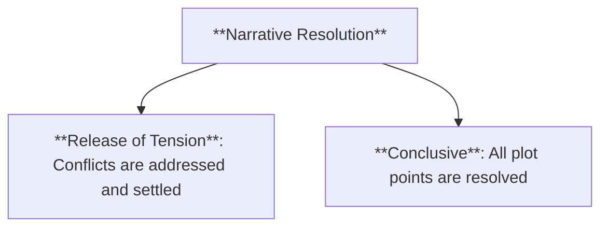

- **Characteristics**:
  - **Release of Tension**: The conflicts introduced earlier are addressed and settled.
  - **Conclusive**: The narrative reaches a satisfying end, with all plot points resolved.

###### 2.2.1.2. **Dissipation of Energy**:

- **Definition**: As the narrative moves toward its end, the high-energy conflicts that propelled the story forward begin to lose momentum, and the narrative winds down.

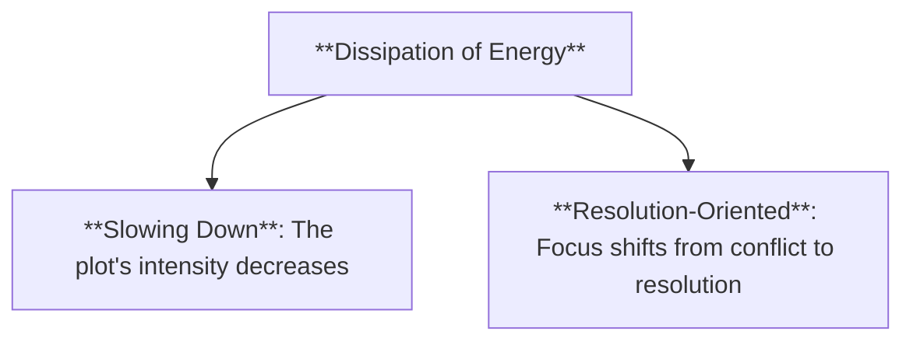

- **Characteristics**:
  - **Slowing Down**: The plot’s intensity decreases.
  - **Resolution-Oriented**: Focus shifts from conflict to resolution.

###### 2.2.1.3. **Balance of Forces**:

- **Definition**: A narrative must balance textual energy with entropy to achieve a satisfying conclusion. Too much energy without enough entropy can result in an unresolved ending, while too much entropy without sufficient buildup can lead to anticlimax.

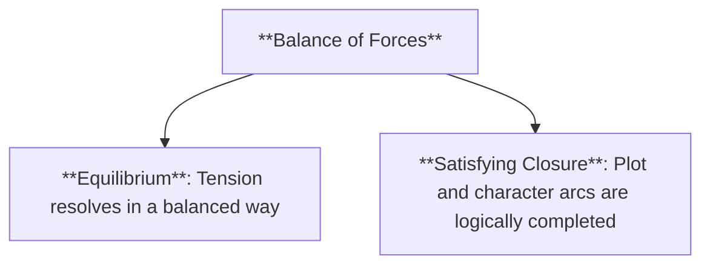

- **Characteristics**:
  - **Equilibrium**: The story resolves the built-up tension in a balanced way.
  - **Satisfying Closure**: Both the plot and character arcs are completed in a manner that satisfies the narrative’s internal logic.

---

### 3. **Brooks’s Perspective on Narrative Dynamics**

#### 3.1. **Textual Energy as a Narrative Force**

- **Definition**:
  - Brooks argues that textual energy is essential for keeping the narrative engaging and dynamic. Without sufficient energy, a narrative can become stagnant, losing the reader’s interest.

##### 3.1.1. **Components of Textual Energy**

###### 3.1.1.1. **Building Momentum**:

- **Definition**: Textual energy builds as the plot progresses, with conflicts becoming more intense and character dynamics evolving.

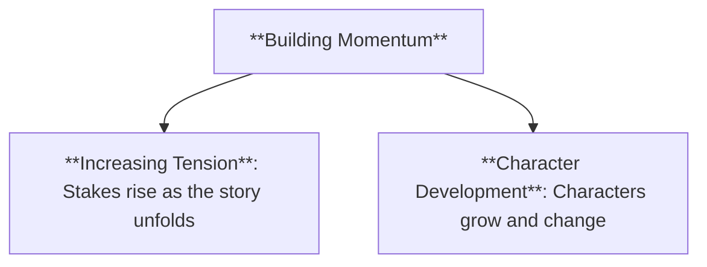

- **Characteristics**:
  - **Increasing Tension**: Stakes rise as the story unfolds.
  - **Character Development**: Characters grow and change, driving the narrative forward.

###### 3.1.1.2. **Drive for Completion**:

- **Definition**: The need for resolution drives the narrative toward its conclusion, with textual energy pushing the plot forward until the story reaches its end.

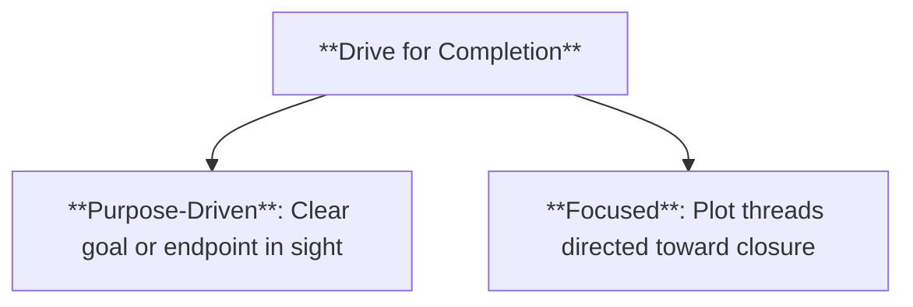

- **Characteristics**:
  - **Purpose-Driven**: The narrative moves with a clear goal or endpoint in sight.
  - **Focused**: Plot threads are directed toward closure.

---

#### 3.2. **Entropy as Necessary Dissipation**

- **Definition**:
  - For Brooks, entropy is not a negative force but a necessary process that allows narratives to achieve closure. Without entropy, narratives would remain in a state of perpetual tension, unable to resolve.

##### 3.2.1. **Components of Entropy**

###### 3.2.1.1. **Winding Down**:

- **Definition**: As the narrative approaches its conclusion, the energy built up throughout the story begins to dissipate, leading to the resolution of conflicts and closure.

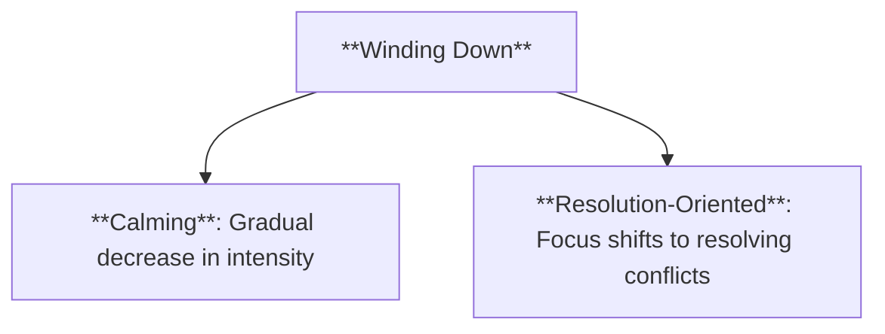

- **Characteristics**:
  - **Calming**: The narrative gradually decreases in intensity.
  - **Resolution-Oriented**: The focus shifts to resolving the central conflicts.

###### 3.2.1.2. **Equilibrium**:

- **Definition**: The state of balance achieved once the narrative has resolved its conflicts and reached a satisfying conclusion.

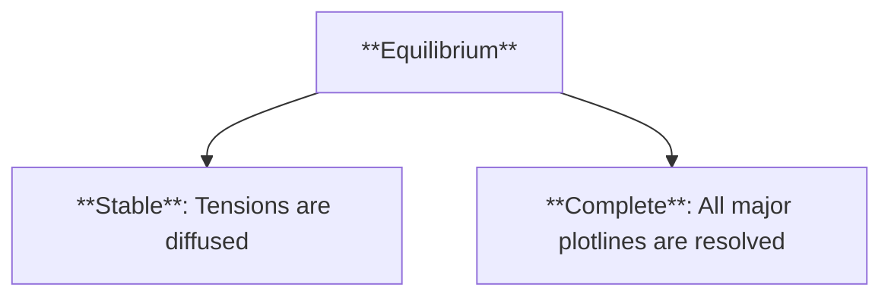

- **Characteristics**:
  - **Stable**: The story’s tensions are diffused.
  - **Complete**: All major plotlines are resolved.

---

### 4. **Conclusion**

- **Brooks’s Textual Energy and Entropy Model** offers a framework for understanding the balance between the forces that drive narratives forward and those that lead them to their conclusion. By conceptualizing stories in terms of energy and entropy, Brooks provides a dynamic model for analyzing how narratives maintain momentum, build tension, and ultimately achieve closure. His integration of psychoanalytic theory into narrative analysis deepens our understanding of the emotional and psychological investment that narratives elicit from readers.

---

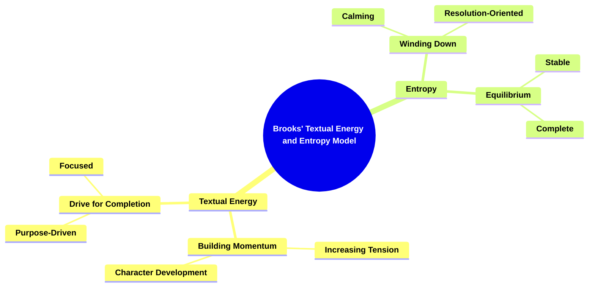
